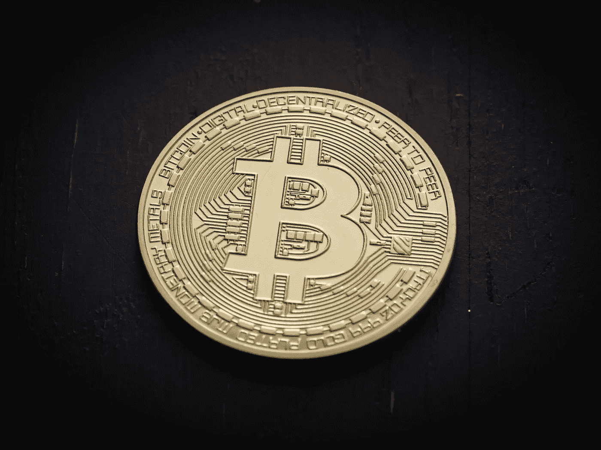
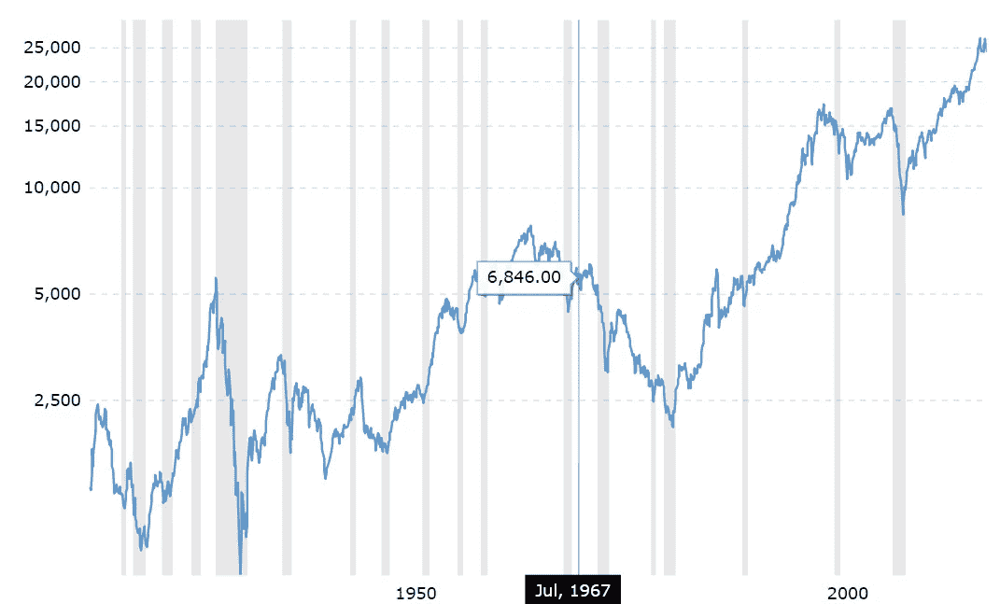

# 比特币的价格会打到 0 美元吗？

> 原文：<https://medium.datadriveninvestor.com/will-the-price-of-bitcoin-hit-0-790dda16ef5e?source=collection_archive---------30----------------------->

*不同的视角供你考虑*

Is Bitcoin really worthless?

多好的一周啊。穿过每一个支撑位，比特币的价格继续创下新低，这是去年这个时候没有人能想到的。那些在 20000 美元的高点买入比特币而没有套现的人都哭着睡着了。街上到处都是血。怀疑论者夸口说，这证实了他们一直以来对比特币的看法——这是一个骗局。相当多的人甚至在说，比特币本质上毫无价值，其价格最终将降至零。

然而，所有这些说法都是真的吗？

虽然比特币的价格肯定已经膨胀了很长一段时间，但这是否足以成为比特币价格将跌至零的理由呢？如何看待这样一个事实，即有鲸鱼持有大量比特币，并且(可能)一直在操纵市场？这是否意味着比特币实际上是一个骗局？

这些都是我希望人们在作出这样的断言并向市场传播更多恐惧之前要思考并有有效答案的问题。虽然我不能肯定比特币是否会回到 20，000 美元的价格水平甚至超过它，但我想从不同的角度解释为什么比特币变得一文不值的可能性真的很小，也想听听你对这个话题的看法。请继续阅读了解更多信息。

# 市场周期性波动——上涨和下跌

Dow Jones- 100-year historical chart

让我们看看[宏观趋势](https://www.macrotrends.net/1319/dow-jones-100-year-historical-chart)提供的道琼斯百年历史图表。市场在不同的时期崩溃了好几次。有些只持续了几个月，有些长达几年，价格在触底回升之前一直在下跌。然而，市场一直在朝着一个总的方向发展——上涨。

虽然市场可能很快会经历崩盘(另一篇文章的主题)，但新的底部可能会高于以前的低点。随着越来越多的人变得更了解金融，并想开始投资，对股票的需求将上升，导致价格上涨的总体趋势。

以任何商品和有价值的货币为例，你可能会在很长一段时间内得到相同的上升趋势。和任何市场一样，恐惧和贪婪必然并存。当价格高的时候，人们哀叹价格低的时候不要进入。然而，当价格实际上很低时，他们迫不及待地套现，并“存下所有剩余的钱”。这就引出了我的下一个观点。

# 比特币——死了 323 次才活着

有多少次比特币被知名人物和文章宣布为“死亡”或“骗局”？

总计 **323 次**。

Declared to be “dead” many times, Bitcoin is still alive

至少按照 99 比特币的说法。你可以在这里找到比特币的讣告。一个已经被宣布“死亡”323 次的东西，实际上怎么可能还活着？**除非它真的在这里停留**。无论你如何给比特币分类，是作为一种货币、数字黄金还是某种形式的投资资产，仍然有人认为它有价值。

以遭受通货膨胀的国家为例，如土耳其和委内瑞拉。如果你是那里的公民，随着时间的推移，你辛苦赚来的钱正在迅速贬值，比特币难道不是一个让你的钱保值的好选择吗？(至少在最近价格大幅下跌之前)

首先，政府很难控制比特币的使用和供应，而对美元等外币来说，政府或许可以做到。其次，如果你家在其中一个国家，比特币不是很好的替代方式来进行汇款吗？它又快又安全，比西联汇款或任何其他汇款服务都要快得多。

在我看来，通货膨胀是人们持续关注的问题，比特币总是有价值的。

# 什么会引发复兴？

“尽管这一切都很好，但怎样才能引发比特币价格的复苏呢？我想从中获利！”

我个人认为不会有一个包罗万象的原因。相反，如果真的有复苏的话，这可能是不同的推动和拉动因素的结合。如果让我自己来推测，我会说以下几个可能起作用的因素:

*   比特币交易所交易基金(ETF)和比特币期货平台 [Bakkt](https://www.bakkt.com/index) 的推出是由洲际交易所发起的，后者进而拥有纽交所
*   让公民对本国货币失去信心的金融危机
*   比特币对于不太懂技术的普通人来说很容易获得

即使这些真的发生了，我相信也需要很长一段时间。谁知道呢，这些事件达到高潮的时间可能彼此接近，从而为大规模采用提供了关键的推动力，并因此引发了比特币和加密货币价格的复苏。

# 在一天结束的时候…

了解自己的投资偏好，不要在任何形式的投资中投入你无法承受损失的资金，尤其是加密货币。赚钱从来都是凭逻辑，从来不是凭情绪。

没有人知道比特币的价格是否会开始上涨，以及上涨需要多长时间。总是想到与市场相反的方向是有好处的(如果你相当自信自己是对的)毕竟，没有人通过跟随市场而获得真正的利润。总是逆市而行。

坚持住，祝你一切顺利！

# 给你的一篇文章

为了实现大规模采用，区块链内容需要被分解，并以大众理解的术语传达给他们。这也是我写这样的观点文章的原因——让大众更好地了解区块链技术和加密货币。

喜欢你读的吗？如果你是一家寻求内容营销支持的区块链公司，让我为你写更好的文章！

[今天就提升您的营销水平](http://blockconstellation.com/contact/)

【联系我
**网站**:[http://blockconstellation.com/](http://blockconstellation.com/)
**邮箱**:jiayung@blockconstellation.com
**LinkedIn:**[https://www.linkedin.com/in/jia-yung/](https://www.linkedin.com/in/jia-yung/)