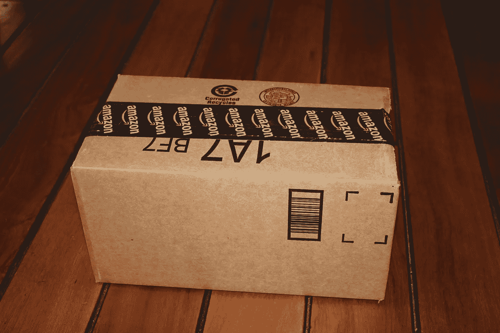

# UPS(联合包裹服务公司)会在亚马逊生存下来吗？

> 原文：<https://medium.datadriveninvestor.com/will-ups-ups-survive-amazon-9cf93c0958eb?source=collection_archive---------2----------------------->

**UPS (UPS)** 是一家盈利公司，受到其主要客户**亚马逊(NASDAQ: AMZN)** 的威胁。

值得注意的是，**联合包裹(纽约证券交易所代码:UPS)** 报告称，2018 年第三季度的总利润为 161.4 亿美元，收入为 174.44 亿美元。此外，Stockrow 报告称，UPS 的收入在 2018 年第三季度以 7.86%的速度增长。

此外，Stockrow 在 2018 年第三季度为 UPS 记录了 17.27 亿美元的营业收入和 15.08 亿美元的净收入。因此，UPS 的核心业务正在赚大钱。

UPS 是一家现金充裕的公司吗？

显然，许多观察家会怀疑 UPS 是否是一家现金充裕的公司。答案是肯定的，UPS(联合包裹)是一家现金充裕的公司。

例如，2018 年第三季度，UPS 的运营现金流为 22.22 亿美元，自由现金流为 5.91 亿美元。除此之外，UPS 在 2018 年 9 月 30 日报告了 40.97 亿美元的现金和等价物以及 7.44 亿美元的短期投资。

因此，UPS 在 2018 年 9 月底拥有 48.41 亿美元现金。因此，UPS 是一家现金充裕的公司。

**为什么亚马逊 Prime 对 UPS 来说是好消息也是坏消息**

亚马逊 Prime 对 UPS 来说是个好消息，因为 2018 年 6 月美国有 9500 万 Prime 会员。因此，通过 Prime 进行 UPS 递送的潜在客户有 9500 万。

重要的是，Prime 正在急剧增长，尤其是在美国。事实上，据 Statista [计算](https://www.statista.com/statistics/546894/number-of-amazon-prime-paying-members/)，2017 年 6 月有 8500 万 Prime 会员，2018 年 6 月有 9500 万。因此 Prime 获得了 1000 万新会员；UPS 在一年内赢得了 1000 万潜在的送货客户。

然而，一些增长最快的主要业务是 UPS 不提供的服务。例如，亚马逊估计 Prime 会员[在 2018 年订购了](https://www.amazon.com/b?ie=UTF8&node=18424185011)20 亿件一天或更快交付的产品。

此外，亚马逊正在成为食品杂货领域的主要参与者。事实上，亚马逊的 Best of Prime 声称订户购买的有机苹果足够烤 35 万个苹果馅饼。

此外，Amazon Prime 现在可以在不到 10 分钟的时间内交付洛杉矶、北卡罗来纳州和华盛顿州的一些订单。因此，亚马逊的交付重点正在从 UPS 等传统运营商转移。

**亚马逊正在快速远离 UPS**

亚马逊正在采取严肃的措施远离像 UPS 这样的运营商。例如，亚马逊正在密歇根州和俄亥俄州雇佣送货司机，*财富* [报道](http://fortune.com/2018/11/05/amazon-hiring-drivers-holiday-deliveries/)。

这些司机将为一家名为亚马逊运输(Shipping by Amazon)的新子公司工作，该子公司将与 UPS 直接竞争。值得注意的是，亚马逊正在从戴姆勒公司购买 2 万辆奔驰 Sprinter 面包车，由亚马逊运输，*《汽车新闻》* [声称](http://www.autonews.com/article/20180905/OEM01/180909883/amazon-mercedes-sprinter)。

事实上，亚马逊在其交付合作伙伴计划中为承包商提供燃料、车辆、保险和制服折扣。送货伙伴将操作货车，雇佣司机，并运送货物。

因此，亚马逊试图在全美范围内为 UPS 制造数百个竞争对手。亚马逊的运输应该会吓到 UPS，因为 Everything Store 拥有实现这一目标的资源。

**亚马逊的运输如何威胁到 UPS**

例如，亚马逊在 2018 年第三季度记录了 204.25 亿美元的现金和等价物以及 93.4 亿美元的短期投资。因此，亚马逊在 2018 年 9 月 30 日获得了 297.65 亿美元的现金。

在这种情况下，亚马逊几乎可以立即雇佣数千名司机，购买数千辆货车。然而，还不清楚亚马逊是否有物流或管理专业知识来协调这些交付工作。

我认为，如果亚马逊推出得太快，它的运输可能会很快变成一场大灾难。特别是，我认为亚马逊和承包商都缺乏专业知识来组织和部署亚马逊需要的大规模交付。

鉴于这一现实，我认为亚马逊的运输业务对 UPS 或联邦快递(纽约证券交易所代码:FDX)构成严重挑战还需要几年时间。亚马逊将需要几年时间来建立和部署基础设施，以使亚马逊运输工作。

**UPS (UPS)在可预见的未来会赚钱**

因此，在可预见的未来，UPS 将会赚钱，并在很长一段时间内移动很大比例的亚马逊包裹。

此外，还有外部因素可以帮助 UPS，包括其他在线零售商和反垄断立法。例如，eMarketer [估计](https://marketmadhouse.com/is-wayfair-nyse-w-making-money/)一家在线零售商 Wayfair(纽约证券交易所代码:W)在 2018 年第三季度的增长率为 40.1%。

然而，way fair 2017 年 33.9 亿美元的销售额仍是亚马逊 528 亿美元的零头。此外，沃尔玛的在线销售额在 2018 年第三季度以 39.4%的速度增长。然而，**据 eMarketer [估计](https://retail.emarketer.com/article/walmart-overtakes-apple-no-3-e-tailer-us/5bec6a2cb979f109c0bb101a?ecid=NL1014)，沃尔玛(纽约证券交易所:WMT)** 仅占美国在线销售额的 4%。

反垄断的担忧可以帮助 UPS，因为山姆大叔将面临强大的压力，迫使亚马逊退出航运等业务。特别是，卡车司机工会可能会向民主党和共和党施压，阻止亚马逊向航运业扩张。卡车司机会反对亚马逊运输，因为 UPS 是他们最大的公司之一。

此外，随着 2020 年总统大选的临近，唐纳德·j·特朗普总统(纽约州共和党)可能会对亚马逊采取行动。然而，只有时间才能证明这种压力是否会导致有效的政治或监管行动。

**目前，UPS 从亚马逊获得的红利是安全的**

在这种情况下，从亚马逊那里获得 UPS 红利目前是安全的。对于 2018 年 12 月 5 日收到 91 的 UPS 股东来说，这是个好消息。

锦上添花的是，UPS 的股息大幅增长。例如，UPS 在 2017 年 11 月 29 日支付了 83 英镑的股息。所以 2018 年 UPS 红利增长 8。

关于 UPS 红利的数据是极好的。例如，2018 年 12 月 3 日，UPS 股东的股息收益率为 3.16%，年化股息为 3.64 美元，股息支付率为 50.2%。此外，这些股东正享受着连续第八年的股息增长。

**UPS 是亚马逊时代的价值投资**

我认为从股息和股价来看，UPS 是亚马逊时代的价值投资。此外，2018 年 12 月 6 日报告的 105.90 美元的股价对价值投资者来说是一笔很好的交易。

如果你需要一个亚马逊时代的长期收益股票，UPS 是一个很好的选择。亚马逊及其竞争对手在未来几年都将需要 UPS 的服务。因此，UPS 的股东将在未来几年享受高额股息。

*最初发布于*[*https://market mad house . com/will-ups-NYSE-ups-survive-Amazon/*](https://marketmadhouse.com/will-ups-nyse-ups-survive-amazon/)