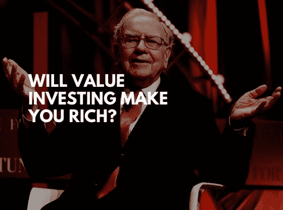
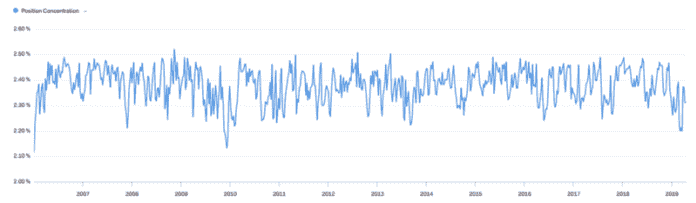
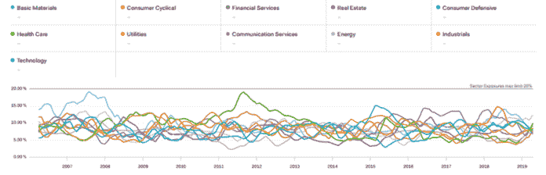
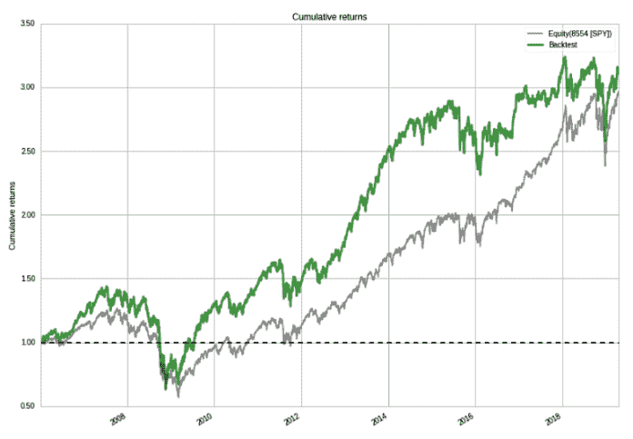
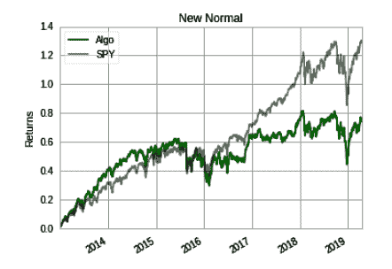

# 价值投资会让你变富吗？

> 原文：<https://medium.datadriveninvestor.com/will-value-investing-make-you-rich-data-driven-investor-7f6ca9505613?source=collection_archive---------3----------------------->

沃伦·巴菲特，世界第三大富豪，净资产 863 亿美元，通过价值投资致富。我们能复制他的策略得到同样的结果吗？

我对价值投资策略进行了历史模拟，并将回答以下问题:

 [## 股票市场投资的机器学习——数据驱动的投资者

### 当你的一个朋友在脸书上传你的新海滩照，平台建议给你的脸加上标签，这是…

www.datadriveninvestor.com](https://www.datadriveninvestor.com/2019/01/30/machine-learning-for-stock-market-investing/) 

1.  选择价值股的规则是什么？
2.  如果我们从 2006 年开始使用价值投资策略直到今天，它的盈利能力如何？

# 什么是价值投资？

价值投资是一种投资策略，选择相对于收益来说便宜的股票。由于市场对坏消息的过度反应，这些股票相对于其他股票被低估了。这让价值投资者有机会在价格回到其公允价值时，利用低价赚取巨额利润。

然而，价值投资策略并非没有风险。如果公司未能改善、管理成本和创新，廉价股票可能会变得更便宜。这被称为价值陷阱，是每个价值投资者的噩梦。

因此，价值投资者承担这种风险是为了获得长期巨额利润的回报。他们的投资期限通常至少为 3 年，一旦价格相对于公允价值不再具有吸引力，他们就会平仓。

# 投资组合构建

从标准普尔 500 500 只股票的投资宇宙中，我选择了宇宙中具有最低市盈率(PE 比率)的 50 只股票(前 10%)。低市盈率意味着股票交易价格相对于其收益较低，这是寻找廉价交易的价值投资者的理想选择。

我将投资组合中 50 只股票的[权重](https://www.datadriveninvestor.com/glossary/weight/)设为相等，以降低投资组合的集中度风险，即投资组合中每只股票的目标权重为 2%。随着投资组合中股票价格的上涨或下跌，权重将偏离 2%。如果权重偏离太远，股票会重新平衡回到目标权重。

我对单只股票或几只股票表现如何不感兴趣，我感兴趣的是价值投资主题表现如何。这意味着观察一组市盈率低的股票(宇宙的 10%)，并找出它是否跑赢整体市场。

Position concentration — Percentage of the portfolio invested in its most-concentrated asset.

投资组合构建的另一个关键方面是行业中立。基于本益比，在科技领域便宜的股票在公用事业领域可能被认为是昂贵的。比较不同行业股票的市盈率是没有意义的，因为每个行业都有自己独特的特点。

因此，我们在每个行业中选择市盈率最低的股票，以确保我们不会以[偏向](https://www.datadriveninvestor.com/glossary/bias/)估值较低的行业而告终。下图显示，投资组合没有向任何特定行业倾斜，每个行业的权重都低于 20%。

Sector Exposures

# 模拟结果

模拟结果显示，价值投资策略的年收益率为 8.9%。该策略跑赢了 S&P，取得了 210%的累计回报。虽然这种策略的总回报很高，但它也伴随着更高的风险。其年波动率为 19.7%，而市场的历史波动率为 17%。

Cumulative returns vs S&P 500 benchmark

如果我们比较 2013 年以来的表现，模拟显示，S&P 赚了 130%，而策略只赚了 80%。这是一个高达 50%的性能差异。一个从 2013 年开始买价值股的投资者不会太高兴！

Cumulative returns vs S&P 500 benchmark since 2013

# 结论

价值投资总体上表现出了良好的结果，在过去的某些时期提供了非凡的回报。便宜的股票确实有跑赢昂贵股票的趋势。

然而，仍然存在风险，投资者可能不会因为承担价值风险溢价而获得回报，比如从 2013 年开始。

这说明了为什么大多数成功的价值投资者都有 3 年以上的长期投资眼光。这让他们有充足的时间度过表现不佳的时期，以便有机会在长期获得巨额利润。

# 我们连线吧！

如果你觉得这个故事对你有帮助，并且你想收到未来的更新，请考虑之后的[。](https://medium.com/@ivannfok)

*原载于 2019 年 4 月 29 日*[*https://www.datadriveninvestor.com*](https://www.datadriveninvestor.com/2019/04/29/will-value-investing-make-you-rich/)*。*