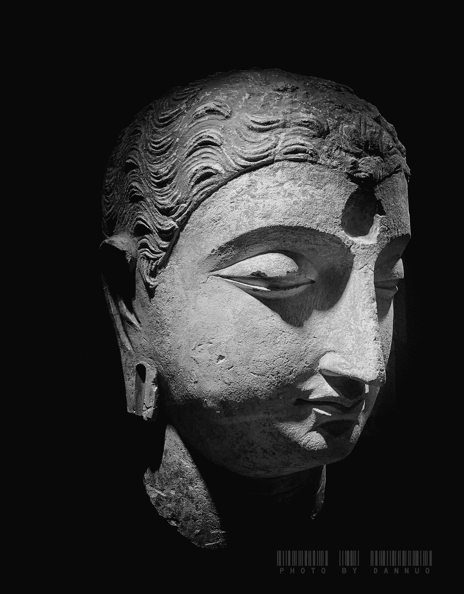

# 赢得胜利

> 原文：<https://medium.datadriveninvestor.com/win-your-day-b884f8d6f257?source=collection_archive---------13----------------------->

## 学会活在当下

Photo by Dannuo ([https://i.pinimg.com/originals/57/97/11/579711076fc59eda49d088af8ab4713f.jpg](https://i.pinimg.com/originals/57/97/11/579711076fc59eda49d088af8ab4713f.jpg))

人类最尴尬的一件事是，尽管有共同的信仰，但我们内心并没有一个永久不变的统一的真我。我从尤瓦尔·诺亚·哈拉里(Yuval Noah Harari)在他的书《德乌斯人》(Homo Japan)中借用了这一点，他在书中解释了对左右脑不相连的人所做的实验，这些人通过切断连接左右脑的胼胝体来帮助我们在两个半球之间建立沟通渠道。实验表明，在大脑半球不相连的病人体内，每个人都有同时存在的自我，分别由左右两个大脑半球中的一个来代表。除此之外，他认为在每个人基于以前的背景经验做出判断和决定未来的决定时，经验自我与叙事自我相比有着不同的态度。他总结道，当我们在经历中每时每刻都在改变时，我们会错误地认为我们内心只有一个真实的自我。

把这个放在我们生活的世界的动态本质之外。我们的社会经济环境中的一切都在变化，我们通过这些动态的经历塑造我们的内在自我，同时试图接受我们的内在自我就是前一天的他。这种理解的含义是什么？我们的过去有效地塑造了我们，但我们对此无能为力。甚至我们也不能确定我们从过去经历中得到的理解是有效的，因为我们的叙述自我只取峰值-端点平均值，并将其保存在我们的记忆中，以备我们未来的决策。过去的教训，如果记录良好，可以用于未来的决策，但这是我们能从过去得到的，仅此而已。未来是不确定的，没有人能确定未来会发生什么，以及对任何未来的事情来说什么是正确的行为。

 [## 在创业之旅中，拥抱学习|数据驱动的投资者

### 好像建立一个数百万美元的公司还不够困难，企业家必须额外照顾他们的…

www.datadriveninvestor.com](https://www.datadriveninvestor.com/2018/10/16/on-the-entrepreneurial-trek-embrace-the-learning/) 

风险评估，即对未来后果的预测，是一件明智的事情，但这是我们所能做的。对尚未发生的未来不再担忧是建设性的，也是有益的。剩下的就是我们生活的当下。这很重要，我们可以做很多事情。我们所期待的未来是现在，而在未来的现在，我们会对过去感到遗憾。我们是否利用了当下？我们关注过去和未来会不会给自己带来太多麻烦？

> 剩下的就是我们生活的当下。这很重要，我们可以做很多事情。

佛陀教导我们如何摆脱对过去和未来不必要的使用，这是从接受开始的。接受当下的时刻，接受我们的感觉，而不关心我们自己对它们做什么。你可能会为过去发生的任何事情感到苦恼、悲伤甚至高兴，你开始认为你必须为此做些什么。你觉得你需要做一些事情来补偿过去发生的事情，以利于未来的前景或保留你可能在未来消失的幸福。“无济于事”，这是佛陀教导我们的。你可能会对未来的事情感到担忧，甚至对未来可能发生的事情感到兴奋，你想做些什么来防止不好的事情或充分利用未来的祝福。“那是没有用的”，这是佛陀教导我们的。佛陀建议我们接受当下的感觉，拥抱它，观察它。观察你的悲伤、你的难过、你的快乐和你的焦虑，要知道它们不会永远持续下去。你的内在自我与经验和产生的感觉接触，并且正在适应它们。随着这些经历和感受，你的智慧在更新，你的情商在更新，你对存在的感知也在更新。

> 你觉得你需要做一些事情来补偿过去发生的事情，以利于未来的前景，或者保存你可能在未来消失的幸福。“无济于事”，这是佛陀教导我们的。你可能会对未来的事情感到担忧，甚至对未来可能发生的事情感到兴奋，你想做些什么来防止不好的事情或充分利用未来的祝福。“那是没有用的”，这是佛陀教导我们的。

这是否意味着我们失去了可以从过去吸取的教训？是不是意味着对未来的事情很被动，没有规划？这是否意味着我们放弃了基于过去事件的明智的基于风险的未来规划？不，不是的。它只处理你不必要的焦虑和压力，不需要任何用户操作。它处理的是失去我们当下的时刻，以及在没有采取适当行动的情况下，无所事事、忧心忡忡地浪费它们。这是**而不是**关于我们的行为！**是关于我们的感情**！明智的做法是在过去的基础上为未来做些事情，但第一步是活在当下，从接受现在的时间和感觉开始，不需要额外的努力去担心或维持那些感觉。

一个切实可行的方法是通过专注于你当前的感觉来提高你的正念，并通过冥想将你自己从中分离出来。审视你当下的感觉并观察它们！拥抱它们，把它们作为帮助你塑造自我的精神工具。你的痛苦，你的快乐，你的焦虑，你的热切，你的极度热情，你的恐惧，你的愤怒，等等。是你渴望从存在中获得感知的工具。毕竟，这是最重要的，这将是未来的决定因素之一，要知道还有很多其他事情是你无法控制的，它们也是未来事件的决定因素。任何时候你觉得你正在失去你的一天，你的当下，深呼吸，闭上你的眼睛，审视你自己，观察你的感觉。了解它们，拥抱它们，承诺自己去爱你的内在，知道它们不会持久，尽管它们会对你的智慧和内在自我产生影响，并接受它们对你有好处。学会和他们一起跳舞，享受他们的存在，你很快就会发现这是非常愉快的。

> 审视你当下的感觉并观察它们！拥抱它们，把它们作为帮助你塑造自我的精神工具。你的痛苦，你的快乐，你的焦虑，你的热切，你的极度热情，你的恐惧，你的愤怒，等等。是你渴望从存在中感知自己的工具。

正念对于任何企业家来说都是一种重要的能力，因为它有助于他们保持精神能量，并带领他们的成员度过艰难的日子。不是所有的时刻都是愉快的，也不是所有的愉快时刻都能永远持续。你永远不会每天都赢，你的胜利只是为未来事件采取新行动的开始，无论是要满足最后期限还是要解决项目中不想要的问题。一个团队的所有成员都依赖于企业家的智慧和领导力来度过艰难时期和克服障碍。对于任何企业家来说，要想有效地领导团队，她必须从培养正念开始，学会如何捕捉当下。**精神企业家**不是关于你创业行为中的精神动机！它是关于在你的创业使命中使用你的精神工具和能力。