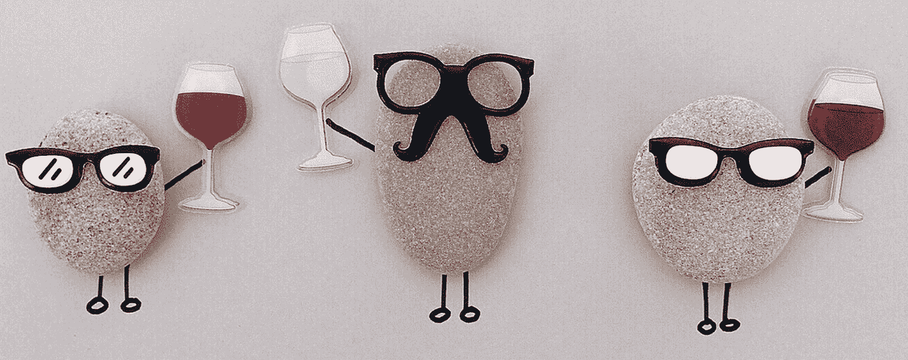
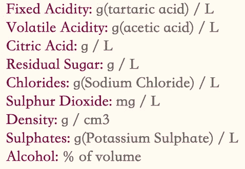
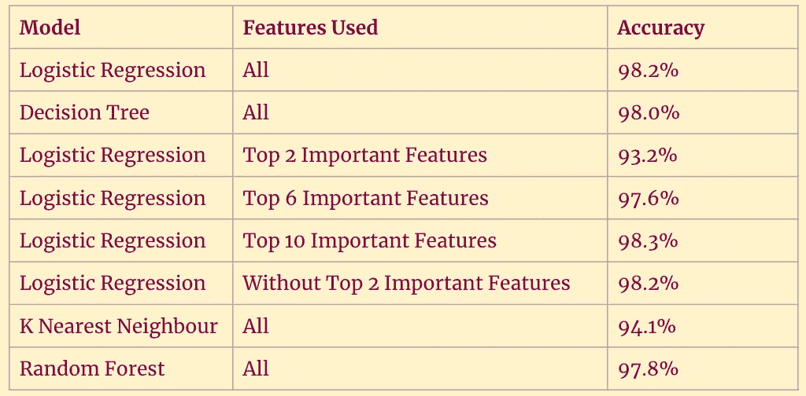
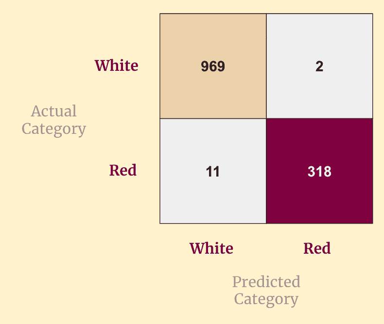
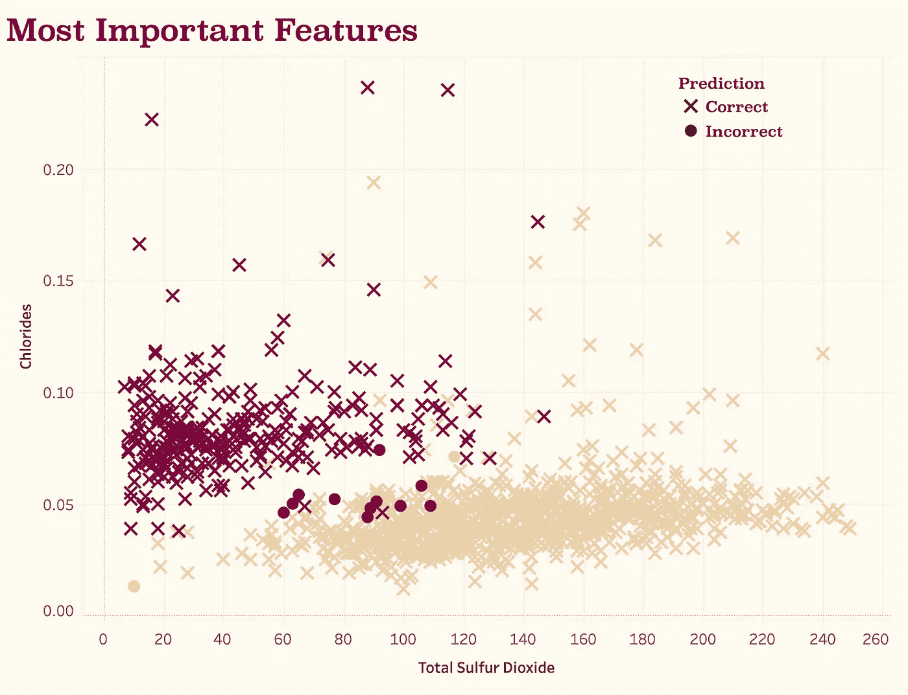
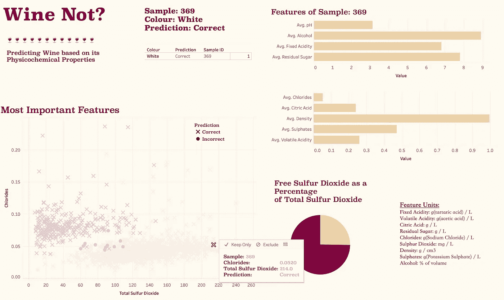
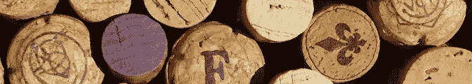

# 酒不是？葡萄酒样品的分类和分析

> 原文：<https://medium.datadriveninvestor.com/wine-not-66ac1243eb1d?source=collection_archive---------3----------------------->

[](http://www.track.datadriveninvestor.com/1B9E)

> 使用监督学习根据葡萄酒的物理化学特性预测葡萄酒，并使用交互式仪表板进行评估。



Cheers! 🍷

无论在科学上还是在社会上，吸烟都是一个热门话题。众所周知，我自己尝试过不同种类的葡萄酒*(通常是在漫长的一周学习后的周五晚上！)*并认为它非常适合于分类项目。我们之前在梅蒂斯训练营的[项目](https://medium.com/datadriveninvestor/predicting-the-score-of-a-rugby-match-c8968a3b62fa)是使用回归来预测一个连续的结果，然而，我们在这里的挑战略有变化——预测一个明确的结果。

我对这个项目的假设是测试葡萄酒样本的**物理化学性质是否可以预测葡萄酒是红还是白。**物理化学特性是指那些与物理和化学特性(冲击)相关的特性，在同一地区的葡萄酒中会有所不同。

这让我想到了为这个项目获取的[数据](https://www.kaggle.com/aleixdorca/wine-quality)。该数据集包含 6500 个葡萄酒样本，来自葡萄牙北部的 vinho verde 地区。其中 75%是白葡萄酒——考虑到该地区生产的 86%的葡萄酒是白葡萄酒，这并不奇怪。这个数据集最初是为了对每个样本进行质量分析而编制的，但是，对于这个项目，每个样本的主观属性都被删除了。



Physicochemical properties measured for each sample.

该项目的标准之一是将我们的数据输入到 SQL 数据库中，并创建一个 AWS 实例来存储该数据库。对我来说，这是一场全新的比赛，在训练营之前，我从未使用过 AWS，只使用过一些基本的 SQL！然而，它似乎去计划，没有灾难，我认为 SQL 和我可以成为长期的朋友！尽管如此，我还是迫不及待地想回到我可信赖的 Jupyter 笔记本和 Python 上进行分析。

> [DDI 编辑推荐— Python 用于数据科学和机器学习训练营](http://go.datadriveninvestor.com/pybootcamp/matf)

## 模型建立的过程

这里有很多选择和很多参数，可以在不同的模型中进行调整。我的思考过程是系统化的，并且从简单开始。我的第一步是使用所有的物理化学特征运行一个逻辑回归模型。我使用这个基线模型来评估稍后要调优的特性和参数。第一个模型表现良好，准确率为 98.2%。因此，我想深入研究特征的重要性，并评估是否有任何强烈的影响葡萄酒是红还是白。

下一个开箱即用的工具是决策树分类器。决策树的美妙之处在于，它会根据使用特征进行的分割对数据进行分类，然后返回特征的层次结构——完美！运行该分类器后，发现**总二氧化硫**和**氯化物**是决定葡萄酒颜色的两个最重要的特征。我还被告知，在这些样品中， **pH** 和**柠檬酸**对葡萄酒的分类最不重要。

虽然决策树分类器的准确性低于最初的逻辑回归，但它提供了一个平台来调整对葡萄酒颜色影响最大的理化性质。因此，我用不同的特征组合重新运行了多次逻辑回归模型，都是为了用最佳特征提高我的模型的准确性。有趣的是，在没有两个最重要的特征的情况下，该模型也表现良好(98.2%的准确度)*，这表明其他特征也确实对分类有影响。我还在混合中加入了 K 近邻和随机森林分类器，持续记录有多少样本被错误预测以及它们的样本身份。然而，这些并没有表现得那么好，准确率分别为 94.1%和 97.8%。尽管人们通常会对 94.1%的模型准确性感到欣喜若狂，但最初的逻辑回归模型确实设置了很高的标准！*



Accuracy of models tried & features used

我最终转向集成，结合不同的模型，试图进一步提高精确度。我分析了每个模型的错误预测，并选择将这些样本有差异的地方结合起来。因此，我选择了逻辑回归和随机森林分类器，使用数据集中的所有特征。好哇...我把准确率提高到 98.8%！

## 结果和解释

我在这上面花费的时间越多，模型的复杂度越高，预测的改进就越小，所以我坚持使用这个最终模型，并在我的测试数据上运行它。我的最终结果如下:

```
Accuracy: 0.99
Precision: 0.994
F1: 0.98
Recall: 0.967
```

*蛮好的，嗯！*😅



Confusion Matrix for Final Model on Test data

我将注意力转向测试数据集中的错误预测本身。这个项目的部分标准是创建一个交互式可视化，这让我非常兴奋。由于我的模型表现良好，我想深入研究数据本身，并创建一个仪表板，在其中我可以单独分析每个样本。感谢 Tableau，这(相对)简单明了，如果你想亲自尝试一下，可以在这里找到！仪表盘围绕着两个定义颜色的最重要的特征，如果你还记得的话，**二氧化硫总量**和**氯化物。**



我绘制了这些数据，并按照颜色(取决于葡萄酒的颜色)和刻度(取决于模型预测)对数据进行了分类。

仅仅基于这些特征，红色和白色样本之间就有明显的区别。如图所示，9 个错误预测的红色样本中有 8 个显示出白色样本的特征！

仪表板允许用户从图或表中选择一个样本，并根据模型的预测分析各个特征。这是很有趣的创造，正如我所说的，请随意发挥左右！(*如果看不出来，我还挺喜欢色彩搭配的)*



Interactive Dashboard created in [Tableau](https://www.tableau.com/)

***那么为什么这两个量词如此重要呢？***

由于二氧化硫具有抗氧化和抗微生物的特性，所以它可以作为葡萄酒中的防腐剂。白葡萄酒中的二氧化硫总量通常高于红葡萄酒，因为单宁含量较少，而单宁也是一种防腐剂。单宁存在于葡萄皮和种子中，在白葡萄酒中大大减少，因为它们不像红葡萄酒那样通常与皮或种子一起发酵。在葡萄酒的制作过程中加入二氧化硫以确保保存并不罕见。类似地，由于果皮和种子中存在氯化物，红葡萄酒中的氯化物含量也较高。矿物质通过葡萄从土壤中吸收后储存在果皮和种子中，因此不同地区的葡萄酒中矿物质含量不同。

谁知道呢！如果你真的想品尝一些葡萄酒，尝一小口吧！干杯！

> 一个完整的 Jupyter 项目代码笔记本可以在[这里](https://github.com/laurenlhoward14/wine-classification)找到。

