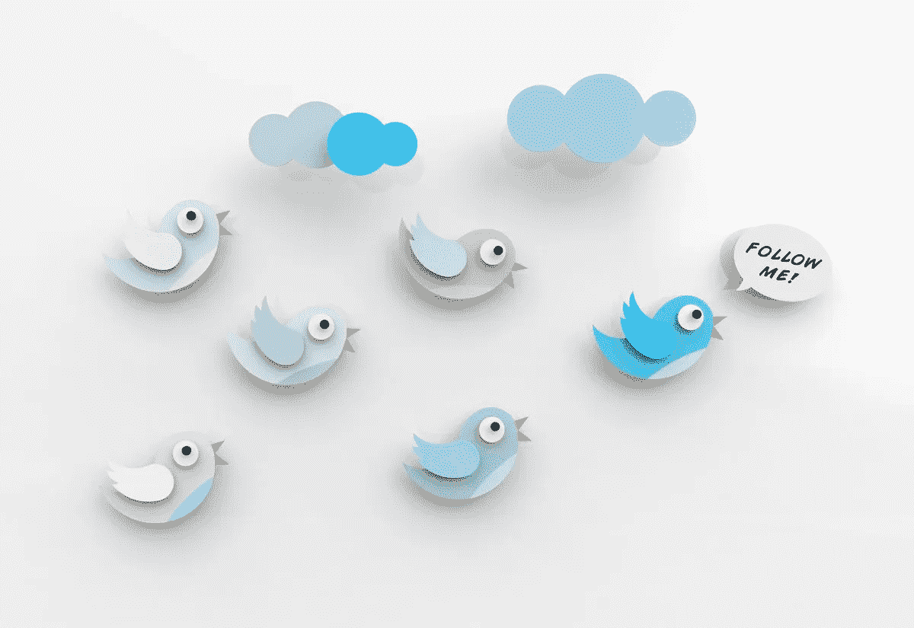

# 影响力越来越大

> 原文：<https://medium.datadriveninvestor.com/winging-to-ever-greater-influence-8bc65070d4f7?source=collection_archive---------9----------------------->

## 在网上寻找晋升机会和更深层次的关系

创业者想要建立自己的品牌影响力，最有效的方式就是面对面的交流。

Twitter 是一个很好的第二选择，因为它有源源不断的社交媒体参与。数字专家认为，蓝鸟的在线派对才刚刚开始，而不是影响力下降。

[Dhariana Lozano](https://twitter.com/DhariLo) 、 [Madalyn Sklar](https://twitter.com/MadalynSklar) 和 [Tim Fargo](https://twitter.com/tim_fargo/) 展望了未来几年等待 Twitter 用户的事情，以增强他们的影响力。

作为该团体的资深成员，法戈几十年来一直以作家的身份推广自己的品牌。社交媒体的出现为他提供了更多的晋升机会，同时也浪费了时间。为了腾出时间，他与人合作开发了社交媒体日程安排应用 [Social Jukebox](https://twitter.com/SocialJukebox/) ，现在他是该应用的首席执行官。

 [## 权力影响者照亮影响者营销

### 营销人员在成为有影响力的人方面受到了错误的教育

blog.markgrowth.com](https://blog.markgrowth.com/power-influencer-shines-light-on-influencer-marketing-6837a2d597dc) 

仅在几年内，该应用程序就为 Fargo、Sklar、Lozano 和社交媒体上的其他人节省了时间，让他们可以从事他们最擅长的事情:推广他们的品牌并获得影响力。

这也给了法戈一个机会来审视如何在今天和未来充分利用 Twitter。

“要始终如一，”他说。“这个世界超级吵。你需要每天重复不同的核心信息。自动发布使这变得更加容易。做你自己就好。这个世界不需要更多的模仿者。

“不要害怕暴露缺点，”法戈说。“例如，我发布关于上瘾的帖子。十年前，我有严重的酗酒问题。这不是我的核心信息，但它是我的一部分，我发布了它。真实性不仅仅是美丽的假日照片。”

他补充了更多专业技巧:

*   参与。有太多的账号输出内容却不回应人们。他们称之为社交媒体，因为它应该是双向交流。不仅仅是广播。
*   耐心点。我们都想快点得到东西。不幸的是，世界很少合作。但是坚持下去的人会有丰厚的回报。
*   实验。尝试新事物。不要害怕改变事物。巨大的成果很少是盲目努力的结果。
*   玩得开心。不管你在做什么，找到享受社交媒体和 Twitter 的方法会让你的旅程更有收获。

# **戏剧性的结果**

洛扎诺是一名社交媒体顾问，也是 [Block & Ave.](https://twitter.com/blockandave) 的联合创始人，他支持用视频增加连贯性，包括[上线](https://medium.com/@JKatzaman/live-stream-freely-and-legally-c313f4114a15?sk=91ad5b15b134e13041368d237af2759d)。

数字营销专家 Sklar 已经习惯了在推特上使用 gif——尤其是定制的 gif——他说:“这将极大地提高你的参与度。再加上太好玩了。”

 [## 最棒的 GIF 是转瞬即逝的

### 尝试简单、醒目的视觉效果来赋予你的品牌个性

medium.datadriveninvestor.com](/the-greatest-gif-of-all-is-fleeting-868d6220f69a) 

参与 Twitter 聊天有助于扩大影响力。没有什么比在全球观众面前进行一场对话更有影响力的了。大家都知道你的观点。另外，你可以边走边向别人学习。

“每个话题都有一个 Twitter 聊天，”Lozano 说。

“聊天是扩大影响力的最佳方式之一，”她说。"强大的营销人员和企业家团体有着学习 Twitter 的共同目标."

根据 Lozano 的说法，聊天参与者的共同兴趣带来了几个好处:

*   分享有价值的信息
*   与目标受众或同行的对话
*   建立思想领导力

“Twitter 聊天是一个与‘你的人’联系的绝佳场所，”Sklar 说。“展示你的知识，作为你所在领域的专家被人看到和听到。我们的一些#TwitterSmarter 聊天常客已经证明了他们的价值，并成为了客人。”

有抱负的主持人现在应该考虑做一个 Twitter 聊天。然后和已经主持过的人核实一下，看看怎样才能把事情做好。

Sklar 说聊天对主持人来说有[有价值的好处](https://madalynsklar.com/2019/02/the-benefits-of-starting-your-own-twitter-chat/):

*   建设繁荣的社区
*   轻松与您的目标受众建立联系
*   提供了一个绝佳的学习机会

Lozano 说:“当你的行业或话题没有聊天时，考虑开始你自己的 Twitter 聊天。”“你有独一无二的东西要拿出来。你有一个想以新的方式联系的社区。使用聊天来进行特定的活动，如活动。”

# **列清单**

列表是另一个 Twitter 影响工具。它们是在行业对话或特殊话题中保持最新状态的好方法。此外，企业家可以监控他们的竞争。

洛扎诺说:“使用 Twitter 列表的方式有很多。"此功能允许您在一个地方组织特定的帐户。当您添加的人被列入名单时，他们会收到通知。其他人可以关注您创建的列表，因为列表有自己的链接。

“由于这些特点，Twitter 列表是一种无需关注任何人就能扩大受众的好方法，”她说。“你可以组织人和资源。列表可以为您的受众增加价值。”

 [## 清单让你的约定有目标

### Twitter 列表帮助企业家发展他们的业务

blog.markgrowth.com](https://blog.markgrowth.com/lists-keep-your-engagements-on-target-75945de7281) 

以下是她列出的一些专业建议:

*   创建一个“感谢”客户或分享您内容的人的列表。
*   有一个你最喜欢的账户或工具的资源列表。
*   创建私人列表以跟踪影响者。
*   组织活动发言人。

Sklar 说:“将团队成员分组，创建一个员工目录。“为未来的机会创建一个潜在客户列表。把你最特别的客户保存到一个列表中。”

这些建议包含在她的推特列表终极指南中。

标签是必不可少的 Twitter 品牌建设工具，尤其是当它们脱颖而出的时候。使用“骆驼背”格式帮助用户阅读。不要使用#twittersmarter，而要使用#TwitterSmarter。这种差异在多词创作中非常明显。

即使用户的意图是好的，Lozano 回忆起常见的标签错误:

*   不研究标签是什么就使用标签
*   使用过于流行或普通的标签
*   根本不用标签
*   忽略本地标签
*   使用太多标签，而不是限制在每条微博两个

洛扎诺说:“超过两个标签会让你眼花缭乱。”"研究表明，超过两次会降低参与度."

当 Sklar 看到“#你的#tweet 中的每个# other word #都是#hashtag”时，她很恼火。还有一些没有意义的标签。”

# **难忘的印象**

推文的视频回复——以及直播——获得了巨大的吸引力。

“你可以在 Twitter 上创建许多不同的视频内容，”洛扎诺说。“分享技巧、回答问题、现场采访、深入公司或活动的幕后。我们都有机会接触到给推文增添活力的 gif。甚至创造自己的。”

Sklar 是推特中视频回复的忠实粉丝。然而，2019 年 3 月，Twitter 改变了移动应用程序 camera，并增加了做视频的难度。

“步骤太多了，”Sklar 说。“我现在提倡定制 gif。这是做得漂亮的视频。”

她在她的文章 [*“你在 Twitter 上使用 gif 和自定义 gif 的指南”中解释了这一点*](https://madalynsklar.com/2019/12/using-gifs-on-twitter/)

 [## 日程安排者让社交媒体保持正轨

### 利用生产力工具优化您的发布

medium.datadriveninvestor.com](/schedulers-keep-social-media-on-track-8f5813729d94) 

洛扎诺说:“确保你的视觉效果在你的推文中正确出现的最好方法是测试和检查它们。”“如果我使用调度程序，我会在一天中的某个时间进入，以确保推文以正确的格式发出。

“我总是尝试，”她说。“我将测试图像显示效果。有时候 Twitter 会改变它的工作方式。”

视觉营销专家 Louise Myers 为 T2 提供了一份指南，为推特上的图片提供了正确的规范。

Twitter 的一个有时被忽视的好处是固定推文。

“对你最重要的内容使用 Pin Tweet 功能，”Lozano 说。“我现在为我的每月会员计划发布了一条推文。使用这些推文来推广你的免费名单、网站或[的最新优惠](https://blog.markgrowth.com/lead-magnets-attractive-ways-to-get-your-foot-in-the-door-2005d8be6f96)

Sklar 用她固定的推文来推广她的最新文章或推特时刻。她还将一条[钉住的推文变成了一条线索](https://madalynsklar.com/2019/06/how-to-use-twitter-threads/)。

# **频繁检查**

为了确保 Twitter 的策略不偏离轨道，Lozano 和 Sklar 建议用户每月或尽可能地审计他们的账户。

“审计你的推特账户非常重要，”洛扎诺说。“我每个月都有提醒。这时，我会收集并记录我的分析，看看我的个人资料，以确保一切都井然有序，或者如果我感到有灵感去改变一些事情。

“偶尔调整一下，”她说。“尝试不同的传记格式。更改您的标题图像，以反映您的最新优惠或为您的帐户带来一点新鲜感。不要害怕尝试新事物。你随时可以把它改回来。”

Lozano 的免费资源库中有一份 15 分钟的 Twitter 审计清单。

Sklar 在她的文章 [*“如何检查和清理你的 Twitter 账户”中谈到了审计问题*](https://madalynsklar.com/2019/12/clean-up-your-twitter-account/)

**关于作者**

吉姆·卡扎曼是 T21 拉戈金融服务公司的经理，曾在空军和联邦政府的公共事务部门工作。你可以在[推特](https://twitter.com/JKatzaman)、[脸书](https://www.facebook.com/jim.katzaman)和 [LinkedIn](https://www.linkedin.com/in/jim-katzaman-33641b21/) 上和他联系。