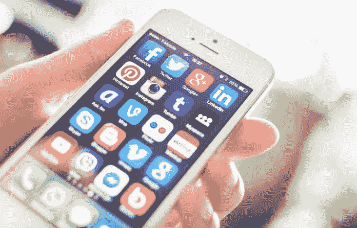
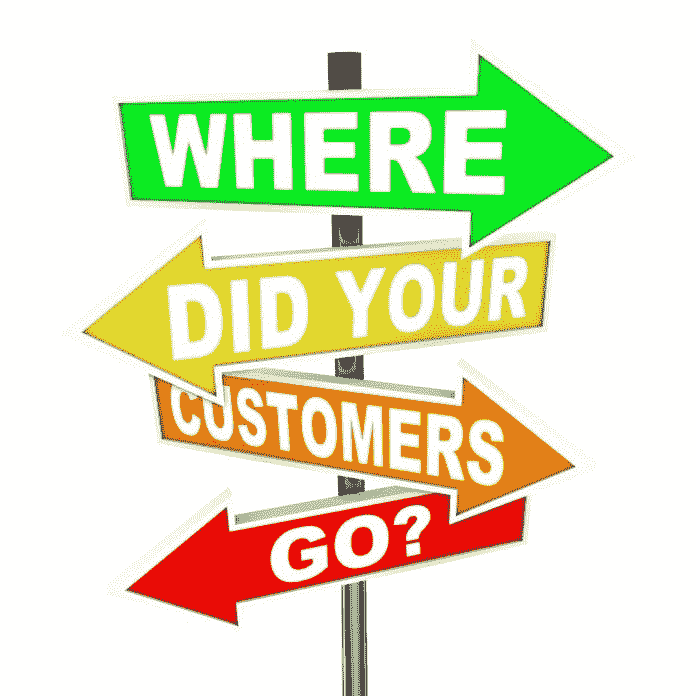

# 获胜的品牌习惯性地取悦消费者

> 原文：<https://medium.datadriveninvestor.com/winning-brands-habitually-please-consumers-b5982ee07f79?source=collection_archive---------4----------------------->

## 了解客户习惯，以吸引他们的注意力和销售

消费者的习惯会随着时间的推移而演变。这可能是口味变化、新兴技术和一系列其他因素的问题。要想成功，企业家必须预测并适应经济趋势，这样他们才能领先于竞争对手。

[Francis Kihara](https://twitter.com/KiharaFrank) 研究消费者习惯，认为他是“一个对建立和推广品牌感兴趣的热情的营销人员”他的[entri idea 博客](http://entridea.blogspot.com/?fbclid=IwAR1fgsr3XhU8ccD8ARnCtqtl2XQiwfD0ZfpLiew5l4Fw0tVryInriA9Fx4w)“全是关于创业和创意产生的，”他在[非洲推特聊天](https://twitter.com/AfricaTweetChat)中讨论了这一点。

他列举了品牌可以用来监控消费者习惯的各种工具。

“首先，我们通过了解消费者的行为和习惯来开始对话，”Kihara 说。“消费者行为只是个人、群体或特定社会所反映的购买习惯和模式。

 [## 在创业之旅中，拥抱学习|数据驱动的投资者

### 好像建立一个数百万美元的公司还不够困难，企业家必须额外照顾他们的…

www.datadriveninvestor.com](https://www.datadriveninvestor.com/2018/10/16/on-the-entrepreneurial-trek-embrace-the-learning/) 

“品牌需要了解消费者的习惯、诱因和偏好，”他说。“这只能通过使用数据来理解，但数据是如何收集的呢？是通过监控工具。”

# 新旧工具

Kihara 解释说，技术和传统工具分为几类:

*   社交智能工具:集成的社交倾听软件，如 Hootsuite、Social references、Sprout Social、KeyHole、SumAll 和 Hubspot。这也包括搜索引擎分析工具:Google Analytics、Neil Patel、SEOptimer 和 Moz Analytics。社交媒体平台支持的工具:脸书提及、脸书洞察、脸书分析、Twitter 分析、YouTube 分析和 Instagram 分析。
*   用于测量人口统计、媒体习惯和心理图形的工具:益普索思纬、Tifa 研究、斯莫兰零售解决方案、尼尔森、德勤研究、Geopoll、ReelForge 和消费者洞察。
*   追踪对话:西辛和 SM2。
*   购买决策和消费者零售商店行为:钱柜数据分析，WiFi 跟踪工具，EFT 数据可用。

Kihara 概述了显示消费者习惯多年来演变的指标:购买模式的变化，越来越多的在线社区转向更健康的产品，社会责任附属营销实时消费，评论至上，见多识广的消费者和忙碌的消费者。

 [## 人情味助推优秀品牌走向巅峰

### 消费者的购买行为与情绪息息相关

medium.com](https://medium.com/datadriveninvestor/human-touch-boosts-outstanding-brands-to-the-top-5b71cd610e73) 

“随着时间的推移，消费者已经转向在线电子商务平台进行重要的购买，”Kihara 说。“最初，个人会去市场买杂货，但现在只需在网站上点击一下。”

他看到越来越多的大多数在线社区和消费者转向在线的方式。搜索更加本地化和个性化。消费者依靠在线评论来做出购买决定。

“我们正在走向一种纯移动文化，”Kihara 说。“在线视频已经比有线电视更受欢迎。世界上大多数人通过社交媒体联系在一起。

“有一种向更健康产品的转变，”他说。"人们正在转向无糖强化食品，以避免糖尿病、肥胖症和癌症等新的疾病。"

# 满足社会需求

Kihara 指出可口可乐是一个公司转向零糖产品和能量提升的例子。

他说:“人们对那些对社会需求有浓厚兴趣的品牌很感兴趣，比如环保、伟大的企业社会责任活动以及为社会慈善事业做贡献。”“营销概念已经从产品概念转变为现在的社区和社会意识营销概念。

“这意味着消费者购买的产品符合他们的价值观和文化，”Kihara 说。“社会责任品牌必胜。”

随着消费者对消费者推荐和招聘的增加，千禧一代将同龄人作为他们的主要影响力。

“实时消费和信息访问的出现给了消费者技术，让他们不必去商店就能获得他们需要的所有产品信息，”Kihara 说。“谷歌是这方面的一大颠覆。”

他深入挖掘评论的至高无上。

“你上一次下载应用程序或预订酒店是什么时候？”木原说。"我敢打赌，你用评论来做决定."

并非所有的评论都是平等的，对此，Kihara 给出了消费者阅读评论的原因:

*   去看看别人在说什么。
*   与企业建立信任。
*   避免不良产品和服务。
*   从企业那里获得透明度。

Kihara 说:“技术的发展导致了一个见多识广的消费者，他有一大堆需要权衡的产品。

# *没时间浪费了*

时间越来越成为一种宝贵的商品。

“忙碌的现代消费者几乎没有时间过多考虑产品，”Kihara 说。“让他们印象深刻的是他们挑选的东西。哪个品牌到达潜意识就赢了。品牌必须在各方面给自己定位，做到心中有数。

“再次，可口可乐执行全球最佳的销售标准之一，有助于抓住消费者，”他说。

Kihara 将品牌价值定义为消费者愿意为品牌支付额外费用并重复购买的溢价。

“你的品牌价值观将帮助你抓住品牌的三个 P:主张、个性和目的，”他说。“如果没有价值观来指导你，你的品牌看起来就像其他业务一样。这是一个品牌在同一片海洋中与众不同的地方。”

 [## 创新为商业基础注入乐趣

### 思想开放和灵活会带来成功

medium.com](https://medium.com/datadriveninvestor/innovation-injects-fun-into-business-fundamentals-408a620713aa) 

他列举了影响消费者购买习惯的品牌价值:

*   社会责任。
*   快乐——可口可乐品牌的“分享感受”最能体现这一点
*   通过客户服务和满意度实现客户至上。
*   创新。
*   可持续性。
*   对更好的环境和更强大的社会的承诺。

精明的企业家利用内容个性化来引发消费者的反应。

“个性化——也意味着定制——寻求根据特定用户的需求定制数字产品，”Kihara 说。"它们共同引发了消费者的反应."

*   让观众有一种内在控制感。
*   减少信息过载。当你知道社交媒体网站上显示的内容是为你量身定制的，与帖子一般化相比，它提供了一个更易于管理的参与框架。
*   当人们听到自己的名字时，会有一些特别的事情发生。它会触发大脑活动。
*   这是完成注意力、兴趣、欲望和行动的 AIDA 模型的最佳方式。

# 迎合顾客

“内容个性化的优势包括改善客户体验、增加收入、提高客户忠诚度和品牌忠诚度，”Kihara 说。

品牌如何讲述故事将极大地影响消费者的决策。

“麦肯锡咨询公司表示，多达 40%的消费者在购买前会因为他们看到或听到的一些事情而改变主意，”Kihara 说。他将决策过程分为几个阶段:最初的考虑、积极的评估、购买的瞬间、购买后的体验和忠诚度循环。

“品牌故事可以有多种形式，”他说。“它们包括产品网站演示；消费者评论；社交网站图片和对话；Monster Energy 很好适应的贴纸信息等产品或服务卖点；视频讲故事；和影响者营销。”

 [## 那是她的故事，而且她坚持这样做

### 创意遇上内容营销讲故事

blog.markgrowth.com](https://blog.markgrowth.com/thats-her-story-and-she-s-shticking-to-it-47924f608fc6) 

他讲故事的必做之事是确保每个故事都引人入胜，值得分享；做文化相关用内容连接人，用技术连接渠道。因此，品牌故事可以在决策的每一步帮助消费者:

*   品牌故事可以增加积极的品牌反应，并最终使消费者更愿意购买低涉入类别的品牌产品。
*   减少负面品牌联想。
*   有助于在消费者心目中树立积极的品牌形象。
*   建立客户参与度。
*   通过展示产品的独特性来帮助分享品牌价值:帮助回答“你是谁？”

“故事是人们记得的东西，”基哈拉说。“即使他们忘记了名字和面孔，他们也很少会忘记这个故事以及它给他们带来的感受。请记住可口可乐的“分享可乐，分享感受”活动。

“人们与故事相关，”他说。“他们在你的主角身上看到了自己的影子。他们把对抗和冲突与他们自己生活中的问题联系起来。当主角最终实现目标时，他们分享喜悦和回报。”

 [## 我们讲述自己最精彩的故事

### 讲故事赋予你的品牌个性

medium.com](https://medium.com/datadriveninvestor/we-tell-our-own-best-stories-8a07ec5ab760) 

在所有的戏剧之后，总会有回报的。

“故事揭示了产品如何有益于客户，它打算解决什么和它的质量，”Kihara 说。"体验被重新定义，比如在 Airbnb 的故事中."

社交媒体可以帮助品牌与消费者建立联系，但这不是全部的解决方案。

“在发展中经济体，2018 年首次有超过 3.6 亿人上网，”基哈拉说。“这大约是世界人口的百分之五。

“我们现在有超过一半的世界人口连接到互联网上，”他说。“互联网用户平均每天上网 6.5 小时。社交媒体平均领先 2.25 小时。”

其他统计数据显示，有近 35 亿活跃的社交媒体用户，占世界人口的 45%。社交媒体去年的 2.8 亿新用户反映了 9%的增长。2018 年，脸书、谷歌和 YouTube 高居谷歌搜索榜首。

 [## 脸书营销是一个迷宫

### 这个社交媒体巨头已经为社区建设做好了准备

blog.markgrowth.com](https://blog.markgrowth.com/facebook-marketing-is-a-maze-ing-abfe0961a107) 

超过 22.7 亿人在脸书，19 亿人在 YouTube，10 亿人在 Instagram。平均每个月每个用户有四条评论。

“有了这个数据，是的，品牌应该使用社交媒体，”Kihara 说。“未来就在那里。”

他提出了使用社交媒体的好处:

与此同时，Kihara 提醒人们注意社交媒体的陷阱:

*   比你的观众更关注你的产品或服务。
*   不包括你的观众。
*   不是讲故事。
*   在不同的社交媒体平台上使用相同的语气和风格。
*   不关注分析。它们很重要。

“成功的品牌使用多种平台来接触消费者，”Kihara 说。“这是通过分段瞄准来实现的。是的，数字正在成为主流。

“单靠社交媒体并不能解决问题，”他说。“企业家应该整合他们的客户参与的所有营销渠道。这有助于建立品牌形象和轻松跟踪投资回报。”

**关于作者**

吉姆·卡扎曼是拉戈金融服务公司的经理，曾在空军和联邦政府的公共事务部门工作。你可以在[推特](https://twitter.com/JKatzaman)、[脸书](https://www.facebook.com/jim.katzaman)和[领英](https://www.linkedin.com/in/jim-katzaman-33641b21/)上和他联系。

*原载于 2019 年 4 月 22 日*[*https://www.datadriveninvestor.com*](http://bit.ly/2Vol2gm)*。*