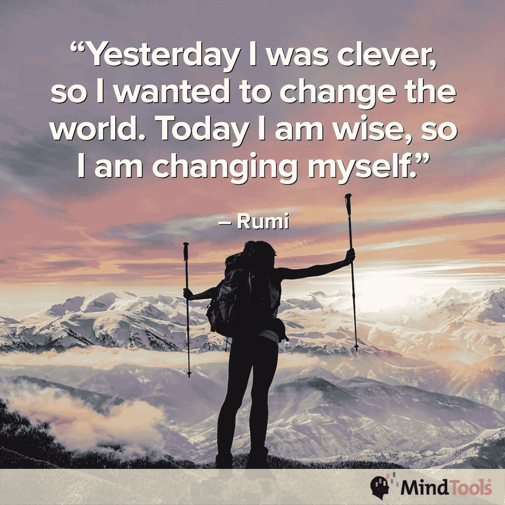
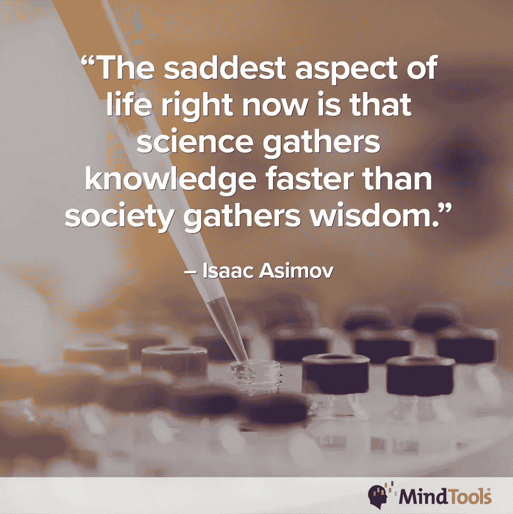
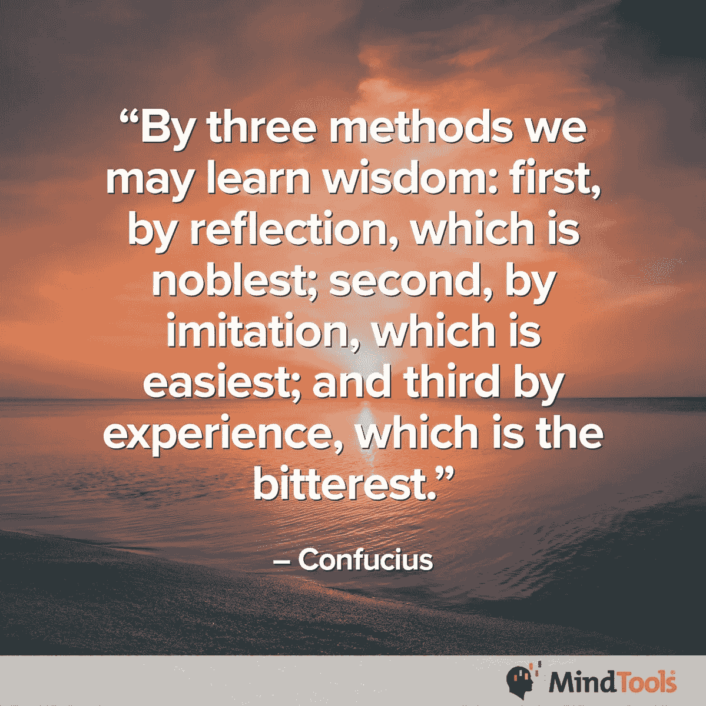

# 智慧孕育成功——如果运用得当

> 原文：<https://medium.datadriveninvestor.com/wisdom-breeds-success-if-applied-wisely-604110ff9129?source=collection_archive---------6----------------------->

## 少说，多听，更好地观察你周围的人

山顶上并不总是有智慧。有智慧的人每天都会路过，尤其是工作的时候。

那些今天认为自己没有智慧的人可以振作起来。[扎拉·布里塞利](https://twitter.com/ZalkaB)、[伊布昆·奥卢本加](https://twitter.com/hibbikay)和[头脑工具](https://twitter.com/Mind_Tools)网站的专家们相信人们可以获得智慧——如果他们用心去做的话。

Bricelj 是神经语言编程大师教练和讲故事的人。奥卢本加是漫画家和作家。

Mind Tools 有助于“传播领导力、管理和个人效率方面的最佳理念”

 [## 用领导者的思维把握成功

### 在这个令人分心的世界里，专注是一项挑战

medium.datadriveninvestor.com](/grasp-success-with-the-mind-of-the-leader-92416c0b5a78) 

从根本上说，智慧就是拥有知识，知道何时以及如何使用知识。

“很多时候，智慧与年龄有关——或者说变老，”Bricelj 说。“我们的经历和学习让我们变得更聪明，或者更好地理解我们周围的世界、人和环境。”

奥卢本加相信做正确的事。

“智慧是知道正确的事情，并在正确的时间以正确的方式去做，这对每个人都有好处，”她说。

Mind Tools 认为时机——以及你如何利用它——就是一切。

该网站称，“智慧就是少说，多听，多观察”。“智慧是从你所知道的、你所理解的和你的生活经验中获得洞察力的能力。”

# 不要炫耀

智慧是意识到你拥有知识而不炫耀它。它伴随着冷静和耐心。

“聪明人不会妄下结论，”思维工具说。“一个明智的人会听得懂，不会为了满足自我而说话。”

当然，没有人急于获得智慧。

“这是在各种情况下变得更加沉着和‘有成就’，”Bricelj 说。“你可以更好地评估形势，不那么被动，言行不那么冲动。你更经常地看到更大的画面。”

“智慧是知识的应用，”奥卢本加说。

 [## 用行动和态度提高技能

### 领导力不是一种适合所有人的风格

medium.datadriveninvestor.com](/sharpen-skills-with-action-and-attitude-6bc2fef20e1a) 

如何应用这些知识是一套技能。

“人们可以积累很多知识，”Bricelj 说。"然而，有些人缺乏使用和应用这些知识的智慧和技能."

正如 Mind Tools 解释的那样，这是一个知道哪些信息该使用，哪些该忽略的问题。

“我们通过学习、研究和经验了解到的事实和想法就是知识，”该网站称。“知道何时以及如何以一种成熟而功利的方式应用你所知道的东西，这就是智慧。”

有智慧的人给别人一条长皮带。快速触发显示缺乏智慧。

“糟糕的领导力是指老板或领导者没有能力领导、管理团队或赋予良好的团队合作，”Bricelj 说。“当‘我’比我们更重要时，团队成员表现出缺乏智慧。

“一般来说，当沟通不畅得不到解决时，就缺乏智慧，”她说。“这变成了‘他说，她说’式的情况。”

# 避开无聊

相反的情况很明显。

“当环境吸引人时，你知道智慧正在被使用，因为你会想要积极参与，”Olugbenga 说。“如果没有，环境会很无聊，很单调。”

根据 Mind tools 的说法，在人们不参与或不可教的环境中，缺乏智慧。

 [## 同伴压力威胁生命

### 当职场内外被欺负者控制时，人们处于危险之中

medium.datadriveninvestor.com](/peer-pressure-threatens-lives-78eca60ebffd) 

“当压力很大时，缺乏智慧是显而易见的，”该网站称。同时，聪明的人似乎知道在压力下应该做什么。

“在高度政治化的环境中，往往缺乏智慧，因为人们服务于错误的利益或有隐藏的动机，”Mind Tools 说。"在允许人们思考和推理的工作场所，智慧更为普遍."

网站有一个解释[归纳推理](https://www.mindtools.com/pages/article/newTMC_96.htm?utm_source=social&utm_medium=organic&utm_campaign=tweetchat)的博客。

自我和高压环境将智慧挤出画面，可能是因为领导者没有强调智慧是一种品质或一种值得努力的价值。

“不同的人被不同的价值观和经历所驱使，”Bricelj 说。“当一家公司没有培养同理心、协作和分享或知识的文化时，事情可能会失去同步。”

几乎总是，一个团队反映了领导者的品质。

“当领导者缺乏智慧时，你会看到这一点，”奥卢本加说。“这包括团队领导、老板、经理、首席执行官或任何负责积极推进业务的人。”

缺乏智慧会破坏交流，最终会破坏信任。仓促的决定会蚕食利润。

奥卢本加说:“有未能满足最后期限的情况，也有商业上的失败。“技能的死气沉沉或多余的技能，缺乏创新或主动性，马虎和其他负面因素是一个不成功的商业公司的标志。”

工人的安全也是一个因素。

“在领导者缺乏智慧的环境中，员工可能会感到心理不安全，”Mind Tools 指出。"哪里缺乏智慧，哪里就常常缺乏自我意识。"

网站上有一篇关于如何[培养自我意识的文章](https://www.mindtools.com/pages/article/developing-self-awareness.htm?utm_source=social&utm_medium=organic&utm_campaign=tweetchat)。

# 平静之岛

一个聪明的人会在工作中创造一个稳定的中心——一个进行理智检查和推理的地方。冷静能缓和紧张的局势。即使是不利的条件也能导致好的决策。

奥卢本加说，“积极的氛围，团队精神显示了一个成功的商业冒险。”

聪明的人可以改善环境。

“这可能会令人耳目一新，令人振奋，”Bricelj 说。“聪明的人知道如何观察和倾听，以及何时加入他们的一部分，以加强团队或提升士气。

“当他们的意图真实可信时，就会发生这种情况，”她说。

 [## 一次，两次，三次一个领导

### 伟大的领导者有同理心和善良——并倾听

medium.datadriveninvestor.com](/once-twice-three-times-a-leader-ab554765231c) 

智慧来自于观察、倾听、看结果和学习。把这些都拿走，需要的时候再付。

“人们有一种强烈的渴望去真正理解而不是知道，然后投入正确的努力去获得这样的理解，”Mind Tools 说。

该网站称，“通过倾听和向聪明人学习，你会获得更多的智慧”。"增加智慧的一个方法是成为智囊团的一员."

Mind Tools 有一个帖子是关于[智囊团是如何工作的](https://www.mindtools.com/pages/article/mastermind-groups.htm?utm_source=social&utm_medium=organic&utm_campaign=tweetchat)以及加入这样一个团体对你有什么好处。

“是的！布里塞尔说:“策划小组是非常棒的 T2 T3。“能够与人聚在一起，讨论问题，相互授权，共同学习，这是最好的组合。

“智慧不是你可以买到的，”她说。“重要的是要保持开放的心态，成为一个终身学习者，并观察、倾听和观察他人。保持好奇心，抓住生活中的每一个机会去学习新事物，变得更聪明——*和*从错误中学习。”

最聪明的人都足够聪明，不会让人觉得他们很聪明。他们谦逊聪明。

“我钦佩那些终生学习的人，他们对学习新东西*和*与他人分享感到兴奋，”Bricelj 说。“我经常回头看我的祖父母教给我的东西，并看到它如何与我的道路和学习相吻合。”

奥卢本加有她的英雄模型。

她说:“[比尔·盖茨](https://twitter.com/BillGates/)正致力于为许多人增加积极的价值观，并证明自己是一位当之无愧的世界领袖。”。“我非常钦佩安静的人。有太多难以启齿的个性。”

# 从右边开始

智慧应该从每个新人上班的那一天就开始运用。这有助于他们迅速适应文化，而不会浪费时间，也不会因为不得不自己照顾自己而感到沮丧。

“增加你与人相处的智慧总是有益的，”思维工具说。“增强自我意识可能会帮助你做出明智的反应，而不是快速反应。”

 [## 为糟糕的入职体验找借口

### 对公司的良好介绍有助于幸福的婚姻

medium.datadriveninvestor.com](/cut-excuses-for-bad-onboarding-experience-498913851acb) 

该网站有一个关于[如何意识到盲点](https://www.mindtools.com/pages/article/newTED_90.htm?utm_source=social&utm_medium=organic&utm_campaign=tweetchat)可能会帮助你在未来更明智地行动的博客。

“把智慧用在决策上，”奥卢本加说。“这对所有人都有影响和好处。”

运用得好的智慧会带来清晰。

“这适用于所有存在误解、冲突或纯粹的自我冲突的情况，”Bricelj 说。“智慧和人际交往技巧可以帮助你‘退后一步’，找到一个有益的解决方案或对话，从而成功地继续下去。”

**关于作者**

吉姆·卡扎曼是[拉戈金融服务公司](http://largofinancialservices.com)的经理，曾在空军和联邦政府的公共事务部门工作。你可以在[推特](https://twitter.com/JKatzaman)、[脸书](https://www.facebook.com/jim.katzaman)和 [LinkedIn](https://www.linkedin.com/in/jim-katzaman-33641b21/) 上和他联系。