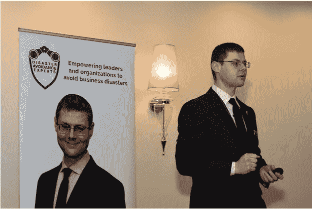
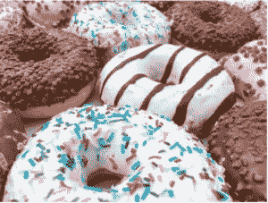

# 明智决策者运动宣言

> 原文：<https://medium.datadriveninvestor.com/wise-decision-maker-movement-manifesto-e38cd60eb194?source=collection_archive---------11----------------------->

# 作为决策者，你不应该相信自己的直觉:原因如下

商业领导力和职业建议中最大的谎言可能也是最常被重复的:“跟着感觉走。”你肯定经常听到这个建议，以及这句话的一些变体，例如“相信你的直觉”、“保持真实”、“倾听你的内心”，或者作为决策者“跟随你的直觉”。

如果你喜欢视频，[这里有一个基于这个博客的视频:](https://youtu.be/iuVNaSXISnM)

如果你喜欢音频，[这里有一个基于博客](https://www.spreaker.com/user/11435621/wise-decision-maker-movement-manifesto)的播客:

或者直接往下读！

当我看到高利润的公司、顶尖的职业生涯和良好的商业关系因为有人接受了听从直觉的有毒建议而遭到破坏时，我深感沮丧、难过和愤怒。当一个人从某个大师的走火研讨会回到家，开始表现得像“真实的自己”时，他们只是在搬起石头砸自己的脚——还有他们的生意。

我们真实的自我适应了古老的热带草原，而不是现代的商业世界。在当今的职业环境中，跟随我们的直觉会导致可怕的决定。为了我们的底线，我们需要避免跟随我们的原始本能，而是文明地对待我们如何解决我们头脑中固有的缺陷。

思考这些问题:

*   贵公司有百分之多少的项目成本超支？
*   你公司的领导上一次抵制必要的变革是什么时候？
*   你团队中的人是否经常对他们决策的质量过于自信？
*   在你的工作场所中，有多大比例的计划过分强调较小的短期收益而不是较大的长期收益？
*   您的员工表示不愿意就潜在的严重问题进行艰难的对话的频率有多高？

所有这些和许多其他问题都来自于我们的本能反应。

这些错误中的任何一个，如果重复得足够频繁，都可能并确实会给成功的公司带来灾难，并拖垮雄心勃勃的职业生涯，尤其是在面对那些自学如何避免此类问题的聪明竞争对手时。相比之下，如果你是一个了解这些错误并为自己辩护的人，你可以利用那些敢于犯毁灭性错误的竞争对手，使你获得真正的竞争优势。

# 商业战略评估存在严重缺陷

可悲的是，当前旨在通过结构和规划解决人性弱点的商业战略评估本身存在严重缺陷。以其中最受欢迎的 SWOT 为例，一群商业领袖试图找出他们的企业所面临的优势、劣势、机会和威胁。由于我们的大脑是如何连接的，SWOT 评估通常无法解释我们所犯的危险的判断错误。

尤其有问题的是，SWOT 分析几乎总是在团队环境中进行，而在团队环境中，精神盲点通常会成倍增加。一个特别大的问题被称为群体思维，群体倾向于围绕一个强有力的领导者的观点联合起来。

SWOT 和类似的战略评估给使用它们的企业领导人一种虚假的舒适和安全感。这些令人欣慰的技术导致了令人震惊的疏忽，毁掉了有利可图的业务。

# 体育领先于商业

令人惊讶的是，像棒球这样的运动在认识到避免本能反应的价值方面已经领先于绝大多数企业，2011 年的电影 *Moneyball* 使这一点广为人知。这部电影展示了奥克兰运动家棒球队 2002 年的赛季，该队当年的球员预算非常有限。其总经理比利·比恩采用了一种非常非正统的方法。他依靠定量数据和统计来选择球员，而不是传统的相信球队球探直觉的方法。

换句话说，他用的是头脑而不是直觉。他雇佣了一系列被其他使用老派评估方法的球队低估的球员。结果，奥克兰运动家队破纪录地赢得了 20 连胜。

其他团队也采用了同样的方法。在对球员的决策中，统计数据越来越多地主导直觉反应，以及做出什么样的选择。在棒球和其他运动中，对定量数据的依赖也越来越普遍。例如，足球中的踢腿越来越过时，因为基于证据的方法显示，从统计上来说，踢腿是一个坏主意，尽管直觉表明踢腿很好。

如果在你的业务中引入一项类似的革命性创新，让你连续 20 个季度获得创纪录的增长，你愿意付出多少？通过避免相信你的直觉，而是用你的头脑，你会得到一个本垒打。

# 为什么总是听到“跟着感觉走”？

如果我们的直觉与现代世界如此不匹配，为什么“跟着感觉走”的建议如此广泛？因为相信我们的直觉对我们来说很自然。我们倾向于选择舒适的东西，而不是真实的或对我们有益的东西，即使面对非常有力的证据表明并非如此。

可悲的是，那些告诉人们他们想听什么以及什么让他们感到舒服的大师们得到了高薪，而那些说出令人不舒服的真相的专家们通常被忽视。你直觉上更愿意听到什么:有人描述美味、令人愉快、可口的一打甜甜圈，或者有人分享如何保持身体健康？

难道你不能想象那一打油炸圈饼:巧克力糖衣、波士顿奶油、草莓果冻、奶油冻、巧克力屑、柠檬奶油？好吃！我让自己饿了。最好买些甜甜圈。

好了，我说完了。回到宣言。

“跟着感觉走”相当于一打甜甜圈甜点的商业建议。

当然，一盒 12 个甜甜圈所含的卡路里比我们一天应该吃的还要多。然而，我们的直觉想要油炸圈饼，而不是不符合我们直觉的健康但不那么直观的水果拼盘。对你来说最有吸引力的选择往往是对你底线最糟糕的决定，就像甜甜圈比水果盘更直观，但对你的腰围来说是最糟糕的选择。

太多时候，我们选择了一个吸引人的甜点(或一个商业选择)，但后来我们后悔了(包括我自己)。

在古老的热带草原，为了生存，尽可能多吃糖对我们来说至关重要。尽管在现代环境中吃太多甜甜圈会造成伤害，但我们的本能反应仍然会驱使我们这样做。

不幸的是，仅仅知道这一点是不够的。我将诚实地承认，尽管我在饮食、商业和其他生活领域使用基于科学的决策策略做出更明智的决定方面已经变得更好，但芝士蛋糕仍然是我的致命弱点。

从本质上来说，基于直觉做出商业决策就像吃甜甜圈而不是水果一样。不幸的是，糟糕的商业决策可能比吃甜甜圈带来更严重的后果。

幸运的是，我们有大量基于研究的公共信息，为了我们的个人健康，需要抑制我们对饮食的本能。然而，我们只是在最近才开始发现和推广关于管理我们围绕商业决策的直觉的研究，以确保我们的企业和职业健康发展。

# 但我能做出明智的决定！

在这一点上，你可能会告诉自己，你已经成功地跟随直觉做出了很多好的决定。不幸的是，术语“本能反应”在商业语境中被广泛用于指代各种内部冲动。这个过于模糊的概念涵盖了你在工作中为做出高质量决策而养成的非常有用和值得信赖的习惯，以及来自我们古老的热带草原遗产的那些危险的直觉和本能。

例如，你可能已经学会了作为领导者有效地委派任务和避免微观管理的违反直觉的行为。也许你可以快速浏览一个部门的损益表，并识别出需要解决的问题。也许你可以听到一个推销，并立即评估它是否很适合你的需求。

你在这些方面的决定可能是快速的、直觉的、非常准确的。你可能会觉得你在凭直觉行事。然而，所有这些正确的选择都来自于后天的技能。你必须学会做正确的事情，而不是简单地相信你的直觉，就像你学会开车一样。你现在可以自动这样做，在旅途中做出正确的决定。

你不会让一个没有参加课程和通过驾照考试的人开车，是吗？然而，在获得决策者的权威地位之前，企业领导人不会通过决策课程来获得“决策许可”。他们只是观察其他领导人做出决策，并在工作中学习，遵循好的和坏的例子，并依靠自己的直觉。

可悲的是，我们的大脑无法区分我们自然的、原始的、常常是危险的本能和我们有学问的、文明的、有效的决策冲动。拿起另一个甜甜圈，感觉就像决定该考虑哪个推销词，该忽略哪个一样直观和舒服。

这就是为什么商业领袖永远不应该简单地相信他们的本能和直觉，跟着感觉走。相反，你应该评估这种内在的冲动是否来自于一个有着丰富经验的地方，在那里你学会了做出大多数时候都是正确的决定；如果是这样，相信直觉。如果它来自其他地方——比如“这就是感觉不对”或“这就是感觉对”——本能反应可能是我们作为人类都会犯的许多危险的判断错误之一。用你的头脑验证这种直觉反应是否指向一个实际的商业威胁或机会，而不是简单地跟着你的心和直觉做商业决定。

即使在你认为你可以依靠直觉的情况下，最好把你的直觉作为潜在危险的警告信号，并对情况进行分析评估。例如，与你有长期业务关系的人可能刚刚得到一些关于他们家庭的坏消息，他们的举止让你本能地误读了情况。

市场变化呢？拖垮成功公司和事业的最大问题之一是未能注意到市场条件的重要变化。在那些情况下，你在市场上的丰富经验实际上是非常非常糟糕的。你会发现自己在不同的环境中运用古老的、可信的直觉，就像一条离开水的鱼。这会让你错过重要的新威胁和有利可图的机会，并可能让你破产，因为更敏捷的竞争对手——无论是其他公司还是更年轻的专业人士——会更快地适应这些变化。

# 我们真实的想法(和感受)

研究人员发现，粗略地说，我们有两个系统决定我们的心理过程。研究表明，旧的弗洛伊德的本我、自我和超我模型已经过时。这两个系统有不同的名字:系统 1 和 2，快速思维和慢速思维，低路和高路。在我看来，“自动驾驶系统”和“有意系统”对它们的描述最为清晰。

自动驾驶系统符合我们的情感和直觉。这个系统进化来帮助我们在原始的热带草原环境中生存，并且主要依靠杏仁核，大脑中较老的部分。它指导我们的日常习惯，帮助我们做出快速决策，并对危险的生死状况做出即时反应。

直觉和情感产生的快速判断通常感觉“真实”和“正确”，正是因为它们快速而有力。当我们和他们一起去时，我们感到很舒服。在类似于古代大草原的情况下，我们本能反应产生的决定往往是正确的。

不幸的是，在很多情况下，他们都错了。我们的现代环境——在商业和其他生活领域——有许多不同于热带草原的元素。随着从电话会议到社交媒体的不断发展的技术破坏，未来的办公室看起来将更不像我们祖先的环境。因此，自动驾驶系统将越来越多地以系统和可预测的方式引导我们做出灾难性的决定。

相比之下，意向性系统反映了理性和分析性思维。它以前额皮质为中心，前额皮质是大脑中最近进化的部分。这种思维系统帮助我们处理更复杂的心理活动，如管理个人和群体关系、逻辑推理、抽象思维、评估概率以及学习新的信息、技能和习惯。

虽然自动系统不需要有意识的努力就能发挥作用，但使用有意系统需要有意识的努力，而且在精神上很累。幸运的是，在足够的动机和适当的训练下，你可以学会在自动驾驶系统容易出现系统和可预测错误的情况下打开意图系统。

这是两个系统的快速视觉对比:

**自动驾驶系统**

●快速、直觉、感性的自我

●不需要任何努力

●自动思维、感觉和行为习惯

●通常能做出正确的决策，但容易出现一些可预测的系统性错误

●有意识、理性、专注的自我

●有意识地努力打开并消耗精神能量

●主要在我们学习新信息时使用，使用理性和逻辑

●可以被训练为在检测到自动驾驶系统出错时打开

我们倾向于认为自己是理性思考者，通常使用意向系统。不幸的是，事实并非如此。

自动驾驶系统是两个系统中最强大的一个，它决定了我们 80-90%的行为、思考、感觉和决定。

我们的情感经常压倒我们的理智。此外，我们的直觉和习惯主宰了我们生活的大部分。我们通常处于自动驾驶模式。

这并不是一件坏事，因为考虑我们的每一个行动和决定会让我们精神疲惫。然而，当这个系统一而再、再而三地犯同样的错误时，那就糟了。

幸运的是，你可以使用你的有意系统来中断这些错误。你可以改变你的自动思维、感觉和行为模式来避免精神盲点。

认识到这两种思维体系是违反直觉的是至关重要的。它们不符合我们有意识的自我认知。

你的头脑感觉像一个有凝聚力的整体。不幸的是，这种自我认知只是一个帮助你度过一天的舒适神话。那里没有实际的“那里”；你的自我意识是由自动驾驶仪和有意系统中的多重复杂心理过程产生的。

当我第一次发现这一点时，我大吃一惊。这需要一点时间来将这种认识融入你对自己和他人的心理模型，换句话说，就是你如何感知你的思维在工作。底线是你不是你认为的那个人。

# 避免危险判断错误的艺术和科学

来自行为经济学、心理学、认知神经科学和相关领域的研究揭示了我们在商业和其他领域犯下的许多类型的危险判断错误——学者们称之为*认知偏差*。

许多这些系统性的和可预测的判断错误来自我们的进化遗产。它们帮助我们在热带草原环境中生存下来，比如对感知到的威胁做出过度反应。事实证明，扑向 100 个影子比不扑向一只剑齿虎对我们的生存更有帮助。

我们是那些被进化选择跳向阴影的人的后代。当然，大多数认知偏见在我们的现代环境中并没有很好地为我们服务，就像我们小时候学到的许多心理习惯在成年后并没有很好地为我们服务一样。然而，我们仍然保留着许多这些令人欣慰的习惯，即使它们现在对我们有害。

认知偏差的其他原因来自我们心理处理能力的内在限制，例如我们难以跟踪许多不同的数据点。这种挑战导致公式通常在典型情况下胜过专家，例如评估贷款申请人的信用价值。最好的系统结合了典型情况的公式和专家对异常值的分析。

大多数认知偏差来自于我们本能反应的错误，也就是自动驾驶系统的错误。更罕见的是，认知偏差与有意的系统错误有关。

你认识相信自己不会犯错的人吗？这种信念本身就是最危险的认知偏见之一，被称为*偏见盲点*，它往往对成功人士的影响最大。正如《圣经》箴言 16:18 所说，“骄傲在毁灭之前，狂妄的心在跌倒之前。”

最重要的是，过去几年见证了在*去偏见*——减少或消除认知偏见的实践——方面的前沿发现，这些发现为我们提供了许多新技术，来解决我们职业生活中的危险判断错误。

然而，推广这项研究是非常困难的，至少在商业领域是如此。

食品行业中不道德的行为者不顾对我们健康的悲惨后果，为了利润，试图喂我们尽可能多的无热量食物，并反对健康研究显示食用这种不健康食物的危险。类似地，一些非常强大的商业大师的职业生涯是建立在这样的主张之上的，即我们应该跟随自己的直觉，不管对我们的利润会有什么样的灾难性后果。由于担心自己的生计，他们反对任何关于不信任我们直觉的务实的基于研究的商业建议。

如果你的私人教练告诉你吃一盒油炸圈饼而不是水果，我希望你会解雇他。可悲的是，目前没有一个商业顾问、教练、演讲者、作家或其他专家会因为告诉你要跟着感觉走而害怕被解雇。

研究表明，在 1981 年至 2007 年间申请破产的 423 家资产超过 5 亿美元的美国公司中，有 46%的公司，如果领导者做出更明智的判断(理解为:领导者不听从自己的直觉)，破产的原因本可以完全避免。在剩下的 53%中，许多更好的决定会大大减少问题，并可能防止破产。

这对中小型企业来说更是如此，它们的资源更少，因此犯错的空间更小，领导团队的经验也更少。事实上，大约一半的新企业会在五年内关门。这种关闭很大程度上源于创始人的判断失误。糟糕的战略领导决策造成了如此多的商业灾难，这难道不可怕吗？尽管有大量证据表明提高一个人的判断技能很容易，但这些领导者和他们的追随者都没有在决策方面获得专业发展。

这就是为什么我写了 [*【永远不要跟着感觉走:先锋领导者如何做出最佳决策并避免商业灾难*](https://disasteravoidanceexperts.com/nevergut/) 。这本书为我上面提出的所有观点提供了广泛的证据，将认知神经科学和行为经济学与务实的商业案例研究相结合，这些案例研究来自于我 20 多年的经验[咨询](https://disasteravoidanceexperts.com/consulting/)、[辅导](https://disasteravoidanceexperts.com/coaching/)、[演讲，以及培训](https://disasteravoidanceexperts.com/speaking/)领导者如何通过做出最佳决策来避免灾难和实现成功最大化。我在学术界研究这个话题已经超过 15 年了，包括作为俄亥俄州立大学决策科学合作组织的教授，以及之前在教堂山的北卡罗来纳大学的研究员。最终，我离开了学术界，作为一名畅销书作家和精品咨询、辅导和培训公司[避灾专家](https://disasteravoidanceexperts.com)的首席执行官，将我的全部精力投入到增强商业领袖避免灾难的能力上。

除了关注商业中认知偏差的灾难性影响，我还试图帮助人们解决生活中其他方面的认知偏差。因此，我写了 [*《寻求真理者手册:基于科学的指南》*](https://disasteravoidanceexperts.com/author-page/the-truth-seekers-handbook-a-science-based-guide/) ，讲述如何在所有生活领域战胜危险的判断错误。此外，我撰写了 [*《我们之间的盲点:如何克服无意识的认知偏见并建立更好的关系*](https://disasteravoidanceexperts.com/blindspots) 》，专门关注解决职业和个人关系中的这些精神盲点。

# 我为什么在乎

我对这一主题的深切热情，以及一丝决心(有些人可能会说是固执)使我愿意特立独行，接受既得利益，推动反直觉、基于研究、数据驱动的范式转变，以改善企业健康。这种热情是个人的。

当我还是个孩子的时候，我的父亲以最大的信念毫无保留地告诉我“跟着你的直觉走”我最终在职业活动中做出了一些非常糟糕的决定，比如浪费了几年时间从事医疗事业。我也看着他跟着感觉走，做出了一些严重伤害我家庭的可怕选择，比如对我妈妈隐瞒了几年他的部分工资。在她发现他保留的这个和其他几个财务秘密后，她对他的信任被打破了，这是导致他们后来长期分居的主要因素之一；幸运的是，他们最终和解了，但信任的缺失永远无法完全修复。

我坚信无处不在的“跟着感觉走”的建议是空洞的，随着我在互联网繁荣和萧条以及世纪之交的欺诈性会计丑闻中长大，这种信念变得更加坚定。看到杰出的商业领袖在没有有效收入来源的情况下挥霍了数亿美元的在线业务——web van、Boo.com、Pets.com——令人清醒，特别是当我看到说服投资者跟随直觉将所有资金投入网络公司的大肆宣传时。

同样，几乎在同一时间得知安然、泰科和世通的高管如何在他们的公司因互联网泡沫破裂而损失惨重后利用非法会计手段来欺骗投资者，这似乎是不真实的。大多数商业领袖行为道德，诚实地承认他们的损失，但这些领导人选择了谎言之路。

他们当然知道他们的罪行最终会不可避免地被发现，导致名誉扫地和长期监禁。对他们看似非理性的行为的最好解释来自他们愿意跟随自己的直觉，为了短期但最终空洞的回报——一盒甜甜圈——而放弃理性思考。

他们并不需要钱，他们已经有很多了。他们用钱主要是为了记分和提高他们的社会地位。他们越来越绝望的谎言和腐败的金融阴谋源于他们害怕被同龄人视为失败者。

从我与我指导过的和我咨询过的商界领袖的亲密交谈中，我知道这种恐惧是他们最强大的驱动力之一。他们中的许多人把自己的身份和社会地位深深地投入到成为商业世界的赢家中。被视为失败者——即使他们在银行账户中保留了相当可观的一笔钱——对他们的自我感觉将是一个无法忍受的打击。

你有过这种感觉吗？你能同情他们吗？如果你的同龄人把你看成一个失败者，你会怎么样？

想象一下当他们认为你没在看的时候他们的侧目，他们会在背后说你什么，当他们想到你曾经有多伟大和你堕落了多远的时候他们是如何摇头的。你能想象自己做一些你不会做的事情来避免这种情况吗？

这种求胜的欲望源于祖先在热带草原上攀登部落社会等级顶端的本能，并且仍然是我们最强大的动力之一。当被用于积极的社会结果时，它确实有很多好处，但也有可能造成巨大的损害，如会计丑闻和随之而来的破产。

读到员工、股东和被这些事件摧毁的社区的描述，我真的很沮丧。安然(Enron)等案例尤其令我不安，在这些案例中，公司领导人鼓励员工购买股票，而自己却在公司濒临灾难的边缘时抛售股票。

作为一个有功利主义道德准则的人——渴望最大数量的人得到最好的——我感到有一种通过帮助领导人避免危险的判断错误来减少痛苦和改善福祉的召唤。我认识到，通过接触领导者，我可以通过这些领导者对他人的影响带来巨大的价值。这就是为什么我决定奉献我的一生，为了他们自己，为了他们的组织，也为了我们整个社会，让领导者们战胜精神盲点，做出最好的决定。

# 如何防止职场中的商业灾难

那么，如何战胜这些危险的判断错误呢？

首先，你需要[评估他们可能在哪里以及如何伤害你、你的团队和你的组织](https://disasteravoidanceexperts.com/how-to-evaluate-unconscious-bias-caused-by-cognitive-biases-at-work/)。通过看到他们给你带来的痛苦，并让其他人看到这种痛苦，你会知道应该关注哪些具体的问题领域，以及应该投入多少资源来对抗认知偏见。

下一个简单的步骤是调整结构化的决策过程，以做出[快速的日常选择](https://disasteravoidanceexperts.com/how-to-make-decisions-quickly/)，做出[适度重要的选择](https://disasteravoidanceexperts.com/8-step-leadership-decision-making-process-for-making-the-best-decisions/)，做出[重大和/或复杂的决定](https://disasteravoidanceexperts.com/8-key-steps-for-effective-leadership-decision-making-to-avoid-decision-disasters/)。当你实施重大决策时，使用结构化的过程来避免失败并最大化成功，你也会受益匪浅。你需要的另一个技巧是一个[有效的方法来规划你未来几个月或几年的战略](https://disasteravoidanceexperts.com/10-steps-for-strategic-planning-to-defend-your-future/)，它不会遭受 SWOT 和其他战略评估和规划工具的典型问题。做决定非常简单——由你自己，与你的团队一起，或者在组织层面上——将这些方法整合到你的所有决策中。

当你有时间使用它们并认识到它们的必要性时，这些结构化的决策和决策实施方法对于保护你和你的团队免受决策灾难是至关重要的。然而，你和他们也需要掌握战胜认知偏见的 12 种心理技能。这些能力将使您能够:

*   预测你或其他人何时会陷入认知偏见，并防止问题发生
*   当危险的判断错误正在破坏手头的情况时，即使你事先没有预测到，也要立即意识到
*   即使你没有时间使用哪怕是最简单的结构化决策过程，也要立即采取有效措施，保护自己或他人免受这些偏见的影响
*   教别人如何保护自己免受精神盲点的伤害

通过将评估、结构化决策和实施以及 12 种心理技能结合起来，你将优化自己的能力，战胜商业中的危险判断错误。二十多年来，我的咨询和辅导客户——从财富 500 强公司到中型企业和非营利组织——从本书描述的这些和其他策略中受益匪浅。现在，你也可以这样做，加入明智的决策者运动。

# 结论:加入明智的决策者运动

许多雄心勃勃的专业人士——包括顶级商业领袖——不愿了解危险的判断错误，因为这样做可能很难，也很不愉快。这是违反直觉的，让他们走出了凭直觉行事的舒适区。它违背了团队和组织中通常倾向于相信直觉和真实的典型结构和激励。

此外，许多——不是所有——最成功的领导者和专业人士都认为自己是完美的决策者。毕竟，到目前为止他们已经成功了！

不幸的是，最大的灾难发生在那些曾经最成功的人身上。这种悲剧的发生通常是因为这些成功人士在以前的方法不再适用的新环境中继续使用过去对他们有效的方法。

他们面临的另一个常见问题是，随着职业生涯的发展，他们会失去以前信任的关键信息来源，导致越来越多的扭曲，从而导致越来越糟糕的判断。这种趋势有助于解释许多非常能干和成功的商业领袖把他们的公司和事业推向毁灭的例子。

如果你了解了这些判断错误，并特别采取了必要的措施来解决它们，那么与这些商业领袖和任何其他没有意识到工作场所中典型判断错误的危险的专业人士相比，你就处于一个非常有利的位置。如果你和你的组织能够避免哪怕一小部分导致我们决策灾难的危险判断错误，因为我们适应了古老的热带草原，而不是现代商业环境，你就已经踏上了成功之路。

如果你选择与那些你关心的专业同事分享这些策略，你不仅会大大减少自己的痛苦，也会减少周围人的痛苦。所以请将这种范式转变传播到你的团队和专业的联系网络中，至少是那些你不希望看到遭受商业灾难的人。

我的个人道德准则——尽量减少痛苦，提高福祉——促使我尽可能广泛地传播这一信息。我邀请你们和我一起这样做，加入一个决策者伙伴的运动，他们渴望作出最明智的决定，并帮助对他们重要的其他人也这样做。这就是明智的决策者运动的意义所在。

你会发现，一些你试图帮助的人起初会有抵触情绪，这是由于一些著名商业大师的不幸建议，他们鼓励自己的追随者相信自己的勇气。坚持下去，证明为什么适应热带草原的直觉是现代商业环境的可怕指南。你可以相信他们最终会感谢你的坚持。

让我说清楚:就像一个一天正确两次的破钟，直觉反应有时是正确的。然而，你永远不应该跟着感觉走，因为在当前的商业环境中，有太多的情况是感觉不到直觉的。

如果你对某个情况感到不舒服，不要仅仅依靠你的直觉，跟着你的自动驾驶系统走。而是打开意向性系统来分析发生了什么。评估是否有任何认知偏见可能会影响你，并使用一种或多种已被证明有效的基于科学的策略来解决判断错误。

阅读这篇文章和相关的片段很容易。更艰巨的任务是保护你自己和你的企业免受判断失误的挑战性反思。更困难的是:将你所学到的东西整合到你的日常工作中，在橡胶遇到道路的地方，并授权他人这样做，作为明智决策者运动的一部分。

那么三个月后，你想讲述一个关于自己的什么样的故事呢？你想成为这样一个人吗？他读了一份改变模式的宣言和相关文章，但遗憾的是工作离开了你，你让这些策略溜走了，你和你关心的人遭受了随之而来的灾难？或者，您是否想讲述这样一个故事:您阅读了这些改变范式的文章，做了所有必要的艰苦工作，将至关重要的新信息融入您的专业工具箱，并努力将这些策略融入您的工作中，以将您和您的团队的绩效提升到一个新的水平，并将竞争对手远远甩在身后？

这些故事中的哪一个反映了你想成为的那种领导者和你想要生活的未来？选择权在你。

如果你是第二种类型的领导者，我保证你会看到三大好处。

*   首先，你将在竞争中脱颖而出，保护自己免受众多潜在威胁，并做好充分准备来利用意想不到的机会，从而最大限度地提高你的底线。
*   其次，你可以感到安全和自信，晚上睡得很香，因为你知道通过避免危险的决定，你将自动超越你的客户、同事、供应商、投资者和任何其他内部和外部利益相关者的期望。
*   第三，你在日常工作中的挫败感、压力和焦虑会少得多，因为你有能力在组织内外建立良好的业务关系。

那些你关心的人，那些你作为明智的决策者运动的一部分传播这些信息的人，将会得到类似的好处。

如果你在阅读这篇文章时只记得一件事，请记住*对你来说感觉最舒服的选择往往是对你的底线最糟糕的决定*。

在我们技术混乱的环境中，未来永远不会像今天这样。我们必须不断适应不断变化的环境，以确保我们的业务和职业生涯取得成功。这种不断加快的变化速度意味着我们的本能反应在未来会越来越不适用。依赖我们的自动驾驶系统会导致我们崩溃和燃烧。

那些在未来世界中生存和繁荣的人将会认识到这种范式的转变。他们会采用违反直觉的、不舒服的、高利润的技术来避免商业灾难，并通过依靠他们的有意系统来解决我们都倾向于犯的系统性和可预测性错误来做出最佳决策。我热切希望你加入我们，为你、你的团队以及你与之分享这一范式转变的每个人，将痛苦最小化，将幸福最大化，作为更广泛的明智决策者运动的一部分。

我祝愿你们做出最明智的决定，我的朋友们！

# 关键外卖

> 对你来说最舒服的选择通常是对你底线最糟糕的决定。要成为一个真正明智的决策者，你必须采用违反直觉的、不舒服的、但利润很高的技术，通过做出最佳决策来避免商业灾难。— -> [点击推文](https://ctt.ac/PL5cr)

# 需要考虑的问题(请在评论区分享你的想法)

*   过去，凭直觉行事给你或你的职业关系网或组织中的其他人带来了什么问题？
*   你预见到在采取违反直觉的、不舒服的、高利润的方法，不凭直觉做出最佳决策时会遇到什么障碍？
*   为了将这些信息整合到您自己的工作、您的团队和您的组织中，您可以采取哪些后续步骤？

*图片鸣谢:* [*避灾专家*](https://disasteravoidanceexperts.com/speaking/) *和* [*公共领域图片/Petr Kratochvil*](https://www.publicdomainpictures.net/en/view-image.php?image=268297&picture=donuts)

— -

**传记** : [格莱布·齐布尔斯基博士](https://disasteravoidanceexperts.com/glebtsipursky/)肩负着保护领导者免受被称为认知偏差的危险判断错误的使命。他的专长和热情是利用务实的商业经验和前沿的行为经济学和认知神经科学来制定最有效和最有利可图的决策策略。作为一名畅销书作家，他写了 [*《永远不要跟着感觉走:先锋领导者如何做出最佳决策并避免商业灾难》*](https://disasteravoidanceexperts.com/NeverGut/) (2019 年)、《真理探索者手册:基于科学的指南》 (2017 年)，以及 [*《我们之间的盲点:如何克服无意识的认知偏见并建立更好的关系》*](https://disasteravoidanceexperts.com/blindspots) (2020 年)。Tsipursky 博士的前沿思想领导力被刊登在 [*【快速公司】*](https://www.fastcompany.com/40575508/why-go-with-your-gut-is-terrible-advice)*[*哥伦比亚广播公司新闻*](https://www.cbsnews.com/video/study-says-taking-a-small-break-from-facebook-might-be-good-for-your-mental-health/)[*时代*](http://time.com/4257876/wounded-warrior-project-scandal/)[*商业内幕*](http://www.businessinsider.com/how-to-handle-a-delusional-boss-who-makes-your-day-impossible-2017-11)[*政府高管*](http://www.govexec.com/excellence/promising-practices/2017/03/heres-why-your-gut-instinct-wrong-work-and-how-know-when-it-isnt/136104/)[*编年史中的 400 多篇文章和 350 次采访中*](https://www.philanthropy.com/article/Opinion-Science-Shows/237890)*

*他的专业知识来自于 20 多年的[咨询](https://disasteravoidanceexperts.com/consulting/)、[辅导](https://disasteravoidanceexperts.com/coaching/)、[演讲和培训](https://disasteravoidanceexperts.com/speaking/)经验，担任[避灾专家](http://disasteravoidanceexperts.com/)的首席执行官。它的数百个客户(大中型公司和非营利组织)遍布北美、欧洲和澳大利亚，包括 Aflac、IBM、本田、富国银行和世界野生动物基金会。他的专业知识也源于他作为行为经济学家和认知神经科学家的研究背景，他在学术界有超过 15 年的经验，包括在俄亥俄州立大学担任了 7 年的教授。在《行为与社会问题》*[*《社会与政治心理学杂志》*](https://jspp.psychopen.eu/article/view/856) 等学术期刊上发表数十篇同行评议文章。**

**他住在俄亥俄州的哥伦布市，为了避免个人生活中的灾难，他确保花足够的时间和妻子在一起。在 Gleb[at]disasteravidanceexperts[dot]com 联系他，在 Twitter [@gleb_tsipursky](https://twitter.com/Gleb_Tsipursky) 、insta gram[@ dr _ Gleb _ tsipursky](https://www.instagram.com/dr_gleb_tsipursky/)、[脸书](https://www.facebook.com/DrGlebTsipursky/)、 [YouTube](https://www.youtube.com/user/gleb1111) 、 [RSS](http://feeds.feedburner.com/DisasterAvoidanceExperts) 和 [LinkedIn](https://www.linkedin.com/in/dr-gleb-tsipursky/) 上关注他。最重要的是，帮助自己避免灾难并最大限度地获得成功，通过报名参加他的免费[明智的决策者课程](https://disasteravoidanceexperts.com/newsletter/)，可以免费获得一份关于工作场所危险判断错误的 [*评估*](https://disasteravoidanceexperts.com/products/download-assessment-on-dangerous-judgment-errors-in-the-workplace/) 。**

**— -**

***原载于 2019 年 7 月 26 日* [*避灾专家*](https://disasteravoidanceexperts.com/wise-decision-maker-movement-manifesto/) *。***

**📝把这个故事保存在[杂志](https://usejournal.com/?utm_source=medium.com&utm_medium=noteworthy_blog&utm_campaign=tech&utm_content=guest_post_read_later_text)上。**

**👩‍💻每周日早上醒来，你的收件箱里会有本周最值得关注的科技新闻。阅读科技简讯中值得注意的内容。**

**点击订阅 DIntel [。](https://ddintel.datadriveninvestor.com/)**

**请访问我们的网站:[https://www.datadriveninvestor.com](https://www.datadriveninvestor.com/)**

**在这里加入我们的网络:[https://datadriveninvestor.com/collaborate](https://datadriveninvestor.com/collaborate)**