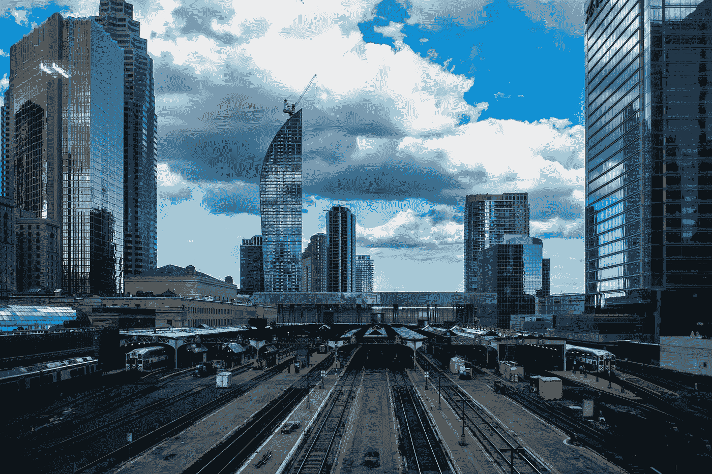

# 美联储的信誉岌岌可危，接下来会发生什么？第二部分

> 原文：<https://medium.datadriveninvestor.com/with-the-feds-credibility-at-stake-what-s-to-come-part-ii-a84785abf015?source=collection_archive---------15----------------------->

Photo by [Tony Yeung](https://unsplash.com/@mrtonyyeung?utm_source=medium&utm_medium=referral) on [Unsplash](https://unsplash.com?utm_source=medium&utm_medium=referral)

与许多人的想法相反，我非常相信市场的智慧。自由市场是世界上已知的为最大多数人创造财富和福利的最佳工具。然而，我也非常相信有“过犹不及”这样的事情。

我拒绝每一个极端，我认为极端的立场是不可持续的，因为它们通常带有自我毁灭的种子。在过去的几年里，我读了很多关于周期问题的书，也做了很多思考。我相信周期几乎渗透了一切。在霍华德·马克斯(Howard Marks)的新书《掌控市场周期》中，这位成功的基金经理讨论了周期和从一个极端到另一个极端的钟摆之间的本质“同义性”。

 [## 为什么包容性财富指数比 GDP 更能衡量社会进步？|数据驱动…

### 你不需要成为一个经济奇才或金融大师就能知道 GDP 的定义。即使你从未拿过 ECON 奖…

www.datadriveninvestor.com](https://www.datadriveninvestor.com/2019/03/08/why-inclusive-wealth-index-is-a-better-measure-of-societal-progress-than-gdp/) 

虽然我普遍认为市场越自由越好，但如果发展到极端，我担心“过于自由”的市场将不可避免地引发反弹，迫使钟摆向相反的方向摆动。因此，在我看来，如果一个人希望市场尽可能人性化，那么理想的市场自由应该是可持续的，并且不会面临政治反弹的重大风险。

限制市场自由的主要原因是政府或国家干预。政府和决策者可以(在我看来，偶尔也必须)推动市场，以促进长期可持续的均衡。我相信这就是一些主要的全球央行在其量化宽松(QE)计划中所做的。

人们认为央行行长比我们大多数人都聪明，市场参与者经常给他们一些好处，认为他们可能知道我们其他人不知道的*的一些事情。或许一些关键央行行长确实准确解读了全球人口老龄化对全球长期利率的影响。无论如何，我重申，现在是各国央行普遍远离 QE 的时候了，让真正的市场价格发现从这里开始。*

同样，我希望美国政府决定发行期限长达 100 年的长期美国国债。有人(有理由)怀疑，定期、可预测地发行所谓的世纪债券是否有可能超越第一次尝试。我仍然认为最好让市场以它的智慧来决定。彻底解决这个问题，然后从这里开始。

在我不可否认的不太知情的观点中，好处远远抵消了美国发行 50 年和 100 年期债券的风险。延长美国收益率曲线(要知道即使是意大利也发行 50 年期债券)是一件好事，让自由市场决定哪些公司(如果有的话)最终会跟随美国财政部发行超长期债券。值得一提的是，已经有*永久公司债券问世。*

***广场雅阁 2.0 来了吗？***

1985 年 9 月 22 日，当时的五国集团(美国、日本、西德、法国和英国)在纽约广场酒店签署了所谓的*广场协议*。有趣的是，现任美国总统会在几年后拥有这家酒店，并在公众的想象中与这家酒店联系在一起(唐纳德·特朗普在 1988 年 3 月 27 日买下了纽约广场，1995 年一个投资者团体从特朗普的债权人手中买下了它)。一些人仍然相信总统拥有广场。

无论如何，在美元大幅升值后，由政府主导的削弱美元的协调策略确实促成了美元汇率的急剧逆转。货币市场(像许多其他周期驱动的物体一样)过度波动，钟摆最终会向相反的方向摆动。政府/政策制定者的推动能够而且经常是钟摆逆转的催化剂。

在我看来，美元并没有被严重高估。当然，这取决于相对于什么，但当谈到对欧洲共同货币(欧元)的关键交叉汇率时，我对基于购买力平价(PPP)的公平价值的评估仍然是大约 1.20 美元兑 1 欧元。我仍然认为美元与瑞士法郎持平，两者均为 1 欧元兑 1.20 瑞士法郎，非常接近基本公允价值。

美元今年迄今的升值一如既往地归因于多重因素。不可否认，它的相对实力让我感到惊讶，尽管事后来看，很容易理解它现在的交易价格。美国相对较高的短期(政策驱动)利率目前确实为美元提供了一些支撑。

我不认为美联储会明确瞄准美元价值，并大幅下调短期利率，以压低美元汇率。尽管如此，鉴于它不会违背长期基本面，正如我所评估的那样，我认为一份支持美元略微走软的协调声明不会是一件坏事。

在我看来，和几乎所有其他事情一样，一个国家货币政策的松紧程度只能用相对值来准确评估。例如，特定的货币政策只有在相对于其他国家(特别是主要贸易伙伴)宽松的情况下才是宽松的，尤其是当涉及到该政策对货币的可能影响时。

因此，从美元相对于其他货币的强势，或许更重要的是相对于黄金的强势，可以看出美国的货币政策确实已经相对于其他发达国家的货币政策收紧。美元是唯一一种尚未看到黄金价格创下历史新高的主要法定货币。

我重申:( 1)虽然我通常不赞成政策制定者干预市场,( 2)有一些强有力的证据表明，美元相对于其他货币(甚至相对于黄金)被略微高估，这表明美国此时采取*相对*宽松的货币政策是合适的。

在其他条件相同的情况下，我更希望政府和政策制定者避开自由市场促成的价格发现过程。由于市场确实倾向于在周期的极端点上过度波动(因为钟摆在某一特定方向上过度摆动)，当干预得到协调，并且是在长期经济基本面支持的方向上时，干预最有可能成功。

当不止一个主要国家的政策制定者同意将货币市场推向一个特定方向时，自由市场参与者就会注意到。如果这种干预“顺市场之势”进行，就会特别成功，而形势已经开始逆转。然而，如果协调一致的多边干预在市场参与者眼中是可信的(和/或足够多的市场参与者害怕被错误定位)，这种干预实际上可以成为逆转局势的关键催化剂。

鉴于目前我在市场上看到的一切，我认为，发达国家的主要政策制定者协调一致地将美元汇率推至略低的水平，不会有什么不妥。或许更重要的是，我认为这将比加剧正在进行的贸易冲突更具建设性和更有成效。

因为市场参与者并不期待类似广场协议 2.0 的东西，而且因为美元相对于越来越多的货币在购买力平价基础上有些高估，所以在当前环境下，协调的货币干预可能有很高的成功概率。