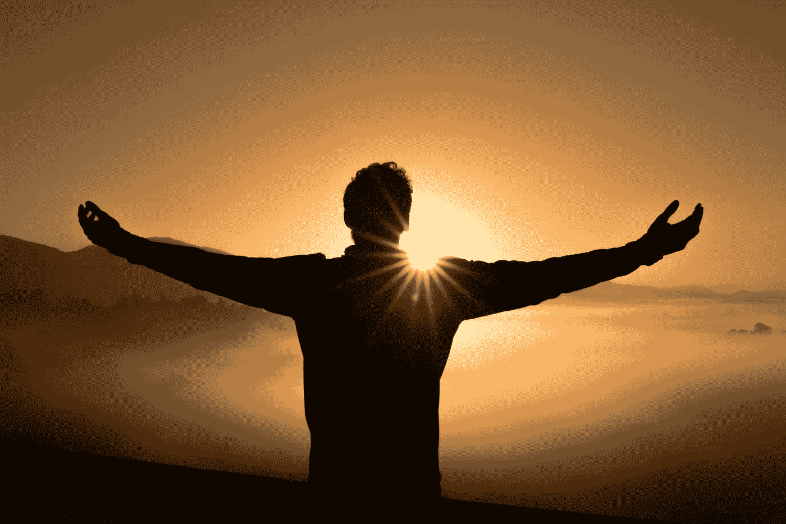

# 有了这 6 个步骤，你就为成功做好了准备

> 原文：<https://medium.datadriveninvestor.com/with-these-6-steps-you-set-yourself-up-for-success-c866cf16fc5b?source=collection_archive---------33----------------------->

Photo by [Zac Durant](https://unsplash.com/photos/_6HzPU9Hyfg?utm_source=unsplash&utm_medium=referral&utm_content=creditCopyText) on [Unsplash](https://unsplash.com/search/photos/success?utm_source=unsplash&utm_medium=referral&utm_content=creditCopyText)

你的梦想是什么？你想完成什么？你为什么还没有成功？

一句中国谚语说，种一棵树的最好时间是 20 年前。第二好的时间是现在。

时机从来都不完美。

你可以继续推迟，或者你可以选择开始行动。

当你遵循这 6 个步骤时，你将为自己的成功做好准备。

# **第一步你的目的**

你的人生目标是什么？你想留下什么遗产？

这是一个非常困难的问题，许多人一生都在寻找这个问题。也许有所帮助的是回顾你生命中那些让你感到满足、积极和感激的时刻。你快乐的时刻。你真正做出改变的时刻。

这是在哪里？你感觉如何？是什么让这个事件如此令人难忘？感受你对他们的感觉。回到这个事件的核心。想想所有的细节。你做了什么？你的角色是什么？

接下来，考虑如何复制这样的事件。不一定要完全一样，但是想想本质，想想你如何在不同的环境下，对不同的人做同样的事情。

最后，想想这样做很多次会让你有什么感觉。几次之后你会不会感到无聊，不再像以前那样快乐、满足和充满活力？然后回去找一个不同的时刻，当你做更多的时候，它会给你带来更多的能量。当你找到它的时候，你会感觉到它。能量爆发会影响你做的每一件事。你找到了你的目标。现在承诺吧！

# **第二步你的身份**

第一步，我们看了你在生活中的角色。

第二步，我们看你如何看待自己。

你是谁？你如何看待自己？

你可能已经找到了人生的伟大目标，但是如果你把自己看作一个普通的人，你就不会一开始就非常自信。

列出至少 7 个你会如何描述自己的不同特征。

然后列出 7 个你希望看到的自己的不同特征。成功的你是什么样子的？

现在开始表现出全新的你。

你可以停下来。去做吧！

从现在开始，你做的每一个决定都是基于成功的你的特征。

# **第三步你的价值观和信念**

如果你认为你做不到，看看卡罗尔·德韦克的视频关于成长心态和固定心态。思维定势的人认为他们不能做某些事情。他们如此确信自己做不到，以至于他们可能会尝试一次，但他们也可能不会全部尝试，因为他们一开始就认为无论如何都不会成功。

另一方面，有成长心态的人认为任何事情都可以学习。有些东西比其他东西更难学，但只要你不断尝试，你最终会学会的。如果你坚持做下去，你最终会成为大师。几乎在任何情况下，毅力都比智力重要。

价值观和信仰是你认为正确或错误的东西。

是什么价值观和信仰在拖你的后腿？

去这个信仰的根源。它从哪里来？

是不是因为钱脏就不允许赚很多钱？或者也许相反，你必须夜以继日地工作，尽可能多的挣钱吗？

这些信念大多来自于你的成长方式。我从小就被教育要存钱。尽量节俭。最好把钱存在银行，以防万一。享受一个长时间的淋浴，去我们的晚餐，旅游或购买精美的礼物是我们的问题。还不如省钱。这种成长经历对我的金钱心态有很大影响。

# **第四步你的能力**

你的能力就是你的知识、技能和能力。

为了实现梦想，你需要学习和掌握什么？

你怎么能这样做？

你能报名参加一门课程吗？

你能找到一个能帮助你的教练或导师吗？

从这一步开始，它变得更容易，更实用。如果你陷在你的价值观和信念中，或者只是决定跳过这一步，你可能会在第四步遇到麻烦。

如果你认为你不能做某事，你将不能做它。如果你认为这不是为了挣大钱而做的，而这正是你创造你渴望的影响力所需要的，那么你就会陷入困境。如果发生这种情况，你必须回到你的价值观和信仰，并首先进行排序。

对你来说，以成功所需的心态开始这一步是至关重要的。如果你这样做了，你将能够很快学会并掌握你所需要的知识和技能！

# **第五步你的行为**

你的行为就是你的言行、你的表现、行动和反应。

如果你在第 1 步到第 4 步都为自己的成功做好了准备，现在是时候开始收获了。传播你的故事，开始建立关系网，完成交易。

在这一步中，你可能会得出这样的结论:你缺少一些让它发生的技能。不要为此责备自己。这是流程的一部分！如果你需要营销方面的帮助，去寻求帮助。要么自己努力掌握，要么花钱请人帮你做。总有你不喜欢做的事情。试着找一个能为你做这件事的人。保持能量水平！

在这个阶段，有如此多的事情要做，如此多的事情要关注，以至于你可能看不到更大的图景。时不时地，回到你最初追求这个的原因。如果你很容易偏离轨道，每周都这样做。否则一个月做一次。检查你在哪里。上个月你在实现梦想方面走了多远？为了在下个月迈出更大的一步，你应该改变或优化什么？

# **第六步你的环境**

你的环境是何时何地与谁。你可能面临的外部因素或常数。

在第 1 步到第 5 步中，你已经为成功做好了准备。

在什么样的环境下，这种成功会进一步加速？

什么人相信你？哪些人对你的成功做出了贡献？能多陪陪他们吗？

还有，是什么人让你沮丧？你能花更少的时间和他们在一起，或者完全不再和他们见面吗？

我能帮助你的人有哪些？你能在哪里找到他们？去他们要去的地方。向他们学习，建立关系。

最后，什么样的环境能让你发挥出最佳水平？如何在这种环境下多花点时间？你喜欢在大自然中工作吗？需要激励身边的人吗？你是在蓝色还是粉色的办公室里工作？不管是什么，让它发生！找到一个完美的地方，装修，搬家，做任何你需要的事情来加速你的成功。

# **你准备好有所作为了吗？**

我已经为你创建了一个[免费清单](https://jongmarketing.us19.list-manage.com/subscribe?u=d739f47bb4d8ed68c008cefde&id=ab45da3dd9)，让你开始一个有影响力的成功商业。如果你勾选了所有的选项，你就为你的事业打下了完美的基础。

[本文最初发表于 Thrive Global。](https://thriveglobal.com/stories/with-these-6-steps-you-set-yourself-up-for-success/)

# 关于作者

Marjan de Jong 是一名社会影响教练和培训师。Marjan 的梦想是社会企业统治世界，住在海边的房子里:-)。她是 [JONG marketing](https://jongmarketing.com/) 的社会影响培训师和教练。Marjan 培训和指导社会企业家和学生创业。她喜欢和她的(即将成为)丈夫和两个孩子去海滩，享受美丽的大自然、美食、烹饪、园艺和创造力。