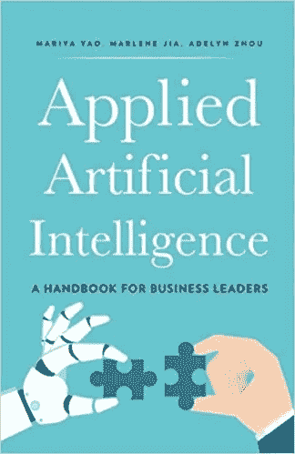

# WK1:应用人工智能

> 原文：<https://medium.datadriveninvestor.com/wk1-applied-artificial-intelligence-b144a97d45a2?source=collection_archive---------7----------------------->

《商业领袖手册》作者:玛利亚·姚、马琳·贾和艾德琳·周

> ***“献给所有创造技术让明天比今天更好的人。”***

每个人都知道(也讨厌)营销人员使用最新的流行语，不管实际利用率如何，作为他们公司的独特销售主张:人工智能当然也不例外。作者提供了一个值得发笑的迷因:“人工智能就像青少年性行为。每个人都谈论它。没有人知道如何做这件事。但每个人都认为其他人都在做，所以他们声称自己也在做。”

虽然大数据和机器学习系统仍处于初级阶段，但炒作是真实的。当首席技术官向董事会提出令人生畏的人工智能计划预算时，削减成本和创造收入的承诺无处不在。

这本书详细介绍了企业在即将到来的人工智能范式中面临的挑战和机遇。

作者在机器智能连续体中提供的工具之一是机器能力的列表，它有助于理解智能系统功能的不同程度。

1.  起作用的系统:基于规则的自动机。这些系统根据一些预定义的脚本运行，使用手动编程的 if-then 规则。
2.  预测系统:这些系统能够分析数据，并使用它进行概率预测。预测只是将已知信息映射到未知信息，不一定是未来事件。预测系统是由统计能力驱动的，因此其能力取决于所用数据的质量。
3.  学习系统:这些系统就像统计系统一样进行预测，但是更少手工操作。在机器学习和深度学习的推动下，它们可以在没有明确编程的情况下执行任务。学习系统首先需要能够对世界做出预测的相关数据。这种预测与更高层次的判断一起用于执行一个动作。该动作及其随后的结果使用反馈来改进，这提高了系统的预测能力。
4.  创造的系统:几十年来，人类和机器之间的一个定义性特征是创造力，但最近神经网络的突破正在重振计算创造力。这些系统能够创作原创作品、艺术品、音乐，甚至它们自己的人工智能系统。
5.  相关系统:随着亚马逊 Echo 的 Alexa 等消费产品渗透到我们的日常生活中，情商正在融入智能系统。情感分析，也称为意见挖掘或情感人工智能，从我们的文本，声音，面部表情和肢体语言中提取和量化情感状态。这使得系统能够像我们的朋友一样，充满感情地、动态地做出反应。
6.  掌握的系统:我们人类是掌握的系统:一个智能代理，能够从稀疏的信息中构建抽象的概念和战略计划。掌握的系统是人工智能的重要组成部分，更好的说法是奇点，因为跨域传输数据的能力还不是我们当前人工智能系统的能力。
7.  进化的系统:这些系统展现出超人的智慧和能力，比如根据环境中不断变化的条件改变自己的设计和架构的能力。人类不能简单地通过插入更多的 RAM 来增加我们的内存容量，或者通过升级我们的处理器来提高思维速度。我们受到生物“湿件”的限制，而进化的系统却可以轻松做到。自我进化的智能体将能够进行更快的自我改进迭代，这将最终导致超级智能，更好的说法是让伊隆夜不能寐的东西。

作者提出的另一个挑战是创造一个仁慈的人工智能:消除可能传播到越来越大的不平等差距的先天歧视和偏见。在创建人工智能系统时强调责任是整本书的一个常见比喻，希望在前进中仔细考虑危险。

副标题为《商业领袖手册》,这本书详细介绍了一个企业人工智能战略，涉及到为人工智能的采用创造一种文化的重要性。由于大多数企业都不是以技术为中心的，因此证明一大笔支出用于高风险、高回报的投资无异于自圆其说。作者断言，由于缺乏合格的机器学习工程师和数据科学家，企业面临挑战，学生和工人面临机遇。他们声称，大约有 10 万人能够在人工智能和机器学习计划中提供真正的价值，大多数人都被谷歌、脸书、亚马逊和微软等行业巨头挖走了。有很多像 Udemy 和大规模开放在线课程(MOOCs)这样的在线资源可以帮助你抓住这个机会。

机器学习系统可以改善企业功能的各个方面，这一事实使得新闻媒体将人工智能革命与世界末日事件相提并论。现实是，目前，机器学习系统在机械任务和简化流程方面比人类更好；还不能完全取代人类工人。然而，他们能够解放你的员工的认知负荷，让他们致力于工作中更有意义的方面。

AI 系统在企业中的应用如下(针对具体领域):

1.  一般和管理:这些角色充斥着乏味但关键的任务，如手动数据输入。由于计算机不会疲劳，擅长重复任务，并且不需要补偿，智能系统是会计、法律合规、记录维护和一般运营优化等领域的主要候选对象。
2.  人力资源和人才:雇佣能够很好合作的优秀人才对于任何公司的成功都是至关重要的。人工智能系统在角色匹配、简化面试流程、职业规划和保留风险分析以及其他管理功能方面可能比人类更好。人工智能在人力资源领域的一个令人兴奋的方面是提供不考虑身份的简历审查和评估，产生多样化的合格候选人库。
3.  商业智能和分析:从数据中推断意义并做出智能商业决策是机器学习系统的天作之合。人工智能可以帮助整理有用、干净和相关的数据，用于训练智能系统，构建高效的数据结构，并提供有价值的分析，以引导你和你的公司占据市场主导地位。
4.  软件开发:下一代软件开发将通过人工智能得到增强，用于快速原型制作、智能编程辅助、自动分析和错误缓解、代码重构、精确的项目评估，当然还有决策制定。
5.  营销:这是一个已经显示出前景的领域，它使用自然语言生成来优化数字广告，并给推荐和个性化引擎注入类固醇。
6.  销售:机器学习系统通过优化和自动化客户细分、线索资格、销售发展和销售分析来增加销售任务，从而将销售人员解放出来，从事更有价值和更有意义的任务，如寻找高潜力的销售线索。
7.  客户支持:客户关系管理(CRM)系统的自动化是人工智能的一个有前途的应用，同时使用社交智能系统减少客户流失并增加客户终身价值。

对于那些看到机器学习潜力并寻求利用动态技术来提高生产力和生活质量的企业领导者来说，这是一本必读的剧本。

Get the book // [Happy Reading!](https://www.amazon.com/Applied-Artificial-Intelligence-Handbook-Business/dp/0998289027)