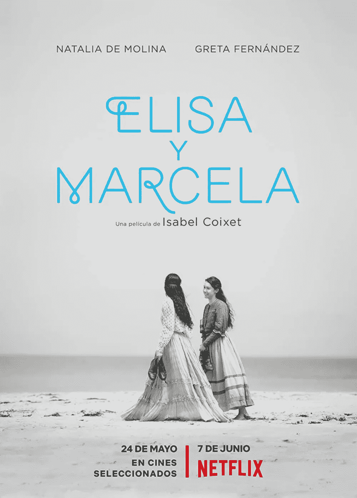
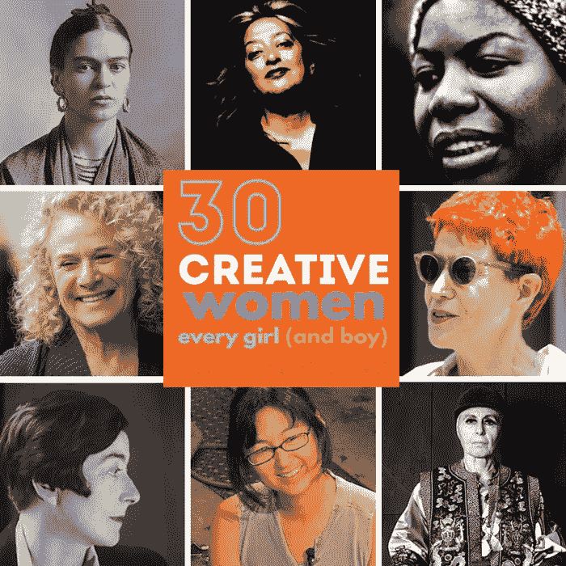

# 女人没有创造力

> 原文：<https://medium.datadriveninvestor.com/women-are-not-creative-b90ca376c7a8?source=collection_archive---------5----------------------->

人类热爱神话。

没有它，也许就不可能在社会上生存。几乎所有定义人类社会结构的东西都与塑造我们信念的概念有关。一个群体要生活得好，至少在理论上，必须相信同样的理念，这些理念是支撑他们共存基础的支柱；他们必须接受使社会平衡的概念:金钱、神、私有财产、政治、教育等等。

当然，这一切当你看到写在文字里的时候，都是非常美好的。因为现实从来不像我们想象的那样。我很高兴这是真的。

“你只会学到必要的东西，”玛塞拉的父亲说。这个在修女学院学习的女孩可以学习，但是有一个应该被尊重的限度。那是十九世纪，所以这可能很正常。在 2019 年由伊莎贝尔·科赛特执导的电影《Elisa & Marcela》中，剧情吸引了我对女性创造力的关注。在那个时候(可能在那之前很久)，人们认为女性不需要很多研究，因为这在某种程度上是浪费时间，因为它不会有太大的好处。

女性创造力是个谜。一个黑暗的。所以最好是把它锁在一堵厚厚的石墙后面，这样可以挡住那种咆哮。

我知道我不能谈论女人。这不是我说话的地方。

是的，男人没有权力谈论女人的世界。但是，作为一个男人，我可以谈谈男人的世界，那堵墙是在哪里建造的。

女足世界杯让我相信了一些事情。看到女孩们如何演变成他们的运动艺术是令人惊讶的。最可爱的是看到这个场景如何不像我们每天在世界各地成千上万个长满草的长方形中看到的那样。男性在战斗中燃烧睾丸激素，就像角斗士一样，争夺一个皮革制成的圆形物体的控制权，这个物体上有一些著名品牌的标志。最初的礼貌仅限于几次握手和小小的微笑，很快就消失了，取而代之的是碰撞和踢打。游戏转了，规则几乎失去了意义。

我不是说女性更擅长这项运动。我只能说，随着时间的推移，他们克服了许多限制，完善了他们的动作，增加了他们的身体能力和技术，而没有失去他们的温柔。游戏流畅。没有多余的抱怨和暴力，至少对我来说没有。

女性的创造力一直存在却一直被审查。今天，社交媒体帮助联系这些从各种来源中寻找灵感的人。互联网帮助打破了障碍，创造了他们之间的团结精神。

门开得越多，我们在最不同的地方看到的女性面孔就越多。电影、戏剧、书籍和艺术作品的学分。他们经营着更多的公司、政党、汽车、自行车、教室、城市、州和国家。在最近的过去，人们只能“只学习必要的东西”。他们读的书越多，没有任何审查，我们社会的心态就变得越丰富。女性在权力岗位上的缺席，尤其是在科学领域，只会推迟人类的旅程。他们待得太久，只是为了填补一个由毛绒制成的社会。他们在那里支持和塑造，但最终，优点和特权都在外面。我知道这可能看起来很悲惨，但是即使在今天，女性因为争取更多的平等仍然在很多方面被嘲笑。在观看 PBS 电视台一部关于卡西尼-惠更斯号飞船探索土星的纪录片时，我对团队中负责该项目 30 年的女性数量感到惊讶。这与阿波罗任务控制小组中充斥着男性形象形成了鲜明的对比。书越多，自由越多。越自由，越有创造力，让这个世界充满想法。

*Oscar 2017 Viola Davis @ Frazer Harrison/Getty Images*

我们从未在奥斯卡上见过这么多女性。当然，它可以改进。但是，我们正朝着一个我认为非常有趣的方向发展。女性创造力被扼杀了几千年。从历史上看，从洞穴开始，人们就认为它们在照顾家居环境时看起来更好。在这种情况下，世界处于危险之中，因为食物不会被清洁和烹饪，使婴儿和男性抱怨。因此，饥饿的战士无法捍卫部落的利益。一些“明智”的老人会说，养活你的男性，保证和平。

许多作家不得不用笔名发表作品。即使在今天，这也是可以看到的。有些人仍然认为 J. K .罗琳不是女人。

“而你，海伦娜·费兰特，你也是男人吗？!"

十九世纪末西班牙的伊莉莎和玛塞拉的关系非常危险；以至于伊莉莎不得不变装成男人，假扮成死去的表亲，才能娶到玛塞拉。影片讲述了天主教会促成的第一桩同性婚姻的真实故事。为了捍卫一段几乎无人理解的爱情，两人都遭受了严厉的惩罚，付出了高昂的代价。女性的创造力不一定要像男性的才能被称为创造力。随着时间的推移，困难以各种方式帮助他们动员起来，打破障碍，规避规则，寻找差距来解放自己。许多女性已经从男性的角度打开了大门，创造了机会。但真正有所不同的是，他们发现了他们作为人的独创性，作为人类，展示了他们真正拥有的东西，而不是复制品或模型。不论性别，当人类真正真实时，他们是有创造力的。

男人似乎仍然相信洞穴的神话，那时他们仍然负责部落的狩猎和安全。事情已经变了。女性也证明了她们对新奇事物持开放态度，推动了历史上不可思议的革命。

This is my new book, spare some time to know more about creativity.

这给了他们在社会上越来越大的空间，而他们的同龄人却察觉不到；因为他们忙于争夺方尖碑的尺寸。

女性合作，思考未来。仅此一点就足以摧毁任何只相信纯粹和简单的精英统治、只基于我们所能看到的主流神话和直接结果的社会的基础。

女人没有创造力:这是一个神话！她们的知名度越高，就越能激励世界各地的女性。连锁效应显示，越来越多的女孩愿意展示自己的潜力，而不怕批评。有了真正的学习自由、优秀的研究资源和适当的鼓励，女性创造力的历史正在被彻底改变。当然，这对任何人类都有好处。但是对于那些千百年来饱受脆弱、无能、低人一等、不完整和无能的神话之苦的人来说，它已经成为创造新意义的理想燃料，能够摧毁一个完全不必要的神话。

— -

非常感谢您的阅读。如果你喜欢我的工作并想支持我，那么你可以 r [*给我买杯咖啡*](https://www.buymeacoffee.com/barterwilliam) *☕️
或者使用* [*这个链接*](https://williambarter-br.medium.com/membership) *成为中等会员。
继续关注更多这样的故事！*

通过下面的链接安排与[**William Barter**](https://app.ddichat.com/experts/william-barter)**的 DDIChat 会话。**