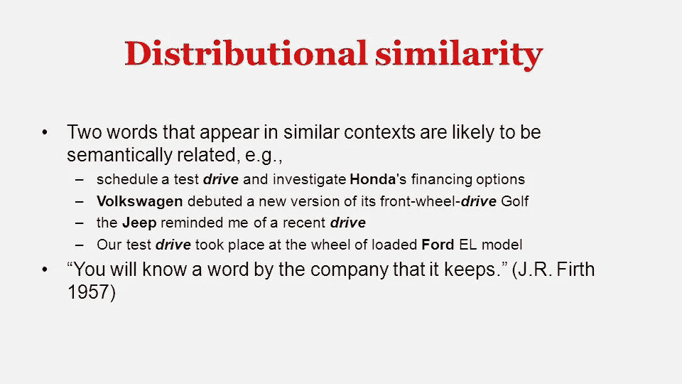
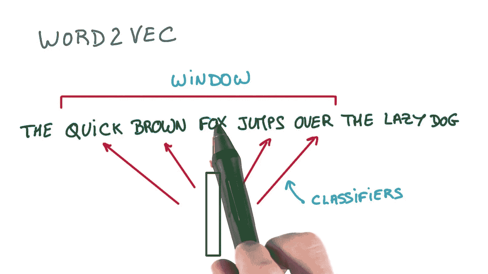
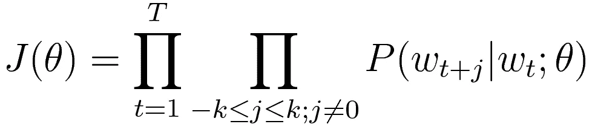
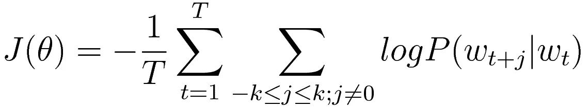
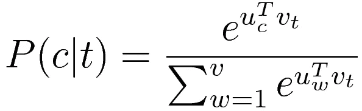
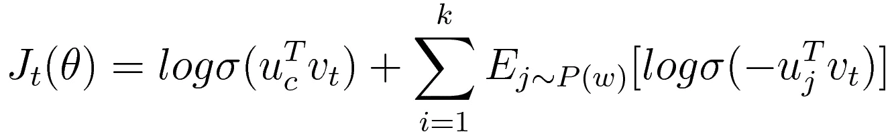
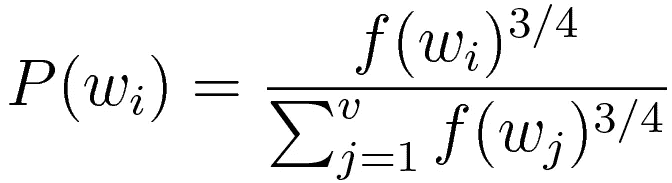

# 单词向量表示法— Word2Vec

> 原文：<https://medium.datadriveninvestor.com/word-vector-representations-word2vec-87b6bf0a755e?source=collection_archive---------2----------------------->


Natural language processing

**自然语言处理(NLP)** 是计算机以一种智能而有用的方式理解、分析人类语言并从中推导出含义的一种方式。在过去的几年中，该领域被认为正在从传统的统计方法转向神经网络模型。深度神经网络已经成为数十种语言处理任务的一站式解决方案，并在语音识别等特定语言问题上取得了最先进的成果。

所有语言处理任务的基本且重要的构建块是创建单词表示，该单词表示将捕获它们的含义、语义关系以及它们在其中使用的不同类型的上下文。一种简单而直接的方法是将它们表示为****向量**。在向量空间术语中，这对应于 1-D 向量，对于词汇表中的所有其他单词，1(对应于所表示的单词)和 0。**

```
**[0 0 0 0 0 0 0 0 0 0 0 0 0 0 0 0 0 0 0 0 0 0 0 1 0 0 0 0 0 0 0 0 0]**
                         one hot encoding for some word e.g - hotel
```

**然而，这种表示有几个问题**

## ****数据稀疏度****

**注意，这种矢量编码只在每个单词的一个位置保存有意义的数据。考虑到我们有 100 万个单词的词汇表(这是自然语言处理领域的标准)，我们将使用一个 100 万 x 100 万元素的矩阵，其中大部分都是零。就存储和计算成本而言，这太低效了。**

## ****地方主义代表****

**其次，使用**一键编码**，我们可以独立于任何上下文来表示单词。所以，它没有给出不同单词之间关系的任何固有概念。例如，该表示无法找到*“戴尔笔记本电脑电池大小”*和*“戴尔笔记本电脑电池容量”*之间的相似之处。**

**相反，我们需要一种方法，在这种方法中，单词的表示以这样一种方式编码它们的意思，我们可以直接从这些表示中读出相似性。我们可以通过使用自然语言处理领域广泛应用的概念来实现这一点— **分布相似度**。**

## ****基于分布相似性的表示****

**它只是源于这样一个事实，即我们可以通过观察一个词出现的上下文，来获得表示这个词的意义的很多价值。**

****

**Distributional similarity for the word drive**

**例如，如果我想知道单词 *drive* 是什么意思，我将收集大量包含单词 *drive* 的文本，并在上下文(时间表、融资、高尔夫、最近、测试、车轮等)中使用这些单词来表示 *drive* 的意思。为此，我们将为每个单词构建一个向量，以便它能够很好地预测上下文中的其他单词。每一个其他的单词也可以用向量来表示。这样，我们可以用点积来寻找任意给定向量之间的相似性度量。**

**一般来说，我们需要一个模型来预测给定目标词的上下文词的概率。任何大小的上下文窗口都可以，这取决于可用文本语料库的大小。我们的最终目标是改变单词的表示，直到在模型上定义的损失函数最小化。具体来说，有一个这样的模型可以满足这个目的— **Word2Vec** 。**

## ****Word2Vec****

**Word2Vec 模型的重点是建立一个简单和可扩展的模型，我们可以在非常大的文本语料库上运行，并建立良好的单词表示。有两种这样的算法，一种比另一种更受欢迎。由于 skip gram 是实践中使用的一种，我们将更多地关注它**

*   ****跳步图****
*   ****连续包字(CBOW)****

## ****跳跃图****

****

**Skip gram model with window of 2**

***skip gram 模型*的想法是选择一个目标单词，然后预测其上下文中的单词到某个窗口大小。它通过最大化概率分布来做到这一点，即在给定目标单词的情况下，该单词出现在上下文(在指定窗口内)中的概率。这可以用下面的目标函数来表示**

****

**Objective function to optimize**

**其中 *k 为窗口大小*(目标词前后的上下文词) *t 为目标词在大语料库*中的索引， *T 为文本长度*，参数(*θ*)*为词的向量表示*。本质上，对于作为目标单词的文本中的每个单词，该目标函数将选择参数，使得它将最大化上下文单词的概率分布。**

**在实践中，每当我们最大化概率时，记录日志几乎总是更好，因为这样我们就必须处理总和而不是乘积，这让生活变得容易得多。因此，在应用 log 之后，我们新的目标函数将是**

****

**Negative log likelihood of objective function**

**为了适应机器/深度学习的领域，偏好是最小化事物而不是最大化事物，我们将对整个语料库取平均值的否定。现在，剩下的唯一一件事就是给定目标单词，得出上下文单词的概率分布。我们可以用数学方法表示概率如下**

****

**Probability distribution in objective function**

**其中 *v over sigma 表示词汇的大小*， *c 和 t 分别是上下文和目标词在词汇中的索引，u 是与上下文词相关的参数矩阵，v 是目标词的向量表示*。这里，点积度量两个字向量之间的相似程度，而取幂强制结果为正。最后，可以使用 softmax 将这些数字转换成概率。到目前为止一切顺利，但是有一个小问题隐藏在高计算成本中。注意，对于每个上下文目标对，我们必须对整个语料库求和(分母)来计算 softmax 概率。显然，对于非常大的文本语料库，这将是非常低效的。通常，这种方法几乎总是与其他一些技术相结合来产生有效的结果。两种这样的技术是:-**

1.  ****分级 softmax****
2.  ****负采样****

**在实践中，负采样总是优于它的对应层次 softmax。因此，我们将只探索这一点。**

## ****负采样****

**使用负采样，以及上下文和目标对，我们将从我们的语料库中随机选择一小组单词( *k* )，这些单词不能出现在给定目标单词的上下文中。这样，我们可以预测所有 k+1 个单词(一个正上下文单词和 k 个负单词)将目标单词向量馈送给我们的算法的概率。因此在每一次迭代中，我们将只为这 k + 1 个样本训练网络。**

> **该研究称，选择 5-20 个单词对于较小的数据集来说效果很好，而对于较大的数据集来说，2-5 个单词就足够了。**

**从今以后，我们修改后的目标函数将变成**

****

**Modified objective function for negative sampling**

**注意，当上下文单词的概率最大而负样本的概率最小时，该目标函数最大。**

## ****如何选择阴性样本****

**一种方法是根据我们的文本语料库中词的经验频率进行采样。然而，这种方法的问题是，我们最终会对像*‘the’，‘and’，‘of’这样的词有很高的表示率。*另一个极端是在 *1/VOCAB_SIZE* 上均匀随机地采样字。这也不能很好地代表英语单词的分布。在实践中，最好的方法是根据下面的分布产生负样本**

****

**Probability distribution for selecting words**

**其中 *v 是词汇量*， *f(wi)是特定单词*的观察频率， *P(wi)是选择单词 wi 的概率。使用这种方法，我们可以生成足够好的负样本，以满足我们生成单词表示的目的，这些单词表示将反映这些单词使用的上下文。稍后，这些单词嵌入可以用于一系列其他自然语言处理任务，例如[命名实体识别](https://en.wikipedia.org/wiki/Named-entity_recognition)、[机器翻译](https://en.wikipedia.org/wiki/Machine_translation)、[情感分析](https://en.wikipedia.org/wiki/Sentiment_analysis)和[自然语言建模](https://www.coursera.org/lecture/nlp-sequence-models/language-model-and-sequence-generation-gw1Xw)。***

**这个模型最简单的实现可以在这里找到。**

## **资源**

**[](https://www.coursera.org/lecture/nlp-sequence-models/word2vec-8CZiw) [## Word2Vec -自然语言处理和单词嵌入| Coursera

### 本课程将教你如何为自然语言、音频和其他序列数据建立模型。感谢深…

www.coursera.org](https://www.coursera.org/lecture/nlp-sequence-models/word2vec-8CZiw) [](http://cs224n.stanford.edu/) [## CS224n:深度学习的自然语言处理

### 自然语言处理是信息时代最重要的技术之一。理解…

cs224n.stanford.edu](http://cs224n.stanford.edu/) 

请让我在评论中知道这篇文章可以容纳的任何改进/修改。**