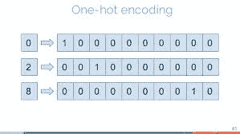
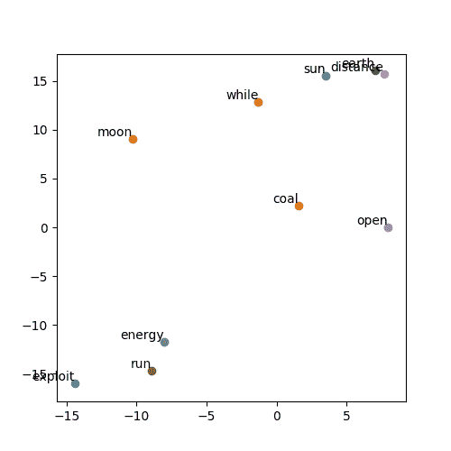

# Word2Vec(跳格模型)解释

> 原文：<https://medium.datadriveninvestor.com/word2vec-skip-gram-model-explained-383fa6ddc4ae?source=collection_archive---------0----------------------->


Photo by [Sandy Millar](https://unsplash.com/@sandym10?utm_source=medium&utm_medium=referral) on [Unsplash](https://unsplash.com?utm_source=medium&utm_medium=referral)

Word2Vec，你可能从名字本身就猜到了，跟单词和向量有关系。但是到底是什么呢？我们在哪里使用它？最重要的是，我们为什么需要它？

我们将试图在这篇博客中找到所有这些问题的答案，然后我们将试图围绕跳格模型的想法，这是一个相当有趣但理解起来非常简单的概念。

[](https://www.datadriveninvestor.com/2019/03/03/editors-pick-5-machine-learning-books/) [## DDI 编辑推荐:5 本让你从新手变成专家的机器学习书籍|数据驱动…

### 机器学习行业的蓬勃发展重新引起了人们对人工智能的兴趣

www.datadriveninvestor.com](https://www.datadriveninvestor.com/2019/03/03/editors-pick-5-machine-learning-books/) 

所以让我们开始吧！！！

**word2vec** 是一类模型，将大型文本语料库中的一个词表示为 **n 维空间**(或 n 维特征空间)中的一个向量，使相似的词彼此更加接近。一个这样的模型是跳格模型。

**Skip-gram 模型**是 NLP(自然语言处理)中最重要的概念之一，我们必须了解它到底是如何工作的，而不是仅仅使用一个已经实现的模型或预先训练的嵌入(不知道嵌入是什么意思？不要担心，我们很快就会谈到这一点！)，顺便说一下，这是非常容易得到的。

首先，我们需要明白计算机不理解单词。计算机所能理解的只有数字！电脑爱数字胜过一切。嗯，也许电是清单上的第一项。我想你们明白我的意思了！


Computers love numbers !

因此，我们需要找到一种方法，将字典中出现的每个给定的英语单词转换成数字。实际上有两种方法。

# 一键编码

它是将分类变量表示成向量形式(由数字组成，计算机可以理解的东西)的一种方式。当我们对字典中的单词进行一次性编码时，要做的第一件事是为所有单词分配唯一的索引。这可以通过按字母升序或降序对单词进行排序来实现，也可以通过以任意随机顺序排列它们来实现。我们感兴趣的是将所有的单词映射到一个唯一的索引。

一旦完成了单词到索引的映射，为了对单词进行一次性编码，我们创建一个长度等于字典中单词总数的向量，并在除了该特定单词的索引之外的任何地方放置 0。我们把 1 放在索引上。所以我们的向量有很多 0，只有一个 1。



These One-Hot Embeddings have ‘1’ only at the index mentioned on the left side

例如，想象一下，你有一本 10000 字的字典。

```
{‘a’, ‘aaron’ ..‘apple’...‘batman’...‘joker’...‘shinchan’... ‘zulu’}
```

它的第 0 个索引是 a，第 2 个索引是 aaron，第 999 个索引是 zulu。

“a”的一键编码看起来像这样

```
[1,0,0,0,0...0]
```

“祖鲁”的一次性编码看起来会像

```
[0,0,0,0,0...1]
```

我希望你们能想出任何单词的一次性编码，如果你在单词字典中有这个单词的索引的话！😄

## 但是这种一键编码有几个问题:

1.  独热编码的长度可以达到 100 万(给定 100 万单词的字典)。这是一种非常稀疏的矢量编码，在存储数据时效率非常低。
2.  这样的编码**不能保留单词的语义**。选择任意距离度量，任意两个单词的一键编码之间的**距离**是**总是相同的**。你不认为有编码会更好，能给我们一些单词语义的概念吗？

这就是**连续向量**发挥作用的地方！！！

# 连续向量

这些是由连续实数(不仅仅是 0 或 1)组成的单词的矢量表示。在这种表示中，这种向量的长度没有固定的规则。您可以选择任意长度(任意数量的特征)来表示给定词典中的单词。

我将用一个单词的例子来解释这个问题，比如 ***【蝙蝠侠】**【小丑】******【蜘蛛侠】******【灭霸】*** 。例句选的很有意思吧？我编了这些词的三维( **3 个特征**)连续向量来给你解释，向量这个词里的实数可能代表什么。

```
word2vec(‘Batman’) = [0.9, 0.8, 0.2]word2vec(‘Joker’) = [0.8, 0.3, 0.1]word2vec(‘Spiderman’) = [0.2, .9, 0.8]word2vec(‘Thanos’) = [0.3, 0.1, 0.9]
```

1.  第一个特征似乎代表了**属于 DC 宇宙**。看到*【蝙蝠侠】*和*【小丑】*的第一个特性值更高，因为他们确实属于 DC 宇宙。
2.  也许 word2vec 表示中的第二个元素在这里捕捉到了**英雄/恶棍的特征**。这就是为什么*【蝙蝠侠】**【蜘蛛侠】*的数值较高，*【小丑】**【灭霸】*的数值较小。
3.  有人可能会说，单词 vectors 的第三部分代表**超自然力量/能力**。我们都知道*【蝙蝠侠】*和*【小丑】*没有这样的超能力，这就是为什么他们的向量在第三位的数字很小。

我希望你现在已经理解了，一个**连续单词向量**中的不同维度如何可能捕获该单词的不同**语义/特征**，这是一键编码无法捕获的！

# 嵌入来自哪里？

单词 vector/embedding 没有正确的数字组成向量。只有在使用某种 word2vec 模型在巨大的文本语料库上训练时，嵌入才能捕获语义。在训练之前，单词嵌入是随机初始化的，它们没有任何意义。只有当模型被训练时，单词嵌入才捕获了所有单词的语义。

单词嵌入可以被认为是孩子对单词的理解。最初，单词嵌入是随机初始化的，它们没有任何意义，就像婴儿对不同的单词没有理解一样。只有在模型开始接受训练后，单词向量/嵌入才开始捕捉单词的意思，就像婴儿听到并学习不同的单词一样。

深度学习的整个想法是由人脑启发的。它看到的越多，理解和学习的就越多。

# 跳格模型

像所有其他 word2vec 模型一样，Skip-Gram 模型使用了一个在许多其他机器学习算法中也使用的技巧。因为我们没有与单词相关联的标签，所以学习单词嵌入不是监督学习的例子。这是半监督学习，因为我们没有与单词相关联的直接标签，而是使用(句子中上下文单词的)相邻单词作为标签。

## 生成上下文目标词

Word2vec 将文本的大型[语料库作为其输入，并产生一个](https://en.wikipedia.org/wiki/Text_corpus)[向量空间](https://en.wikipedia.org/wiki/Vector_space) ( **特征空间**)，通常具有数百个[维度](https://en.wikipedia.org/wiki/Dimensions)，其中[语料库](https://en.wikipedia.org/wiki/Corpus_linguistics)中的每个唯一单词被分配一个空间中的相应向量。这是通过建立上下文和目标词对来完成的，这进一步取决于你所取的窗口大小。


Keep Calm and read till the end!

让我们更详细地理解这一点。


An overly used image which never fails to explain how exactly are the context-target word pairs are made to be used for the training of the Skip-Gram model.

上图显示了上下文-目标词对是如何用于训练跳格模型的。我们使用一个 ***window_size*** 参数(在这种情况下，window_size 为 2 ),该参数在上下文单词的左侧和右侧查找多达 window_size(=2)个单词。

让我带你看一下制造语境目标词对的过程。

1.  我们有一个句子。我们取第 1 个词(**'*'*' T3)。这就是我们的 ***语境词*** 。我们将这个上下文单词与它右边的单词配对，这些单词包含在指定的窗口中(***【quick】和【brown】***)。这样我们就有两对了。第一对是(***‘The’，【quick】***)，第二对是(***‘The’，*** )。我们无法将上下文单词与它左边的单词配对，因为它左边没有单词。**
2.  现在，我们移动到句子的第二个单词( ***上下文单词***)(***‘quick’***)并将其与指定窗口中覆盖的单词配对(这次我们还有一个单词***‘左边的’***)。所以这次我们做了 3 对。(**、*、【快】、*、**)、**、*、【快】、【布朗】、*、**)、**、*、【快】、【福克斯】、*、**)
3.  我们继续为所有可能的 ***上下文*** 和 ***目标*** 单词建立上下文-目标单词对。我们在这里所做的基本上是，我们捕获可以彼此相邻找到的词对。我们正在捕获**上下文**，我们将使用此上下文信息来训练单词嵌入**。**这也是我之前把这个叫做**半监督学习算法**的原因！

你们现在能把这些线索联系起来吗？:D


When you start to understand the content of the blog that you have been reading for the last 10 mins

## 培养

到目前为止，我们已经准备好了 10，000 个单词的字典，我们也有了上下文目标单词对。

我们采用上下文单词的一次性编码，并将其输入到浅层神经网络中。这个输入乘以隐藏层的权重，最后，我们得到输出向量(也有 10，000 个分量)。

请注意，输出层应用了 softmax，它实质上是将神经网络的输出向量转换为概率向量，它的每个分量都表示作为目标词的词在其索引处的概率。


然后，应用损失函数(交叉熵损失，因为我们将此视为分类问题)来计算损失，并且反向传播更新权重(单词嵌入)。

单词嵌入就是这样训练出来的！！！

## 假任务

一旦我们的上下文和目标对准备就绪，我们就训练一个具有很少隐藏层(可能只有一个隐藏层)的神经网络来执行某项任务，但我们永远不会使用这个神经网络来执行它被训练来执行的这项任务。相反，我们感兴趣的是在训练过程中学习到的隐藏层的权重。这些权重，就是我们从这篇文章开始讨论的单词嵌入！

这被称为“假任务”，因为我们对模型的预测不感兴趣，而是对模型的副产品(词向量/嵌入)感兴趣。

# word2vec(跳格模型)的 Pytorch 和 TensorFlow 实现

对于那些想动手的人来说，这里有一个非常简单的 word2vec (Skip-Gram-Model)在 both、**[**【py torch】**](https://github.com/n0obcoder/Skip-Gram-Model-PyTorch)和 [**TensorFlow**](https://github.com/n0obcoder/Skip-Gram_Model-TensorFlow) 中的实现。**

**在这些实现中，我使用了来自 gensim 库的语料库。我对它做了一些预处理，制作了一个单词词典，生成了上下文-目标单词对，并训练了一个单层神经网络。**

**一旦对嵌入进行了训练，我就使用 TSNE 来降低一组单词的嵌入维数，这样嵌入就可以在 2D 图上可视化。这就是我得到的！**

****

**Word Embeddings trained using Skip-Gram model**

# **来自训练嵌入的洞察力**

**你可以注意到，像 ***【太阳】*** 和 ***【地球】*** 这些语义相似的词，它们的 2D 嵌入非常接近。**

**此外，像*和***【exploit】***这样的词共享一些上下文，我的模型能够捕捉这些上下文，这就是为什么这两个词的 2D 嵌入位置彼此靠近。***

***考虑到模型被训练的文本语料库的小尺寸，这是一个不错的结果。***

# ***对于那些喜欢看的人来说***

***我写这篇博客是因为我通过阅读别人的博客学到了很多东西，我觉得我也应该尽可能多地写下并分享我所知道的一切。所以请在下面的评论区留下你的反馈。此外，我是写博客的新手，所以任何关于如何提高我的写作的建议将不胜感激！:D***

***我也是一个独立的音乐艺术家，喜欢在空闲时间演奏和录制音乐。也许你可以在 Spotify 上查看我的艺人页面，表示支持:)
[Spotify 上的 8 楼和声！](https://open.spotify.com/artist/7G2BgSnludIYl1gFyJKG6X?si=Bv5L4ZAVQrmIsl5SgGRAUw)***