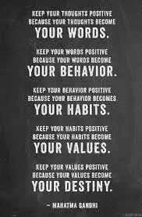

# 文字。行为。习惯。价值观。命运。

> 原文：<https://medium.datadriveninvestor.com/words-behaviour-habits-values-destiny-68a8267b69a?source=collection_archive---------11----------------------->

在一个即时满足的文化中，关掉一切，专注于你思想的质量是很有挑战性的。

> ***“你所想的，展开。”——t·哈弗。埃克***

我知道在过去的几周里，我被挑战着去意识到自己的想法——甚至是那些我没有完全意识到的想法。是那些伴随我长大的小声音，一遍又一遍地重复着。这些问题听起来熟悉吗？

> *“人们会怎么想？”*
> 
> *‘如果不行呢？’*
> 
> “如果你失败了怎么办？”
> 
> 你确定你能信任他/她吗？

有趣的是，直到最近我接受了测试，我才意识到这些想法有多么根深蒂固。通过最近在我的个人生活和职业生涯中的互动来测试。当我知道我真正要做的是内在的工作时，我变得如此脆弱和情绪化，以最轻微的评论(或缺乏评论)寻求外部的认可。我连续几天抵制内部工作，提高警惕，直到我意识到除非我改变，否则事情不会改变。

我的头和心总是来来回回，把我往相反的方向拉。我的心告诉我要跟随我的激情和直觉。我的头脑使我变得现实和理智。这是一场持续的斗争，当这些想法不受控制时，它们会影响我的态度和行为。

我最喜欢的名言之一，希望你也喜欢它！

― **Mahatma Gandhi**

这个帖子最初出现在[健康与活力上。](https://wordpress.com/stats/post/174813840/lovehealthandwellness.wordpress.com)