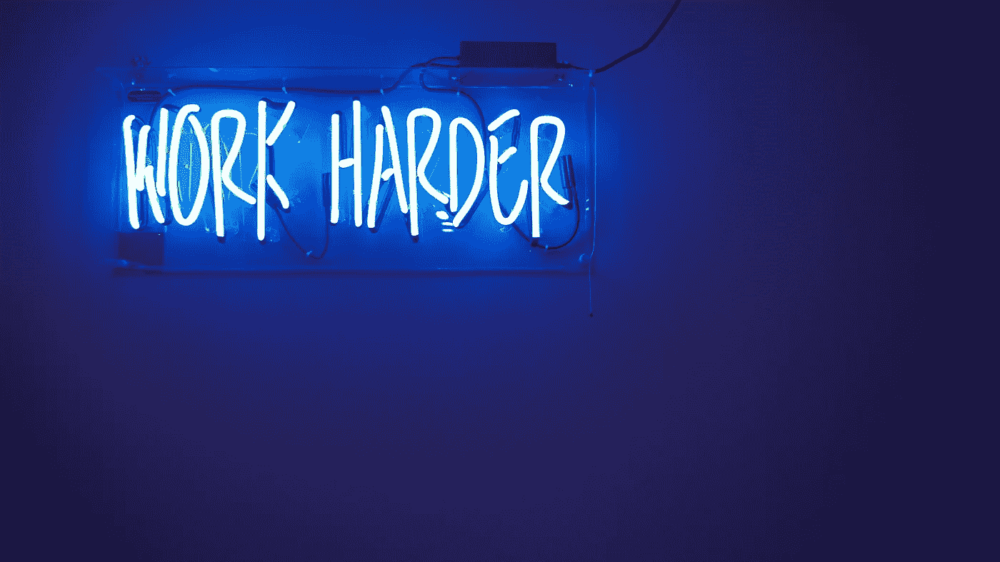

# 努力工作或者不要打扰

> 原文：<https://medium.datadriveninvestor.com/work-hard-or-dont-bother-acac7af5fc96?source=collection_archive---------16----------------------->

Photo by Jordan Whitfield via Unsplash

我最近读了一篇纳特·埃利亚松的文章，标题是“[不再有‘斗争色情’](https://medium.com/@nateliason/no-more-struggle-porn-202153a01108)”，它重新打开了我大脑中的一个无法关闭的蠕虫罐。这是一个 5 分钟的阅读。去吧，试试看。我会在这里等。

赶上了？很好。和 Nat 一样(大概我们现在是直呼其名了)，我没有见过 Gary V——或者任何一个热情友好的励志演说家——但我肯定能看到相似之处。他们在“努力工作，保持谦逊”的口号下吃饭、睡觉、呼吸。

最困扰我的是他们知道这并不像他们说的那么简单。他们知道时代在变，机会、技术和社会结构也在变。那么他们为什么要延续这种生活方式呢？你可以说我们只是在看精彩片段——他们多年的成功——但这难道不是重点吗？成功是副产品，而不是创造他们所建立的东西的方法。他们应该讲述故事的两个方面。

更不用说暗示如果你不把自己工作到死，那么你就没有生产力。这是一种看待“职业道德”的有毒方式，但当我们只听到那些“成功”的人时，这种讲故事会崇拜“奋斗”才有意义。

“你必须努力奋斗”的思维方式在企业家和技术界非常明显(咄)——多年来一直如此，见这里的、这里的和这里的——但我认为我们创意人员是最差的。[Adobe 不久前的一项调查](https://blogs.adobe.com/creative/creatives-are-producing-more-content-than-ever-how-will-your-team-adapt/)发现 **71%的创意人员创作的内容比 5 年前多了 10 倍**。这太疯狂了——而且这只是在雇主/为公司工作的一面。这种压力不仅仅要归咎于雇主，因为我们对自己/彼此都很严格，就像他们对我们一样。

如果你不是自由职业者，那么你就没有真正创造足够多的 *。如果你没有一个充满激情的项目，那么你的探索就不够。如果你没有副业，那么你对你的手艺就不认真。*听着耳熟？这不是热门话题，但绝对是潜台词——尤其是当你考虑到冒名顶替综合症的猖獗蔓延时(无论是在科技领域还是设计领域)。

所以我问:当我们天生就知道这是胡说八道的时候，为什么我们让自己延续这种“努力工作或不要打扰”的教条？

可悲的是我是这个恶性循环的一部分。我的压力成瘾——因为缺乏更好的描述——让我进了医院。我总觉得我必须做得更多。如果我有空闲时间，那就意味着时间被浪费了。我仍然没有打破其中的一些习惯，尽管现在不得不服用药物来无限期地调节我的心率(以后再说)。

如果你愿意，我们可以一起改变动态——文化。

*   我们可以从像对待人类一样对待彼此开始。不是工作马。睡眠、休息、排毒、社交都是好事。
*   我们可以继续在客户和雇主面前为自己辩护，以确保他们理解创作过程，以及尽管有最后期限，但不能总是仓促行事。
*   我们可以提醒自己，没有任何两个人、故事或道路是相同的，正因为如此，成功没有统一的定义。
*   更具体地说，我们可以继续强调设计是一场马拉松，而不是短跑(不管你的公司向你抛出什么敏捷框架)。
*   我们被允许时不时地与所有的设计/创意脱节。这对我来说是最难的，因为我是那种“设计是一种爱好和工作”的人。但是有时候你必须承认，有时候，这都是工作，你的大脑需要你停下来。

我写这些提醒不仅是为了你的利益，也是为了我自己。

我认为“努力奋斗，保持谦逊”这句话仍然适用——但这一次，“努力”并不排除自我照顾，谦逊也不意味着“通过与他人比较”

所有这些都说明我在努力做得更好。我只是希望你也能，在你别无选择之前。