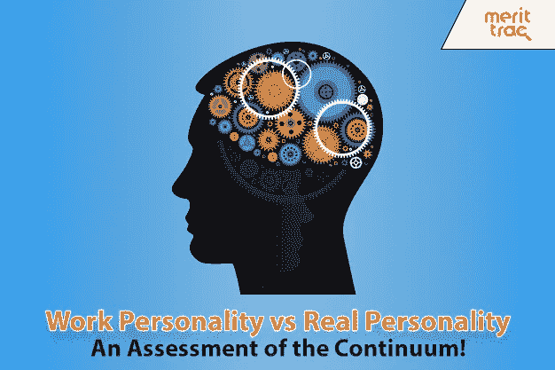

# 工作人格与真实人格--对连续体的评估！

> 原文：<https://medium.datadriveninvestor.com/work-personality-vs-real-personality-an-assessment-of-the-continuum-4844cd7e6f3?source=collection_archive---------5----------------------->

在心理学中，人格是指影响一个人如何与他/她的环境互动和做出反应的独特和相对永久的行为和特征模式。这将是“真正的”人格，与一个人的“工作人格”相对，简单地说，工作人格是影响一个人如何与他/她的工作环境互动和做出反应的行为和特征的特征模式。这些性格不同吗？

不一定。工作人格和真实人格可以被看作是躺在一个连续体的人格特质上。这些个性甚至可能是一个特征或一组特征的不同方面，因为个性特征在不同的情况下表现不同。例如，一个外向的人可能在工作中表现出领导行为，但在同龄人中却非常随和(而不是带头)。虽然两者都是社会性的特征，但这些行为是不同的，但适合各自的环境。

 [## 面向 Noobs |数据驱动型投资者的数字身份

### 聪明人如何在增强现实中创造身份价值？我最近刚满 40 岁。作为一个生物…

www.datadriveninvestor.com](https://www.datadriveninvestor.com/2019/02/28/digital-identity-for-noobs/) 

一个人对环境的反应不仅仅取决于他们的个性，还取决于环境。“工作”有一种不同的文化，这种文化影响着如何表现和表现什么样的特征。有些行为在工作场所受到鼓励，如竞争，相应的性格特征在这种文化环境中可能会变得更加明显。行为在环境中的适当性也是为什么工作个性不同于我们真实的个性。

一个人的工作角色也会影响允许出现的个性特征。例如，一位财务主管，具有高度的责任心和外向性，可能在工作中更频繁地表达前一种特质和相应的行为，但可能没有机会表达社交能力，因为工作角色可能并不真正需要表达这种特质。

工作个性也可以通过[镜像行为](https://en.wikipedia.org/wiki/Mirroring_(psychology))和替代(观察)学习来塑造。我们认为其他人的一些行为达到了预期的结果，并倾向于学习和模仿这些行为(有意识和无意识的)，这反映了我们的个性特征是如何表达的。

而且，我们不都是为了在工作中给人留下好印象吗？很明显，我们会根据我们的所作所为和所取得的成就接受评估，并且会产生切实的结果，但在工作之外的生活中，情况并非总是如此。我们对自己在工作中表现出的性格特征、表现方式和表现程度非常谨慎。

那么，工作人格可以造假吗？嗯，印象管理确实会发生，但个性是“相对永久的”，记得吗？人格特征的长期“伪装”会导致认知失调和情绪劳动，并可能最终导致心理痛苦。所以，不，伪造一个人的工作个性是不理想的(也不总是可能的！)

如果工作性格确实与一个人的真实性格截然不同，那么用于筛选和选拔的性格测试甚至有效吗？是的，他们是。性格测试(标准化的，而不是脸书或 BuzzFeed 的测验)的效用怎么强调都不为过，因为好的性格测试能揭示一个人真正的性格特征，并能描绘出匹配的工作行为。

招聘人员应该寻求将候选人的真实性格特征与工作的行为要求相匹配，特别是为了减少不协调，因为从长远来看，员工的工作投入和心理健康与为紧急职位空缺选择合适的候选人一样重要，不是吗？仅仅将认知技能与工作角色相匹配是不够的；性格在获得个人和工作的“完美匹配”方面有很大帮助。如果一个聪明的销售人员的内向性格阻碍了她发展和维持良好的客户关系，她能做什么呢？

也就是说，了解性格并不仅仅是性格测试；它从那里开始。性格和其他[行为测试](https://www.merittrac.com/behavioural-assessments)结果应在上下文中进行，解释和由此产生的决定应由其他来源的数据支持，如[访谈](https://www.merittrac.com/blog/interview-questions-under-microscope)和过去的表现记录。

因为，“我们相信上帝；所有其他人必须展示数据”，甚至是“工作个性”。

【https://www.merittrac.com】最初发表于**。**