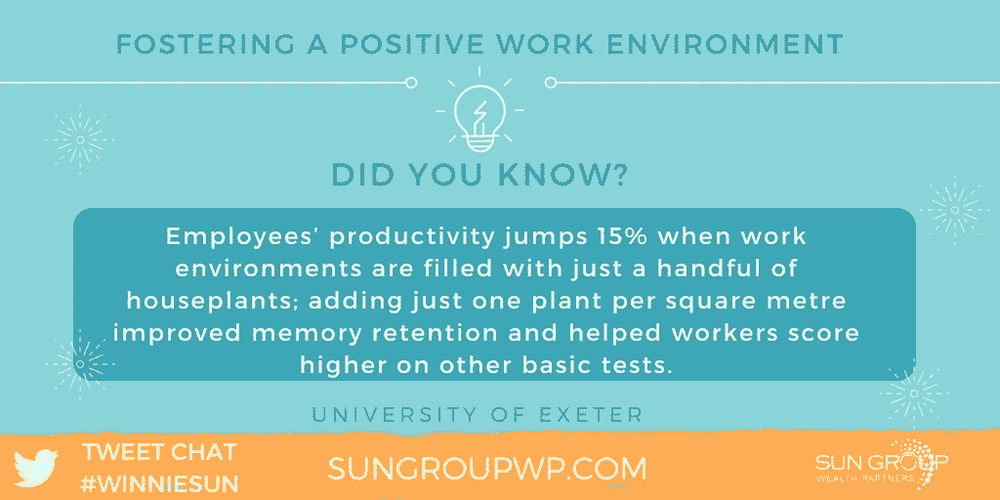
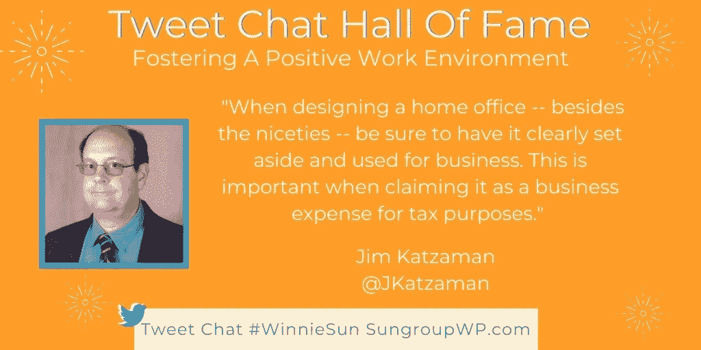
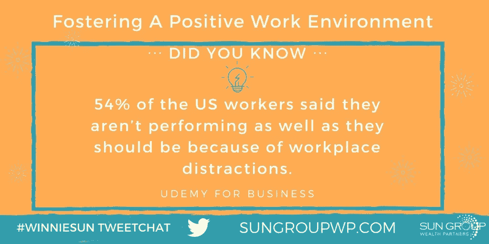
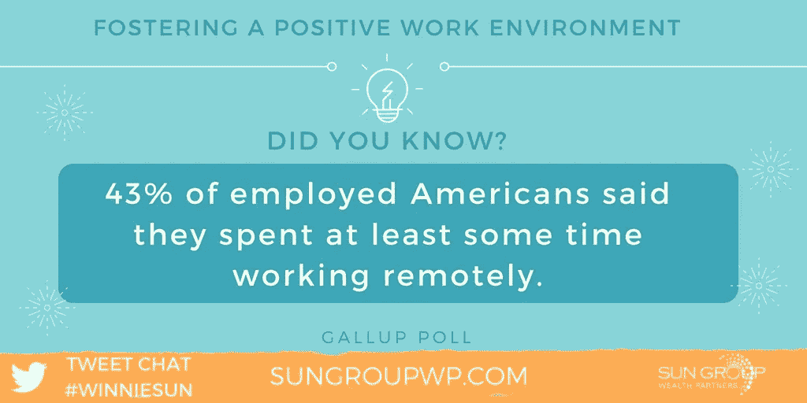

# 通过设计提高工作效率

> 原文：<https://medium.datadriveninvestor.com/work-productively-by-design-8269123f716d?source=collection_archive---------2----------------------->

## 理想的工作环境让员工心情愉快

一个积极的工作环境可以激励士气、效率和生产力。心情好的员工是快乐的人，这会增加公司利润。

[温妮·孙](http://winniesun.com/about/)，金融行业最受欢迎的专业人士之一，与[玛莎·科利尔](https://twitter.com/MarshaCollier)谈论了如何让工作场所成为一个好地方。科利尔是一名作家、播客、社交媒体、[电子商务、易贝和客户服务专家，也是营销未来学家。](https://medium.com/@JKatzaman/startcustoing-business-online-not-for-faint-of-heart-6367e4e6bc4d)

如果成本不是一个问题，[一个理想的工作环境](https://medium.com/@JKatzaman/how-well-do-you-work-by-design-68455fc542ef)将允许一个开放的与同事相处的空间和一个为了隐私和专注而封闭的空间的结合。

 [## 鼓舞人心的空间让员工心情愉悦

### 创造舒适、高效的工作场所对每个人都有帮助

medium.com](https://medium.com/datadriveninvestor/inspiring-spaces-put-workers-in-the-mood-516bd6947d01) 

“这是千真万确的，”孙说。“这是对时间和空间的尊重。

“我过去常说我们不会有办公室，”她说。“然而，有一个你每天都喜欢去工作的地方，以客户和员工应得的方式为他们服务，这是一件很美好的事情。”

Sun 的理想工作场所——包括灵活的时间表——确实很理想。

她说:“如果成本不是问题，我们会面朝大海，拥有海滩通道、游乐场、托儿所、餐厅和更多设施。”。

“灵活的时间表真的很聪明，”孙说。“完成工作，尊重你的同事和客户，但保持平衡和灵活。灵活性这个词就是一切。”

公司不一定要做大才能提供大的利益。

“一个每个人都有自己空间的办公室——保持绿色和通风，鼓励分享想法是理想的，”科利尔说。“即使在我的小机构里，我们也有人兼职处理课后托儿服务。我们工作时，他们在后院玩耍。

“只要有人维护，活墙就是一条路——这并不容易，”她说。“我旅行并工作了一段时间，但决定在工作室里为自己创造完美的环境。它更适合我。我喜欢手头有我需要的一切。”

# 与业务一起成长

团队在这种安排下齐心协力是有益的。

“当我们是一个团队时，办公室更适合做生意，”科利尔说。“该机构的员工欣赏并需要他人的支持才能充分发挥创造力。我们赢得了许多奖项。

她说，“如果你发展壮大，有了自己的房间，你就可以把它变成一间真正的办公室。”。"现在，这里有三张桌子——还有一间浴室."

事实证明，这些限制看似强大，但却与时俱进。

科利尔说:“我的公司负责洛杉矶顶级地区购物中心的营销和广告。”。“上世纪 90 年代，当我告诉他们需要一个网站时，他们认为我疯了。”

Sun 和 Collier 一直依靠应用程序和其他工具来保持有序和高效。

“我发现谷歌工具套件非常有助于我保持条理，”孙说。“当然，还有 Intuit 的 QuickBooks 和老式的电子邮件。"

科利尔利用她的客户服务背景。

“你*必须*使用一个全面的客户关系管理程序，”她说。“我使用 [Nimble CRM](https://twitter.com/Nimble/) 让每个人都有条理。如果你不能跟踪你的联系人，你就迷路了。”

 [## 提高你的眼界，让你的顾客兴奋

### 利用社交媒体提升客户体验

blog.markgrowth.com](https://blog.markgrowth.com/raise-your-sights-excite-your-customers-5869f0d3b9f6) 

一个基本的日历也很有帮助。

“我安排了四处走动的时间，否则我会整天坐在椅子上写作，”科利尔说。“我投资了 Aeron 椅子。如果我希望人们高效工作，我需要提供最好的工具。”

狡猾的经理可以平衡创造一个激励和支持的环境，同时仍然满足底线和不超支。

“你的环境很重要，”孙说。“工作环境应该是明亮、舒适的，但人与人之间的互动才是神奇之处。营造有利于[合作、](https://medium.com/@JKatzaman/collaboration-were-going-to-through-it-together-d630dcf6524f)讨论以及呼吸和思考能力的空间。”

# 注重预算的团队建设

这提供了一起工作或分开工作的机会。

“开展团队建设活动，”科利尔说。“它们不需要花很多钱。人们需要被欣赏——而这是免费的。

“我很少把工作和娱乐混为一谈，”她说。“有时出差时，我会在另一个城市待几天——多亏了我的客户——放松一下。”

为团队设计一个高效的家庭办公室不同于设计一个小型企业办公室。

当设计一个家庭办公室时，除了细节之外，一定要把它清楚地留出来，用于办公。当出于税务目的将其作为业务费用申报时，这一点很重要。

“我建议像设计办公室一样设计家庭办公室，”孙说。“考虑照明、充足的插座、隔音和便利。

“当你为一个团队设计时，你需要先考虑你的团队——人——然后再安排位置，”她说。“过渡的时候，慢慢来。问很多问题。听着。邀请其他人来帮你设计。”

 [## 你的设计工作有多好？

### 愉快的工作环境会带来快乐、高效的员工

medium.com](https://medium.com/datadriveninvestor/how-well-do-you-work-by-design-68455fc542ef) 

不要被盒子束缚。

“也要利用外部空间，”科利尔说。“在树下可以做很多好的工作。投资于你的员工，而不是花里胡哨的环境。”

在开始新的办公室设计之前，花点时间好好想想。

孙说:“在建立工作空间时，最重要的事情是要记住，当人们走进你的办公室工作或参观时，他们是什么感觉。”

“你能做些什么来[让他们感到快乐、有力量](https://medium.com/@JKatzaman/have-a-little-fun-and-profit-4dd7b69d6a90)？”她说。"我非常相信自然光、行动自由和便利。"

记住你的工作。

“除了绿色，对我来说最重要的是人体工程学，”科利尔说。"每一个设备和椅子都以人的舒适为中心."

员工认可也是办公室设计的一部分。

“我喜欢庆祝胜利——不管多小——祝贺，出去吃午饭，然后回家和家人一起庆祝，”孙说。"更大的胜利意味着团队度假."

# 灵活性允许感受

如果可能的话，试着“模拟”一下你想在办公室做什么，在哪里做。这可能有助于你避免把桌椅放在碍事而无益的地方。

“使用灵活的设计，”孙说。“我在非常昂贵的地方工作过。既然我们有了自己的空间，我相信开放、轻便、不那么笨重和昂贵的家具。更多的植物，更注重感觉。

“我认为让你感到充满活力和创造力的触摸对效率是最好的，”她说。" [WeWork](https://twitter.com/WeWork/) 在这方面很棒."

孙有一个[的推荐折扣链接](https://refmarketing.wework.com/winniesun/)，可以探索在当地的 WeWork 工作。

“我花了大量的时间在我的工作空间，因为它离家很远，”她说。“我也在家做很多工作，但这更具挑战性。我的孩子还不喜欢工作。”

科利尔尽力避免“松鼠！”时刻。

“当我写作时，我不得不强迫自己站起来四处走动，但我不能用谈话来分散注意力，”她说。“保持专注是关键。”

个人空间不同，每个人都不一样。这意味着一种通用的办公室设计不会适合所有人。设计要灵活，尽可能适应个人喜好。

 [## 明天的工作将“感觉像是我们生活的一部分”

### 自动化和人工智能将挑战员工

medium.com](https://medium.com/datadriveninvestor/tomorrows-work-will-feel-like-part-of-our-lives-6d10dbd7ca41) 

“共同工作空间的好处是能够花更少的钱，更少的承诺，并与所有不同行业的其他人一起在一个社区中工作，”孙说。“这给了你合作的机会。

“就我个人而言，当我离开办公室时，我喜欢使用 WeWork spaces 令人难以置信的工作环境，”她说。

科利尔补充说，共同工作空间“很棒，只要你减少社交时间。始终保持激光聚焦。”

无论一个人多么努力，分心往往会带来挑战。

“我最大的工作分心也是我最大的爱:我的孩子，”孙说。“这就是我在家不做正经工作的原因。我会把我孩子的需求放在第一位。完成的工作会更少，我们需要支付账单。"

# 向孩子学习

科利尔找到了分散注意力的解药。

“最棒的是，我学到了纪律，”她说。“当我女儿小的时候，我在一张艺术家的桌子下面为她建了一个帐篷或堡垒。她知道妈妈在工作。”

虚拟办公室既有希望也有缺点。

“虚拟办公室意味着与世界各地的团队成员一起工作，”孙说。“我以前也曾以这种方式和别人一起工作过，但我觉得这不如在一个办公室一起工作那样有效或愉快。

她说:“在同一个地方，我们肯定效率更高，但雇佣虚拟员工的成本会低得多。”。

 [## 现实一点——确保你知道自己在做什么

### 为工作中的增强和虚拟现实让路

arvrjourney.com](https://arvrjourney.com/get-real-and-be-sure-you-know-what-youre-doing-a1a5356edc44) 

尽管受到诱惑，科利尔还是敲响了守旧派的钟声。

“虚拟在我的脑海里，”她说。“当我在任何地方工作时，这就是我的办公室。但我更喜欢熟悉的环境，我需要的一切都在手边。”

在家办公的最大好处是不会浪费通勤时间。最大的缺点是在家工作会分散注意力。

“好处当然有很多:通勤时间和成本更少，办公空间成本更低，互联网接入更便宜，而且你可以在打电话的时候做很多家务，比如打开洗衣机和烘干机，”孙说。

“我喜欢在家工作，”她说。"然而，我需要一间办公室来定期会见客户."

**关于作者**

吉姆·卡扎曼是[拉戈金融服务公司](http://largofinancialservices.com)的经理，曾在空军和联邦政府的公共事务部门工作。你可以在[推特](https://twitter.com/JKatzaman)、[脸书](https://www.facebook.com/jim.katzaman)和 [LinkedIn](https://www.linkedin.com/in/jim-katzaman-33641b21/) 上和他联系。