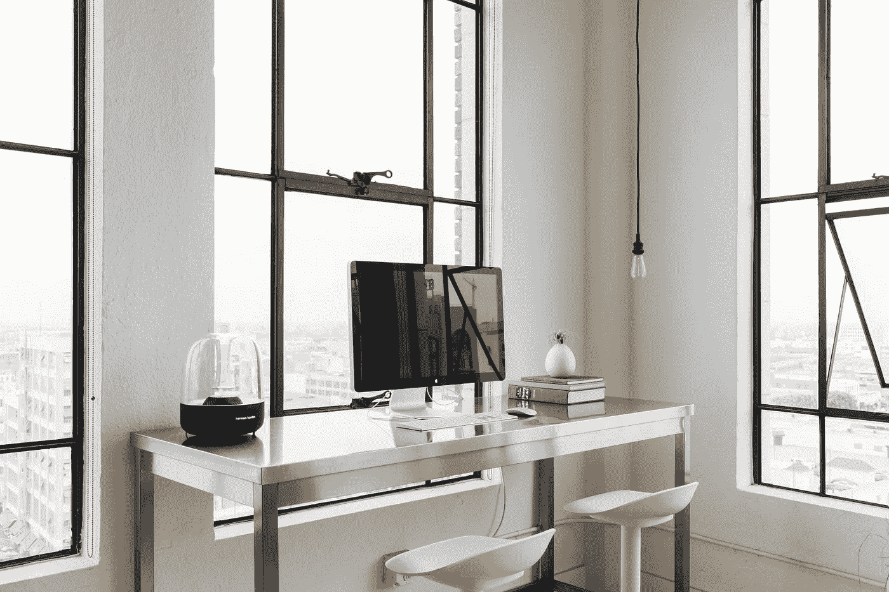

# 在家工作:城堡中的城堡

> 原文：<https://medium.datadriveninvestor.com/working-at-home-your-castle-within-a-castle-1ab710aecd6a?source=collection_archive---------4----------------------->

## 离开办公室辛苦工作需要不同的心态

在家高效工作既是一种优势，也是一种挑战。你远离了通勤的喧嚣，有更多的时间工作。另一方面，来自公司办公室的新的转移和需求造成了障碍。

[社交媒体营销和公共关系策略师亨利·马鲁普拉](https://webfluential.com/hennymaps)和其他人谈论了在家办公的利与弊。

在家工作与在办公室工作需要不同的思维方式。办公室有让人分心的东西，人们会停下来聊天，反之亦然。家有不同的干扰，如电视、窗外的诱惑和想聊天的家人。

无论你在哪里工作，都会有干扰。这是你说你在负责，而不是让分心接管，给你一个方便的借口不完成你的工作。

 [## 保持距离的终极方法

### 大大小小的组织都在努力应对远程工作

medium.com](https://medium.com/datadriveninvestor/the-ultimate-way-to-keep-your-distance-a4d86d46dd62) 

“你必须把注意力集中在工作模式上，假装你要去办公室，”马鲁普拉说。“保持你正常的洗澡和办公室职业形象。仅仅因为你在家工作并不意味着你可以忽略基本的东西。

“为自己设定并奉献工作时间，”他说。“抵制整天躺在床上和‘我以后再做’的心态。在你设定的工作时间内，也要遵守禁止访客的规定。”

# **保持标准**

除了个人标准，家庭工作场所也需要符合标准。

“复制一个合适的办公室环境，”马鲁普拉说。“有合适的办公桌和空间、舒适的椅子和工作用具、Wi-Fi、笔记本电脑、打印机等。”

指定的家庭办公室不仅有利于税收目的，它还向朋友和家人——以及你自己——发出信号，表明这是完成工作的地点和时间。请勿打扰。

 [## 当没有比家更好的地方时如何成功

### 维持家庭办公室的有效方法

medium.com](https://medium.com/an-idea/how-to-succeed-when-theres-no-place-like-home-dc53f418a8f) 

记住，一个人的工作动力是另一个人的干扰。一类人在背景音乐中工作得最好。另一种方式在沉默中效果最佳。如果你是真正听音乐而不是做任何事情的人，要小心了。

“离电话远点，”马鲁普拉说。“关掉电视，假装你在办公室里。不要想你的床或沙发。所有的工作都是为了我。”

# **保持专注**

在家工作的秘方是远离调味汁。你需要头脑清醒地工作。

你是早上型还是下午型的人？如果你有灵活性，把你最重要的工作安排在巅峰时期。如果是早上，那就完成同样多的事情——尤其是在两条腿分心的人醒来想要得到关注之前。

马鲁普拉说:“当我为自己的舒适区设定目标时，我通常会表现出色。“此外，创造性的汁液往往在‘你的空间’中流动得更多，你最终会超额完成任务。

“因为这是你的房子，你不会被限制工作时间或你应该如何工作，”他说。因此，你可以灵活地完成工作。你的规则，你的界限，你的空间。”

 [## 成功的远程工作平衡了生活质量

### 获得如何完成工作的焦点和清晰性

medium.com](https://medium.com/datadriveninvestor/successful-remote-work-balances-quality-of-life-b4c838001a3a) 

马鲁普拉更像是一个音乐人。

“音乐刺激情绪和不同的流派，”他说。“它能唤起感觉，这对你的大脑有效工作可能至关重要。一首 R&B 慢歌可能会让你放松神经，而一首摇滚或重金属歌曲可能会唤醒你的睡眠，激发你的能量。”

# **穿衣还是不穿衣？**

你是否在家打扮取决于你的心态和你为谁工作。有些专家说——不管其他人是否看到你——你都应该穿得正式一点，这样你的思维才能适应工作。

你也应该穿好衣服，以防你的老板决定召开视频电话会议。有些老板更喜欢视频电话，只是为了确保人们不会穿着睡衣在家工作。安全总比后悔好。

玛鲁阿普拉说:“穿得体面些，尤其是如果你有一个适合客户来访的办公室的话。”。“话说回来，这取决于职业。比如我做社交媒体营销和管理。与向客户推销时穿西装不同，这种着装通常是休闲的。

 [## 喜欢也好，讨厌也好，在家工作会生存吗？

### 远离办公室的辛苦工作混合了吸引力和可能的倦怠

medium.com](https://medium.com/datadriveninvestor/love-it-or-hate-it-will-work-at-home-survive-c08482c9eccb) 

在家办公有两个原因。首先是有一个指定的地方，在那里你和其他人都知道你开展业务。向其他人发出信息，让他们在工作时不要打扰你。

第二个原因取决于你所在国家的税法。在美国，员工必须有符合明确标准的特定空间，才能被申报为减税的办公空间。您的法律可能会有所不同，但您需要了解这些要求。

# **一个属于自己的空间**

“在房子里有一个空间，作为你工作的角落，”马鲁普拉说。“它不一定是一个大的或封闭的空间。它可以是你工作的房间的一个角落:我的‘家庭办公室’区域。”

有时候，在家工作是你唯一的选择，尤其是当你花很多时间在与客户的现场会议上，回家填写细节，发送电子邮件等等。

 [## 在一个肘撞的世界里，我们在一起会更好

### 在物理上分离的情况下寻找新的业务方式

medium.com](https://medium.com/datadriveninvestor/were-better-together-in-a-world-of-elbow-bumps-e0a0a2694078) 

在其他职业中，在家工作是可选的，取决于管理者的意见。在某些情况下，公司领导说他们喜欢远程办公，但实际上并不喜欢。比起在办公室工作，你可能更需要证明在家工作的合理性。

“这取决于你的团队有多大，”马鲁普拉说。“如果你是一个人的乐队，在家工作绝对可行，而且没有任何麻烦。但如果你是一个团体和团队，那么这可能会成为一种挑战，比如侵犯个人空间，因为这是一个家。”

最终，在家工作没有一个正确的答案。这不是你想要什么的问题，而是你的老板允许什么的问题——每个老板都是不同的。知道规则，顺其自然。

**关于作者**

吉姆·卡扎曼是[拉戈金融服务公司](http://largofinancialservices.com)的经理，曾在空军和联邦政府的公共事务部门工作。你可以在[推特](https://twitter.com/JKatzaman)、[脸书](https://www.facebook.com/jim.katzaman)和 [LinkedIn](https://www.linkedin.com/in/jim-katzaman-33641b21/) 上和他联系。