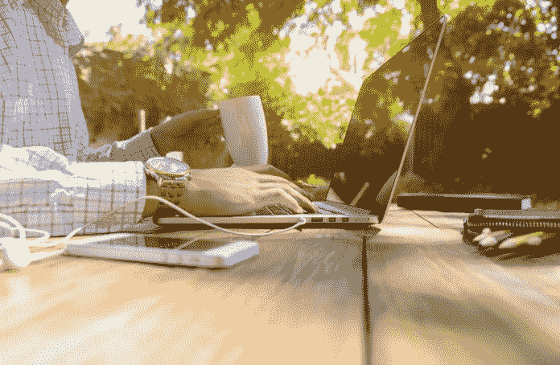

# 在家工作——当你的父母不理解你有一份“真正的”工作时。

> 原文：<https://medium.datadriveninvestor.com/working-from-home-when-your-parents-dont-understand-that-you-have-a-real-job-b557695330e1?source=collection_archive---------49----------------------->

> 至少可以说，不承认现代科技给我们年轻人创造的机会是不屑一顾的，这些机会是我们十年前无法想象的。

我已经有一段时间没有拥有一份“真正的”工作了，这是我年长亲戚的信念。我理解他们的想法，因为坐在电脑屏幕前当然很难被认为是“艰苦的工作”。

为什么有人会认为，在我甚至没有办公室的情况下，在电脑屏幕前坐 15 个小时，同时做三份不同的“有偿”工作，会有“真正的工作压力”呢？

我的时间表是假的，但是据大多数人说，它真的很简单——很舒服。当我思考为我的投资公司分析数据，研究学术论文，为学生起草讲稿，我的写作热情，并确保我每天至少发表三篇文章。

这些都算不上“真正的”工作，因为我几乎从不离开家，如果我从不离开家，在“*凌晨 2 点醒来假装工作到下午 5 点”，*也不算什么。那怎么会有工作压力呢？当我说我因为紧张的工作日程和在三个不同的时区工作而昏厥时，怎么会有人认真对待我，而我的大多数外科医生朋友却嘲笑我的“娘娘腔态度”,说我从未做过任何“实际”工作是多么幸运。

最近有人批评我不够社交，没有花足够的时间在朋友和家人身上，因为我不够外向；尽管我从未真正做过任何“真正的”工作。可以理解的是，也许他们不明白，当我周围的人都在为社交生活做准备的时候，我却在想，能睡上至少 4 个小时的好觉该有多幸运。

当我在闲聊中跟不上他们时，我理解人们说我是个“混蛋”或有“严重的态度问题”，因为当我完成我的“假工作”时，我的大脑感觉像是被钉了钉子。

我想收入也不太重要，因为在家电脑屏幕前工作获得“报酬”几乎不被认为是一份有价值的工作。

我不责怪人们没有理解问题在于他们对我的态度，不想适应他们的“职业道德”意识形态，我想我只是不适合这个要求。

我对自己说，如果有人能够理解我们处理工作压力的不同方式，也许，只是也许，我的“假工作”对我来说真的很重要。

> *如果他们有另一个脑细胞，那将是孤独的。*

从社会中退出很难成为不想社交的借口，但也许我从闲聊、强颜欢笑、摆姿势拍照或与社交名流擦肩而过中得不到乐趣。这不在我的关注范围内。

当我强迫自己继续工作并能够从噪音中提取音乐时，我发现这变得更容易了——我在孤独和能够塑造多种职业的独立性中找到安慰，我在这些职业中找到了真正的快乐。

我不介意我的时间表，我介意人们对它的态度。这是不屑一顾的，无情地与他们对我是一个“孤独者”的不安全感无关。

> 我希望有时候我可以大声说出来，大声喊:“我内向的生活是我引以为豪的决定。我不喜欢和那些对我没有任何价值的人交谈。我对别人的生活不感兴趣…真的有点让我他妈的一个人呆着，因为我很忙，在家工作并不意味着我失业了”。

但那将需要我付出太多的努力来解释一些人们可能不会理解的东西，而且这些人对我来说基本上是无足轻重的。

> *当我真的相信那些批评我“虚假工作”的人只是“你抗议得太多了”的例子时。*

> 在我心底，“去他妈的自己吧——用你闪亮的办公室假阳具”。

*原载于 2018 年 9 月 17 日*[*www.datadriveninvestor.com*](http://www.datadriveninvestor.com/2018/09/17/working-from-home%E2%80%8A-%E2%80%8Awhen-your-parents-dont-understand-that-you-have-a-real-job/)*。*