# 工作多光谱图像

> 原文：<https://medium.datadriveninvestor.com/working-multispectral-images-f10b85eaa544?source=collection_archive---------2----------------------->

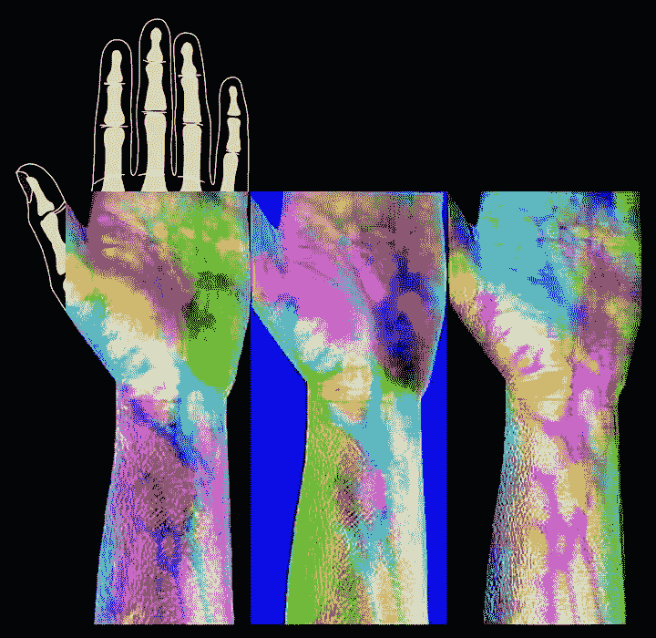

[mix.msfc.nasa.gov](https://mix.msfc.nasa.gov/abstracts.php?p=2700)

# 电磁波谱的一些基本原理

电磁波谱由一系列不同波长或“颜色”的光能组成。光谱遥感仪器收集电磁波谱特定区域内的光能。光谱中的每个区域称为一个波段。

# 空间与航空数据

遥感数据可以从地面、空中(使用飞机或直升机)或太空收集。我们可以想象，从太空收集的数据通常比从飞机上收集的数据具有更低的空间分辨率。然而，权衡的结果是从卫星收集的数据通常提供更好的(直至全球)覆盖范围。

例如，Landsat 8 卫星对整个地球有 16 天的重复周期。这意味着我们可以每 16 天为一个区域找到一张新的图像。收集机载数据需要大量的时间和财力。因此，数据通常只适用于较小的地理区域。

# 波段和波长

当谈到光谱数据时，我们从电磁光谱和图像波段两方面来谈。光谱遥感数据是由功能强大的类似照相机的仪器收集的，这些仪器被称为成像光谱仪。成像光谱仪收集“波段”中的反射光能。

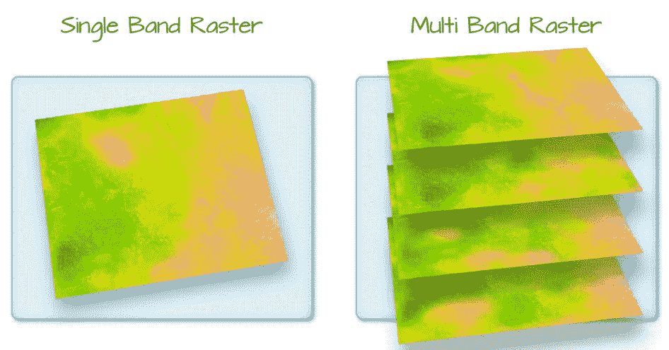

A raster can contain one or more bands. We can use the raster function to import one single band from a single OR multi-band raster. Source: Colin Williams, [https://www.earthdatascience.org](https://www.earthdatascience.org)

一个波段代表一段电磁波谱。例如，800 纳米(nm)和 850 nm 之间的波长值可以是成像光谱仪捕获的一个波段。成像光谱仪收集地面上像素区域内的反射光能量。因为成像光谱仪收集许多不同类型的光——对于每个像素，每种类型的光或波段的光能量将被记录。因此，举例来说，照相机记录每个像素的红色、绿色和蓝色光量。

通常，当我们使用多光谱数据集时，波段信息被报告为中心波长值。该值代表该波段中代表的波长的中心点值。因此，在 800-850 纳米的波段中，中心应该是 825 纳米。

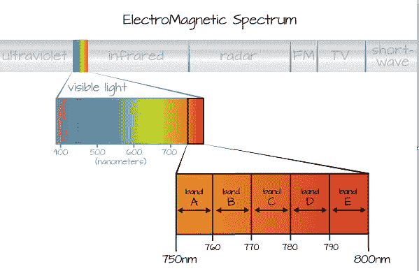

Imaging spectrometers collect reflected light information within defined bands or regions of the electromagnetic spectrum. [https://www.earthdatascience.org/](https://www.earthdatascience.org/)

# 谱分解

具有多个波段的数据集的光谱分辨率是指数据集中每个波段的光谱宽度。虽然通常提供传感器的一般光谱分辨率，但不是所有的传感器都在均匀宽度的波段内收集信息。

# 空间分辨率

栅格的空间分辨率表示每个像素覆盖的地面面积。如果栅格中的像素较小，数据会显得更加“详细”如果栅格中的像素较大，数据会显得更粗糙或“模糊”

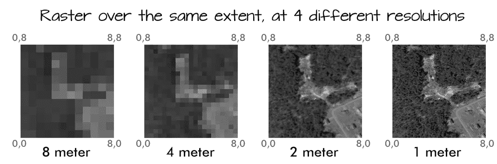

[https://www.earthdatascience.org/](https://www.earthdatascience.org/)

# 什么是多光谱图像？

我们许多人都熟悉的一种多光谱图像是彩色图像。彩色图像由三个波段组成:红色、绿色和蓝色。每个波段代表从电磁波谱的红色、绿色或蓝色部分反射的光。合成时，每个波段的像素亮度会创建您在图像中看到的颜色。这些颜色是你的眼睛在电磁波谱的可见光部分能看到的颜色。在多光谱图像中，我们可以使用灰度颜色渐变分别绘制多波段图像的每个波段。

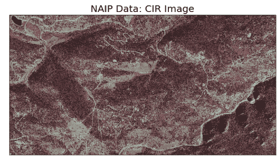

Near infrared light reflects strongly off of vegetation. [https://www.earthdatascience.org](https://www.earthdatascience.org)

多光谱图像被用于多个领域，例如，从医学、农业、地图、地形地貌的定义、矿物勘探或金属成分的研究。我的目标是将其用于废料的分类，利用对其光谱的实时研究，并利用深度学习，对其进行分类。

让我们用 python 和 [Jupyter 合作实验室做一些探索多光谱图像的例子。](https://colab.research.google.com/notebooks/welcome.ipynb#recent=true)

首先，开始将一些 tif 文件读入协作室。

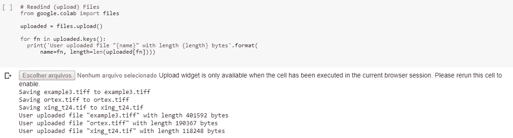

声明一些库，特别是这个工作的 GDAL

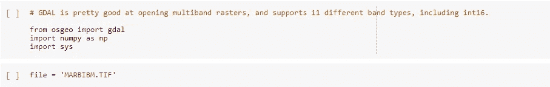

打开我们选择的 tif 文件，在这里是 MARBIBM。标签图像文件格式。

列出图像中有多少条带:

查看分辨率信息:

其他信息文件:

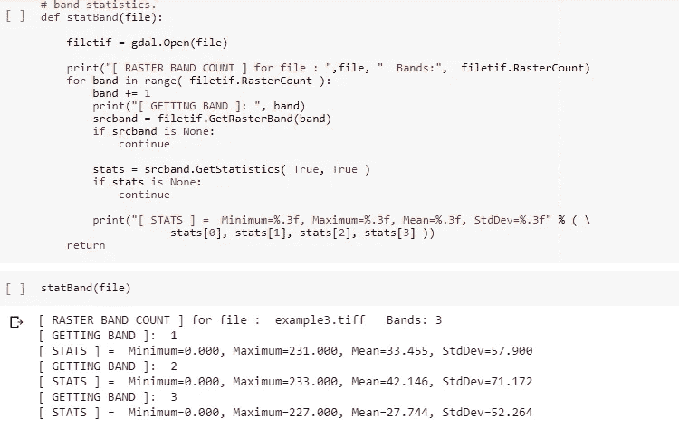

声明 matplotlib 库以绘制图像:

从图像中绘制波段的功能:

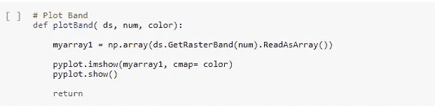

现在，让我们来绘制我们的图像，波段 1:

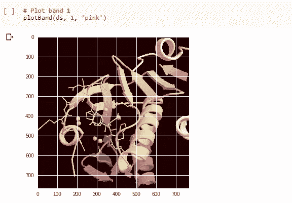

图带 2:

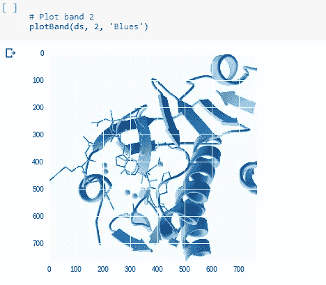

图带 3:

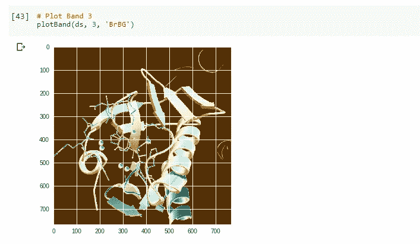

现在，我们可以在 JPG 记录所选波段的图像，并创建一个数据库，用于我们分类器的学习机器。

您可以在 [GitHub](https://github.com/MRobalinho/Multispectral_Images) 上查看 Jupyter 笔记本中的工作。

# 参考资料:

【http://www.spectralpython.net/ 

[http://www.spectralpython.net/fileio.html](http://www.spectralpython.net/fileio.html)

[https://www.geeksforgeeks.org/working-images-python/](https://www.geeksforgeeks.org/working-images-python/)

[https://www.geeksforgeeks.org/reading-images-in-python](https://www.geeksforgeeks.org/reading-images-in-python)

[https://hub . packtpub . com/image-class ification-and-feature-extraction-images/](https://hub.packtpub.com/image-classification-and-feature-extraction-images/)

[https://pypi.org/project/tifffile/](https://pypi.org/project/tifffile/)

[https://www.fileformat.info/format/tiff/sample/index.htm](https://www.fileformat.info/format/tiff/sample/index.htm)

 [## 栅格图层- Python GDAL/OGR 烹饪书 1.0 文档

### 编辑描述

pcjericks.github.io](https://pcjericks.github.io/py-gdalogr-cookbook/raster_layers.html)  [## Python 中的多光谱遥感数据简介

### 完成本教程后，您将能够:定义光谱和空间分辨率，并解释它们之间的区别…

www.earthdatascience.org](https://www.earthdatascience.org/courses/earth-analytics-python/multispectral-remote-sensing-in-python/intro-multispectral-data/) 

[https://pcjericks . github . io/py-gdalogr-cookbook/raster _ layers . html](https://pcjericks.github.io/py-gdalogr-cookbook/raster_layers.html)

[https://rasterio . readthedocs . io/en/latest/topics/reading . html](https://rasterio.readthedocs.io/en/latest/topics/reading.html)