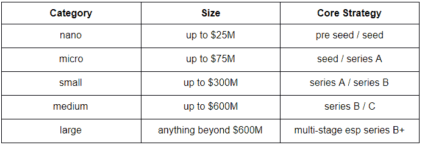

# 与规模较小的 VC 合作— 3 个关键因素

> 原文：<https://medium.datadriveninvestor.com/working-with-a-smaller-versus-larger-vc-3-key-factors-2a6a5c292479?source=collection_archive---------3----------------------->

更小并不总是更灵活，更大并不总是更好，确保分析你的潜在投资者的过去、现在和未来，并验证他们的 T2 工作方式。[规模较小的风投公司](https://www.linkedin.com/pulse/ventures-what-working-lesser-known-vc-amit-garg/)和规模较大的风投公司各有各的优势，在对比它们时，有三个关键因素需要考虑。

**1)基金规模**

风险投资基金的规模反映并决定了他们的策略。在 2019 年的硅谷，以下描述基金的术语被宽松地使用:

一个大的基金，可能有足够多的投资人，对各个阶段给予足够的重视。但现实是，在治理和支持方面(例如下面的“跟进资本”和“价值”)，针对特定阶段优化的基金往往能对他们的初创公司提供更多帮助。

 [## 风险投资家在给创业公司播种时会考虑什么标准？-数据驱动型投资者

### 2017 年，风险投资资金攀升至十年来的最高水平。你的创业公司目前吸引风险投资的机会是…

www.datadriveninvestor.com](https://www.datadriveninvestor.com/2018/04/20/what-criteria-do-venture-capitalists-consider-when-seeding-a-startup/) 

因此，如果你是一家选择与中型基金合作的种子期公司，相应地调整你的期望——你将获得品牌和网络，但你也将成为他们实践中的一小部分。即使你对此进行了调整，过早获得大型风投的投资也会让你在未来几轮投资中被他们套牢，这让你在条款和估值上的筹码更少。

**2)跟进资金**

规模更大的基金拥有更多可支配的资本，可以更好地支持需要更多现金的企业家，无论他们是业绩非常好、希望进行收购，还是面临危机、需要一只救生船。但是有两个关键因素要记住。

第一，基金规模是一个不完美的指标，真正重要的是储备现金。不同的风投对新投资的投入有不同的门槛，大体上在基金的 1/3 到 2/3 之间。如果你在一个基金的生命周期结束时从该基金获得新的投资，那么他们的储备很可能是有限的；这是一个企业家在尽职调查时应该问的关键问题。显然，有许多好的方法可以绕过它，许多 VC 有一个机会基金(即一个根据需要部署更多现金的辅助基金)或可以做 SPV(即为特定目的筹集资金)；重要的是让你的投资者感到放心。

第二，信号问题——如果一家大型风投公司不提供后续资金，这对初创公司来说是一个巨大的打击，因为它在市场上引发了太多问题。另一方面，一个规模较小的风险投资者不愿意按比例分配他们的份额可以更容易解释。在让投资者在未来为你提供足够的现金，但又不会限制你的选择之间，肯定有一个微妙的平衡，这就是为什么[选择你的领投 VC 如此重要](https://www.linkedin.com/pulse/lead-vc-does-really-matter-amit-garg/)。

**3)值**

价值远不止估值，它是一个风投能为你做的资本之外的一切。许多企业家会告诉你，他们的投资者只是资本的来源，只是董事会中的季度声音，但那些超出这一范围的投资者价值连城。你的特定投资者的专业知识，尤其是卷起袖子与你合作的意愿，显然是他们价值的一大部分。

介绍是价值的另一个重要组成部分，这也是大型风投公司更适合设立的地方。例如，在企业中，潜在客户包括首席信息官、首席信息官、首席技术官和副总裁，接触他们在早期阶段非常有用。在卫生领域，围绕监管的指导可能是一个存在的差异。对于所有的初创公司来说，向潜在雇员引荐是至关重要的。规模较小的风投可以通过更加专注和过度执行来与拥有更大网络的规模较大的风投竞争。

*这些都是专注于实践见解的短文(我称之为 GL；dr —良好的长度；确实读过)。如果它们能让人们对某个话题产生足够的兴趣，从而进行更深入的探索，我会感到非常兴奋。这里表达的所有观点都是我自己的。如果这篇文章有对你有用的见解，请给个赞，任何想法请留言。*