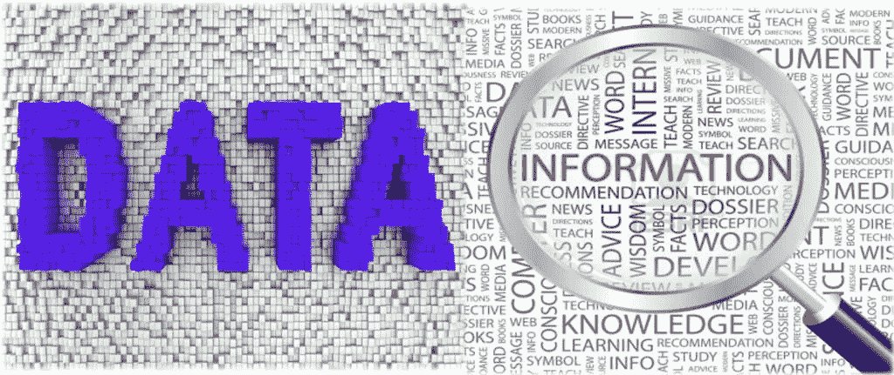
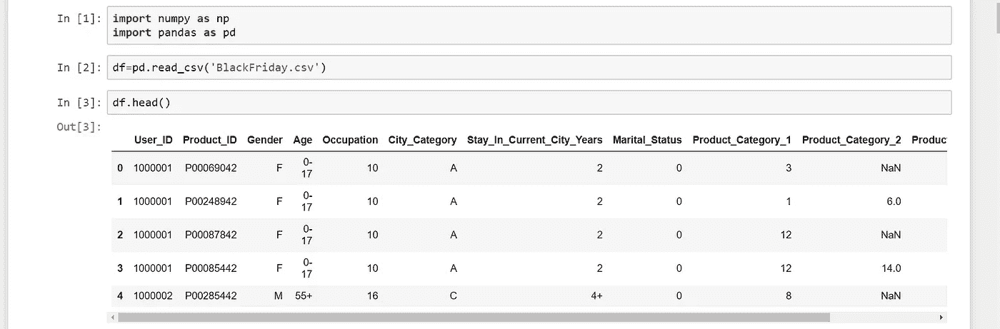
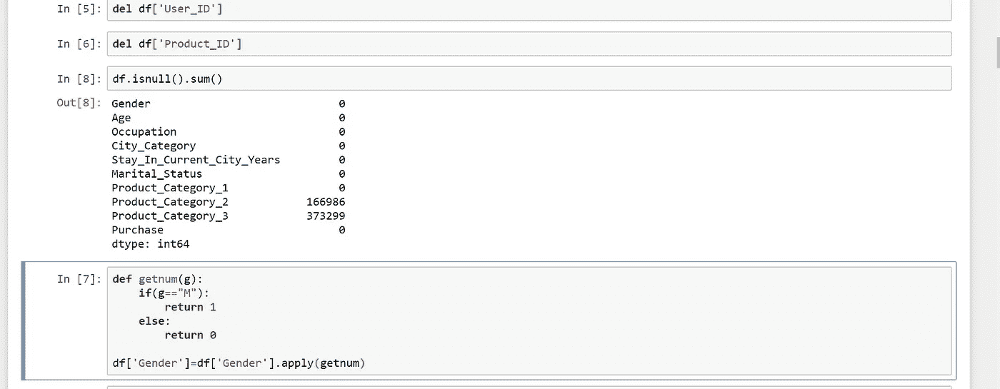
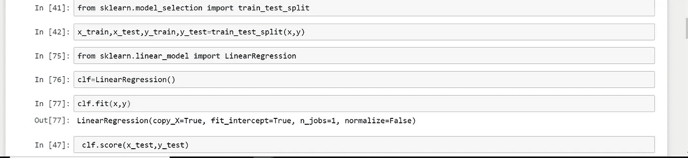

# 在机器学习中使用数据

> 原文：<https://medium.datadriveninvestor.com/working-with-data-in-machine-learning-d1dad3cad1d7?source=collection_archive---------32----------------------->

[https://www.plantagbiosciences.org/people/sinead-nee/wp-content/uploads/sites/47/2018/07/Data-5-1024x431.jpg](https://www.plantagbiosciences.org/people/sinead-nee/wp-content/uploads/sites/47/2018/07/Data-5-1024x431.jpg)

收集数据后，需要遵循以下步骤来从中提取有用的信息。

我们将使用黑色星期五的数据集来帮助理解这个过程。你可以从[https://data hack . analyticsvidhya . com/contest/black-Friday/download/train-file](https://datahack.analyticsvidhya.com/contest/black-friday/download/train-file)获得这个数据集

## 步骤 1:理解数据

这涉及到了解你的数据集中存在的所有东西的重要性的过程。我们可以使用熊猫图书馆来可视化我们数据的许多方面。

## 步骤 2:清理数据

这一步包括删除可能对我们没有任何用处的不必要的数据。注意，在上面使用的黑色星期五数据集中，目标标签是 purchase，它不受 User_Id 和 Product_Id 属性的影响。

除此之外，还有一些填充了 NaN(不是数字)和 NULL 值的行。这些要么被移除，要么被适当地填充。

该过程还包括在需要时将分类数据转换为数值数据，就像下图中对婚姻属性所做的那样。

## 步骤 3:选择合适的培训模型

基于问题的类别，可以使用不同的算法来训练样本。这里我们使用线性回归，因为我们的目的是预测购买价值。在训练之后，在测试数据上测试该模型。基于准确性的值，即我们的预测结果与实际结果有多接近，我们的模型质量就确定了。

这 3 个步骤涵盖了当你有一个数据集时，开始机器学习需要什么的简短想法。一个好的机器学习模型是上述三个基本步骤的适当应用的累积。