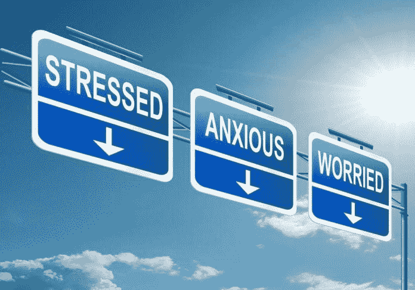

# 工作场所必须支持心理健康

> 原文：<https://medium.datadriveninvestor.com/workplace-must-support-mental-health-ed73fbd4a607?source=collection_archive---------7----------------------->

## 环境、开放的工作空间和基因会影响思维

工作非但没有好处，反而可能对你的精神健康有害。这是顾问、精神病学家和心理健康倡导者[奇塔伊·穆拉布拉](https://twitter.com/Dr_chitayi)与美食博客、自然爱好者和心理学家[塔伊巴警长](https://twitter.com/Tayyiba08)一起提出的建议。

在非洲的一次推特聊天中，Murabula 和 Sheriff 研究了环境、基因、开放的工作空间和其他因素如何影响工作场所的心理健康。

“精神健康的遗传学非常复杂，因为遗传不是基于单个基因，而是多个基因相互作用，”Sheriff 说。“然而，双胞胎研究表明，某些精神疾病，如精神分裂症和注意力缺陷/多动症，有遗传根源。

她说:“事实上，一些精神障碍有共同的遗传风险因素。”“例如，与精神分裂症相关的基因变异与双相情感障碍和抑郁症重叠。一个家庭中存在精神疾病并不能保证其遗传性，但会增加患病的风险。”

她补充说，先天、后天或者两者都有可能影响心理健康。

穆拉布拉说:“心理健康是一种幸福的状态，可以应对生活压力，提高工作能力，建立人际关系，为社会做出贡献。”

 [## 我们屏蔽了社交媒体，这引起了公愤。数据驱动的投资者

### 上瘾，我们看不出来。在最近的一项研究中，基于以前的研究成果，我们想…

www.datadriveninvestor.com](https://www.datadriveninvestor.com/2018/12/01/we-blocked-access-to-social-media-it-caused-an-outrage/) 

“心理健康不是精神疾病，”他说。“精神障碍是一种影响人的情绪、思维和行为的疾病。因此，讨论与精神疾病有关的遗传学比讨论精神健康更合适。”

他指出，有 200 多种精神疾病——有些轻微，有些严重——每一种都有不同的病因和病程。

“当生物、心理和社会风险因素或原因相互作用时，就会出现精神障碍，”穆拉布拉说。“没有一个单一的风险因素足以导致精神障碍。

“遗传风险因素是精神疾病的生物学原因的一个例子，此外还有脑损伤、癌症以及疟疾和艾滋病等感染等因素，”他说。“心理疾病的心理原因包括自卑、心理创伤和年轻时失去家人等因素。”

精神障碍的社会风险因素包括贫困、家庭不稳定、丧亲、失业、监禁、耻辱和暴力，以及紧张的工作条件。

穆拉布拉说:“一个携带抑郁症等疾病遗传风险因素的人可能不会患上抑郁症，直到遇到像失去家人这样的环境压力。”“由于我们没有现成的途径来获取我们的基因构成——因此也就没有我们患精神疾病的遗传风险因素——因此，采取促进良好精神健康的做法是明智的。

“这是一项正在几个非洲国家进行的研究，其发现将增加我们对精神障碍遗传学的了解，”他说。

更微妙的挑战之一是发现同事是否有自杀倾向，是否急需帮助。

“某些警告信号是显而易见的，如自残、参与令人不安的行为、抑郁期后突然冷静、脱离社会、依赖酒精或药物、鲁莽以及因睡眠不足或过多而疲劳，”警长说。

“也注意他们的对话，”她说。“陈述可能显示出成为负担、被困、缺乏归属感或直接提到死亡的感觉。无法解释的敌意和易怒也是重要的信号。”

不是每个有自杀倾向的同事都会表现出抑郁症状。

“其他人，试图掩盖他们的痛苦，会显得非常‘正常’，快乐和无忧无虑，”警长说。“这类案件更加危险，处理起来更具挑战性。

“如果你怀疑同事有自杀倾向——即使迹象可能很微妙——密切关注他们，警惕这些行为，”她说。"留意可以立即接通的自杀热线，并确保可以获得专业帮助."

对管理人员和员工的培训至关重要。

“精神疾病可能发生在任何人身上，”警长说。"工作压力增大是主要的风险因素之一。"

穆拉布拉解释说，遗传和精神疾病之间的关系很复杂。

“没有发现特定的基因会导致特定的精神障碍，但有几个基因会增加患精神障碍的风险，”他说。他在工作场所表现出精神疾病的迹象:

*   与同事之间持续的恶劣关系。
*   会议期间注意力长期不集中，无法完成任务。
*   无法用其他方式解释的频繁旷工。
*   极度害怕人或做演示。
*   不停地谈论死亡。
*   听到不存在的人的声音，或者看到不存在的人或事物——幻觉。
*   从集体活动中抽离出来并长时间孤立自己。
*   过度和不受控制地使用酒精、bhang 或 miraa 等物质，包括在醉酒状态下工作。

“精神疾病的诊断是一个复杂的过程，”穆拉布拉说。“建议任何人都不要进行自我诊断或诊断同事。如果注意到精神障碍的迹象，应寻求专业意见。”

随着开放式办公空间的流行，公司高管已经利用它们来帮助应对心理健康问题。

“普通人一天中大约有三分之一的时间在工作场所度过，”警长说。“不可否认，工作环境对一个人的心理健康有重大影响，尤其是像工作压力和焦虑这样的情况。

“在某些情况下，开放式办公室可能会比私人小隔间更能降低压力，鼓励更多的运动，从而促进身体健康，”她说。"这种开放式的设置让同事们可以互相监督，发现精神健康恶化的迹象。"

与在私人小隔间相比，患有焦虑或抑郁的同事更容易被注意到。

“通过这种方式，一个开放的空间允许同事之间有更多的透明度、交流和支持，”Sheriff 说。“这种办公室还可以设计社交活动或即兴会议的中心，方法是制作一些简单的圆形沙发，方便圆桌讨论。这可能会进一步鼓励一种相互联系的意识，并推动创新。

“给协作和创造力留出空间，”她说。“那么，在减压的同时集思广益也不是不可能。员工们肯定会欣赏可供他们选择的不同方案，并选择最适合他们的方案。”

另一方面，开放空间也不是万能的。

“这可能会恶化一些有或没有精神疾病的员工的状况，”警长说。“由于每个人的个性和工作方式不同，有些人在人前会感觉更好，而对其他人来说，这可能会加速他们的症状。

“尤其是那些患有抑郁症的人无法忍受噪音，”她说。“因此，在开放式办公室里，他们会感到更加疲劳和烦躁。当涉及系统差异时，一刀切的解决方案可能不是理想的前进方式。”

一个这样的解决方案可能会被错误地应用到非常满意的内向者身上。

“内向的人经常被误认为是孤立的个体，然而他们中的大多数人实际上是非常社会化的，”Sheriff 说。“相反，诸如对日常活动缺乏兴趣、持续生闷气、耐受性差、自残等症状是心理健康恶化的指标。”

事实上，内向可能会与社交焦虑混为一谈。

“它们不一样，”警长说。“事实上，我们所有人既不完全内向，也不完全外向。我们处在一个范围内，有些人比其他人更内向，反之亦然。

“内向的人确实更容易感到被冷落，”她说。"然而，有些人处理得很好，对自己的皮肤很满意."

同时，不要在外向的人面前畏缩。

“不要被外向的人吓倒，”警长说。“你同样可以在你的领域出类拔萃。著名的杰伊·谢蒂也是一个内向的人，但是他却在外面，改变着生活。他可以，你也可以。不要让任何人给你设置障碍。”

在没有监控的情况下过度使用电脑访问社交媒体平台会影响心理健康。

穆拉布拉说:“在过去的 20 年里，互联网使用的增加可能会给我们的精神健康带来风险。”。他给出了几个问题场景:

*   一个预先存在心理健康状况的人，如双相情感障碍，可能会从事有害的互联网使用，作为心理健康状况的一种表现。
*   互联网用户可能会变得依赖，就像病理性赌博障碍一样。
*   有害的互联网使用可以在其他风险因素的背景下催生一种新的心理健康状况，如抑郁症。

穆拉布拉说:“网络欺凌会增加自残甚至完全自杀的风险。”

Sheriff 建议经理们与其对抗在线趋势，不如与之合作。

“随着技术的进步，获取任何东西都是理所当然的，”她说。“社交媒体平台不受监控的使用无疑给社会带来了巨大的破坏。如果出于正确的原因，在正确的时间内使用，社交媒体可以成为一个强大的工具。

“社交媒体并不总是传播最有用的信息，”警长说。“某些群体将厌食和其他生活方式选择等不健康行为正常化。对于一个容易被洗脑或被冲昏头脑的人来说，这样的信息会把人引上黑暗的道路。”

这样的旅程可能是致命的。

“已经发表了几份关于人们获取自杀信息并决定走上同样道路的报告，”警长说。“现在越来越多的青少年因为网络欺凌而受到精神影响，这也不足为奇。

“不幸的是，当人们开始遭受一些症状时，他们避免专业帮助，而是求助于互联网，这往往会预测错误的疾病，”她说。

知情的干预可以拯救生命。

“在最近的一个案例中，一名青少年由于过度使用社交媒体而开始出现抑郁症状，”警长说。“对他的时间表做了一个简单的改变——在睡觉前一小时和醒来后限制使用社交媒体——显示出了显著的积极效果。”

从根本上来说，识别精神健康问题是可能的。

“通过收集信息，不仅可以确定令人震惊的精神问题，还可以做出必要的改变，”警长说。“在某些情况下，可能是简单的生活方式因素导致问题升级。

“解决任何问题的简单方法不是药物就是酒精，”她说。“这样的人不知道他们给自己带来的伤害。恢复可能是一个相当长的过程。”

深入研究可以发现有用的解决方案。

“在研究过程中，可以识别模式以及应对策略，”Sheriff 说。“此外，对相同样本进行的跟踪将显示特定策略是否有效，并相应地进行更改。”

冒名顶替综合征和多重任务处理加剧了心理健康问题。

“有些人可能会不断怀疑自己的工作，需要安慰，面临难以集中注意力、遵循指示和满足最后期限的困难，”警长说。"专注于多项任务也会让人变得虚弱."

员工被置于 24/7 全天候在线并可为其雇主所用的期望之下，会给他们的身心健康带来严重的代价。沟通不畅增加了复杂性。

“最被错误处理和低估的解决方案之一是适当的沟通，”Sheriff 说。“大多数人不知道正确的方法，可能会——尽管是无意的——说一些不恰当的话，从而引发情绪。

“提醒人们他们的优点，而不是他们的缺点，”她说。“这并不意味着他们的弱点应该被忽视和原谅，但首先也是最重要的是，让他们放心，重新点燃他们的自信。”

拒绝改变不需要修正的东西。

“我们应该愿意接受人们的现状，并帮助那些正在挣扎的人，”警长说。“今天是他们。明天可能就是你了。”

穆拉布拉告诫不要增加污名。

“接受你有心理健康问题的同事是人，”他说。“精神疾病和身体疾病没有区别。此外，任何人在任何年龄都可能患有精神疾病。

“不要让同事的心理健康问题成为幽默和八卦的焦点，”穆拉布拉说。"从他人的痛苦中取乐是不人道的。"

为了提供最好的帮助，了解手头的资源。

穆拉布拉说:“帮助有心理问题的同事，告诉他们在哪里可以找到心理健康专家。”“在可能和可以接受的情况下，主动提出陪同他们。

“公司高管应该经常组织心理健康教育论坛，以提高员工的心理健康素养水平，减少对心理疾病的污名，”他说。

这就是为什么警长说每个公司或工作场所都应该有一个指导和咨询办公室。

“我们大部分时间都在工作场所，”她说。“如果我们不能在那里提供基本的咨询，我们肯定会把所有的问题带回家，只会造成更大的破坏。

“每个工作场所都应该有一个指导或咨询部门，”警长说。“这会让很多员工安心。”

好像正常的压力还不够，注射骚扰化合物的有毒环境。

穆拉布拉说:“尽管压力大的工作环境是患精神疾病的一个风险因素，但性骚扰在很大程度上加剧了这种压力环境。”。

单靠指导和咨询不足以防止工作场所的性骚扰，但警长说这是一个起点。

“这就是为什么在这种情况下，工作场所提前制定明确的政策非常重要，”她说。“如果有必要，收集证据，但最重要的是，采取行动。向你的雇主或法律机构举报。”

**关于作者**

吉姆·卡扎曼是[拉戈金融服务公司](http://largofinancialservices.com)的经理，曾在空军和联邦政府的公共事务部门工作。你可以在[推特](https://twitter.com/JKatzaman)、[脸书](https://www.facebook.com/jim.katzaman)和 [LinkedIn](https://www.linkedin.com/in/jim-katzaman-33641b21/) 上和他联系。

*原载于 2019 年 5 月 26 日*[*https://www.datadriveninvestor.com*](http://bit.ly/2JD9d0t)*。*