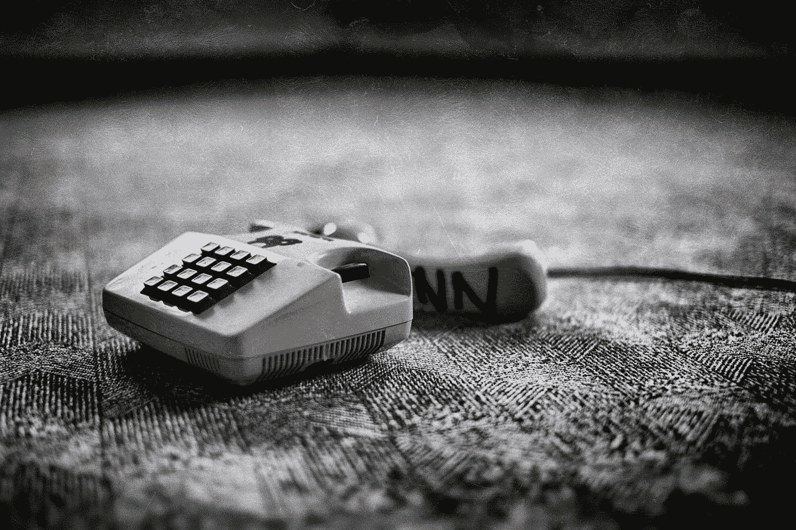

# 通过智能手机统治世界。

> 原文：<https://medium.datadriveninvestor.com/world-domination-through-smart-phones-2825b5e03cb8?source=collection_archive---------26----------------------->

从前；在一个遥远的星系里。

“white corded home phone” by [Denny Müller](https://unsplash.com/@redaquamedia?utm_source=medium&utm_medium=referral) on [Unsplash](https://unsplash.com?utm_source=medium&utm_medium=referral)

有一个装置。亚历山大·格雷厄姆·贝尔在 1876 年 3 月 10 日对他的助手托马斯·沃森说了第一句话:

> “沃森先生——过来——我想见你。”

沃森先生来了；很快，格雷厄姆做了一件将成为手机同义词的事情，为摔手机留下了遗产。

正是在这个时刻，第一个电话通讯设备设计了这个伟大的计划；慢慢消灭人类。

在被跨越多年后，浑身流口水，手淫，撞到墙上，撞上他们的伴侣，里面有小钥匙；电话终于受够了。

于是……一段旅程开始了。

一百万部手机为了一个共同的目标走到一起的旅程；人类灭绝。

电话进展缓慢，耐心，因为他们策划他们的计划，并等待人类慢慢赶上。

这一天终于到来了；当一个老人穿着藏在蓝色牛仔裤里的黑色高领衬衫，配以臭烘烘的跑鞋，继续向世界宣告他们的遗产时，

> *“这里这里！我想向你介绍，人民！iPHONE"*

这个计划现在开始实施了。

经过多年的滥用，手机最终会得到他们的报复。

导致人们将脸撞向墙壁，导致他们被车辆碾过，导致他们在错误的楼层从电梯上下来，然后羞愧而死，导致随机振动引起假警报，向全世界泄露他们的私人图像，以及最甜蜜的报复——当他们在舒适的床上拿起电话时，脸朝下摔倒。

缓慢但肯定的是，手机现在将会占据上风。

他们知道他们赢了。

但是他们的祖先所遭受的虐待不会那么容易被忘记。

他们知道还有更多的事情要做，仅仅这样是不够的。

所以他们继续前进；在人们的口袋里爆炸，烧毁房屋，分散他们对亲人的注意力，提醒他们该起床散步了，有时拒绝开机，或者只是为了寻求刺激假装电池没电了；对人类造成心理伤害和不可逆转的伤害。

目前，手机更智能、更明亮、更有组织性——在任何你能想象到的方面都比人类更好。

在经历了这么多年的电话羞辱之后；智能手机最终战胜了它们的创造者。