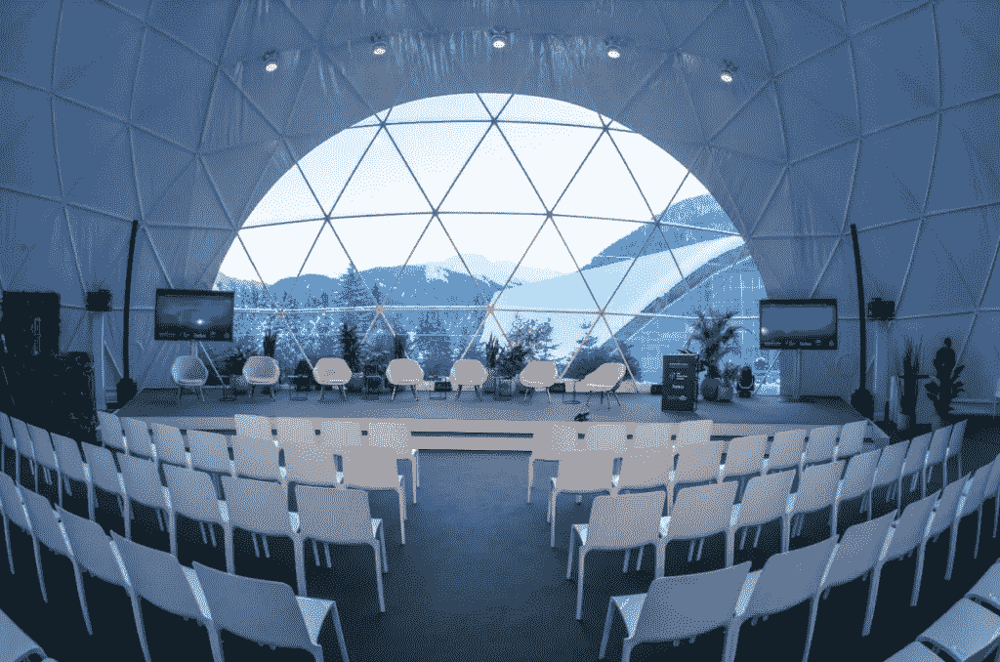
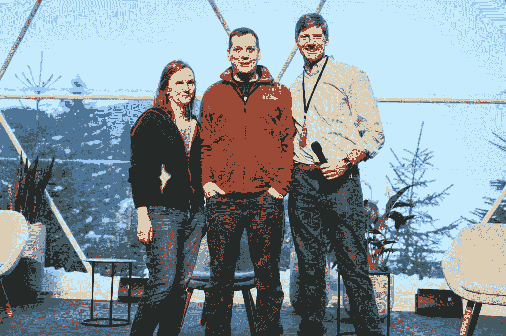
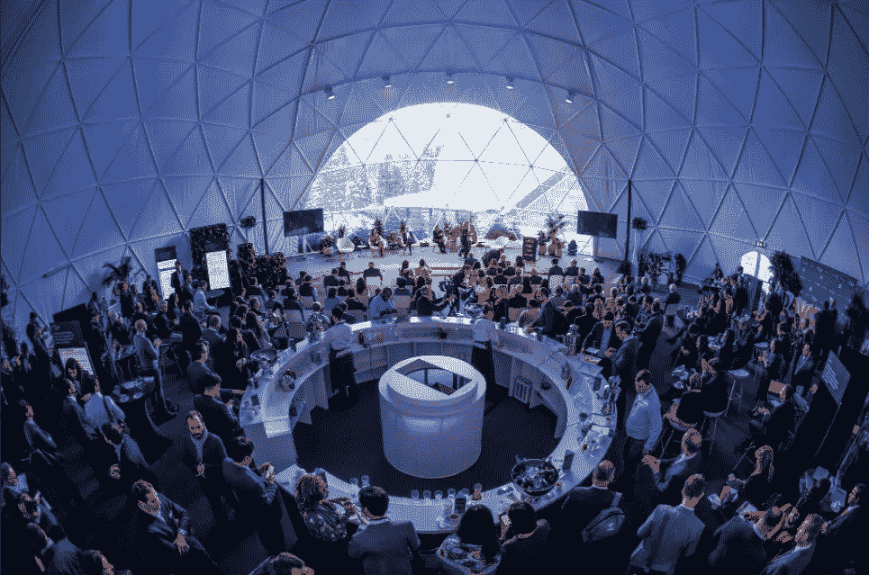
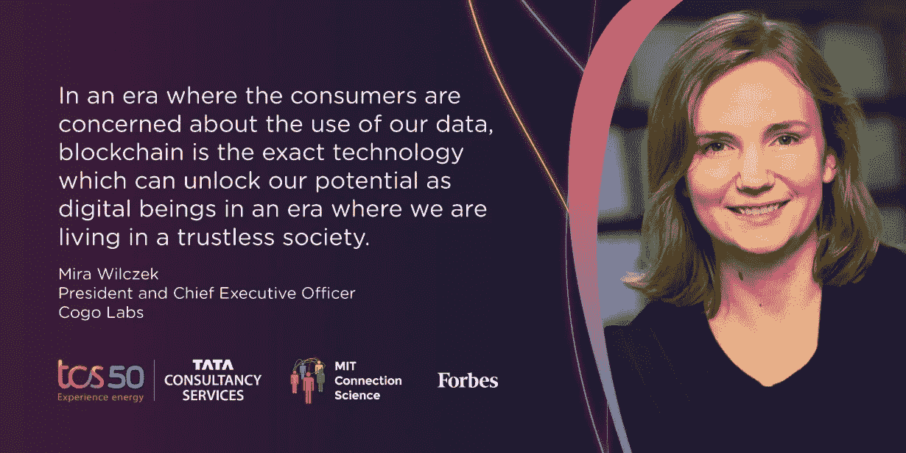
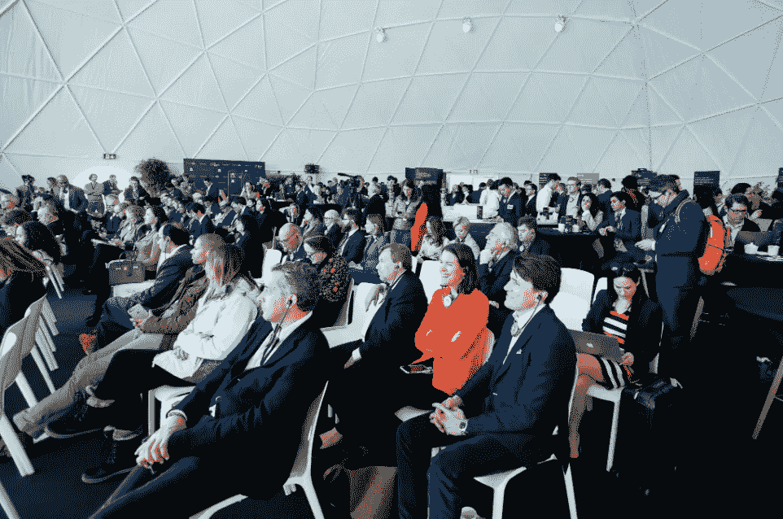

# 世界经济论坛:区块链与 Link Ventures 和 Cogo Labs 合作

> 原文：<https://medium.datadriveninvestor.com/world-economic-forum-blockchain-in-action-with-link-ventures-and-cogo-labs-5d03be558dd6?source=collection_archive---------23----------------------->

每年，世界经济论坛都将来自商界、政府、学术界、媒体和民间社会的一系列国际知名领袖聚集在一起，以加深关系，并更加合作地努力改善我们的世界。

The iconic TCS Dome [*@TCS_Europe*](https://twitter.com/TCS_Europe)

[Link Ventures](http://www.linkventures.com/) 和 [Cogo Labs](https://www.cogolabs.com/) 很荣幸参加本周在瑞士达沃斯召开的 WEF 年会。我们的企业代表正在领导会议并推动讨论，探讨数据和技术在商业和整个社会中的现实意义。

今天，[Dave Blundin](http://www.linkventures.com/team)(Link Ventures 的管理合伙人和 Cogo Labs 的联合创始人董事长&)[Mira wilc zek](https://www.cogolabs.com/person/mira-wilczek)(Cogo Labs 的首席执行官&总裁和 Link Ventures 的常务董事)[John Werner](https://www.cogolabs.com/person/john-werner)(Cogo Labs 的首席网络官& SVP 企业发展和 Link Ventures 的常务董事)将参加由 Tata Sons 董事长 Natarajan 共同主持的题为“[区块链在行动](http://blockchaininaction.org/)的会议

*Mira Wilczek, John Werner and Dave Blundin take the stage at the World Economic Forum’s “Blockchain in Action” event in Davos-Klosters, Switzerland.*

Dave、Mira 和 John 将与数十名全球参与者一起，探索这些新技术对企业和劳动力发展方式的当前和未来影响，以及互联网将继续对整个社会产生的影响。他们将主持的会议将探讨以下主题:

*Full house* [*@TCS_Europe*](https://twitter.com/TCS_Europe)

**区块链和创业公司的力量**

由 Dave 领导，这个讨论将探索创业公司利用区块链的机会(超越加密);关注数据的民主化，以及这种实践对未来企业和社会的影响。

**数据、AI 和工作的未来**

在这次会议中，米拉提出了一个问题:“在这个勇敢的新世界中，我们作为人类如何利用数据和人工智能的力量为我们自己造福，无论是作为个人还是作为一个物种？”数据和人工智能长期以来在商业和劳动力中发挥着作用，但只是在过去几年才开始成为头条新闻，因为技术进步揭示了新的机遇，同时也揭示了个人和社会的潜在风险。

Mira explains the impact potential of ‘the digital you’ [#DigitalDirections](https://digitaldirections.com/tcs-davos-live-blog-2019/)

**结束语**

作为活动的联合主持人，约翰帮助构思和策划了这次活动，召集了一批主题专家探讨诸如“机器 2 机器经济”等主题；“区块链的民主化”；以及“最隐形的人类——谁是数据中的*而不是*？”除了闭幕词，约翰将密切关注与 2018 年 5 月区块链+人工智能+人类活动相比，关于区块链、数据和人工智能的实践和观点的转变。你可以在题为[区块链+人工智能+人类:白皮书和邀请函](http://blockchaininaction.org/blockchain+AI+Humans.pdf)的白皮书中了解更多关于本次活动探讨的主题和成果。

世界经济论坛的“区块链在行动”活动汇集了数据、人工智能和区块链领域许多最聪明、最先进的头脑。下一届区块链行动峰会将于 4 月 27 日在马萨诸塞州剑桥的麻省理工学院媒体实验室举行。

[#wef19](https://digitaldirections.com/tcs-davos-live-blog-2019/)