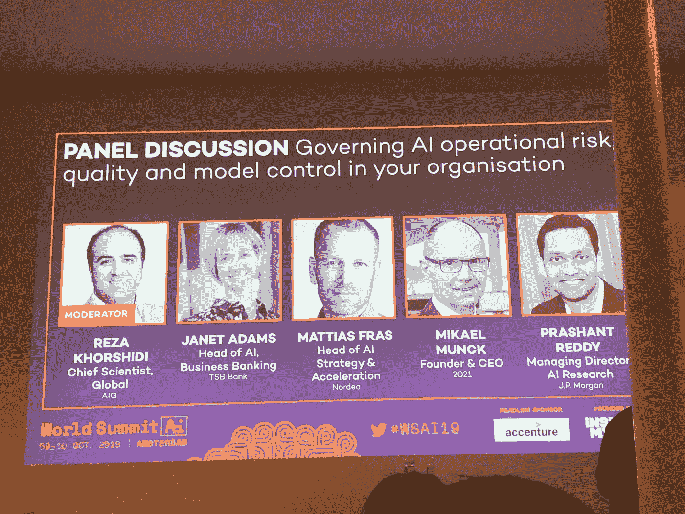

# 人工智能世界峰会:个性与理念

> 原文：<https://medium.datadriveninvestor.com/world-summit-ai-personalities-ideas-3fb857947936?source=collection_archive---------15----------------------->

嗨，这是最后一篇关于世界人工智能峰会的博文。尽情享受吧！

回顾这次活动，两个词浮现在我脑海:个性化和责任。

 [## 今年值得关注的 5 大人工智能趋势|数据驱动的投资者

### 预计 2019 年人工智能将取得广泛的重大进展。从谷歌搜索到处理复杂的工作，如…

www.datadriveninvestor.com](https://www.datadriveninvestor.com/2019/02/19/artificial-intelligence-trends-to-watch-this-year/) 

公司使用人工智能和机器学习模型来与客户建立密切的关系，并不断从他们那里收集数据，即使他们并不积极购买他们的产品。像网飞和 Spotify 这样的公司有很好的例子，比如“推荐给你”或“每周发现”播放列表。我在上一篇文章中提到的 Thread 和本系列博客 1 中提到的 Boeing(T0)都将个性化(T2)作为其商业模式的核心价值。忠诚度计划的个性化以及如何使用人工智能给每个用户更相关的确切奖励也是一个很好的例子和工具，被壳牌公司的能源计划和许多其他计划所使用。

[玛氏](https://www.linkedin.com/in/sandeepdadlani)首席数字官 Sandeep Dadlani 被评为 2019 年度首席信息官，他发表了关于收集消费者洞察以及制作尽可能与客户密切相关的广告和视频的重要性的演讲。他还强调了将需求与情感联系起来的积极影响。

品牌和零售商花费数百万美元设计广告创意、产品包装、商品陈列和店面。但是你怎么知道顾客在最初关键的几秒钟里到底看到了什么呢？Aitrak 提供了专业眼球追踪研究的所有好处，但结果只需几分钟而不是几天，让你知道人们在看哪里，以什么顺序，看了多长时间。

零售营销专家 Aitrak & expert 的首席执行官兼联合创始人 David Bailey 分享了他们的工作对视频广告的影响的一个例子。[这里有一个类似的案例研究。](https://static1.squarespace.com/static/5bba4b00d7819e6c095b2223/t/5c3366944fa51ae3f54775ae/1546872511638/Aitrak+%7C+Insight+Report+%7C+Social+Media+Content.pdf)

图片应该放在广告的右边还是左边？更大还是更小？白色还是黑色背景？巧克力棒还是吃巧克力棒的人？所有这些设计考虑因素都可以通过 Aitrak 进行分析，它会告诉你最佳选择，以及如何将你从广告带到实际购买。

Artifical Solutions 首席营销和战略官安迪·皮尔特(Andy Peart)谈到了如何从聊天机器人转向对话式人工智能。他的讲话要点包括:

*   有一个清晰的商业案例的重要性
*   将数据策略视为保险策略
*   避免线性交互；让它成为对话。
*   机器人应该识别敏感数据并使其匿名。

斯柯达已经通过其虚拟汽车设计师将这些考虑因素考虑在内，并看到转化率增加了 400%，客户参与度也增加了。再次，个性化证明是至关重要的。

Gary Marcus:被优步收购的 Geometric Intelligence 的创始人兼首席执行官，纽约大学心理学和神经科学教授。

他在世界人工智能峰会(World Summit AI)上展示了他的新书《重启人工智能》(Rebooting AI)，并阐述了人类思维的洞察力如何影响人工智能领域的主题。重启人工智能是关于我们如何建立我们可以信任的人工智能。

他坚信混合系统是实现人工智能的唯一途径。

> 一个混合系统，包括符号操作原语的*、*、*和*(连续版本)，包括显式变量和对变量的操作

# 让我们来看一下责任这个术语:

在关于金融领域人工智能的小组讨论中，Janet Adams、Mattias Frias、Mikael Munch 和 Prashant Redoy 谈到了可解释性和问责制之间的差异，以及两者如何与他们公司使用的人工智能相关。

金融是一个需要信任的行业，因此客户必须确切知道他们的数据会被如何处理。算法和人工智能用于风险评估，因此更重要的是组织内的人知道为什么算法会得出某种风险结论。

谷歌首席决策科学家 CASSIE KOZYRKOV 谈到了道德在人工智能中的重要性。

> 在这个数据集上优化这个目标。

这是她强调的一句话，意思是如果你使用别人的代码，你需要确保它和你需要的代码有 100%相同的目标和意图来满足你的目的。

个性化和责任是我从世界人工智能峰会上得到的两个词。作为一名学生参加这次活动非常丰富，因为我与人工智能领域的专家建立了联系，了解了人工智能的实际应用，并发现了我在人工智能领域的职业未来。