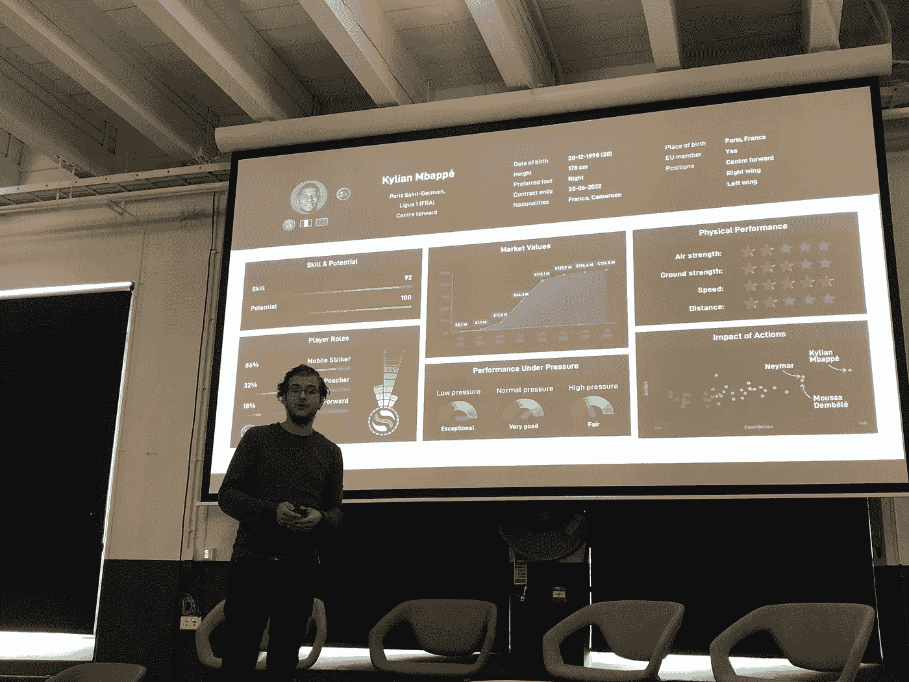
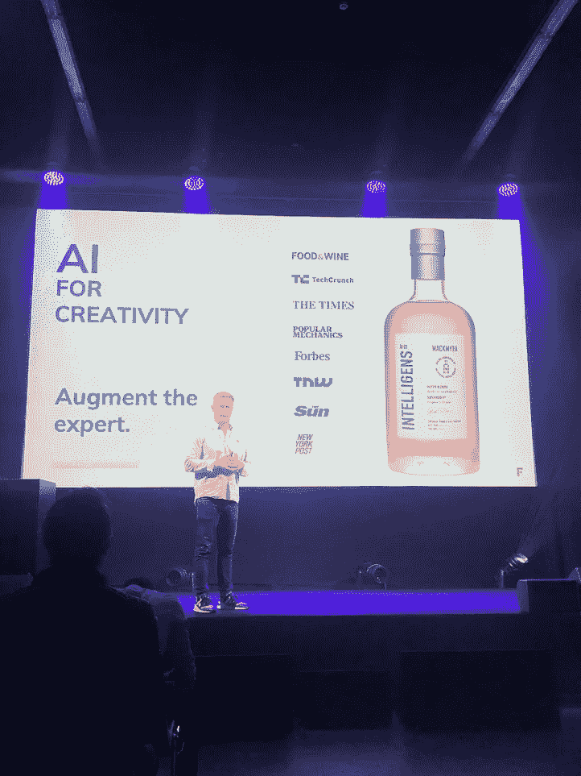
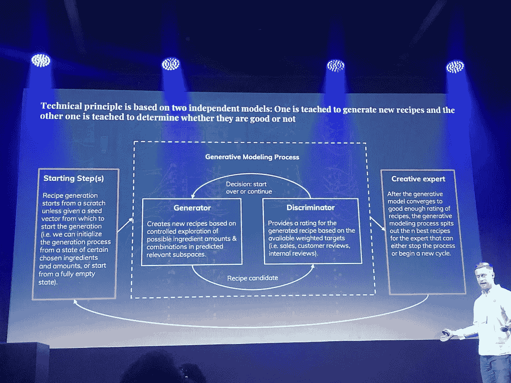

# 人工智能世界峰会:创业公司

> 原文：<https://medium.datadriveninvestor.com/world-summit-ai-startups-244e3b626eb4?source=collection_archive---------9----------------------->

在世界人工智能峰会的两天里，早期和成熟创业公司和独角兽的首席执行官们展示了他们的产品或参加了小组辩论。下面我会列出我最喜欢的创业公司，他们做什么，以及他们分享的任何有趣的信息。尽情享受吧！

Emily Foges， **Luminance** 的首席执行官，加入了“人工智能颠覆者的热门选择”的小组讨论。Luminance 始于 3 年前，现在世界各地的律师都依赖该平台来更深入地挖掘他们的数据，为他们的合同提供前所未有的洞察力和清晰度。他们正在**扰乱律师的工作**，并且已经与 170 个组织合作。

 [## 人工智能与创造力:梦想成真|数据驱动的投资者

### 人工智能总是让我着迷。不仅作为一套有用的工具，不断发展，而且作为一个…

www.datadriveninvestor.com](https://www.datadriveninvestor.com/2019/01/28/ai-creativity-deep-dream-comes-true/) 

**Thread** 是一项**根据你的风格、尺码和预算**推荐衣服的服务。它目前适用于男士时装，很快将推出女士时装。在由 H & M 牵头的 B 轮融资中，Thread 获得了 2200 万美元的额外资金，使其总投资超过 4000 万美元。

应用研究负责人爱德华·斯尼尔森强调，零售公司必须以用户为导向，真正了解他们的客户。Thread 收集了大量关于顾客喜欢什么的数据，这对服装生产商设计新系列非常有价值。

Thread 的团队有 10 名造型师，他们创造造型，并用形容词来描述这些造型。用户(现在超过 100 万)在注册时，会给出自己的特征。具有反馈回路的人工智能算法将两个特征列表连接起来，以给用户提供他们理想的外观。

**UVeye** 利用先进技术，包括专有硬件结合机器学习和计算机视觉算法，为车辆的自动外部**检查提供高端解决方案**。

他们的客户包括汽车制造商、保险公司和公共汽车服务公司。

**Squirrel.ai** 是中国首家人工智能驱动的**适应性教育提供商**。他们以实惠的价格提供个性化的&高质量的 K-12 课后辅导。目标是解决当今教育中的两个燃眉之急:传统课堂中缺乏个性化关注和教育机会分配不均。

Futurice 是一家以数字化为核心的新型创新咨询公司。在会议期间，他们组织了一个关于 10 个实际步骤的研讨会，供领导者和团队超越宣传，开始使用数据和人工智能。1 小时的网络和寻找在一家公司实施人工智能的确切方法。他们的未来驱动，包容和实验文化真的让我想在大学毕业后加入他们的团队！:)

**SciSports** 是专业足球组织的领先数据情报提供商。欧盟选择 SciSports 作为下一个欧洲独角兽之一，HYPE 基金会将该公司选为世界上最具创新性的足球公司。这个平台可以用来预测球员的出售价格，未来受伤的可能性或者与其他球员的兼容性。

Sample football dashboard. All data collected from analysing all the moves from the player throughout his games.

**CBInsights** 技术市场情报平台分析了数百万个关于风险投资、初创公司、专利、合作伙伴关系和新闻报道的数据点，帮助你今天就看到明天的机会。

一个有趣的见解是人工智能背后的公司支撑因素:

*   数据孤岛和过时的人工智能基础设施
*   害怕未经测试的技术带来的监管风险
*   反应迟钝
*   公司不知道从哪里开始。

公司为什么要扭转这种局面:

*   如果你不做，别人会做的
*   迎合不断变化的人口结构和客户群
*   提高利润并产生额外的收入流。

他们还解释了谷歌如何使用人工智能来扰乱医疗保健 3 万亿美元的行业，专注于销售和汽车所有权的个性化的重要性正被汽车共享所取代。

我最喜欢的另一个演讲是来自 FourKind 的 Jarno Kartela，他讲述了他是如何利用人工智能创造威士忌的。FourKind 是一家由实践顾问组成的公司，Jarno 谈到了我们如何利用人工智能进行创意:

回到威士忌，使用了两个模型:一个用于生成新的食谱，另一个用于确定它们是否好。这种主观意见是通过考虑专业威士忌品酒师的意见、国际威士忌奖和对先前威士忌批次的评级来建模的。确实非常有趣！

而这些只是其中的一部分！人工智能创业场景无疑是令人兴奋的，而且竞争越来越激烈。你会错过吗？作为一个公司领导认为，这些创业公司中的一个可以为我解决哪些问题？作为一名年轻的专业人士或学生，我想加入哪家初创公司来积累更多人工智能方面的经验？正如一个雄心勃勃的企业家所想的，谁会是我的新竞争对手？

AI 行业有我们大家的一席之地！很快，这个系列的博客 3，介绍了**AI 场景的重要人物**。不要错过！