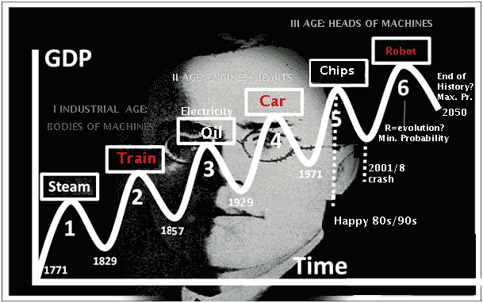

# 世界大战、经济和康德拉蒂耶夫浪潮

> 原文：<https://medium.datadriveninvestor.com/world-war-economy-and-kondratiev-waves-9ed83093f864?source=collection_archive---------0----------------------->

尼古拉·康德拉蒂耶夫是一位俄罗斯经济学家，他在 1938 年被斯大林处死，因为他反对地球的集体化，还因为他声称资本主义会卷土重来，永远不会消亡。

康德拉蒂耶夫因其著名的浪潮而闻名，这一浪潮持续了 50-60 年，由扩张、危机和收缩组成，资本主义在此基础上得以复兴。

根据 2020 年前后的分析，在第五次康德拉季耶夫浪潮的复苏中，估计会开始新的世界大战。这场战争的原因将是主要在原材料和市场上的激烈竞争，以及大国之间军事力量的多极分布。新的力量将创造新的霸权。

一些研究人员(Chase-Dunn 和 Podobnik，1999 年)认为，由德国领导的欧盟有 50%的可能性在 2020 年卷入与美国的全球军事争端，或者另一种可能性是美日战争。而沃勒斯坦(2000)认为，21 世纪欧洲和亚洲之间最有可能爆发战争。Goldstein (2005)估计战争将在 2025 年爆发，而 Boswell (1999)估计战争将在 2010-2020 年爆发。

然而，一个事实是，已经形成并仍在形成的条件使西方世界，主要是欧洲，在各个层面上承受着持续的压力。

中国和印度现在是新兴的人口大国，也是经济大国，可能还有军事大国，而西方的人口却在减少。人们认为，移民可以解决西部的人口问题和养老金制度的问题，并通过市场和房地产的增长来推动经济。

然而，没有考虑到的是，在康德拉蒂耶夫周期的衰落阶段，就像我们正在经历的以工作岗位萎缩为特征的阶段，将会有大量的失业群体(包括本地人和移民)。公共预算将负担沉重，因为提供的福利远远高于支付的税收。此外，持续的自动化导致工作岗位进一步减少，因此将会有多余的“工人”,而通过电信，技能和知识的转移现在非常容易和快速，因此不需要“本地工人”。

关于出生率，一个国家的新移民及其子女的出生率低于本地人(在加拿大和希腊观察到阿尔巴尼亚移民的进入)。西方的人口问题源于现代妇女面临的问题，与经济不安全和国家不保护母亲(托儿所、产假等)有关。)和现代关系的不稳定性(见离婚增多)。另一方面，工作环境对母亲不利。人口更新和年龄分布平稳可以给康德拉蒂耶夫周期的秋季(冬季)阶段带来一些平稳，如果妇女和一般年轻人的个人和职业生活之间保持平衡，这个目标是可以实现的。

避免康德拉蒂耶夫冬季周期重大影响的另一个解决办法是将富国的剩余资本投资于穷国，以便为它们的发展和经济增长做出实质性贡献。

也许这样，将有可能避免分析家预言的世界大战，那将是对人类的毁灭性打击。

推荐读物

蔡斯-邓恩，波多布尼克，1995 年。下一次世界大战:世界体系周期和趋势。世界系统研究杂志 1/6:1–47。

戈尔茨坦 J. 1988。长周期:现代的繁荣与战争。康涅狄格州纽黑文:耶鲁大学出版社。

沃勒斯坦一世，1984 年。经济周期和社会主义政策。期货 16/6:579–585。

互联网资源

[https://canadianfinanceblog . com/the-KONDRATIEFF-wave-tracking-the-past-or-predicting-the-future/#](https://canadianfinanceblog.com/the-kondratieff-wave-tracking-the-past-or-predicting-the-future/)
[http://www . johnbudden . com/WP-content/uploads/2016/04/OPTIMUM-ONLINE-SPRING-2016-CAN-KONDRATIEFF-CYCLES-GUIDE-us . pdf](http://www.johnbudden.com/wp-content/uploads/2016/04/OPTIMUM-ONLINE-SPRING-2016-CAN-KONDRATIEFF-CYCLES-GUIDE-US.pdf)
[http://wsarch.ucr.edu/archive/papers/c-d&hall/warprop . htm](http://wsarch.ucr.edu/archive/papers/c-d&hall/warprop.htm)
T9

