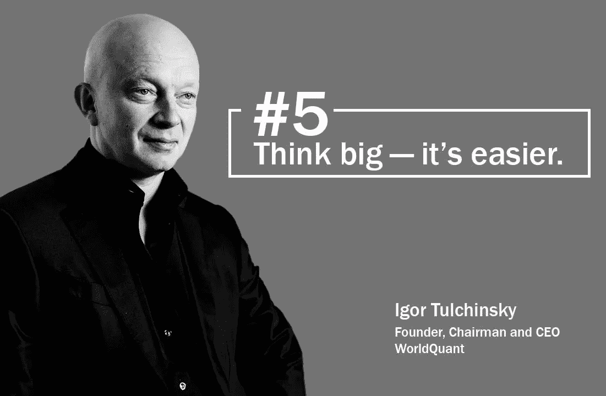
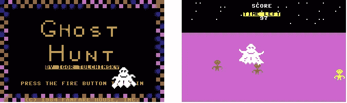
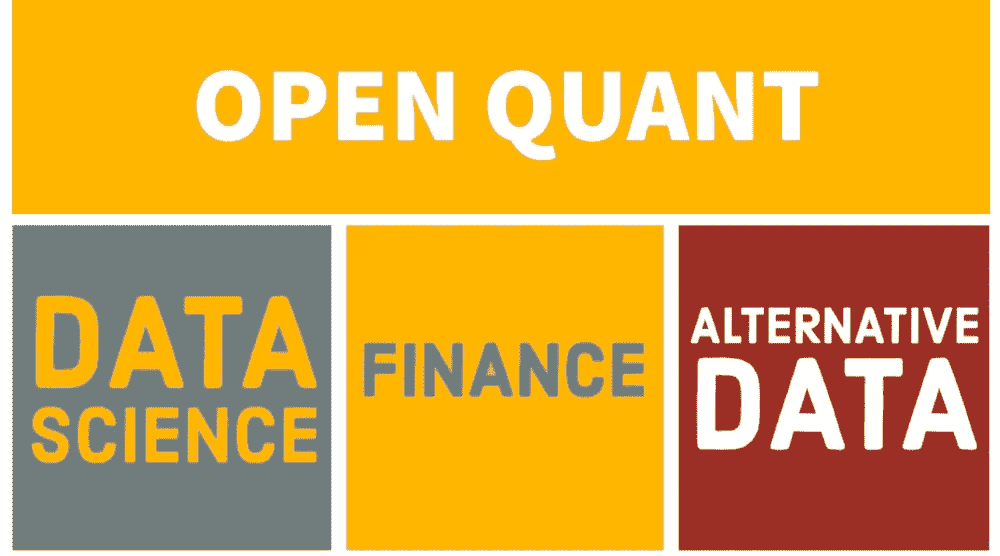

# WorldQuant 的阿尔法多样化三轴计划:从视频游戏到对冲基金

> 原文：<https://medium.datadriveninvestor.com/worldquant-aa3359f51228?source=collection_archive---------2----------------------->

Mr. Tulchinsky is WorldQuant’s Founder, Chairman and CEO. He suggests we think big — it’s easier. Image credits: [WorldQuant Careers](https://www.facebook.com/WorldQuantCareers/?tn-str=k%2AF)

Tulchinsky 先生是 WorldQuant 的创始人、董事长兼首席执行官。Igor Tulchinsky 先生以前是一名统计套利投资组合经理、风险投资家和科学家，曾经是一名视频游戏程序员，创作了令人想起 Pacman 的初级游戏。

Ghost Hunt — Created by WorldQuant’s Founder Igor Tulchinsky. [Play here](http://www.c64.cz/index.php?detailhry=22588) (site in Russian).

Tulchinsky 先生在德克萨斯大学完成计算机科学硕士学位不到 9 个月，在 WorldQuant 以其数学和系统的投资方法而闻名。

WorldQuant 宣扬系统研究的三轴计划(TAP)。攻丝的三个轴如下:

1.  想法和数据集轴；
2.  区域和宇宙轴
3.  性能参数轴。

# 想法和数据集轴

第一个轴是想法和数据集轴。创造阿尔法的方法有很多，从均值回归、动量和趋势跟踪到价值、增长和最小量。

Igor Tulchinsky 等人通过一篇题为“101 个公式化阿尔法”的论文启动了“101 个阿尔法项目”，该论文详细说明了 101 个“阿尔法”的伪代码，即可以在大量股票中计算的基于数量和价格的因素。

 [## 101 公式化阿尔法由祖拉·卡库沙泽::SSRN

### 我们给出了 101 个现实生活中的量化交易阿尔法的显式公式，也是计算机代码。他们的…

papers.ssrn.com](https://papers.ssrn.com/sol3/papers.cfm?abstract_id=2701346) 

也有许多数据集可用。最常见的是核心财务数据，如价格量数据集、公司基本面和分析师建议。最近，替代数据的出现开辟了新的可能性，个人、企业和传感器生成的非传统数据集可以用作思想和 alpha 的来源。

 [## 华尔街的另类数据之战:市场趋势、创新和销售洞察

### 市场、玩家和规则。你需要了解的是，如今华尔街出现了替代数据…

medium.com](https://medium.com/swlh/wall-street-war-alternative-data-ba3493313500) 

# 区域和宇宙轴

第二个轴是区域和宇宙。这个轴定义了策略的可交易空间。最常用的地区是美国和欧洲，亚洲最近也获得了很大的吸引力。在这个轴上，我们应该定义一个股票子集。标准可能包括:

1.  国家和地区
2.  行业和部门
3.  资产流动性
4.  监管和合规规则
5.  授权书(如风险敞口和分配)

任何一组选择都取决于研究人员试图执行的想法或由指令、监管或合规规则强加的标准。

对于国家/地区过滤，一种常见的做法是使用基础基准指数，该指数对目标国家/地区的流动性和可交易证券提供标准和透明的定义。对于行业/部门，一个常见的方法是使用基准，如 GICS 或 ICB，它们提供了广泛认可的行业分类系统。

 [## ETF 和指数基金行业 10 大排行榜

### 被动产业的崛起与崛起

medium.com](https://medium.com/datadriveninvestor/the-leaders-in-the-etf-and-index-fund-industry-in-10-images-c24a7e87cf07) 

Quantopian 提供了一个免费的选项，让你开始接触一个稳定，强大的股票宇宙，作为你的算法的基础。

 [## 量子帮助

### Quantopian 是一个免费的在线教育和投资算法创建平台。选定的算法获得…

www.quantopian.com](https://www.quantopian.com/help#built-in-filters) 

# 性能参数轴

第三个轴是性能参数。性能参数被视为分析阿尔法性能的方法，但也可以被解释为阿尔法想法的来源。这可能是阿尔法的夏普，阿尔法的回报，或提款。在寻找阿尔法想法时，目标函数的性能参数部分的定义是关键。

Axioma 是投资组合分析和投资组合优化的常用最佳解决方案的一个例子。其投资组合优化器模拟了广泛的对冲基金策略，包括长/短股票、市场中性、事件驱动、全球宏观和具有极大灵活性的基金的基金。

 [## Axioma |产品/ Axioma 投资组合/ Axioma 投资组合优化器/对冲基金经理

### 模拟各种对冲基金策略，包括多头/空头股票、市场中性、事件驱动、全球宏观…

www.axioma.com](https://www.axioma.com/products/axioma-portfolio-1/axioma-portfolio-optimizer/hedge-fund-manager/) 

# 结论

WorldQuant 的三轴计划为系统投资提供了一个简单易用但稳健的方法。虽然机器前所未有地强大，但人类仍然需要定义正确的目标函数和数据。

探访:[www.openquants.com](http://www.openquants.com)
快讯:[http://eepurl.com/gwP4Sb](http://eepurl.com/gwP4Sb)

