# 使用机器学习的全球钢铁生产

> 原文：<https://medium.datadriveninvestor.com/worldwide-steel-production-with-machine-learning-7796b423e2ea?source=collection_archive---------17----------------------->

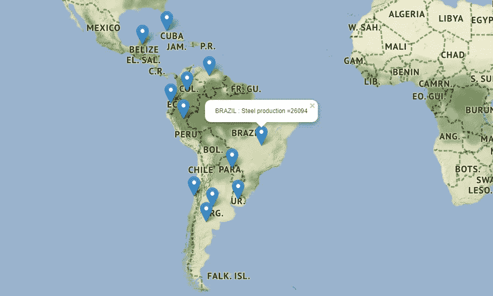

这项工作的目标是使用机器学习来分析钢铁生产。这些数据是从该专业的网站上获得的，并特别强调了南美和巴西的生产。

这些信息是在网站上收集的:

一)【http://www.acobrasil.org.br/site/arquivos/estatisticas/ 

b)【https://www.worldsteel.org/ 

c)[http://comexstat.mdic.gov.br/pt/home](http://comexstat.mdic.gov.br/pt/home)

关于 2018 年的信息是 2018 年 1 月至 10 月的真实信息，预计到 2018 年 11 月和 12 月，因为我们将在 2018 年 11 月结束。

这项工作还训练了使用 follow 包的交互式地图来呈现统计数据。我用谷歌的合作 Jupyter 笔记本来完成这个工作。完整的 python 作品在 [Github](https://github.com/MRobalinho/Steel_statistics_folium_maps) 中。

创建图表的数据源是 excel 格式的 Github(文件夹数据)。

我们去工作吧。

因为我在协作 jupyter 中，所以我用代码将文件读入平台:

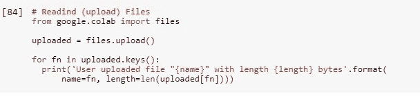

需要安装包 xlrd 来读取 excel 文件。

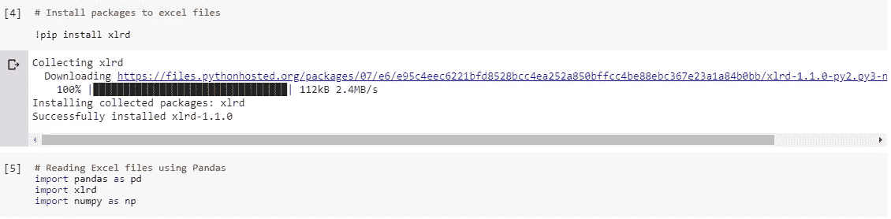

要读取的文件:

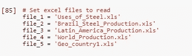

有些从 excel 中读取表格:

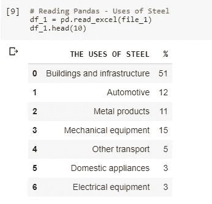

拉丁美洲产量表:

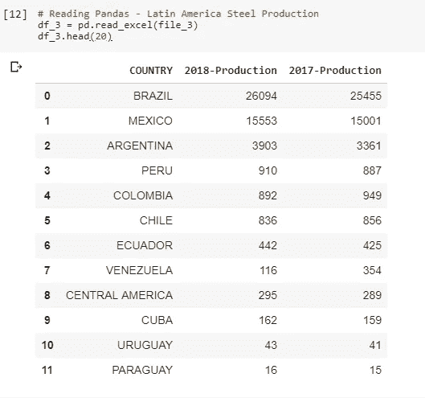

我用拉丁美洲国家的地理坐标创建了一个文件，以便在地图上绘制统计数据:

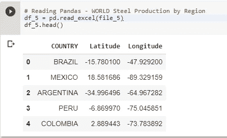

# 打印图表:

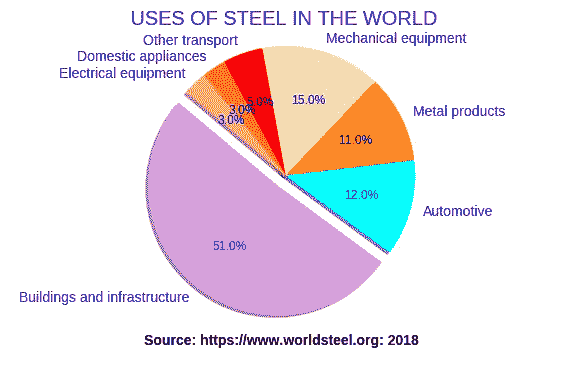

# 各地区钢产量

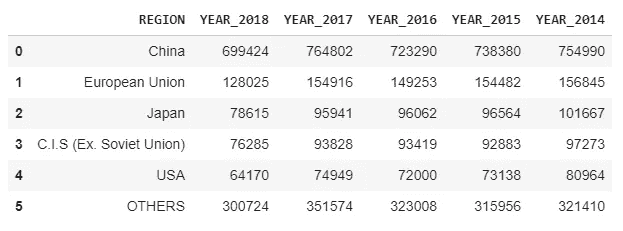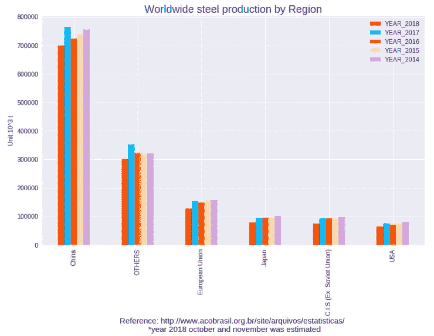

图表显示，2018 年所有市场的钢铁产量都有所下降。

对所有市场进行汇总:

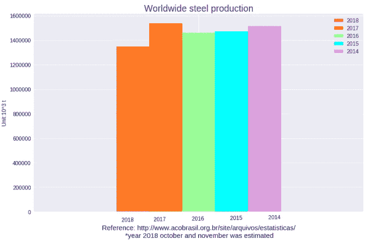

# 拉丁美洲生产

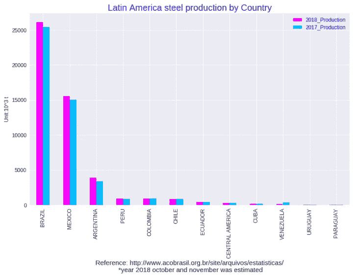

# 使用叶包创建地图

我将拉丁美洲表与带有地理数据的表进行了合并:

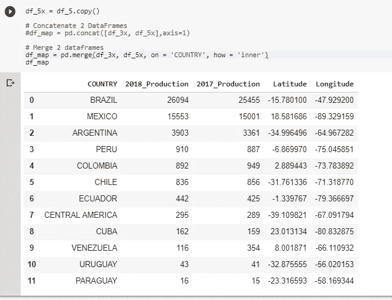

我们需要安装 follow 包来创建交互式地图:

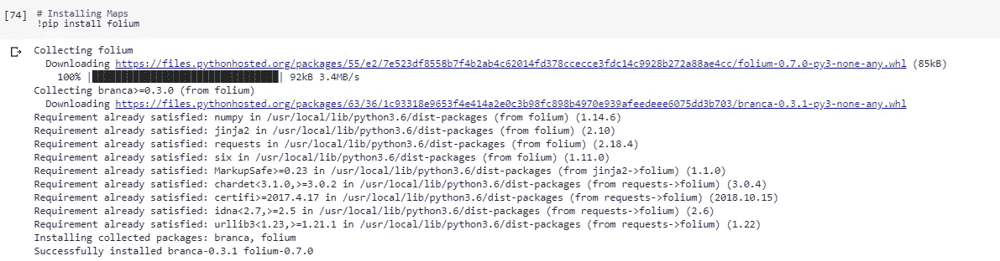

我在 dataframe 中创建了一个新的列来制作我想在 flag-mark 上呈现的 tootip。

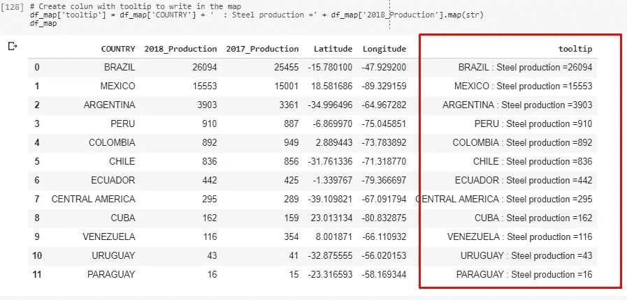

为了打印地图中的统计数据，我使用了下面的代码。我用数据框把坐标传到地图上。

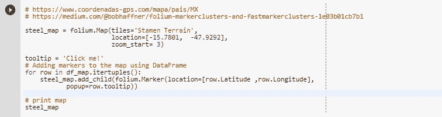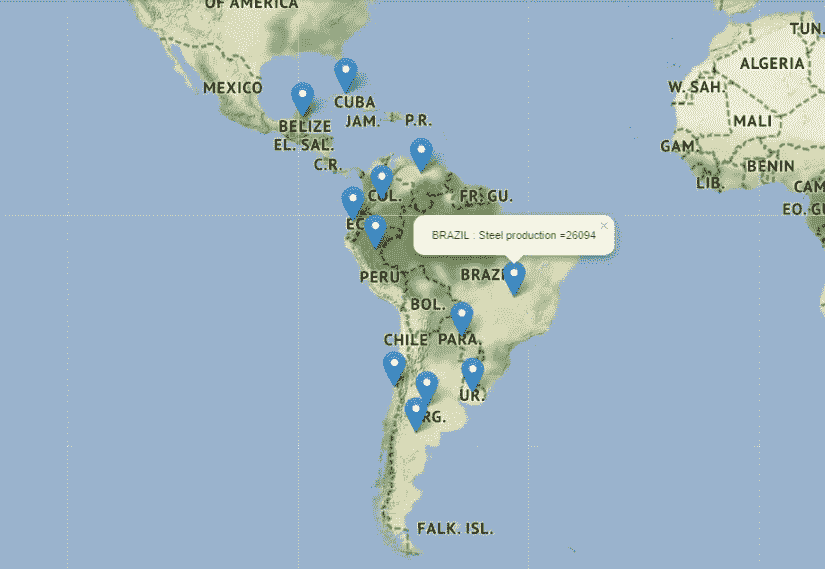

该系统创建了一个美丽的地图。当我们点击标记-标志时，系统会显示该国的名称及其钢铁产量。

# 来自巴西的钢铁产品

因为我在巴西，我们去看看这里发生了什么。

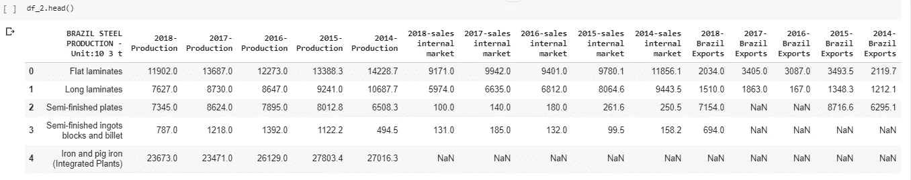

我每年都有很多关于生产和销售的信息。我制作单独的图表来探究这些信息。

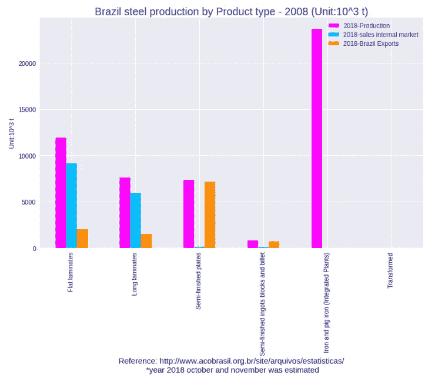

创建子集数据框以制作印刷品，在这种情况下，按年份生产:

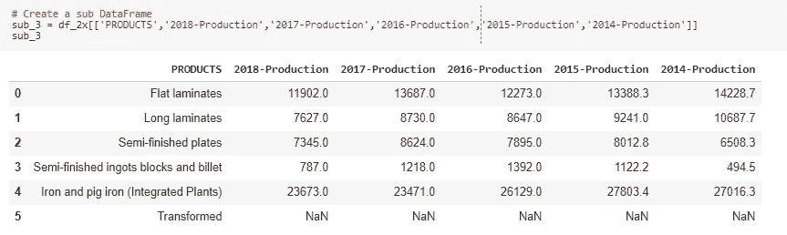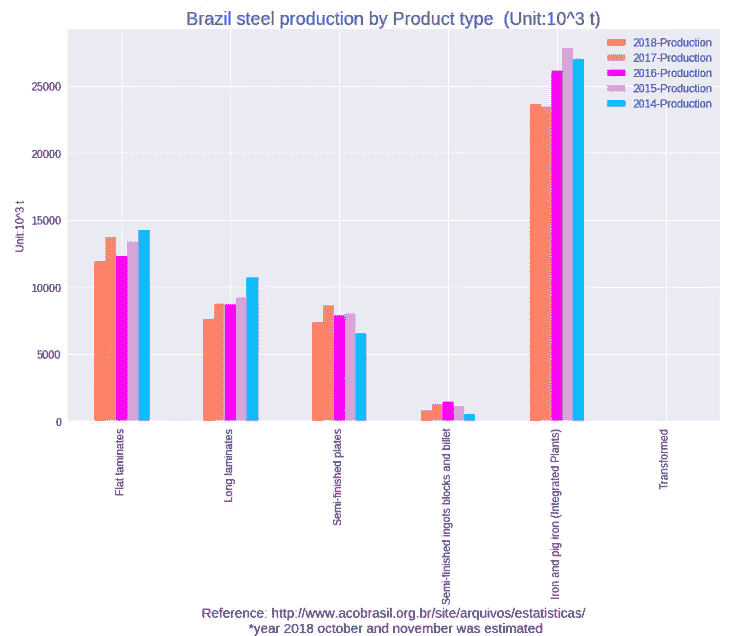

在这张图表中，我们看到了同样的趋势，即所有类型的钢铁产品在 2018 年的产量都低于 2017 年。

创建巴西钢铁销售的子集数据框架:

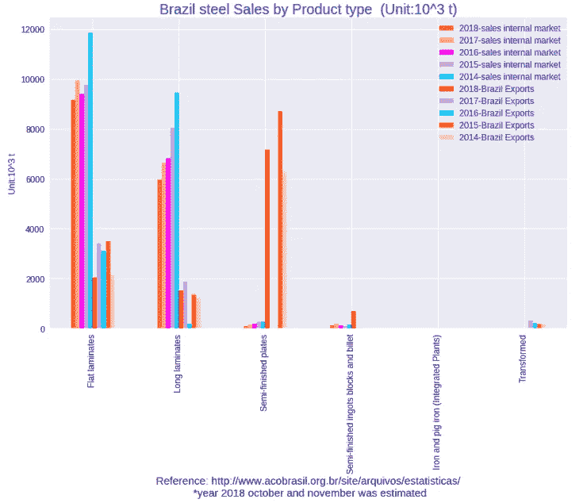

无论是国内市场还是出口，2018 年的销量都低于 2017 年。

## 结论:

在这项工作结束时，有关于钢铁生产市场的知识，巴西市场的最佳知识。在交互式地理地图上打印将是在网站上展示未来工作的一个很好的工具。