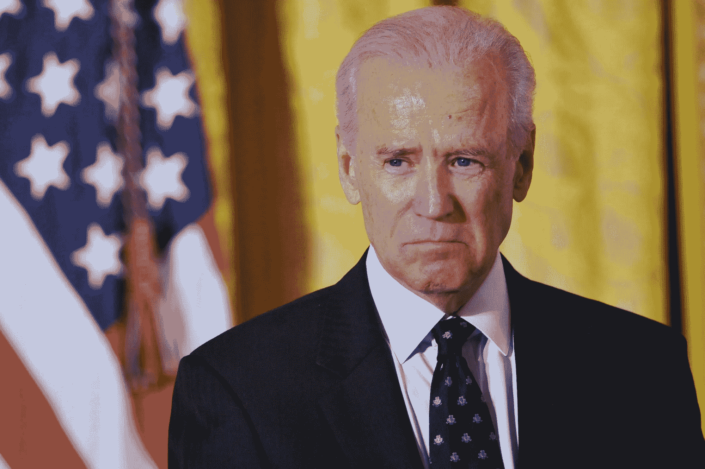

# 乔·拜登总统会拆散脸书吗？

> 原文：<https://medium.datadriveninvestor.com/would-a-president-joe-biden-break-up-facebook-45fe8f4a8961?source=collection_archive---------5----------------------->

## 新的民主试金石:监管大型科技公司

“Breaking up Facebook… is something we should take a really hard look at.”

脸书是美国唯一达成真正两党共识的政治议题之一，这是当代的一个奇迹。脸书以前被奉为增长引擎和硅谷的冠军，现在却处于一个独特的位置，被两边的活动家所憎恨。

民主党初选的早期领先者乔·拜登并不激进。但是拆分美国第五大公司的前景在这次选举结束时可能不会是一个特别激进的立场。自 2016 年大选以来，脸书的一系列失败和疏忽侵蚀了公众的信任和支持，并损害了其与该国代表之前的友好关系。扎克伯格和脸书的其他人正在迅速地、姗姗来迟地[为舆论舞台上的氧气](https://www.nytimes.com/2019/05/11/opinion/facebook-nick-clegg-chris-hughes.html)而战。

所有这些都表明，乔·拜登总统很可能在脸书未来的关键时刻上任。

## 沃伦和民主党左派

在这个问题上，民主党总统候选人中领先的是活跃的伊丽莎白·沃伦，他[在 3 月 9 日对脸书、谷歌和亚马逊发出了死刑执行令](https://medium.com/@teamwarren/heres-how-we-can-break-up-big-tech-9ad9e0da324c)。沃伦的立场(大致反映了政治左派的观点)是，科技巨头利用他们的规模“压制小企业和创新，并用他们自己的金融利益取代美国人民的更广泛利益”。

本月早些时候，脸书联合创始人克里斯·休斯发表的一篇爆炸性专栏文章《是时候解散脸书了》，点燃了围绕脸书日益增长的不安情绪。休斯提出了一个强有力的理由来解散脸书，降低马克·扎克伯格在世界上的影响力，鉴于他和马克曾经在哈佛大学共用一个宿舍，这个论点就更加引人注目了。这篇专栏文章在网上疯传，各种各样的左翼激进组织已经宣布联合反对脸书。

对脸书态度的巨大转变使得其他民主党总统候选人争先恐后。卡玛拉·哈里斯提出将脸书作为公共事业进行监管，而不是拆分该公司(尽管她仍然对此持开放态度)。相比之下，[毫不含糊地支持沃伦的立场](https://www.theverge.com/2019/5/16/18627709/bernie-sanders-democrat-facebook-break-up-elizabeth-warren-instagram-whatsapp)，批评脸书对消费者拥有*【太多权力】*【垄断社会】*。虽然一些候选人对他们的立场持批评态度，但毫无疑问，民主党阵营中的能量是恶毒地反脸书的。*

*这使得乔·拜登成为赢得民主党提名的最大热门(至少在目前的早期阶段)。众所周知，拜登是民主党主要候选人中最温和的政治直觉。迄今为止，当他被问及脸书问题时，他典型地拒绝支持任何特定的行动。但在接下来的 12 个月里，这种温和的本能将被推到边缘。沃伦、桑德斯和哈里斯将排队攻击他侧翼的领先者:拜登被认为在 2019 年与民主党基础不同步的几个领域持有政策立场。*

*甚至在第一场辩论之前，拜登的政策就已经受到攻击。他相对无力的气候变化政策草案被草根民主党明星亚历山大·奥卡西奥-科尔特斯(Alexandria Ocasio-Cortez)描述为“交易破坏者”，被一个由年轻人领导的环保组织描述为“我们这一代人的死刑判决”。拜登因其在安妮塔·希尔听证会上的[处理而受到抨击](https://www.vox.com/policy-and-politics/2019/3/27/18262482/joe-biden-anita-hill-2020-christine-blasey-ford-brett-kavanaugh)，因其在[刑事司法](https://www.vox.com/policy-and-politics/2019/4/25/18282870/joe-biden-criminal-justice-war-on-drugs-mass-incarceration)问题上的历史而受到斥责[被迫就不当触摸的指控给出一个奇怪的道歉-不-道歉](https://www.thedailybeast.com/biden-gives-bumbling-apology-as-the-view-confronts-him-on-creepy-touching-anita-hill)。还有一年的时间，各位！*

*拜登将清楚地意识到，尽管他在早期的民调中领先，但他很容易受到进步派和左派的攻击。不难想象他需要给这些团体一点甜头，也许是以强烈的反脸书政策的形式。打破脸书是一个强有力的政策立场，但它没有强有力的气候政策的巨额价格标签，而且肯定比(注定要失败的)强调刑事司法或女性生殖权利的中期竞选支点更有说服力。*

*真正抓住民主党基础能量的问题只有这么多，而(根据本月的证据)脸书现在似乎就是其中之一。如果你相信拜登最终会在至少几个核心问题上转向左派，那么有理由得出结论，分裂脸书可能是他和他的团队最容易接受的选择之一。*

## *拜登的两党梦*

*一个关键原因是，针对脸书的激进反垄断行动可能比传统民主党领域的政策更吸引拜登，如减贫、刑事司法和气候变化。这些问题都被极端政治化了，党派界限明显两极化(特朗普政府甚至不承认刑事司法或气候变化是问题)。*

*另一方面，脸书——嗯，共和党人也讨厌它。*

*需要说明的是，政治右翼不喜欢脸书的原因与政治左翼完全不同。共和党人，尤其是社会保守派，倾向于[分享一个普遍的观点](https://www.cnbc.com/2018/10/17/why-silicon-valley-cant-shake-accusations-of-anticonservative-bias.html)硅谷是一个自由的天堂，容易产生反保守派的情绪(而且[他们也不一定完全错了)](https://www.wired.com/story/tech-workers-overwhelmingly-support-democrats/)。在过去的几个月里，这种感觉特别针对脸书，在公司[从它的平台](https://www.theguardian.com/technology/2019/may/02/facebook-ban-alex-jones-milo-yiannopoulos)上移除了一系列有争议的、拥有大量追随者的保守账户之后。*

*著名保守派人士爆发出的强烈愤怒可能会让一个外行人认为脸书已经让教皇下台了:*

*这里最具讽刺意味的是，脸书“有目的、有计划地”清除保守派对左倾活动人士来说是不够有目的或有计划的，[他们现在批评平台](https://www.theroot.com/facebook-defends-decision-to-leave-fake-nancy-pelosi-vi-1835033309)拒绝删除保守派攻击南希·佩洛西演讲的视频。*

*脸书处于一个不可能的境地:自由派乞求对内容进行更多的监管，但当脸书审查任何言论(尤其是他们自己的言论)时，保守派愤怒起来。鉴于脸书试图两者兼而有之，没有人满意。没有哪个政治团体倾向于站出来捍卫脸书。*

*对脸书来说完全不愉快的情况对乔·拜登来说可能是一个主要的政治机会？这是一个在向全国发表的就职演说中誓言团结的人，他自称是团结一个分裂的美国的领袖。与沃伦或桑德斯等其他候选人相比，拜登似乎(至少在口头上)更致力于两党合作，[乐观地预测](https://www.vox.com/mischiefs-of-faction/2019/5/14/18623829/joe-biden-republican-epiphany-theory-bipartisanship-president-candidate)特朗普离开白宫后，共和党人将“顿悟”，并与民主党人合作。*

*无论拜登对共和党的这种“顿悟”是对是错(严肃地说，他不得不澄清他“不是在开玩笑”)，很明显，作为一名候选人，他将寻找机会跨越通道。脸书上个月及以后的争议为拜登的两党梦想成真提供了一个千载难逢的机会。政治右翼将认识到，拜登并不在乎失去激励他们的保守派声音，但他们肯定会支持伤害他们现在厌恶的硅谷巨头的行动。*

## *2020 年的问题*

*分裂脸书真的能解决政治左翼和右翼声称的任何缺陷吗？[很可能不是](https://www.vox.com/recode/2019/5/10/18563895/facebook-chris-hughes-mark-zuckerberg-break-up-monopoly)。但毫无疑问:攻击脸书是一种政治算计。这是沃伦的事，是特朗普的事，也是拜登的事。分手是否是最有效的政策并不重要，重要的是拜登的团队是否认为这将有助于他在 2020 年当选总统。*

*当然，这是不可能的。拜登的战略家[似乎坚持认为，他不需要任何大胆的政策来赢得民主党提名，相反，强调候选资格和经验就足够了。他们可能是对的。](https://www.politico.com/story/2019/05/15/joe-biden-slow-approach-1324592)*

*但是想象一下，拜登在一场又一场关于他的进步资历的辩论中受到抨击，在爱荷华州和新罕布什尔州的初选中表现不佳。沃伦或桑德斯可能会受到民众支持，而拜登的全国民调可能会朝着错误的方向发展。*

*我敢打赌，他的竞选看起来会有所改变。“大技术”问题的政治基础可能看起来不可抗拒。*

*例如，承诺打破脸书:*

*   *是一项易于理解的政策，同时也是一句有力的原话；*
*   *让拜登宣布他“站在美国人一边，而不是垄断者一边”；*
*   *在初选中加强了他对该党左派的进步信任；*
*   *而不冒温和派或共和党人强烈反对的风险；和*
*   *甚至给了他一个真正的两党立法的机会，这也是他的竞选口号所强调的。*

*毕竟，政治考量看起来并不那么激进。*