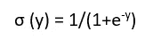
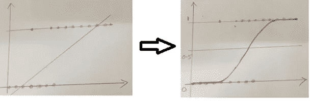
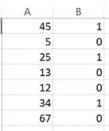

# 哇，逻辑回归也很简单！

> 原文：<https://medium.datadriveninvestor.com/wow-logistic-regression-is-easy-too-fdf6ee247349?source=collection_archive---------20----------------------->

***作者仅代表作者个人观点。这些绝不代表和/或反映他所关联的组织。***

**背景**

我看到了许多试图揭示逻辑回归复杂性的尝试，但我仍然想大胆地再尝试一次，只是想以一种简单的方式表达我的观点。

监督学习以回归和分类的形式给出了两种预测选择。线性回归在处理连续数据方面做得不错，没有任何问题。现在的问题是如何预测具有二进制或枚举输出的数据。这就是分类概念出现的地方，相关的算法被称为**逻辑回归。**

在进入算法部分之前，让我们先看几个现实生活中的例子。你可能已经看到或知道他们，但我会试着快速地触及他们。

1.  根据年龄选择保险就是这样一个例子，我们可以根据一个人的年龄来预测他是否会选择保险。输出必须是二进制的，并根据提供的输入(年龄)给出简单的是或否。
2.  另一个例子是基于申请的贷款金额或候选人的工资的贷款批准决定。
3.  如果我们再多考虑这一层，我们可以讨论多级分类，其中预测不是二进制的，而是可以是枚举列表。例如，根据所提供的温度预测是晴天、阴天还是雨天就是这样一个例子。
4.  同样，识别手写数字并将其分类为 0 到 9 是另一个这样的例子。

现在是时候坐上过山车去理解这个模型背后的直觉了。让我们从线性回归开始，尝试想象一下为什么上述例子不能通过线性回归解决，以及为什么我们需要另一个模型来解决这个问题。

**逻辑回归**

线性回归预测值可以在-∞到+∞之间变化，但是，这里的预期是将预测压缩为二进制输出，要么为是(1)，要么为否(0)，并且该值必须为正，现在的问题是我们如何转换输出以获得我们正在查看的结果。

Sigmoid 函数可以解决这一问题，常规线性回归的极高值可以轻松调整到 0 到 1 之间。公式如下

取代

1.  y as -∞将使σ接近于 0，并且
2.  y 作为∞将使σ接近 1

Sigmoid 函数通过其 S 形曲线使其从 0 到 1 平滑过渡。

随着 sigmoid 函数帮助在 0 和 1 之间转换连续变量，下一个问题将是如何将 0 和 1 之间的这些无限可能性分配给固定值 0 或 1。

这就是逻辑回归发挥作用的地方，所有低于 0.5 的值都将被视为 0，而等于或高于 0.5 的值可以被视为 1。理想情况下，正好落在 0.5 上的值可以是任何一种情况，但是我们需要在接近这个值时表明立场。

**Linear Regression transformation to Logistic Regression**

**示例** —电子邮件是否为垃圾邮件的分类，如果值(不含 sigmoid)为 20，-35，并且如果我们想知道是否为垃圾邮件的二进制答案，那么 Sigmoid 函数将在 0 和 1 之间转换给定值。

一旦值得到转换，逻辑回归将挑选线程并预测给定的输入数据是否是垃圾邮件。

让我们运行一个程序，看看所有这些是如何组合在一起的

**简单逻辑回归的 Python 实现**

这个算法可以通过 R 或者 Python 来实现。用 Python 很容易实现，有很多内置的库(有现成的函数)可供使用。

1.  Scikit-learn 就是这样一个库，它包含了大多数机器学习算法，包括回归、分类、SVM、K-Means 聚类等。
2.  这个库与其他 Python 库配合得很好，以获得整体实现。为了便于参考，下面列出了其中的一些。

a.Numpy 就是这样一个库，可以处理所有复杂的数字数据结构，包括多维数组、矩阵等。

b.Pandas 是另一个帮助数据分析和操作的库

c.如果我们想要绘制图形来可视化正在发生的事情，那么我们需要借助 Matplotlib 库

总的来说，网上有很多指导这些实现的文献。

**下面使用一个简单的 Python 示例逐步解释逻辑回归。**

问题陈述:问题是根据提供的年龄作为输入来预测保单能不能做。

先决条件:Python 设置和运行

数据**insurance classification . CSV**可以通过简单地在第一列中包含年龄和二进制值 0 或 1 来创建，这两个值表示对于给定的年龄是否投保。(以下示例)

*进口熊猫做 pd*

*将 numpy 作为 np 导入*

*从 sklearn 导入 linear_model*

*从 sklearn 导入预处理*

*df = PD . read _ CSV(" c:\ insurance class ification . CSV ")*

*x = df.iloc[:，:-1]。价值观*

*y = df.iloc[:，1]。数值*

*从 sklearn.model_selection 导入 train_test_split*

***#将数据集分成训练集和测试集(80:20)***

*x_train，x_test，y_train，y_test = train_test_split(x，y，test_size=0.2)*

*来自 sklearn.linear_model 进口物流回归*

*reg =线性 _ 模型。LogisticRegression()*

*reg.fit(x_train，y_train)*

*y prediction = reg . Predict(x _ test)****#预测测试集***

*打印(x _ 测试)*

*打印(y 预测)*

*x_test1=[[20]，[24]]****#预测随机输入提供***

*y prediction 1 = reg . predict(x _ test1)*

*打印(x_test1)*

*打印(y 预测 1)*

输出的质量可以通过 score 函数(LogisticRegression 的)来了解，score 函数可以指示预测的准确性，这可以通过下面两行代码来实现。

*ins _ accuracy = reg . score(x _ test，y_test)*

*打印('保险评分: '，ins_accuracy*100)*

**最终评论**

逻辑回归是广泛使用的机器学习算法之一，它可以帮助预测从简单的天气预报到复杂的癌症检测的任何事情。然而，我们需要小心输入数据，任何疏忽都会导致灾难性的后果，至少在生命受到威胁的情况下。