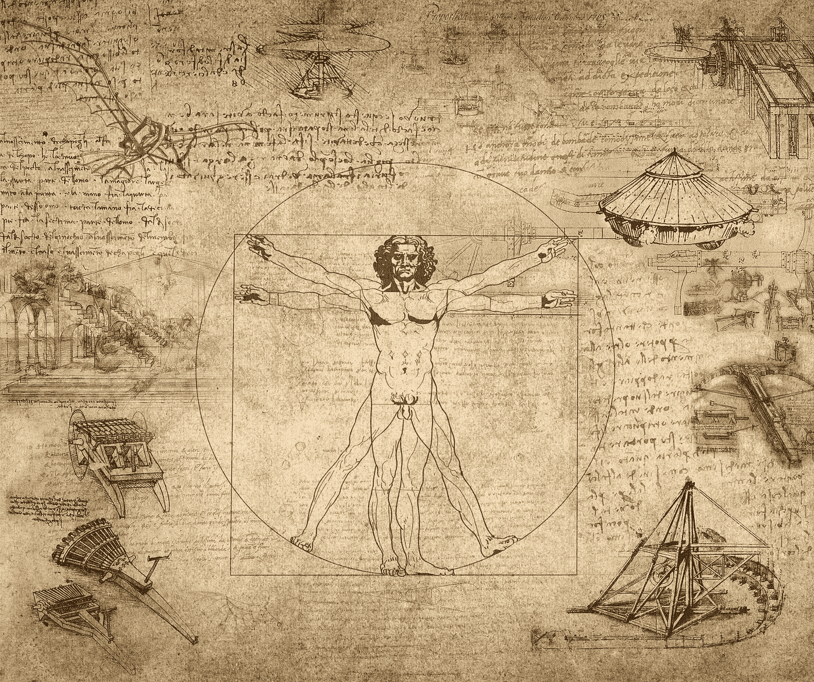

# 把一切都写下来。理论上。

> 原文：<https://medium.datadriveninvestor.com/write-everything-down-on-paper-d236cc920ab9?source=collection_archive---------20----------------------->

***“每一个伟大的想法都是从餐巾纸的背面开始的。”***

From the Journal of Leonardo DaVinci.

想法是如何代代相传的？如果没有一种永久的交流方式，所有的知识将会代代相传。写作是你每天能做的少数几件事之一，它将确保你在生活中的成功。写下来。

写作有很多好处，已经用很多不同的方式分类了，但我想写一点关于为什么你应该写下每件事，字面上的每件事。尽可能多的信息，你应该把它写下来。这将帮助你做几件事情之一。首先，它帮助你描绘你的世界。这也有助于你看清你优先考虑的事情。如果你不知道你是如何消耗你的大脑能量的，那么你是默认地过着一种生活，而不是有意地。如果你想按照自己的方式设计你的生活，你需要进入你的大脑，准确地理解你是怎么想的。通过写下每件事，你会开始看到你如何看待世界的模式出现。你会发现你在哪里欺骗了自己。你会发现哪里你的想法需要改变，哪里你感知的现实与你面前的实际现实不一致。

把一切都写下来对你的记忆和认知能力也有奇效。当你思考一条信息(关于某件事的想法)时，你正在创造新的神经通路，然后通过把它写在纸上，把它显化到现实世界中。每个伟大的想法都是从餐巾纸的背面开始的。创作过程的一部分是将想法变成现实。开始这个过程最简单的方法就是把这些想法写下来。

这里有一个激进的想法。在接下来的一周里，尽可能地在纸上写下更多的东西。不一定要有条理。不一定要说得通。只要把笔放在纸上，如果你想涂鸦和画画，去吧。试着写下你能写下的一切。我是说所有的事情，利用你所有的休息时间来动笔。你可能会认为这很傻，但在这个练习中，你会比你想象的更多地了解自己。一有空闲时间，就写下来。无论什么，让你的思想自由驰骋。也许你坐在你的办公室里，有一些时间，只是在你的世界里布置物理属性。你的墙壁是什么颜色，你的电脑在哪里，你办公室里的什么东西很久没动过了？你听到了什么？你同事的上衣是什么颜色？你有没有刚从联邦快递送来的东西，写下时间和箱子的大小？将标签复制到你的笔记本上。当你有更多一点的时间来写作时，试着重现你童年最快乐的时刻，描述这段经历，现在尝试你童年最悲伤的时刻。现在进入成年期。不要陷入编辑，语法，甚至连贯性，只要保持笔到纸上。

重点是把任何事情都写下来。如果你想记下你看到的所有车牌号，那就去记吧。没有规则。唯一的规则是在 7 天内尽可能多地写。任何事物都是唯一的法则。

这个实验之后，真正的乐趣才开始。你将开始看到你的现实中出现的模式。你会开始理解你生命中最复杂的系统，你的大脑。你会变得更有自知之明。总的来说，你会变得更加清醒。你会注意到生活中发生了更多的事情。你不会因为无聊而分心，尽管无缘无故写下别人的车牌号感觉很无聊。

我发现理解我的想法的最好方法之一就是把它们变成现实。与他们在纸上角力。只有当我们描绘出我们的大脑时，我们才开始意识到它到底有多强大。

写下一切…

关于作者: