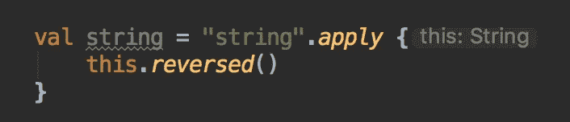

# 将您的 Android 网络编写为 Kotlin DSL

> 原文：<https://medium.datadriveninvestor.com/write-your-android-networking-as-a-kotlin-dsl-330febae503f?source=collection_archive---------1----------------------->

[](http://www.track.datadriveninvestor.com/1B9E)

Photo by [Aman jha](https://www.pexels.com/@amanjha?utm_content=attributionCopyText&utm_medium=referral&utm_source=pexels) from [Pexels](https://www.pexels.com/photo/receipt-folded-into-paper-plane-on-grass-707191/?utm_content=attributionCopyText&utm_medium=referral&utm_source=pexels)

我最近玩的 Kotlin 的一个特性是创建 DSL。DSL 代表领域特定语言，一种编写代码来解决特定问题的方法。DSL 的优点是声明性、简洁，并且很容易理解正在发生的事情。Kotlin 文档有一个使用 Kotlin 的类型安全构建函数创建 HTML 作为 DSL 的很好的例子。

作为一名 Android 开发人员，我对翻新提供的功能相当满意，但我喜欢尝试，所以我想知道我们是否可以构建一些对初学者更友好、设置更少、仍然强大且易于理解的东西。我不保证你能在下一个应用中使用这种方法，但无论如何这是一个有趣的思想实验。

## 我们希望我们的代码看起来像什么

我将稍微向后写这篇文章，因为当我把这个例子放在一起时，我就是这样工作的。我知道自己想要什么，并为此努力。我想完成的基本想法是以声明的方式使用 OkHttp 发出一个网络请求，而不失去库的任何功能或编写太多的样板文件。

What we’re trying to accomplish

就像我之前说的，我们可能不会击败改型的 API 设计，但我认为如果我们能让上面的工作，它应该会成为一个非常好的可重复模式来创建我们的服务。

## 扩展入门

扩展函数是 Kotlin 提供的一点语法糖，允许开发人员在不改变代码源代码的情况下向类添加功能。既然我们不能真的向 OkHttp 发送一个 PR 来添加只对我们有用的特性，我们可以使用扩展函数来完成这项工作。

我们将从处理同步执行函数开始。通常 execute 函数在`Call`对象上，但是上面的代码看起来像是在 OkHttpClient 对象上。为了实现这一点，我们将添加以下代码:

```
class ExecuteFields {
    lateinit var request: Request
}@Throws(IOException::class)
fun OkHttpClient.execute(init: ExecuteFields.() -> Unit): Response {
    val executeFields = ExecuteFields().*apply*(init)
    return this.newCall(executeFields.request).execute()
}
```

这个类`ExecuteFields`可能被命名得更好，但是它的概念很简单。它只是封装了我们发出请求所需的参数。由于`newCall`函数只需要一个参数，即请求，这将是我们需要添加的唯一字段。

这个扩展函数的奇怪之处在于它采用的`init`参数。这个 init 参数是一个带有 receiver 的函数类型，这意味着我们传递给 execute 的函数对一个`ExecuteFields`实例进行操作。`apply`函数完全采用该签名，因此我们可以在下面的例子中看到它是如何工作的:



`apply`函数让你在 lambda 内部对调用者进行操作，就像`this`一样。我经常看到这种模式被用来设置额外的参数，这些参数不在初始化的构造函数中。这是我们试图实现的完美用例。

现在我们有了执行调用的扩展函数，我们可以编写如下所示的代码:

```
val response = client.*execute* **{** request = Request.Builder()
        .url("https://www.google.com")
        .method("GET", null)
        .build()
**}**
```

这是一个好的开始，但不是我们想要的。我们需要在创建请求的方式上加点糖。

## 调味要求。建设者

为了创建请求对象，我们需要使用构建器模式。Builder 模式是一个完全有效的设计模式，但是一旦你开始编写越来越多的 Kotlin，就会觉得有点笨拙。我们可以使用上面的技巧来增加开发者的体验。

```
fun get(init: Request.Builder.() -> Unit): Request {
    return Request.Builder().get().*apply*(init).build()
}val response = client.*execute* **{** request = get **{** url("https://www.google.com")
    **}
}**
```

这接近我们想要的，但仍然是一个不完整的措施。这给了我们一个好听的函数名`get`，但是构建器模式期望方法调用来设置参数的事实破坏了这种氛围。我们可以用一个为我们保存一些参数的小类来解决这个问题。

```
class RequestFields {
    lateinit var url: String
    internal var headers: MutableMap<String, String> = *mutableMapOf*()

    internal var body: RequestBodyFields? = null
}
```

现在我们可以修改我们的原始函数，如下所示:

```
fun get(init: RequestFields.() -> Unit): Request {
    val requestFields = RequestFields().*apply*(init)
    val requestBuilder = Request.Builder().get()
        .headers(Headers.of(requestFields.headers))
        .url(requestFields.url)

    return requestBuilder.build()
}
```

它有点重，但是它把所有的构建器功能都集中在一个地方。它对我们的调用点隐藏了实现，并允许我们编写如下代码:

```
val response = client.*execute* **{** request = get **{** url = "https://www.google.com"
    **}
}**
```

嘣！这正是我从本文开始寻找的代码！

因为一切都是可重复的，所以我将向您展示剩余的代码是如何实现的，而无需过多的解释。如果有什么看起来不对的地方，在评论里给我指出来。从现在开始，本文的其余部分将是代码，谢谢您的关注，我们下次再见。

(一切就绪后，我决定谷歌一下是否有人已经写了类似的东西。看起来这里有一个 Github 回购[https://github.com/rybalkinsd/kohttp](https://github.com/rybalkinsd/kohttp)也有类似的做法。我们选择做一些不同的事情，回购是值得一试的。我只是想让每个人都知道，我没有用这个实现欺骗任何人。)