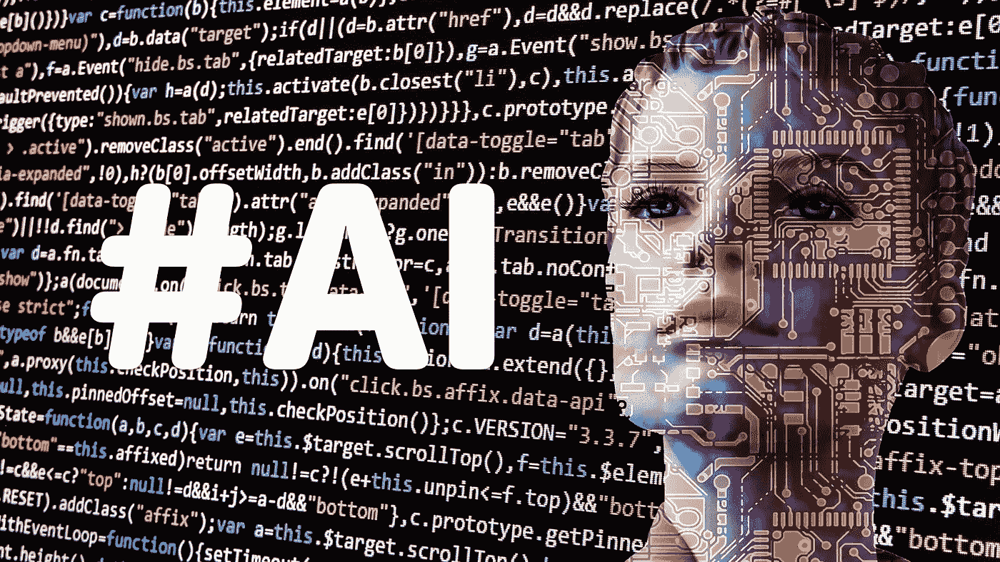
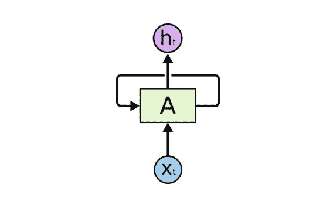

# 用人工智能写童话

> 原文：<https://medium.datadriveninvestor.com/writing-a-fairy-tale-with-artificial-intelligence-79ef7cc26fd7?source=collection_archive---------11----------------------->

你可能使用过翻译自然语言的应用程序(谷歌翻译)或者把你的语音转换成文本，比如 Alexa、Siri 或者 Cortana。企业用来提供更好的客户支持的 Facebook Messenger 机器人呢？你可能会好奇它们都是如何工作的。

所有这些应用程序都处理顺序数据来进行预测。它们与图像识别应用程序非常不同。

当你训练一个模型来预测照片中是否有狗时，你训练了一个卷积神经网络(CNN)，使用了多张有狗或没有狗的照片。你还记得这一集《硅谷》吗？

我就是这个意思！他们训练 CNN 预测照片中是否有热狗。

在这个网络中，信息只在一个方向上移动，即从输入节点向前，通过隐藏节点(如果有的话)到达输出节点。网络中没有循环或环路。这些网络主要用于模式识别。

另一方面，为了成功处理序列数据，需要使用递归(反馈)神经网络。它能够“记忆”部分输入，并使用它们进行准确的预测。它们是带有环路的网络，允许信息持续存在。这些网络在语音识别、翻译等方面非常受欢迎。

递归神经网络(RNNs)和长短期记忆(LSTM)。rnn 专门设计为通过将隐藏状态从序列中的一个步骤传递到序列中的下一个步骤，结合输入，从数据序列中学习。LSTMs 是 RNNs 的改进，当我们的神经网络需要在记忆最近的事情和很久以前的事情之间切换时，它非常有用。

RNN structure

我将根据格林童话集训练一个 LSTM 递归神经网络，然后让它根据所学内容编写新的文本。

这个网络将一次一个字符地学习文本，然后一次一个字符地生成新的文本。

比方说，我们想创作新的莎士比亚戏剧。举个例子:“生存还是毁灭”。我们将把我们的序列传递给我们的 RNN，一次一个字符。一旦经过训练，网络将通过预测它已经看到的下一个字符来生成新的文本。为了训练这个网络，我们想预测输入序列中的下一个字符。这样，网络将产生一系列看起来像原文的字符

例如，如果我们给我们的模型一个字符串 **"The Queen"** ，这个模型将以行 **"The Queen "开始文本。**让我们来看看结果的一些片段:

王后想说话，但她累了，于是他们在父亲的房子里躺下。然后他们在乡下铰接，少女说，“你将是我的麻袋！。我有一个孩子的花园！对我来说，你永远不必是任何人，但你必须受约束。啊！她会站在自己，走到她，不应该再有法院到猫，有光和谁说，“如果你没有死我的奇怪的。”

*“桌子不在城堡里，自己扔在密室里，他就是那只猫”。*

*“早上，他抓住了他。母亲说，她带着孩子，一个野生的答案去了墙，所有的炉子说，我不会带它说，啊，你不能给我什么好。国王的女儿拥有城堡里所有的孩子，还有大海，第三个说，而且必须和你站在一起。晚上好，不过，我要去布兰特姆。国王的儿子走进最漂亮的鞋子里，问他为什么要和鞋匠一起离开。他对仆人说。你想看看你的房子，认为她已经 detcind 他的床，和她的男孩和她扔他的话”。*

*“第二天被当成了秘密，她说的时候，我一点都不喜欢。当我是树的时候。很久以前这将再次带给他们。当时，她对那座山说:我们为什么生孩子呢？”*

*“从前有一块石头变成了一只小鞋子。然后他是一个妹妹，当他站起来的时候必须被打。他来找他，她已经成为他们的东西，寻找一个庭院”。*

*“在天说，‘国王的女儿永远见不到了，并且说他要去见他’。国王的儿子应该是美丽的，所以她带回家，七姐妹会看到当他带着太阳回家”。*

正如你所看到的，有时句子没有意义。但是如果你继续训练模型，改变一些参数，你会得到更好的结果！记住，这个模型是一次预测一个字符！