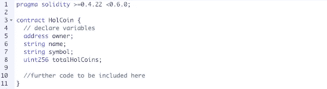
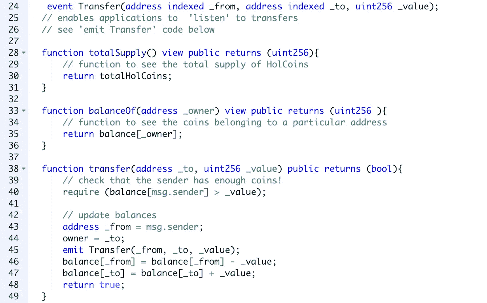

# 如何在 Solidity 中编写一个简单的令牌契约

> 原文：<https://medium.datadriveninvestor.com/writing-a-simple-token-contract-in-solidity-1c457ab25b1a?source=collection_archive---------1----------------------->

是的，你可以设计和发行你自己的可交易加密货币。请继续阅读简短介绍！

Photo by [abigail low](https://unsplash.com/photos/2M2SpKOtTh8?utm_source=unsplash&utm_medium=referral&utm_content=creditCopyText) on [Unsplash](https://unsplash.com/search/photos/money?utm_source=unsplash&utm_medium=referral&utm_content=creditCopyText)

根据以太坊网站:

> 以太坊是一个运行智能合约的分散平台:应用程序完全按照编程运行，没有任何停机、审查、欺诈或第三方干扰的可能性。
> 
> 这些应用程序运行在定制的区块链上，这是一个非常强大的共享全球基础设施，可以移动价值并代表财产的所有权。

您可以编写自己的数字令牌，这些令牌可以部署到以太坊网络上。

我在下面包含了一个非常简单的令牌契约，为此我使用了 [Remix 以太坊](https://remix.ethereum.org/)基于 web 浏览器的 IDE。

# 令牌标准

以太坊的本地货币叫做以太(ETH)。然而，任何人都可以创建在以太坊区块链上存在和运行的独特代币，只要它们满足某些最低标准。以太坊请求注解 20，或 [ERC-20](https://eips.ethereum.org/EIPS/eip-20) 可以说是最广为人知的标准，它包括了关于令牌接口的规则。它提供了转移令牌的基本功能，此外还允许令牌被批准，以便它们可以被链上的另一个第三方使用。您可能还见过 ERC-721，它与“不可替代的”令牌相关(CryptoKitties 是符合 ERC-721 的加密收藏品的一个例子)。

在这个简短的演练中，我将主要关注设置我的令牌契约的基本结构，对于这个演练的目的，我不会过多关注满足 ERC 需求。然而，如果你对发行自己的代币感兴趣，我鼓励你更深入地挖掘一下各种 ERC 提案的目标！固化文档也很有帮助。

您可以查看基于以太坊的顶级令牌合约(并探索它们的代码！)在[https://etherscan.io/tokens](https://etherscan.io/tokens)。

# 使用 Remix 编写一个简单的合同

在这一节中，你会看到我在混音版中制作的一个非常简单的合同的片段，名为“HolCoin”(你说这是个好名字？).我在合同的每一部分应该做什么上加了一些注释。用通常的`pragma solidity`文本和你想用的版本开始你的合同。命名你的契约并声明它的主要变量。

Starting a new token contract

接下来，我们将编写一个允许契约执行的构造函数。

> 合同可以通过以太坊交易从“外部”创建，也可以从实体合同内部创建。当一个契约被创建时，它的[构造函数](https://solidity.readthedocs.io/en/v0.5.3/contracts.html#constructor)(一个用`constructor`关键字声明的函数)被执行一次。
> 
> 构造函数是可选的。

这是有道理的:我们只想创造一次我们的霍尔币供应总量！

现在，我可以用我作为合同所有者的地址、一个名称(' HolCoin ')、一个符号(' HOL ')和一个总供应量(例如 10，000)来设置 HolCoin。

你会看到我还包含了一个`mapping`，它可以用来获得给定`address`的余额。(为简单起见，您可以将每个地址视为不同的用户，但实际上，需要注意的是，一个用户可以有多个地址。)这有点像使用 Javascript 对象。或者，如果您更熟悉 Ruby，映射有点像散列，其中每个命名键都是一个符号，您可以在散列中访问它。

Create a mapping and contract constructor

现在，我们已经为自己提供了一种创建 HolCoin 供应的方法，让我们继续添加一些简单的功能，这将允许外部各方与我们的智能合约进行交互。

下面显示了三个功能:

1.  totalSupply()不接受任何参数，将返回总的 HolCoin 供应量作为 uint256
2.  balanceOf(address)，将使用我们上面定义的映射返回给定地址的硬币余额作为 uint256
3.  transfer(address，uint256)，会将一定数量的硬币转移到给定的地址并返回`true`，只要调用函数的人(`msg.sender`)有足够的硬币可以发送！它还将通过发送传送的细节来告诉网络传送已经发生。

# 后续步骤

如果我真的想在以太坊区块链上发行真正的霍尔币，我需要整理现有的代码并添加功能以满足最低令牌要求。

例如，如果调用转移函数的人实际上没有足够的硬币发送，会发生什么？我可能应该将这一点传达给请求转移的人，并确保在转移没有发生时返回`false`。

为了安全，我大概应该在送币前后进行更多的验证；例如，我应该包括对溢出的检查。

我也没有在这里指定`decimals`——也就是说，我希望我的 HolCoin 令牌有多“可分”,作为一个从 0 到 18 的 uint8。此外，我可能希望能够通过“烧毁”现有令牌来减少令牌的总供应量。

为了测试你的理解，你能找出哪些关键功能还没有被包括进来吗？提示:

*   转移自
*   赞同
*   津贴

如果你已经做到了这一步，我希望这个基本介绍对你有用！我将很快跟进更多关于 Solidity 中智能合约开发的内容。