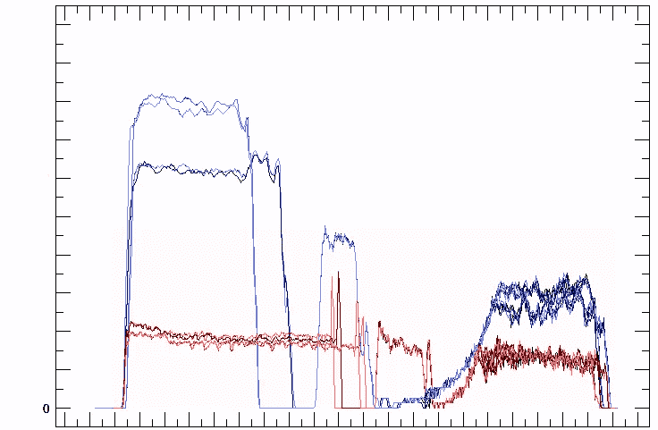
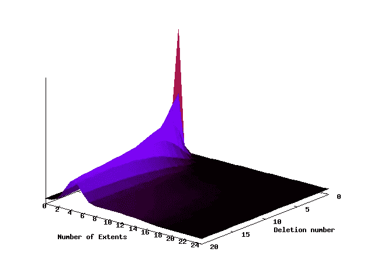
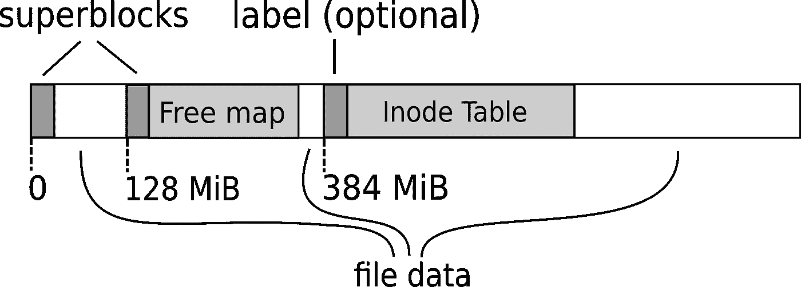
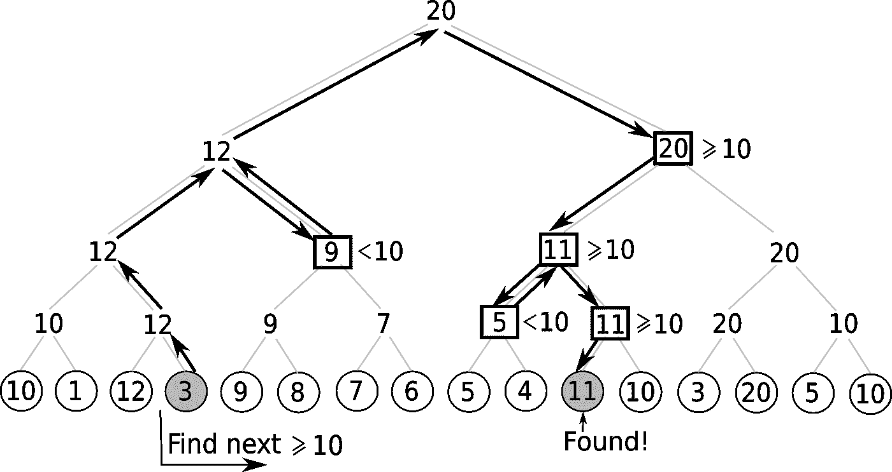
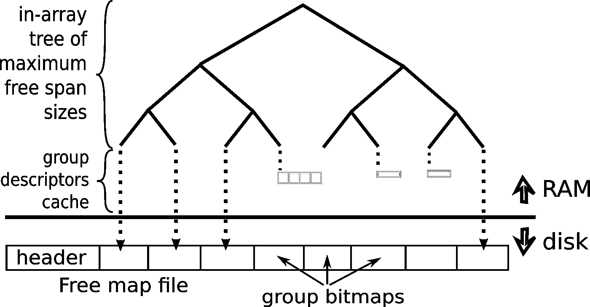
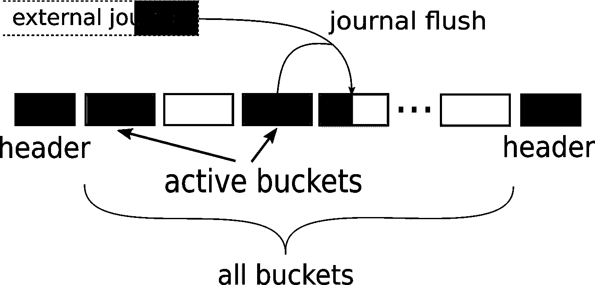

# 编写自己的文件系统可能比你想象的要容易

> 原文：<https://medium.datadriveninvestor.com/writing-your-own-file-system-is-not-as-hard-as-you-may-think-aa4af09329cd?source=collection_archive---------0----------------------->

云计算时代，分布式存储系统无处不在。但是你想过他们内部是怎么存储数据的吗？答案显然是不统一的，但让我告诉你我们在设计世界上速度最快、可扩展性最强的重复数据消除备份应用装置时的经历。

# 为什么自然的首选变成了障碍

早在 2003 年，当我们开始构建 NEC HydraStor 备份设备 [9LivesData](http://9livesdata.com/) 时，在磁盘上存储数据的明显选择是使用*ext3*——当时最流行的 Linux 文件系统。然而，我们随后在确保最佳性能和存储利用率方面的努力证明这种方法并不理想。事实证明，标准的 POSIX 文件系统可能不是最好的选择，因为它提供了许多不需要的功能，却没有提供一些我们真正想要的特性。几个例子:

*   很难准确说出 ext3 还能接受多少数据，所以防止空间不足变得很棘手。嗯， *statfs* 可以告诉我们还有多少块可用，但是猜猜会发生什么？它们也将用于[间接块](https://ext4.wiki.kernel.org/index.php/Ext4_Disk_Layout#Direct.2FIndirect_Block_Addressing)。因此，单个块追加可能会消耗设备上 1 到 4 个块，具体取决于我们追加到哪个文件。更不用说创建或删除文件时会计目录大小的变化了。祝你追踪成功！
*   ext3，像所有抗电源故障的文件系统一样，使用内部日志。然而，在 NEC HydraStor 中，我们跨多个磁盘/分区执行事务，因此我们无论如何都需要自己的高级日志。这导致了所谓的双日志记录:每次用户写操作都在我们的日志中发布一个元数据更新条目，然后在实际写操作中 ext3 再次重新记录它
    ,只有这样更新才最终被写到目标位置。是的，你可以说，元数据更新很小，但是在旋转驱动器上到处重写甚至单个 4 KiB 块都会导致严重的延迟和带宽下降，因为磁盘磁头必须经常移动。
*   我们不能告诉用户他们的数据在一个写调用返回后是持久的。即使打开带有 *O_DIRECT* 标志的文件也不能保证这一点。为了确保万无一失，我们必须在每次写操作后使用 *O_SYNC* 标志或者发出 *fsync* 调用。但是这会增加延迟。遗憾的是，一旦文件系统记录了元数据更新并刷新了数据，我们就不能告诉用户“OK ”,而不必等待应用日志。然而，没有 API 允许我们跳过它。
*   我们一般写大文件(几兆字节)，所以 ext3 对小文件的关心阻碍了我们。我们不需要将分区分成 128 个 MiB 分配组来允许大量小文件的并行分配。相反，我们更喜欢将所有数据保存在靠近驱动器开头的位置，因为它被放在硬盘盘的外缘，硬盘盘上有 ca。线速度比另一端高 2 倍。
*   当任何文件系统变满时，避免其快速老化都是一项挑战。在 HydraStor 的工作负载接近满的情况下，ext3 的碎片激增。

其他问题包括异步 I/O 中的错误(将它无声地转换为同步)，缺乏元数据完整性检查，受控单用户系统中的虚假安全功能和不必要的目录结构，扰乱性能并需要额外的 *fsync* 调用。我们还想让文件系统提供额外的特性，比如按需粉碎用户数据，这是很难实现的(至少在没有恶意攻击的情况下)。

但是本质上最痛苦的问题是缺乏控制。我们只能猜测文件系统接口下到底发生了什么，我们不能直接影响它。在这种情况下，我们如何实现一个好的块设备 I/o 资源管理器呢？我们如何在不产生大量开销的情况下跟踪碎片？

最后，我们决定面对命运，通过追求最有前途的方法来推动 HydraStor 的性能和可管理性的极限:用我们自己的文件系统层 *IMULA* (源自针对*不可变大*文件的优化)来替换 ext3。请继续收听这是如何发生的。

# 我们的探险是如何开始的

文件系统往往很庞大。因此，在有限的预算和时间范围内，从背包中丢弃不必要的东西(在我们的例子中，包括目录、文件名、时间戳、权限甚至精确的文件大小)是成功的关键。但这还不够。你需要一个好的计划。

我们的计划始于确保我们能够成功解决碎片问题，并从底层硬件中挤出大量带宽增长。总而言之，主要目标是消除磁盘的性能瓶颈，不是吗？因此，我们从设计块分配算法开始。

你会怎么做？请注意，HydraStor 的典型工作负载主要包括:

*   大型追加到几个打开的文件和
*   稍后重写以前关闭的文件(以优化它们的读取或回收未使用的数据块)，通常每个文件重写多次。

首先，您希望最小化碎片化。因此，让我们分配整个"*范围*"而不是单个块，让我们努力寻找尽可能长的范围。很好，但是你可以做得更多。您可以尝试让后续的扩展区彼此靠近，这在顺序读取时会有好处。有趣的是，在文件边界之间也是如此，因为一起写入的文件通常也会一起读取(至少在 HydraStor 中)。因此，让我们利用 [*日志结构* *文件系统*](https://en.wikipedia.org/wiki/Log-structured_file_system) 的技巧，尝试在最后一个分配的盘区之后立即分配每个新的盘区。

因此，使用这种方法，我们有两个相互冲突的目标:大范围和接近其前身的范围。怎样才能两者都达到？让我们使用几个大小阈值来解决这个问题。也就是说，我们可以首先寻找大小至少为 1024 个块的最接近范围。如果这个失败了，让我们试试 256，然后 32，最后一个单块。

但是等等！我们忘记了一个重要的优化:让数据尽可能靠近开头。因此，让我们为这个算法添加一个额外的第一步:在驱动器的某个初始部分中寻找 1024 个块的最近范围。但是“初始部分”应该是什么意思呢？

假设我们已经将所有数据重写到了分区的最开始。听起来可行吧？那么，为什么不选择总占用空间作为“初始部分”的大小呢？好吧，这会给初始部分带来几乎满分区的碎片问题。因此，为了避免这种情况，让我们将这个数量放宽到总占用块数的 120%。

根据这一推理，我们准备了一个分配算法，大致如下:

*   在大小至少为 1024 个块的当前“*分配指针*之后，在大小=总占用空间* 120%的初始磁盘部分内找到最近的盘区。
*   如果失败，在整个分区中尝试同样的方法。
*   然后在整个分区内寻找最近的空闲区，最小大小为 256 个块，然后是 32 个块，最后是 1 个块。
*   一旦找到了某个范围，记得将分配指针更新到它的末尾。

然后测试的时间到了。我们用这个分配器跟踪了一些写模式的带宽，并且手头有一个用户操作的原型实现。下面的图表显示了 IMULA(蓝色)和 ext3(红色)之间的相对比较，它们都运行在四个硬盘上。图表水平缩放至相同的时间跨度，垂直缩放为线性:

Write bandwidth comparison between IMULA (blue) and ext3 (red) on a write patterns

如您所见，我们的第一种方法比 ext3 好 2 到 4 倍，这是一个相当好的结果，不是吗？

但是它会随着时间的推移而分裂空间吗？为了检查这一点，我们模拟将驱动器填充到 99%的容量，然后随机删除 5%的数据块，用新数据重新填充到 99%，再次删除 5%，以此类推。在这种压力下，我们的新点子如何运作？让我们看看:

Distribution of the number of extents per file over time (on a nearly full device)

此图表显示了在这 20 轮删除和填充过程中，每个文件的扩展区数量的分布情况。在 20 个周期之后，我们的分配算法通常保持每个文件大约 4 个扩展区。这相当于 3 MB 的平均范围大小。考虑到这个大小足以分摊数据访问中的寻道时间，我们的第一个想法被证明非常有效。

然而，通常当你完成一个原型并开始产品化的时候，许多额外的努力会在舞台上出现。看看这对我们意味着什么。

# 填补细节

好了，我们有了一个块分配器，我们还需要实现什么来让我们的“文件系统”启动并运行呢？

首先，文件元数据必须永久保存在某个地方，以便断电后可以恢复。第二，分配器算法需要保存一些空闲区域的映射(我们称之为空闲映射)。此外，这两种结构都需要将一些摘要保存在一个超级块中，或者更确切地说是两个超级块中(针对坏扇区和更新期间断电的健壮性)。因此，我们最终得到了以下磁盘布局:

On-disk layout of IMULA

# 免费地图

理想情况下，免费地图只能在内存中工作(我们希望有小碎片，不是吗？)，但是支持从 ext3 快速就地升级的需求迫使我们将基块大小保持在 4 KiB，并为高初始碎片做好准备。幸运的是，实验表明，当使用 HydraStor 的典型工作负载时，我们新的闪亮分配器随着时间的推移减少了高初始碎片。这是一个好消息，但是我们仍然必须为陈旧的文件布局做好准备，我们必须编写代码将元数据驱逐到磁盘，至少是暂时的。因此，即使能够从顺序读取的 inode 表中重建整个空闲映射，我们仍然需要磁盘上的一些“空闲映射文件”，至少对于交换来说是这样。

知道我们需要“页面”的免费地图，我们将磁盘分成“组”。为了保持自由映射文件的大小不变，我们决定将组描述保存为自由块的位图(就像 ext3 和其他一些文件系统一样)。这导致了 128 MiB 的自然组大小，因为这是与单个位块覆盖的块数相对应的大小。

很好，但是也要注意我们分配器的直接实现不会太快。我们需要一个快速的操作来找到某个最小尺寸的最近的自由范围(在某个初始区域内，如果没有找到，就退回到开始)。没错。在位图上运行这个会迫使我们遍历整个驱动器空间。

我们解决这个问题的方法是，用一个从组内开始的扩展区数组来表示每个组，并在这些组上构建一个数组内树，每个节点在其子树中保持最大的空闲扩展区大小。此树上的典型操作如下所示:

Logarithmic search for the closest next group with a given minimum free extent size

底部的每个圆圈代表一个组中的最大空闲扩展区大小。得益于这种方法，每次自由映射遍历只需要不超过 *O(log G + g)* 的 CPU 时间(其中 G 是组大小，G 是组的数量)和最多一次 I/O 操作(如果需要，从磁盘获取一个组)。注意，我们还把我们的结构做得相当内存紧凑，这有助于在 RAM 中保存尽可能多的信息。

下面这张图总结了免费地图的设计:

High-level design of Free map

当然，一个勤奋的读者会立即发现其他一些需要解决的小问题，包括:跨多个组的范围应该如何处理，我们应该使用什么缓存回收策略，或者如何优化包含许多自由范围的组的遍历。我们不会详细地告诉你我们是如何解决每一个问题的，这样你就可以在自己解决问题时获得更多的乐趣。

现在，让我们来看看每个文件系统的下一个基石:文件元数据。

# 信息节点表

嗯，正如我之前所说的，我们不需要文件系统通常与文件相关联的大多数元数据，如精确的大小(因为它们在不同的地方被跟踪)、路径、目录、名称或扩展属性。我们所需要的只是从 32 位文件 ID 到 inode 的映射，即文件范围的简单列表。就这样。

诀窍在于映射必须是持久的:不仅在干净重启之后，而且在电源故障之后。这就是所谓的外部杂志帮助我们的地方。

为了防止断电，我们决定将“ID 到范围”映射中的每个更新立即发送到日志(为了简单起见，作为一个全新的范围列表)。但是为了不辜负该日志的热情，我们通过定期将更新的 Inode 转储到 Inode 表文件来避免在其中永久保存大量数据。

索引节点表文件通常在多 TB 驱动器上有多个 GB。启动时要读的内容相当多，所以我们决定以一种紧凑的方式保存它的实际内容。我们通过将该文件划分为固定大小的存储桶，并保持活动存储桶(即:我们必须在启动时读取的存储桶)的数量最少。注意，这种划分不像自由映射那样是静态的——每个索引节点都可以保存在任何存储桶中。事实上，它可以以不同的版本保存在其中的几个版本中。通过以正确的顺序读取存储桶，我们确保了最新的 inode 版本被作为最后一个读取。这是用数据填充存储桶的顺序，它存储在 Inode 表的头中。还要注意，过时版本的索引节点尽管保存在一些潜在的活动存储桶中，但并不会增加它们的填充量。

我们如何保持活动存储桶的数量较少？良好的..我们不得不尽可能地重复使用它们。因此，在一般情况下，当从日志刷新更新时，我们只选择填充最少的存储桶，并将其内容和新数据一起重写到新的存储桶中。为了使之成为可能，我们只需要确保一些桶被填充到最多一半，并且一个活动的桶是空的。反过来，这可以通过简单地将活动存储桶的期望数量设置为能够存储两倍的活动数据量加一的数量来实现。通过简单地在 0、1 或 2 个桶之间进行选择以与从日志转储的更新一起被重写，活动桶的集合被动态地调整到计算出的期望数量。

下面的图表显示了 Inode 表的设计。请注意重复的标头(用于在更新其中一个标头时应对电源故障):

当然，我们没有忘记在内存中缓存索引节点。我们在两个 LRU 列表上这样做(干净和脏的索引节点)，所以在一般情况下，对它们的访问很快。

这种设计的一个有趣的特性是，在我们所依赖的日志损坏或倒带的情况下，能够恢复所有文件的元数据的一致(尽管不一定是最新的)状态。

# 达到目标后

我们可以继续这个故事，详细介绍一些其他好的特性，比如从 ext3 就地升级、元数据完整性校验和、将所有元数据转储到一个 tarball 中以便于支持，或者通过跟踪要粉碎的磁盘区域来提供内置粉碎支持。实现所有这些非常有趣，不仅显著提高了我们产品的性能，而且由于更多的控制，允许更容易的行为定制和进一步的性能优化。

诚然，在我们实现 IMULA 几年后，主流文件系统如 ext4 也提高了性能，XFS 甚至赶上了我们的成果。然而，它们涉及到更多的复杂性，与我们制作的完全受控的设置相比，根据我们的工作量调整它们仍然是相当棘手的。更不用说实现定制的文件系统层特性了…

其他系统也使用这种方法。其中最著名的是 *Ceph* ，它最近推出了新的存储后端“ *BlueStore* ，作为传统“ *FileStore* ”的替代产品。

亲爱的读者，如果您碰巧也在构建存储解决方案，那么您也可以考虑实现自己的文件系统层。正如你所看到的，这并不像看起来那么困难，在我们的例子中，它带来了很多性能和控制方面的改进。我们很想看看它如何改进你的产品。

# 承认

如果没有 Marek Dopiera、micha wenicki、rafawijata、Krzysztof Lichota、Marcin Dobrzycki 和 wit old krcicki，IMULA 就不会实施得这么好，他们都对这个项目作出了贡献，而不仅仅是我。非常感谢他们所有人！

*原载于*[*【9livesdata.com】*](http://9livesdata.com)*2018 年 10 月 2 日*