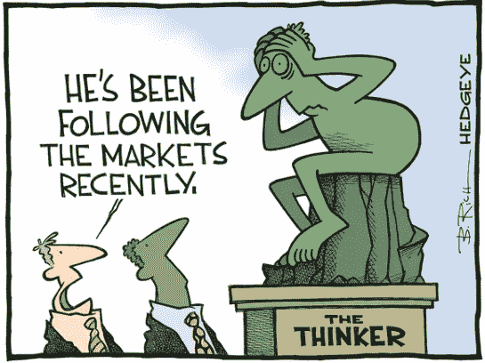
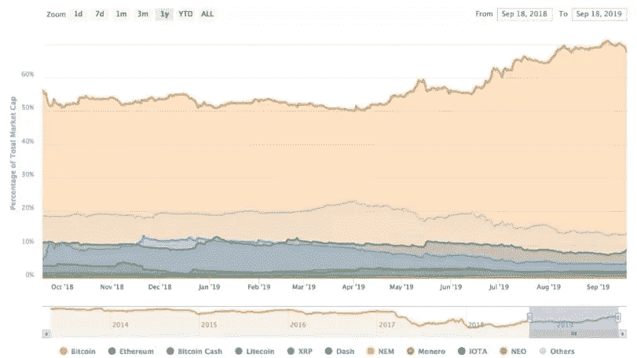
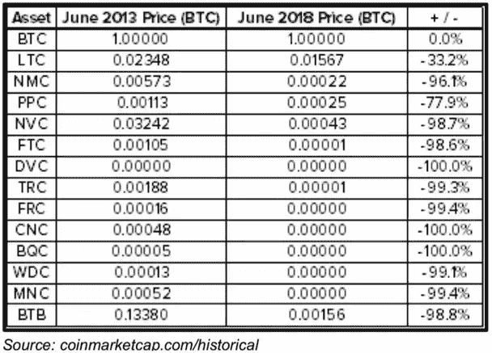
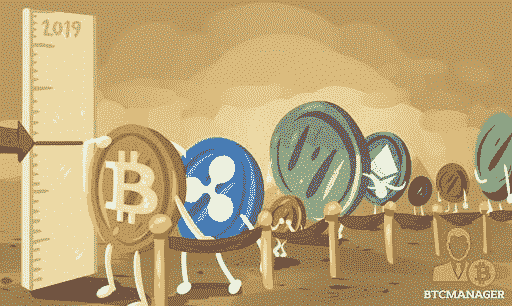
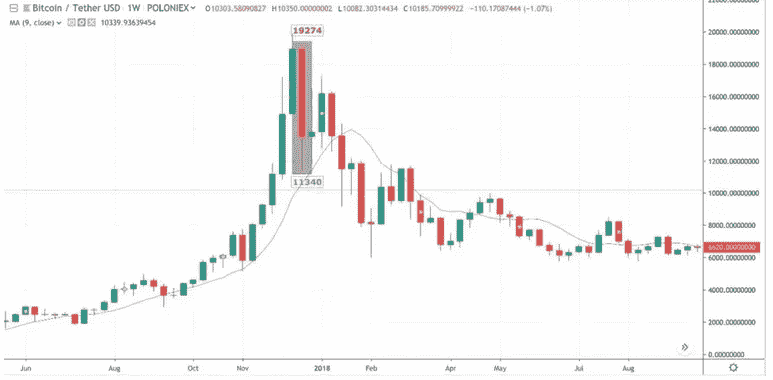
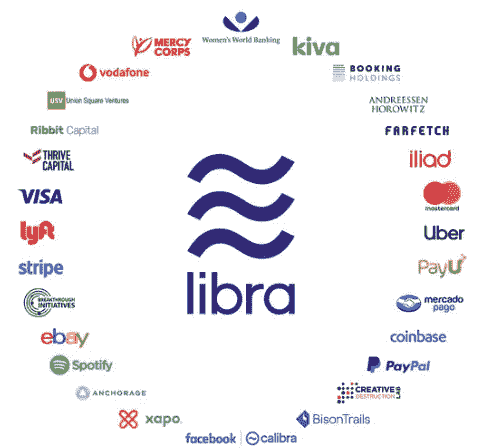
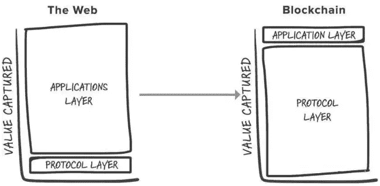

# X-Order 辩论:加密货币行业是死是活？

> 原文：<https://medium.datadriveninvestor.com/x-order-debates-will-the-cryptocurrency-industry-be-dead-or-alive-290ef110e824?source=collection_archive---------13----------------------->

*X-Order 是一家致力于研究开放金融中价值捕捉的投资和研究机构，由 Tony Tao 创立。我们努力成为新金融和与科学和研究相关的跨学科领域之间的桥梁。托尼·陶也是 NGC 风险投资公司的合伙人。*

> *“到 2020 年底，你认为代币市场的前景如何？”*

九月初，我们在 X-Order 内部就代币市场的未来进行了一场辩论。有趣的是，我们的观点分为两个对立的方面，这在讨论中引发了思想的交流。

# 核心观点

**命题**:在 2020 年甚至更久以后，代币市场的发展将会越来越积极。在这段时间内，经过结构性调整，市场会重新焕发活力，变得“更加健康”。

**反对:**除了[比特币](https://www.datadriveninvestor.com/glossary/bitcoin/)，现有的山寨币市场不仅不会变得更好，而且可供投资的机会会更少。

# 命题的论据

## 观点 1:一个好的市场是参与者变得更加理性，能够理解市场主体的价值。

好的市场有以下特征:

*   市场参与者能够**更清楚地了解市场主体的内在价值。**
*   市场可以放弃劣质的车型，并不断尝试新车型。这些新车型，经过市场的考验，会被保留下来。
*   市场上的一些价格与主体本身的公允价值一致。换句话说，这些题材的**泡沫指数相对较低**。从投资的角度来说，参与这个市场相对来说是一个不错的价值投资。

summitfc.net

加密货币行业现在正处于这个阶段。少数替代币将存活下来或在短期内变得更好，但大多数将迅速恶化。

这种情况意味着我们市场的参与者变得更加理性。这个行业的投资者可能会亏钱，但是他们在价值判断上的经验会不断提升。尽管这将是痛苦的，但市场及其参与者将随着这些经历而成长。

 [## 总部位于瑞士的 ETP 进入加密交易市场|数据驱动的投资者

### 虽然金融市场几乎没有沉闷的时刻，特别是在引入…

www.datadriveninvestor.com](https://www.datadriveninvestor.com/2019/03/10/swiss-based-etp-enters-the-crypto-trading-market/) 

## 观点二:只要有好项目，市场就会好转；市场的高度波动将继续吸引年轻人。

对 [altcoin](https://www.datadriveninvestor.com/glossary/altcoin/) 项目的一些观察如下:

**替代币价格与比特币价格不同步**

altcoins 的价格变化有自己的一套规律，和比特币并不同步。今年前 5 个月，altcoin 增速超过比特币。此后是 altcoins 的没落和比特币的大涨。

Changes in Cryptocurrency Market Share, CoinMarketCap

**大多数山寨币都是高度** [**集权**](https://www.datadriveninvestor.com/glossary/centralized/)

与比特币不同，altcoins 的价值在于集中化，也就是说有团队在做项目。因此，我们可以通过分析团队来执行项目的基本分析。

**山寨币不断被新币取代，更新迭代快**

要预测代币市场，我们不能只看一个特定的替代币或几个替代币，因为这是一个不断更新的市场。一个替代硬币的死亡不会导致市场的消亡，因为会有其他新的出现。

比如 2013 年 6 月存在的十大加密货币，现在大部分已经不存在了。替代硬币的生命周期非常短，因此没有先发优势。所以后来出现的 altcoins 更受关注。

Price Changes of the Top 10 Altcoins in 2013

**为什么 altcoin 市场会这样？**

> 1.项目团队:由后来者、梦想家、有野心的人组成，希望市场快速更新迭代，主动制造波动获取利润
> 
> 2.某些投资者的特点:对追高的恐惧和赚钱的欲望之间客观存在矛盾。比如股市，总有人不买亚马逊、苹果、茅台等的股票。相反，他们只购买一些小盘股，以期获得超额收益。
> 
> [3。兑换](https://www.datadriveninvestor.com/glossary/exchange/)(中介):对山寨币保持开放欢迎的态度。[交易所](https://www.datadriveninvestor.com/glossary/exchange/)不仅想让比特币在市场上存在，也想让其他山寨币存在。如果有必要，它还想创造自己的可交易货币。

> 因此，只要未来有好项目，市场一定会好转。

## 观点 3:只要代币市场有创新和新项目，这个行业就不会消亡。

代币市场的发展是建立在无数次失败的探索之上的，行业会不断创新进化。虽然很多还没有找到好的盈利模式，但不代表以后不会。

在互联网发展之初，情况是相似的。

在 20 世纪末，由于未能找到良好的盈利模式，互联网经济并不被看好，甚至到了互联网泡沫存在的程度。然而，在几家公司真正深入研究这个行业后，他们发现了广告收入模式，这导致了互联网经济的快速发展。

Sabirah Rayford

这个模型是基于对所有以前失败的项目的探索。所有的行业从一开始就要经历这样一个过程，才能走向成熟。所以，不能因为目前的发展不是最好的，就说代币行业处于死亡状态。

> *[*加密货币*](https://www.datadriveninvestor.com/glossary/cryptocurrency/) *产业仍在不断发展。**

*例如，2018 年有 10 个巨大项目，2019 年又有 4 个新的巨大项目。*

*即使短期价格波动巨大，即使你投资的所有货币都“死了”，行业内项目的迭代还会继续。会一直这样，直到出现一个可以和实际需求对接的主体，给市场带来真正的活力。*

# *反对派的论点*

## *观点一:代币市场风险大。当资金量较大时，最好选择稳定增长的投资策略。*

*从投资的角度来说，比特币具有一定的投资价值，而 altcoins 没有实际的长期价值。比特币的价值是如此之高，以至于全球约有 1000 万人在交易它，这意味着它拥有大量用户支持，短期内不会被封锁。ETH。*

*如果用元素的生命周期来解释比特币的涨跌，其半衰期只有 3–5 天左右。这从 2017 年底价格的暴跌就可以看出来。BTC 从将近 20，000 美元跌到 12，000 美元。很少有人能够在瞬息万变的市场中抓住这样的机会。*

**

*At the end of 2017, BTC plummeted 40% within the week it reached the high*

> **在这样的市场中，尽管回报可能很高，但相关的风险也很大。**

*这种情况甚至存在于主要的加密货币中，更不用说替代货币了。**投资替代币的风险并没有得到回报的充分补偿。***

*尽管如此，不同资本规模采取的投资策略是不同的。当持有相当数量的资本时，需要选择稳定增长的策略——稳定的收益和较小的风险。*

## *观点二:区块链技术本身有价值，但代币市场前景并不乐观。*

*主要原因如下:*

**

*NYTimes*

1.  *传统大机构的进入，比如脸书的 Libra，中国的 DC / EP，可能会带来很多**实际使用机会和传统用户。** [区块链](https://www.datadriveninvestor.com/glossary/blockchain/)技术给现代生活和金融带来便利。问题是**这些项目和传统的加密货币产业**关系不大。作为散户，我们很难参与其中。即使这些项目最终得以实施并被证明是可行的，对于代币市场目前的项目来说也是利空的。*
2.  *代币市场进入门槛低。一方面，它可以吸引创新者参与其中。另一方面也意味着任何人都可以低成本复制开源项目。再加上基本没有**没有监管**，导致骗子横行。毫不夸张的说，大部分项目并没有太大的实际价值。因此，我们必须小心谨慎，以免落入陷阱，失去所有投资。*

*在各种质量不一的项目中，有些最终会成功。我们需要做的是尽早发现并参与其中，当然，前提条件是要有良好的风险管理。*

**

*The Cagle Post*

## *观点三:短期内，代币市场没有内在价值和现金流支撑项目价格。*

*在风险偏好下降、大部分信息透支的背景下，目前市场情况如下:*

*   *以比特币为首的数字货币旨在成为价值储存手段。比特币的认可将为其他人开启新的可能性；*
*   *去中心化的应用依然**没有用户和现金流**；*
*   *没有现金流，没有用户，没有应用，大部分公链都成了无用的产品。*

*此外，依靠传统的估值方法，故事和价值在短期内不再性感。代币市场要想前进，最直接的方法就是产生现金流。*

**

*Macquarie*

*详情如下:*

*现有的 [ICO](https://www.datadriveninvestor.com/glossary/initial-coin-offering/) 项目大多依靠当时的“时效”筹集资金。虽然项目方看到了大量的资金，但投资者看到了代币的流动性溢价。*

> **短期内没有内在价值和现金流支撑其价格。**

***这就造成了两方面的错位。***

*首先是对项目本身存在误解，即商业项目和科研项目价值发现和实现的**及时性不同。***

*科技研究重视前端，商业看重后端。然而，[区块链](https://www.datadriveninvestor.com/glossary/blockchain/)的风气在于过度商业化本身就存在**政治上的不正确。**更进一步，高端的技术理想受到了更大的追捧，导致很多项目方在起步阶段就认为自己的技术非常强大，具有创新性，并没有大规模应用，因为目前的基础设施还不到位。*

*从经济模型设计的角度来看，会很难形成闭环系统。事实上，基础设施确实存在问题，但需求方面的问题更多。看看中国，4 万亿基础设施好容易建起来了，但是拉动内需花了很长时间。*

**

*World Finance*

*二是出资方的**错位。***

*说白了，在没有合适的估值体系和现金流的情况下；所谓价值投资，可以更好的理解为一种投资，因为你相信行业和团队，或者说**纵向或横向价格的比较投资。***

*如果我们看一下 fat 协议论文，可以看到一个有趣的现象——前期，layer1 公链受益于 fat 协议，后期，由于竞争激烈，理想上更兼容的 layer2 和 layer1 受益于 fat 协议甚至更多。然而，最终，它们被闲置到现在。*

**

*Fat Protocols, Joel Monegro — Aug 8, 2016*

*既然炒作概念能迅速赚钱，它的毁灭也必然会很快。随着各种概念的不同排列组合，新手接手“新概念”首当其冲的**边际效应大大降低。***

*因此，在风险偏好下降和大部分信息透支的环境下，项目方可以采取的途径有三种:继续**技术研究**和开发(适用于[以太坊](https://www.datadriveninvestor.com/glossary/ethereum/)等大型项目)，其中**价格取决于信徒数量**；玩纯粹的资本游戏，然而，这已经变得越来越困难；或者走**商业化现金流**的路子。*

*然而，在没有流动性溢价作为主要短期投资逻辑的情况下，投资者也有几个相应的方向:以**投资技术**，从事长期股权投资，不预期短期现金流；到**继续追求“盲池”**，但容量有限；或者投资能在短期内产生**现金流**的项目。*

*加密货币行业所谓的投资逻辑越来越接近传统资本。这意味着它越来越受到传统逻辑的束缚，ICO 失去了最初的**“开放、平等、无权限”**的吸引力。*

**

*Coinnounce*

# *结论*

*在这场辩论中，主张和反对双方从各自的角度讨论了自己对市场的预测。*

*命题方从**更广阔的视角**看待未来，他们认为市场会**进化，变得理性。**随着 altcoins 不断经历一个迭代过程，**有价值的优质项目**会经过筛选后出现。*

*而反对派则从投资者的角度出发，指出了当前市场存在的问题。这包括:项目的实际价值难以判断；这项技术不容易应用；没有收入模式；而且投资风险巨大。因此，他们对代币市场的未来并不乐观。*

*你有什么看法？*

# *下一步是什么？*

*下面这篇文章是我们对复杂性经济学之父布莱恩·亚瑟的采访，内容是关于他对比特币、区块链和金融市场预测的看法。*

**原载于 2019 年 12 月 12 日*[*https://www.datadriveninvestor.com*](https://www.datadriveninvestor.com/2019/12/12/will-the-cryptocurrency-industry-be-dead-or-alive/)*。**

## *在 [Linkedin](http://linkedin.com/company/xorderglobal) 上与我们联系！*

***翻译**(通过我们的微信账号):心悦*

****编辑:*** *谭**