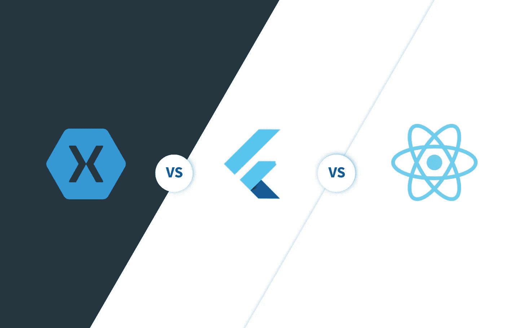

# xamarin vs React Native vs Flutter——什么最适合跨平台开发

> 原文：<https://medium.datadriveninvestor.com/xamarin-vs-react-native-vs-flutter-what-is-best-for-cross-platform-development-3e9562ca3c7?source=collection_archive---------1----------------------->

跨平台开发这个术语最近名声不好，因为确实没有技术可以处理这项工作，甚至那些说他们可以做所有事情的人，仍然对开发人员有严格的限制。由于所有这些问题，不可能证明跨平台开发的合理性，但人们继续坚持使用它，他们使用三种主要技术:Xamarin、React Native 和 Flutter。在我们比较这三者的优缺点之前，让我们先来看看为什么有人会选择这样的东西。

# 为什么选择跨平台开发

跨平台开发有四大优势:

*   **优化** **开发** —可以在各种平台上共享几乎所有的代码，这意味着大大减少了开发时间，因为你只需要开发一个应用程序，代码在操作系统之间共享，允许你进行特定的调整。
*   **It** **节省** **资金**——因为你需要更少的开发人员和更少的工作时间，你节省了大量资金，对于许多创业公司来说，这是一个至关重要的因素。
*   **只需要** **一个** **团队** **就是** **必需的**——不需要分别为 [iOS 和 Android 移动应用开发](https://skywell.software/mobile-app-development/)雇佣两个截然不同的团队。
*   **更简单的** **测试** **过程**——因为你的代码库更小，你不需要大量的测试，你可以利用节省下来的测试时间来关注应用程序的每一个元素。

既然我们已经看到了跨平台开发必须提供的所有精彩的东西，让我们比较一下使用的主要技术:Xamarin、React Native、Flutter。

# 颤动 vs 自然反应

Flutter 由 Google 创建并提供服务，它使用 Dart 和一系列其他原生小部件来创建令人惊叹的跨平台应用程序。

通过使用 Dart，不需要借助 JavaScript 连接器在本地平台和应用程序之间进行中继。虽然这有助于创建复杂的应用程序，但它确实会对应用程序本身造成影响。一般的 Flutter 应用程序占用 4.7 MB，应用程序的巨大尺寸使其成为 Flutter 框架的唯一标识符。

> [DDI 编辑精选— Flutter & Dart —完整的 Flutter App 开发教程](http://go.datadriveninvestor.com/flutter2/matf)

我们可以将这一点与 React Native 进行对比，由于其本机 UI，React Native 看起来几乎与本机应用程序相同。为了创建用户界面，所有开发人员必须做的是概述一步一步的过程，他们描述一切是如何工作的，他们需要一字不差地坚持这个过程。

上面提到的 JavaScript 连接器是一个很大的缺点，因为它会对性能产生负面影响，因为所有的用户交互都必须传递到本机平台，当然，交互越多，需要来回传递的信息就越多。即使在最先进的设备上，这也会影响性能，比如启动时间，因为连接器本身需要时间来开始工作。

与 Flutter 不同，您不应该使用它来生成复杂的应用程序，例如需要多屏幕用户和高级动画的应用程序。虽然每个平台都有其自身的局限性，但使用 React Native，您可能需要雇用对使用 React Native 有特定内部知识的人，因为否则，您将无法在内部处理所有问题。这个因素可能会吓到很多项目经理和开发人员，因为如果您需要雇用额外的帮助，项目很可能会超出预算。

# 扑动 vs Xamarin

Xamarin 为开发人员提供了许多功能，包括许多可供选择的 API、认证方法、运行时引擎和其他有用的服务和功能。它是 C#和本机平台库的组合，所有这些都整合到. NET 层中，它为开发人员提供了一个自动化测试平台，以验证您的应用程序的功能，并识别应用程序内部的任何错误或故障。

Xamarin 使用 C#，这自动将其与我们列表中的其他框架区分开来。它提供了丰富的 API，使其易于与其他硬件组件集成，从而提供更好的用户体验。Xamarin 的另一个有趣的特性是，它允许应用程序离线可用，因为这是只有本机应用程序才能做到的事情。如果你想比较 Xamarin 与本机性能，它与本机应用非常相似，这是 Xamarin 的另一个优势。

总而言之，在考虑哪个框架适合你的时候，你首先要做的是明确定义你希望你的应用程序拥有的能力，以及你目前内部拥有的人员。这些框架各有各的好处，但是它必须牺牲一些东西来实现它。在这里，你必须权衡一切，确定你愿意放弃什么，这是不容商量的。如果您正在构建一个复杂的应用程序，那么它很可能会有许多功能需要在不影响性能的情况下得到支持，因此您应该相应地对此进行规划。选择上面提到的哪种技术并不重要，因为每一种技术都将优化您的开发周期，减少测试，所有这些都将增加节约，如果您预算紧张，跨平台开发是您应该考虑的事情。

*最初发表于*[*sky well . software*](https://skywell.software/blog/xamarin-vs-react-native-vs-flutter-what-is-best-for-cross-platform-development/)*。*