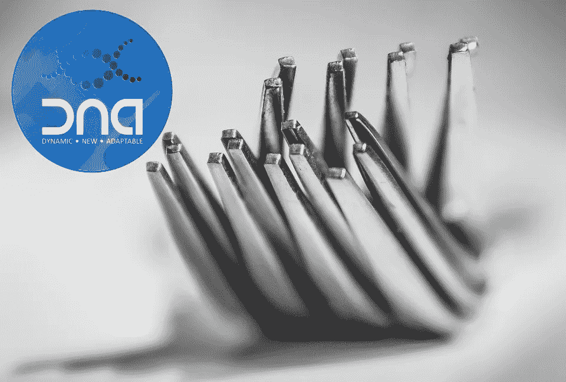
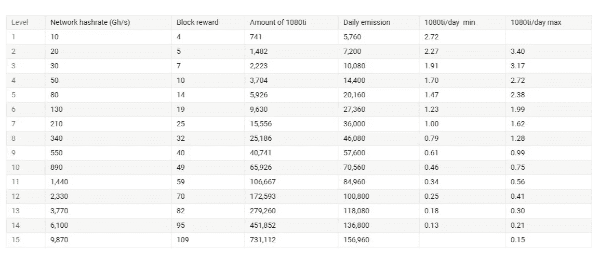
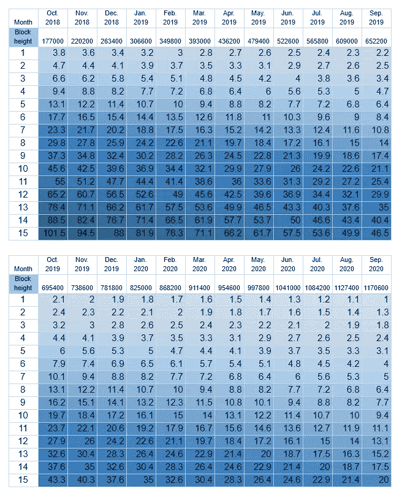
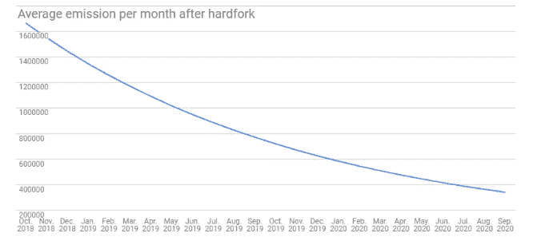
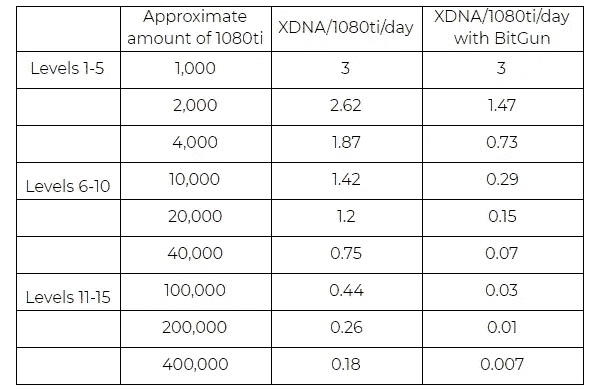

# XDNA 已经实现了硬分叉

> 原文：<https://medium.datadriveninvestor.com/xdna-soft-fork-78dd80f4e407?source=collection_archive---------36----------------------->

在加密领域，一个充满挑战的月份即将到来，因此 XDNA 团队决定通过实现 hard fork 来采纳并合并投资者的请求和技术改进。

这个分支将包括许多更改，以维护可持续、快速和安全的基础设施，这些基础设施由 masternodes 和专门的矿工根据他们自己的十六进制算法保护。

在推出十六进制算法后，BitGun 水平已经逐渐下降，而且它的复苏之路并不遥远，因为现在采矿并不那么有利可图。由于主节点的奖励很大程度上依赖于能量，XDNA 团队对当前的比特枪等级做了相应的调整:

BitGun level before fork

BitGun level after fork

块奖励值将逐渐减少，而主节点的奖励部分将增加。在 24 个月的时间里，分叉将导致所有 Bitgun 级别的奖励每月降低 7%。到这段时间结束，第一关的奖励会是 1 XDNA，而 15 lvl 的奖励会变成 20 XDNA。

这一措施旨在提高硬币的价值，因为它将逐渐变得越来越难获得。目前，在 3 年的期限内，最小的 XDNA 排放量为 7 961 400 枚硬币，而最大的为 155 390 400 枚硬币。

实施上述选项后，最小 XDNA 排放将为 5071 320 XDNA 硬币，而最大排放将降低 3 倍以上——66 216 600 XDNA！

此外，主节点部分的块奖励的百分比将增加，以防止投资回报率的下降。

Average emission of XDNA after hard fork

PoW reward per GPU

新的奖励分配如下:

52%给矿工

25%至全 MNs

15%至中等锰含量

5%至轻度 MNs

2%给 XDNA 基金会

1% —给 DevFee

XDNA 极大地限制了硬币的发行，从而阻止了市场的过度饱和，增加了投资者的利润。

还会有一些技术上的变化:

*   重新平衡锰/矿工奖励
*   MN 投票系统修复
*   小型 GUI 修复

最新消息是，XDNA 慈善平台正处于改进的最后阶段，官方子域开放:[http://foundation.xdna.io/](http://foundation.xdna.io/)

**链接:**

http://xdna.io/网站[T4](http://xdna.io/)

**Bitcointalk**https://bitcointalk.org/index.php?topic=4517612

**Github**[https://github.com/XDNA-Core](https://github.com/XDNA-Core)

**官方区块探索者**[http://explorer.xdna.io/](http://explorer.xdna.io/)

**推特**https://twitter.com/XDNA_Official