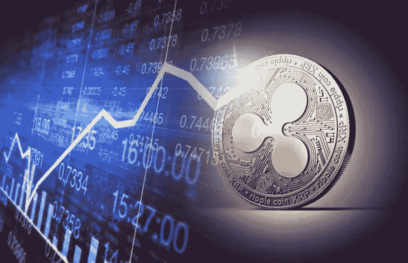

# XRP 弯曲它的肌肉——25 或 6 比 4

> 原文：<https://medium.datadriveninvestor.com/xrp-flexes-its-muscle-25-or-6-to-4-8d883ea66ed7?source=collection_archive---------23----------------------->

最近看 XRP 图表时，我想起了芝加哥的歌曲“25 或 6 比 4”，因为在 9 月 18 日早上 6 点，XRP 的价格是每枚硬币 0.26 美元，低于今年年初疯狂的 3.84 美元的峰值，当时所有东西都爆炸到了加密球的上游。

市场看起来死气沉沉，没有什么大的变化，然后，突然，就像电影里一个挂在救生机器上的死人除了一条直线外什么都没有，还抽搐了一下。首先，出现了一个小高峰，就像你在那些节目中看到的心脏再次跳动一样，然后一个又一个，直到 9 月 22 日凌晨 12 点 01 分，出现了自 1 月份以来最大的高峰，将 Ripple 的价格提高到每枚硬币 0.64 美元。由于市场的原因，它在最初的峰值后逐渐消退，但截至 9 月 26 日，它已经反弹并保持强劲。

这对你来说听起来没什么大不了的，因为 0.38 美元到底是什么，对吗？与 1 月份 3.84 美元的低迷相比，这似乎不算多，但市场的这种好转不仅仅提高了 Ripple 的价格，它创造了一个正数开始正数的环境，随着加密货币市场稍微喘息，投机开始转向。生活似乎正在回归市场，尽管 XRP 股市此后小幅下跌，但可以肯定地说，我们终于再次看到了一些积极的东西，任何积极的东西都是好的。

对于那些拥有比特币资产的人来说，这种加密货币继续统治所有其他硬币的消息是好消息，相对于其他任何替代硬币，它的市值最高的事实更是好消息。这并不奇怪，因为在熊市期间，大多数投资者会将他们的资产集中在一个集中的、最安全的地方，这就是他们在熊市期间所做的。然而；替代硬币市场终于再次升温，这对任何在加密领域拥有资产的人来说都是好消息。

以太坊也在上涨，考虑到这些天围绕这种替代硬币的所有负面影响，价格最终上升而不是下降是一个奇迹，这是大多数人习惯的。

许多人已经退出以太坊，包括玩家使用他们的平台来支持他们的各种项目，这损害了它的价格。但是，尽管如此，仍然有很多人将继续使用以太坊，人们不应该把它排除在媒体的宣传之外。

因此，看起来市场上如此多制作负面视频和发表负面观点的人，像往常一样，都是炒作，也是市场上那些每次看图表都变得负面的人学到的另一课，因为在过去的几个小时，几天，几周，甚至几个月里，没有任何积极的事情发生。

聪明的投资者知道，唯一想赢的是长期投资，只投资他们能够承受损失的资金，并等待涨跌行情明朗，直到有一天，市场将找到稳定，他们的长期资产位于那些最终成为加密货币游戏赢家的项目的顶部。

在接下来的几个月里，有一些项目即将启动，我们花了大部分时间来定位这些项目。加入[交易加密货币获利](https://cryptoinvestinginsider.com/)的行列，让未来十年成为有利可图的十年。