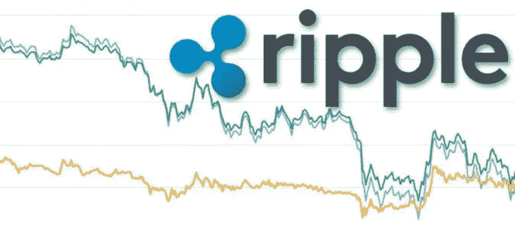

# XRP:不完全是你想的那样

> 原文：<https://medium.datadriveninvestor.com/xrp-not-exactly-what-you-think-it-is-bfcc61ae4536?source=collection_archive---------6----------------------->

一些人认为 Ripple 的 XRP 硬币将改变世界，Ripple 的市值刚刚超过 220 亿美元，是目前第三大加密货币。Ripple 在 2017 年的表现也很出色，在年底取得了巨大的业绩，以 36，000%的强劲回报率结束了这一年，并在有限的时间内，占据了市值第二的位置。

那么，为什么[不是瑞波加密货币](https://cryptoinvestinginsider.com/blog/ripples-continuing-efforts-to-buy-itself-onto-a-major-exchange-prove-to-be-futile/)呢？这种货币将席卷全球，取代所有的中央货币，成为第一种世界货币。嗯，老实说，这从来不是 Ripple 的目标，该公司目前也没有计划采取这种方式。

XRP 和其他加密货币有一些非常显著的区别。当你购买其他硬币时，你也在购买它们背后的公司，所以当你购买 BTC 硬币时，你是在购买比特币公司，并押注该公司和硬币将随着时间的推移而升值。但这不是 Ripple 的工作方式。

Opencoin，是这家初创公司在 2012 年开始运营时首次使用的名称，三年后改为现在的名称。他们的总部设在旧金山，大约有 150 人在工作，以保持公司的健康。他们的主要任务不是把他们的硬币放到市场上让每个人都可以购买，而是致力于利用区块链技术开发方便的银行软件，让银行可以进行国际转账。

Ripple 出售一种叫做 xCurrent、xRapid 和 xVia 的产品，这三种产品都是为了促进银行业的发展，这意味着他们的产品和公司并没有真正朝着去中心化的方向努力。涟漪产品线的旗舰是 xCurrent，它允许银行将资金转移到国际边界，它使用涟漪区块链来实现这一点。该软件为利用它的银行节省了大量的时间和金钱，并且对他们来说使用它没有风险，因为它不会以任何显著的方式改变他们的工作流程。该产品不使用 XRP，这意味着它不会波动，这消除了转让过程中可能的价格波动。

他们销售的下一个产品是 xRapid，旨在提高银行在新兴市场交易时的流动性。这是一种使用 XRP 代币的产品，银行喜欢使用它，因为它允许他们将堆积如山的钱投入使用，但这是有风险的，因为它用于转移资本的硬币具有不稳定性。

他们销售的最后一个产品是 xVia，这个产品在许多方面与 xCurrent 相似，并允许人们通过银行转账。该产品也不使用 XRP，如果它变得像 xCurrent 一样大，这将意味着 Ripple 的很大一部分业务将与加密货币完全无关。

Ripple 该公司与数百家银行合作，这对该公司有利，但没有一家银行使用 XRP 代币来开展汇款服务，因此，如果几乎没有人使用它，而且它几乎没有任何用途，那么 XRP 代币应该代表什么价值呢？

许多人看到了 Ripple 在银行业的成功，他们确实如此，但这是 Ripple 公司，而不是代表 XRP 标志的 xRapid 产品。不要对此感到困惑，购买 XRP 代币，认为它可能会击败比特币或取代中央货币。调整很快发生的可能性是完全可能的，对投资者来说，这意味着麻烦。

Ripple 希望取代 SWIFT，后者是目前在全球银行间转移所有资金的协会。SWIFT 在 2016 年仅赚了 3100 万美元，通过他们的网络发送巨额资金，这一次是 Ripple 的焦点。正如你所看到的，这不是 XRP 成为世界货币所需要的商业机会。

Ripple 在可以在世界各地转移资金的软件市场上也有竞争，他们的主要竞争对手是 R3，R3 拥有与 Ripple 完成相同操作的软件。不同之处在于，也可能是为什么在银行界之外没有人真正听说过他们，因为他们没有一枚硬币可以提供。但是他们现在在世界上最大的 70 家银行里。

另一方面，SWIFT 与超过 11，000 家银行实体合作，每天有超过 2600 名员工在全球范围内转移资金。显然，如果他们愿意，SWIFT 可以开发自己的区块链，并利用其业务联系来推广。如果他们能比 Ripple 更快地扩大用户范围，这对 Ripple 公司来说是个坏消息。

Ripple 拥有约 60%的 XRP 硬币，并锁定了其中超过 550 亿枚。如果你是一个投资者，这应该让你有点担心，因为你现在只有涟漪的话，任何硬币将很快被释放购买。他们承诺将连续 55 个月在市场上投放 10 亿枚这样的硬币，他们显然会通过这样做获得巨大收益。然而，这会转化为投资者的钱吗？

监管的可能性也可能给 Ripple 带来问题，它们面临着与早期硬币一样的问题，因为它们与中央银行相连，所以失败了。即使 xRapid 被银行大量采用，硬币的价值只有通过持有这些硬币才能增加，这一事实对加密货币投资者来说是一个问题。银行不想持有这些硬币，因为它们无法应对波动性，这将导致市值大幅下降。

因此，投资者似乎应该考虑 XRP 根深蒂固的问题。XRP 要想成为真正重要的国家，很多事情都必须走上正轨。Ripple 是一家伟大的公司，拥有伟大的产品，可以在没有加密货币帮助的情况下让公司飞得更高。虽然这对该公司可能意义重大，但这不一定是 XRP 普通投资者想听到的。当然，这完全取决于你这个投资者。

*原载于 2018 年 6 月 14 日*[*【cryptoinvestinginsider.com*](https://cryptoinvestinginsider.com/blog/xrp-not-exactly-what-you-think-it-is/)*。*

