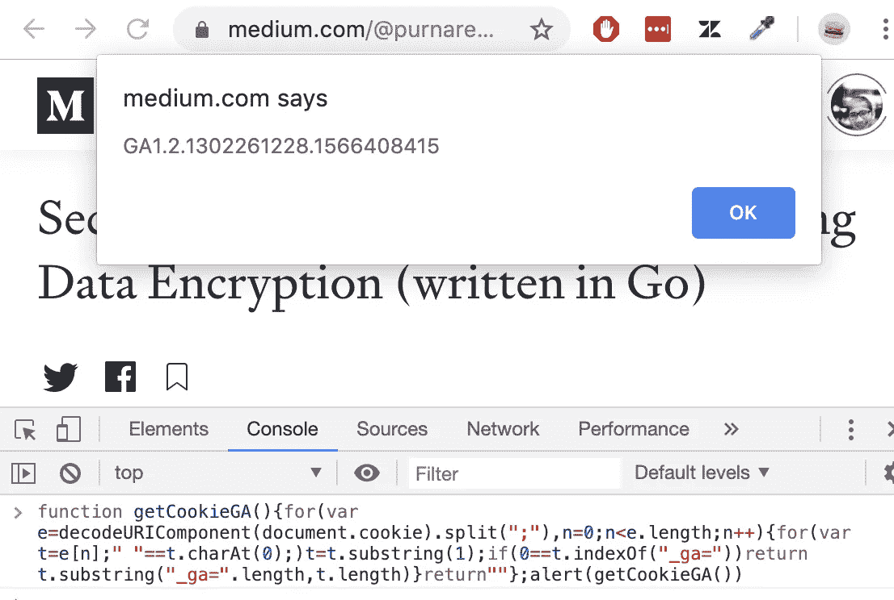
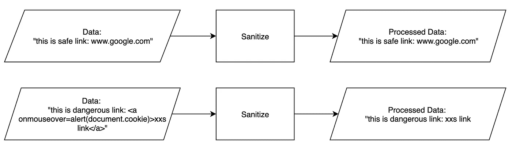
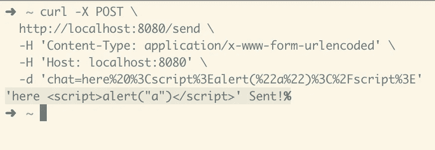
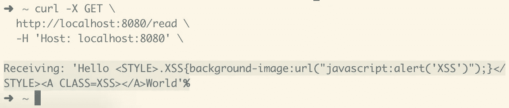
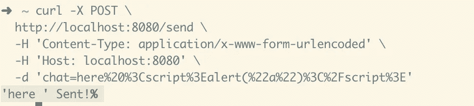
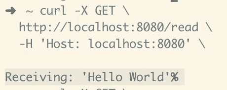

# XSS 解释了如何保护你的顾客

> 原文：<https://medium.datadriveninvestor.com/xss-explained-and-how-to-protect-your-customers-written-in-go-3775bd4cade7?source=collection_archive---------2----------------------->

## 当您的客户因为您系统中的漏洞而成为网络攻击的受害者时，您企业的声誉将荡然无存。


Photo by [Clint Patterson](https://unsplash.com/@cbpsc1?utm_source=unsplash&utm_medium=referral&utm_content=creditCopyText) on [Unsplash](https://unsplash.com/s/photos/hacker?utm_source=unsplash&utm_medium=referral&utm_content=creditCopyText)

**目标**

本文的主要目标是保护客户免受网络安全攻击。作为平台提供商(社交媒体、新闻门户、市场等)，我们有责任确保每位客户在使用我们的平台时都是安全的。

**问题**

XSS 是一种容易实施的攻击。攻击者通常已经准备了数十个攻击载荷(弹药)。然后，它们将在每个可到达的端点中使用有效负载。成功的攻击可能导致登录会话接管等严重事件。

**XSS 是如何工作的？**

几乎所有网站都运行 JavaScript (JS)。按照设计，JS 会执行作用域(网站域)内的任何 JS 脚本。所有漂亮的动画和媒体播放器都可以在网站上运行，这要感谢 JS 运行了那些令人敬畏的脚本。

[](https://www.datadriveninvestor.com/2019/01/23/which-is-more-promising-data-science-or-software-engineering/) [## 数据科学和软件工程哪个更有前途？数据驱动的投资者

### 大约一个月前，当我坐在咖啡馆里为一个客户开发网站时，我发现了这个女人…

www.datadriveninvestor.com](https://www.datadriveninvestor.com/2019/01/23/which-is-more-promising-data-science-or-software-engineering/) 

现在—如果该脚本是恶意脚本，读取您在浏览器中键入的内容，甚至窃取您的 cookies，该怎么办？如果网站创建者在自己的网站上编写恶意脚本，那就没有意义了。但对于一个为用户提供互动平台的网站来说，情况并非如此。因为攻击者可以向这类平台提交数据。

攻击场景示例。

*   买方和卖方可以交换信息的市场平台。
    买家向卖家发送包含脚本的消息。当卖方打开消息时，脚本在没有卖方同意的情况下被执行。该脚本实际上是将卖方 cookie 发送给买方(攻击者)。接下来发生的事情是攻击者能够使用 cookie 访问卖方(受害者)仪表板并提取卖方余额。
*   用户可以提交申请贷款的融资平台。
    当用户提交申请贷款时，用户必须编写建议书或贷款说明。很快，管理员用户打开申请贷款来审查申请。管理员没有意识到该描述包含一个窃取他的 cookie 的恶意脚本。一旦攻击者收到 cookie。他可以下载所有的客户数据卖给黑市，或者破坏平台的声誉。

这两种情况比人们意识到的要经常发生。

**XSS 样本有效载荷**

为了更好地理解 XSS 是如何工作的，在你自己运行 XSS 有效载荷的地方进行“自我攻击”是有好处的。
在 Chrome 浏览器中做自我攻击，打开控制台(视图→开发者→ JavaScript 控制台)。您可以通过复制粘贴来运行有效负载。样本有效载荷:

1.  Alert 让你把
    复制粘贴`alert(“got you”)`到控制台，然后按回车键。它将显示浏览器警报。这是一个简单的有效载荷形式，展示了网站用户如何在网站上运行外部脚本。
2.  读取 GA cookie
    以下脚本是读取 Cookie 并找到我们正在寻找的正确 Cookie 的逻辑组合。将脚本复制粘贴到控制台。它将显示警报包含您的 GA cookie 的跟踪 id。

```
function getCookieGA(){for(var e=decodeURIComponent(document.cookie).split(";"),n=0;n<e.length;n++){for(var t=e[n];" "==t.charAt(0);)t=t.substring(1);if(0==t.indexOf("_ga="))return t.substring("_ga=".length,t.length)}return""};alert(getCookieGA())
```



Script to read cookie and process it

最后一个例子展示了一个简短的脚本如何读取 cookies。一旦攻击者知道目标网站的 cookie 结构，就很容易读取身份验证 cookie。现在，告诉我用 JS 发送 HTTP 请求来发送 cookie 有多困难？一点都不难。

**安全战略**

我们已经看到 XSS 是如何运作的。有两个必要部分来保护我们的系统免受 XSS 的攻击。

1.  净化输入负载
    这个想法是为了确保我们的系统中没有恶意数据。通过消毒，每个有效载荷都经过过滤过程。由于 JS 脚本包含一组独特的字符作为标签，因此可以在有效负载中找到 XSS。当我们找到有效负载时，我们可以丢弃有效负载并向用户发回错误响应，或者删除脚本标记，这样脚本将是一个正常的字符串。建议删除脚本标记，因为发回错误会立即通知攻击者他们的攻击失败。我们不应该给攻击者任何暗示，这样他们会花更多的时间来寻找我们系统中的漏洞。
2.  净化输出响应
    当我们在接收输入时已经实现了净化，这有必要吗？答案是肯定的，我们仍然需要净化输出，因为数据库中仍然存在恶意负载的风险。假设我们本周实施了输入杀毒软件，因此，没有来自新有效载荷的新恶意数据，但自去年以来已经在数据库中的数据仍然存在。这个策略是对第一个策略的补充。如果攻击者避开了第一种策略(他们发现了不安全的端点，或者他们设法能够直接插入到数据库中)，净化输出就是故障保护计划。



Example of sanitizing safe data (top) and dangerous data (bottom)

**样本案例:**

市场平台:聊天模块

**端点聊天**

在大多数生产场景中，聊天模块包括:发送，阅读对话列表，阅读聊天列表，阅读聊天细节。我们为这个示例案例构建了两个端点，以关注卫生设施部分。

```
func main() {
    http.HandleFunc("/send", SendChat)
    http.HandleFunc("/read", ReadCHat)
    log.Fatal(http.ListenAndServe(":8080", nil))
}// SendChat is endpoint to send chat
func SendChat(w http.ResponseWriter, r *http.Request) {
    untrustedPayload := r.FormValue("chat") trustedPayload := sanitize(untrustedPayload)
    writeToStorage(trustedPayload) response := fmt.Sprintf("'%s' Sent!", trustedPayload)
    fmt.Fprint(w, response)
}// ReadCHat is endpoint to read chat
func ReadCHat(w http.ResponseWriter, r *http.Request) {
    untrustedResponse := readFromStorage()
    trustedResponse := sanitize(untrustedResponse) response := fmt.Sprintf("Receiving: '%s'", trustedResponse)
    fmt.Fprint(w, response)
}
```

上面的代码显示了 3 个函数；`main`、`SendChat`、`ReadChat`。函数`main`解释一个传入请求的路由并监听它。该示例使用的是 Golang 的`net/http`库。
功能`SendChat`是客户点击`/send`端点时执行的功能。首先，它从请求体中读取`form[chat]`。然后，该值将在写入数据库之前进行清理。它发回包含存储值的响应。 *<不建议生产！不要向攻击者暗示我们净化了响应。该函数发送回经过清理的值，以测试清理工作如何进行>* 函数`ReadChat`是一个从数据库中获取数据的函数，并将该值作为对到达`/read`端点的客户的响应。在将值发送给客户之前，会对其进行清理。

**数据库功能**

上面的代码表明，清理发生在将数据写入数据库和将数据发送给客户之前。为了关注卫生部分，但仍然反映生产场景，这里有一个数据库函数的抽象。

```
// writeToStorage is abstraction function so write to storage DB
func writeToStorage(data string) (output bool) {
    output = true
    return
}// readFromStorage is abstraction function to read from storage DB
func readFromStorage() (output string) {
    data := []string{
        "Good Morning",
        "Ohayou!!",
        "<a onmouseover=\"alert('XSS2')\">XSS<a>",
        "Hello <STYLE>.XSS{background-image:url(\"javascript:alert('XSS')\");}</STYLE><A CLASS=XSS></A>World",
    } output = data[rand.Intn(len(data))]
    return
}
```

第一个函数— `writeToStorage`是要写入 DB 的抽象。在这种情况下，我们还真假设写作总是成功的。
第二个函数— `readFromStorage`是从数据库中读取的抽象。我们准备了四种基于随机数的可能输出。其中的两个输出包含了 XSS。

**卫生设施**

在戈朗已经有一个制作精良的图书馆来照顾 XSS。其中之一是[**blue Monday**](https://github.com/microcosm-cc/bluemonday)**，我们将在本示例中使用它。在我们实现它之前，让我们看看现有的清理代码并测试应用程序。**

```
func sanitize(untrustedPayload string) (trustedPayload string) {
    trustedPayload = untrustedPayload
    return
}
```

**函数中什么都没有，只是将输入转发到输出。现在让我们用`go run main.go`运行应用程序，并用下面的 cURL 进行测试。**

```
curl -X POST \
  [http://localhost:8080/send](http://localhost:8080/send) \
  -H 'Content-Type: application/x-www-form-urlencoded' \
  -H 'Host: localhost:8080' \
  -d 'chat=here%20%3Cscript%3Ealert(%22a%22)%3C%2Fscript%3E'
```

**它所做的是用 POST 方法命中`/send`端点。主体有一个名为`chat`的字段，其中包含 XSS。**

****

**Testing Send Chat: XSS Detected**

**cURL 的输出显示 XSS 未被改动，并成功写入数据库。现在让我们通过 cURL 测试几次`ReadChat`,直到随机响应包含 XSS。**

****

**Testing Read Chat: XSS Detected**

**两项测试都显示，我们的客户有感染 XSS 病毒的风险。现在，让我们在代码中实现 bluemonday 。**

```
func sanitize(untrustedPayload string) (trustedPayload string) {
    s := bluemonday.UGCPolicy()
    trustedPayload = s.Sanitize(untrustedPayload)
    return
}
```

**您可以看到 bluemonday 是使用`bluemonday.UGCPolicy()`启动的。bluemonday 有一个被认为是安全的 HTML 元素列表。该列表是根据我们从`UGCPolicy()`获得的策略构建的。如果需要，也可以使用 bluemonday 实现自定义策略。
既然我们的`sanitize`功能是安全的。让我们运行前面的 cURL 来获得净化的响应。**

****

**Data Sanitized on Send Chat**

**上面的测试表明，请求体中的值是经过清理的。**

*   **之前:`'here <script>alert(“a”)</script>' Sent!`**
*   **之后:`'here ' Sent!`**

**数据库函数现在可以安全地处理请求了。
现在，我们来看看`ReadChat`功能。**

****

**Data Sanitized on Read Chat**

**`/read`的输出现在对 XSS 来说是安全的。**

*   **之前:`Receiving: ‘Hello <STYLE>.XSS{background-image:url(“javascript:alert(‘XSS’)”);}</STYLE><A CLASS=XSS></A>World’`**
*   **之后:`Receiving: ‘Hello World’`**

**感谢 [**bluemonday**](https://github.com/microcosm-cc/bluemonday) 做了建库的辛苦工作，并提供了预定义的策略。**

****总结****

**XSS 的风险很高，这是因为攻击很容易实施，而且可能造成的破坏也很严重。一旦你的客户账户在社交媒体上被盗，你的平台的声誉就完了。除非你的团队有强大的公关团队收拾残局。**

**本文中提供的示例是 Golang。大多数其他流行语言已经有了一个很好的净化库。针对 XSS 的安全系统的实现非常简单明了。**

**完整代码可以从 Github 下载:[https://Github . com/purna resa/secure me/blob/master/XSS-sanitize/main . go](https://github.com/purnaresa/secureme/blob/master/xss-sanitize/main.go)**

**考虑到缓解如此容易，您认为何时开始清理您宝贵的端点？**

**如果你觉得这篇文章对你有帮助，别忘了关注我的账户。
Xoxo**