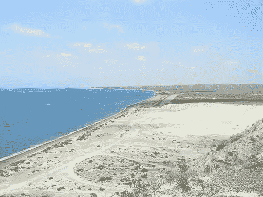
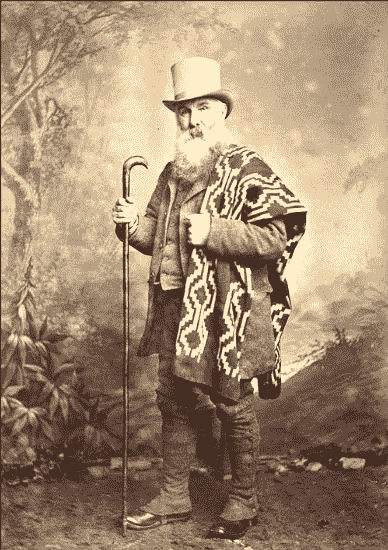
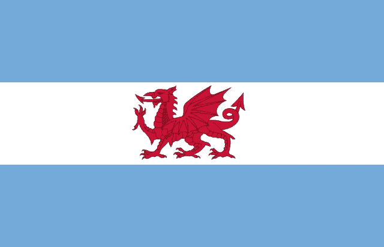

# Y Wladfa:巴塔哥尼亚的威尔士山谷

> 原文：<https://medium.datadriveninvestor.com/y-wladfa-the-welsh-valley-in-patagonia-2416c456301?source=collection_archive---------3----------------------->

## 一群受够了英国压迫者的威尔士人决定在离家 7400 英里的阿根廷建立殖民地的晦涩故事。

那是 1982 年 6 月，马岛战争正式结束，英国以近 1000 人的生命为代价，成功地在可预见的未来保持了对其怪异的帝国前哨的控制。当从阿根廷人手中解放出来的福克兰群岛居民重新过上牧羊和捕鱼的生活时，英国军队承担了遣返阿根廷战俘的任务。当囚犯们在巴塔哥尼亚的马德林港下船时，一名来自英国军队的威尔士卫兵遇到了一名来自当地阿根廷驻军的士兵。英国士兵本以为这种互动会包括一系列手势和单音节单词，但当阿根廷士兵——一个从未横渡大西洋的人——用流利的威尔士语与他交谈时，英国士兵感到震惊。这怎么可能？

***A beach at Puerto Madryn***

19 世纪对威尔士来说是一个动荡的时代。快速的工业化打乱了威尔士人的生活节奏。反抗英国工厂主的起义爆发了，社会主义在这个小国蔓延开来。英国议会提出了为什么威尔士人变得如此暴力的问题。

为了寻找一个不会威胁统治阶级经济状况的答案，立法者提出了这样一个观点，即归咎于威尔士语的继续使用。1847 年发表的一份由三位只会一种语言的英国律师撰写的报告证实了资本家们的担忧:威尔士人缺乏道德和礼貌，而威尔士语是罪魁祸首。除了杜绝这种粗俗的语言，别无选择。工作会很早开始:在学校。“威尔士不”是英国文化压迫的最讨厌的象征。当听到一个孩子说他们的母语时，老师会给这个孩子一根小棍子。他们会拿着棍子，直到听到另一个孩子说威尔士语，这时他们可以把棍子传给他们。最后，拿着棍子的孩子受到了严厉的惩罚。

在 1861 年公理会牧师迈克尔. d .琼斯在众议院举行会议之前，威尔士人团体已经试图在美国建立威尔士殖民地，但是失败了。这些群体在美国遇到了和他们回国时一样的学习英语和适应工业化生活方式的压力，并很快被同化了。因此在 1861 年的那个晚上，琼斯和他的伙伴们讨论了在远离英语世界的地方建立一个威尔士殖民地的可能性；在美洲的另一端，巴塔哥尼亚。琼斯曾就一个叫巴伊亚布兰卡的地区与阿根廷政府联系过。如果有人在巴伊亚布兰卡定居，这将符合阿根廷人的意愿，因为他们与智利在土地所有权上存在争议。作为回报，阿根廷人承诺允许威尔士语言和文化在该地区占据主导地位。琼斯的小组在整个威尔士公布了这个机会的消息。

1865 年，200 名威尔士人来到离家 7400 英里的同一个海湾，这个海湾在 1982 年成为马德林港。巴伊亚布兰卡的第一批欧洲移民比他们想象的要艰难。阿根廷人夸大了该地区的优势。巴伊亚布兰卡并不像他们承诺的那样，是绿色肥沃的威尔士低地。这里贫瘠而多风，几乎没有水或食物来源，也没有树木。该党的第一个避难所是在海湾的浅洞穴里。

***Reverend Michael D. Jones***

由于没有适当的食物和材料来源，这些定居者似乎面临着与多年前参与灾难性的达里安计划的苏格兰人在现在的巴拿马所遭受的命运相同的命运。但是他们继续推进到 40 英里外的丘布特山谷中计划好的殖民地点，在一条他们命名为*阿丰·坎威*的河边——扭曲河。他们在这里建立了第一个定居点:罗森镇。阿根廷政府授予殖民者正式的土地所有权，殖民者开始耕种。到 1880 年，这个在威尔士被称为“Y Wladfa”的殖民地的人口增长到了 1000 人左右，因为煤田的萧条迫使威尔士人离开他们的家园去寻找新的生活。丘布特山谷逐渐繁荣起来，威尔士语成为当地政府和教会的语言。没有威尔士 not 被发现；在学校里，孩子们愉快地和同学聊天，用威尔士语学习数学、历史和音乐。

在几年的时间里，定居者将一片人烟稀少、灌木丛生的土地变成了阿根廷最繁荣的地区之一。他们找到了他们的避风港。

但很快这种成功开始威胁到殖民地的福利，吸引了南美和欧洲其他地区的兴趣。到 1915 年，有 20，000 人居住在丘布特省，其中一半来自威尔士以外的国家。威尔士语成了少数民族语言。在南美寻求新生活的不仅仅是威尔士人。在整个欧洲，人们的处境和威尔士人一样艰难，新大陆的熔炉给了他们一个新的开始。

19 世纪初，阿根廷也实施了直接统治。阿根廷政府违背了他们早先的承诺，认为丘布特省现在太有价值了，不能不控制。直接统治结束了威尔士语作为官方语言的使用。迈克尔·d·琼斯的梦想似乎正在破灭。在一封信中，老人哀叹道:

‘虽然仍有一些家庭忠实于威尔士的语言和传统，但我担心那里的威尔士人的生活会慢慢消逝，可能活不过下一代。在那里长大的一代人从未到过威尔士，他们中的一些人尽管偶尔会说威尔士语，但阅读威尔士语有困难，一些人认为自己是阿根廷的臣民，并在他们的思想和心中给予阿根廷骄傲的地位。

随着时间的推移，殖民者的后代放弃了成为威尔士殖民地的想法。相反，丘布特山谷接受了它作为阿根廷独特的威尔士部分的地位。很长一段时间，威尔士语一直是教堂的语言。bara brith——威尔士的一种水果面包——继续在茶馆供应。威尔士小教堂和风车点缀着风景，许多城镇和城市都有威尔士的名字。

**An Associated Press newsreel about Y Wladfa, with residents speaking Spanish and Welsh**

在家乡，威尔士的文化和语言经历了一次复兴。威尔士有自己的议会，其成员经常用威尔士语发言，并鼓励公众学习这种语言。2015 年，1220 人在巴塔哥尼亚参加了威尔士课程。三所学校继续用西班牙语和威尔士语对学生进行双语教学。Y Wladfa 的故事是你在美洲遇到的许多奇怪的古老欧洲文化的前哨之一。对欧洲大陆的探索和征服导致了许多土著文化的灭绝，但同时也为欧洲受压迫的人民提供了第二次机会；逃离饥荒的爱尔兰人，被地主贵族赶出家园的苏格兰高地人，寻找比意大利南部的贫困更好的东西的意大利人。

巴塔哥尼亚古色古香的威尔士茶叶店和南里奥格兰德的炸肉排餐馆提醒着人们，在几十年前和平到来之前，欧洲人为了在长期困扰欧洲的贫困、种族主义和战争中生存下来，曾经走过了多么漫长的道路。

[*【怪异的西班牙】*](https://weirdspain.substack.com/) *是一份时事通讯，面向那些想要更深入了解他们的第二故乡及其人民的移民，以及世界各地想要更多了解这个神奇国家正在发生什么以及为什么会发生的西班牙爱好者。* [*在这里订阅，在你的收件箱里收到这些文章。*](https://weirdspain.substack.com/subscribe)