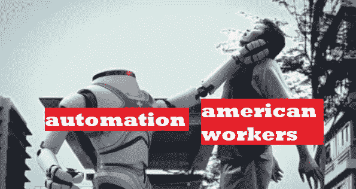

# 杨 2020:互联网的候选人，但他的政策将如何影响你的投资？

> 原文：<https://medium.datadriveninvestor.com/yang-2020-the-internets-candidate-4077f8cc421e?source=collection_archive---------7----------------------->

Secure the Bag

那些认识我很长时间的人都知道我倾向于有“独特的”政治观点。部分原因与我的成长经历以及我在大学里对哲学的学习有关。这些天，我没有被任何特定的意识形态所驱使。随着年龄的增长，我已经开始为最符合我利益的候选人投票。奇怪吧。想象一下理智地投票。

自从我进入加密货币(巧合的是，就在 2016 年总统大选之后)，我开始通过被区块链海啸冲走的世界来过滤政治。不仅仅是区块链，还有人工智能和更广泛的互联网。

 [## 保护主义、政治和经济动荡——数据驱动的投资者

### 美国股市昨日出现 400 多点的大幅反转，为未来的事情发出了警告信号。市场…

www.datadriveninvestor.com](https://www.datadriveninvestor.com/2018/06/28/protectionism-politics-economic-turmoil/) 

这就把我们带到了 2020 年总统大选。不幸的是，耶祖斯已经决定不再用他神圣的总统任期来为我们增光，所以我们这些凡人将不得不与我们现有的候选人凑合。幸运的是，我们碰巧有一位候选人，他实际上正在审视这个世界，并对如何应对即将到来的浪潮有许多实际的想法。这位候选人是杨安泽。

这篇文章将主要针对杨的政策如何与密码领域保持一致，但我有很多理由相信他真的能赢得总统大选——尽管，不可否认，这是一个漫长的过程。

# 杨的政策

首先也是最重要的是，总统竞选中经常被遗忘但最终却是最重要的部分是他的政策。我没有天真到认为任何一位总统都会兑现他所有的承诺，但我确实认为这让我们很好地了解了杨对整个技术的看法。

关于杨安泽平台的全面列表，你可以去这个[链接](https://www.yang2020.com/policies/)。

# 自由红利

自由红利无疑是杨最引人注目的位置。杨安泽计划给每个选择加入的美国公民(18 岁以上)每月 1000 美元。这正如杨所说，

> *"* 这将使所有美国人能够支付账单、自我教育、创业、更具创造力、保持健康、为工作而重新安置、与孩子共度时光、照顾亲人，并真正与未来休戚相关。

*这项政策的推动力很简单，劳动力中许多工作的自动化；最值得注意的是，零售和驾驶。*

*最初，当我听到这些时，我认为这很可笑。我实话实说。UBI(普遍基本收入)的想法一直存在，许多其他左翼候选人都曾为此争论过，但都失败了。仅在几年前，奥巴马还艰难地为所有人实施单一支付者医疗保健。伯尼，有一点牵引力，但未能带来“免费大学”，我们凭什么认为杨会成功，而其他人都失败了？*

*直到我真正考虑了他的想法。杨是懂事的。他是个资本家。他在技术领域工作过。他是一个企业主，他理解即将到来的浪潮。*

**

*I can’t let you do that, Dave*

*当我们看到特斯拉的自动驾驶仪时，我们这些在加密领域的人变得如此兴奋。牛市期间甚至出现了特斯拉迷因。人们展示他们边开车边交易的照片。我们都喜欢我们在技术上取得的进步。好吧，随之而来的是代价。随着特斯拉半卡车的推出，我们面临一个严重的问题。美国最大的雇主是卡车运输业。如果我们实现了这些工作的自动化，我们将会有成千上万的人失业。我们将会看到骚乱，我们将会看到药物过量和普遍的不安感——更不用说当零售工作岗位流失的时候。未来 5 年，预计美国将有 30%的商场倒闭。这是严重的失业。*

*我们不能承认这一迫在眉睫的灾难，却对此无所作为。坦率地说，令人不安的是，我们这么多的政治家甚至没有触及这个话题。虽然给每个公民 1000 美元的想法令我担忧，但我认为这可以通过一种对经济弊大于利的方式来实现。*

*这对加密有什么影响？如果每个公民突然拥有额外的 1000 美元，许多人，特别是我们这些在太空中的人，将突然有更多的钱流入太空。从纯粹的金融角度来看，这将极大地影响该领域的价格行为。*

*不仅仅是价格。如果没有经济上的困难，我们这些想为太空做出积极贡献的人可以自由灵活地这样做。他们可以自由地承担风险，为这个年轻而动荡的行业做出贡献。*

# *其他政策*

## *[量子计算和加密标准](https://www.yang2020.com/policies/quantum-computing/)*

## *[重振技术评估办公室](https://www.yang2020.com/policies/reviveota/)*

## *[网络中立](https://www.yang2020.com/policies/net-neutrality/)*

*对我来说，这太疯狂了，我正在体验一种解脱的感觉。我们实际上有一个候选人，他甚至考虑量子计算机和加密标准，因为它与政府信息有关。我想象国家安全局和中央情报局在这上面，但是很高兴看到他考虑了量子计算的影响。对于那些不知道的人来说，随着真正的量子计算机的出现，我们目前所有的加密方法都可以在 24 小时内被破解。*

*在线旅行社至关重要。我们在技术上的进步速度是立法部门根本无法跟上的。如果政府没有一个方面致力于跟上政府的快速变化，我们将“超越”我们的管理机构。问题是，政府不太同意其公民“超越它”的想法。一般来说，在这类纠纷中，对公民来说并不有利。*

*网络中立:让政府和企业远离互联网的永无止境的战争。这是最基本的，就我个人而言，我认为任何对互联网的限制都不会是永久性的。多头九头蛇不会被斩首太久。*

# *缺点*

*如果我没有将一些让他不太理想的事情纳入密码空间，我会有所不妥，我坚信这些政策中的一些应该受到挑战，我个人将接触竞选活动，希望影响他的一些政策，使其变得更好。*

*一个主要的缺点是他的政策是[在税收方面取消资本收益和附带权益的特权。这有可能摧毁密码市场。目前来看，加密货币征税的方式是犯罪。如果杨德特权资本收益，他不仅会给美国人的未来储蓄(401Ks，股票等)带来巨大压力。)，但适用于加密申报的严厉税收将变得更加苛刻。](https://www.yang2020.com/policies/capital-gain-carried-interest-tax/)*

# *结束语*

*当然，没有完美的候选人。尽管如此，杨显然至少有远见和技术上的理解，对国家的未来做出清醒的决定。他显然在评估现代景观，并尽可能谨慎地做出决定。与此同时，其余的候选人似乎完全专注于检查尽可能多的多样性框，在他们的试听会说话的头。*