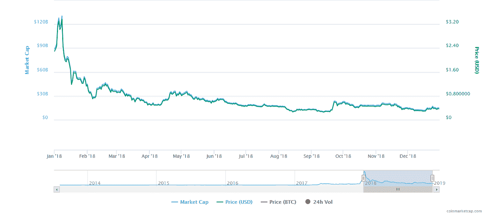

# 年评:涟漪之旅。

> 原文：<https://medium.datadriveninvestor.com/year-review-the-journey-of-ripple-13896a7b930d?source=collection_archive---------35----------------------->

第二次年度总结是关于 Ripple 的。涟漪也被称为 XRP，像其他许多著名的硬币一样价格下跌。然而，Ripple 今年在许多领域取得了成功，例如它在市值排名中排名第二(尽管截至目前(2019 年 1 月 7 日)，他们的排名已经输给了以太坊)。

和比特币一样，Ripple 今年的开局也不太好。如果我们看看 XRP 的季度业绩，我们可以看到，在第一季度(Q1)，他们的价格暴跌。它以 2.30 美元/股(XRP/USDT 比率)开始了它的一年，仅在三天内它就获得了+66.5%的增长，达到了今年的最高价格(价格:3.83 美元，市值:148，425，546，958 美元)。不过，尽管 Ripple 的一月开局不错，但它的结局却很糟糕，甚至更糟。1 月 31 日，ripple 为每枚硬币 1.15 英镑。此外，在 Q1 年末，这一数字甚至更低，仅在第一季度就造成了约 700 亿美元的损失。像 Q1 一样，Q2 的开始对 Ripple 及其投资者来说是个好消息。本季度的最高价格是在 4 月份，尽管没有 1 月份的价格高，但它回到了 0.9589 XRP，这几乎是 Q1 上次估计的两倍。五月和六月几乎彼此相似，它们都有一个稳定的图形，但价格慢慢变低，在 Q2 结束时，波动回到 0.45 美元。与 Q1 和 Q2 不同，第三季度略好，甚至有+的变化(当我们比较第三季度开始和结束时的价格时)。第三季度开始时非常糟糕，它继续成为 Ripple 的噩梦，但在 9 月 18 日，一切都变了，在 12 天内，它获得了 111%的增长，但它们的价格仍在 0.5s (0.57 美元)左右。正是在这个季度，他们通过了以太坊，获得了第二名。

最后但同样重要的是第四季度。第四季度对密码市场来说是一场灾难。我们目睹了许多货币的贬值。在本季度，Ripple 以 0.583 美元的价格开始，在 10 月中旬跌至 0.39 美元。然而，它设法从 11 月份的下跌中恢复过来，回到 0.55 美元。本季度的最低价格是在 12 月(约 0.283 美元)，但在年底前，它设法获得了 33%的增长，使其价格回到 0.369 美元。如果我们从年初到年底比较它的价格和市值，我们可以看到他们损失了 730 亿美元的市值，价格从 2.30 美元下降到 0.369 美元。

*如果你想了解更多，请访问 BIDITEX 页面并提出你的问题，关注我们的* [*推特*](https://twitter.com/biditex_com) *，* [*脸书*](https://www.facebook.com/biditex/) *，* [*中型*](https://medium.com/@biditex) *，* [*电报*](https://t.me/biditex%20%28edited%29) *，*[*LinkedIn*](https://www.linkedin.com/company/biditex)*。投标变更用* [*投标变更用*](https://medium.com/@biditex/biditex.com) *。*