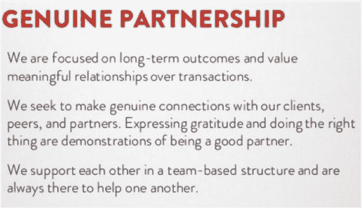
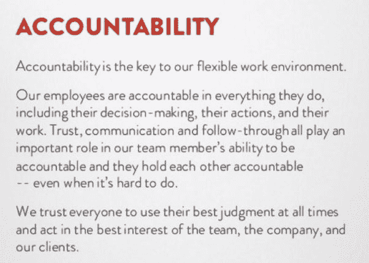

# 是的，有毒的文化会摧毁你的成长型企业。原因如下

> 原文：<https://medium.datadriveninvestor.com/yes-a-toxic-culture-will-destroy-your-growth-business-heres-why-f7d688198612?source=collection_archive---------4----------------------->

暗箭伤人。替罪羊。缺乏责任感。士气低落。消极派系。偏心眼。持续的沟通不畅。这些是有毒工作文化的一些迹象。

我们在与一个客户(我们称之为 X 公司)的互动中观察到了许多这些特征。X 公司的领导聘请我们帮助他们进行绩效营销。

我们很高兴能与该公司合作，因为它是在一个快速增长的行业中运营的，背后有很多动力。事实上，该行业的宏观经济如此强劲，以至于几家最大的公司最近都上市了。

> 然而，在 X 公司工作了短短几周后，这种热情就消退了。

即使我们是供应商，公司的员工也经常对我们的团队出言不逊，完全无视我们的时间。

例子包括不断要求明显超出范围的工作，不出席预定的会议，甚至在电话中按“静音”进行附带对话(大概是关于我们的团队)。客户联系人也总是很晚才给我们提供相关信息，告诉我们我们的团队需要赶上最后期限。

在一个场景中，客户联系人的老板打电话斥责我们的团队成员，指责我们没有做好我们的工作，因为我们没有管理好联系人，或者透露他对他的上司缺乏回应，尽管他的上司会收到所有通信的副本。

> 他们对自己错过的最后期限不负任何责任。从他们的角度来看，我们对这一切都有责任。

我们绝对不希望任何人失败，但得知 X 公司最近倒闭了，这是值得肯定的。对我们来说，它证实了，如果一家公司的领导层创造了一种鼓励指责和暗箭伤人、而不是问责、尊重和合作的文化，那么即使这家公司在一个高增长的行业拥有好产品，也无法取得可持续的成功。

# **软的东西就是硬的东西**

问题的关键在于，成长型公司往往专注于自身的增长和产品，而不是其潜在的文化和可持续性。因此，这些公司往往在短期内飙升，但难以获得持久的成功。

这就像类固醇:它们会帮助一个人快速建立肌肉，但长期后果(例如，健康问题、攻击性行为和生长抑制)远远超过短期结果。在很多方面，这类公司唯一的希望就是被收购；他们不是为了生存而建立的。

> 文化存在于每个组织中，无论是有意还是无意。

虽然保持一种健康、协作、高效、尊重以及(我敢说)良好的文化符合每个人的利益，但创始人的主要责任之一是有目的地引导和培养这种文化。

文化的概念经常与商业的“软东西”混为一谈。事实上，它与法律、技术和金融方面同样重要。文化是经营企业的操作系统。如果你公司的文化没有得到精心培育和培养，它会很快成为你最大的负担，甚至毁掉最宏伟的愿景。我们已经亲眼目睹了这一切。

在像 [Glassdoor](https://www.glassdoor.com/index.htm) (一个匿名的公司反馈网站)这样的公司时代，员工们能够分享他们喜欢什么，真正不喜欢什么，关于为一家公司工作。如果这些评估反映了有毒的公司文化，那么招聘高质量的候选人会变得非常困难，甚至是不可能的。

那么，正在扩大团队、发展自身形象的成长型公司能做些什么来避免有害的工作文化呢？

# **1。创造核心价值**

核心价值观是一套对你的公司至关重要且永恒的指导原则。他们没有抱负；相反，你的核心价值观应该定义你的文化和你到底是谁，无论是个人还是集体。引用吉诺·维克曼的书《牵引力:掌控你的企业》:“当你的核心价值观清晰时，你会吸引志同道合的人加入你的组织。

你还会发现，当他们被应用到你的组织中时，他们会淘汰那些不适合的人。一旦它们被定义，你必须基于这些核心价值观雇佣、解雇、评估、奖励和认可人们。"

例如，我们 Acceleration Partners 的核心价值观之一是“真正的合作伙伴关系”

读完这篇描述后，你可能会确定我们与上述 x 公司合作的困难程度。它的文化与我们的一个核心价值观(实际上是两个；另一个是“没有混蛋”)。最初的项目结束后，我们尽可能快地离开了。

没有既定的核心价值观会导致好人认为表现不好是不合理的，因为默认的文化是模仿被容忍的不良行为。

# **2。促进尊重**

根据《哈佛商业评论》和托尼·施瓦茨最近对全球近 2 万名员工进行的研究，没有其他领导行为比受到尊重对员工的影响更大。培养尊重他人的工作场所文化包括:

*   以礼待人，礼貌待人，和善待人。正如理查德·布兰森所说，“尊重是如何对待每一个人，而不仅仅是那些你想给人留下深刻印象的人。”这不代表你不反对。这意味着你要在尊重的基础上进行健康的辩论和对话。
*   培养一种尊重的意识，这种尊重体现在你交流的各个方面，包括你说的话、你说话的方式、你说话的语气和你的肢体语言。
*   以尊重的态度对待每一次互动，不管你是否认为对方的行为已经“赢得”了尊重，甚至是赢得了尊重。在表达你的观点之前，先听听别人怎么说。
*   鼓励对差异和不同观点的讨论。
*   寻找各种方法来促进工作团队和委员会以及个人协会的多样性。

# **3。鼓励问责制**

“责任”是我们的另一个核心价值观。这对我们的意义如下:

有毒文化通常不重视责任。《哈佛商业评论》的另一项研究报告称，[46%的高层经理](https://hbr.org/2012/11/one-out-of-every-two-managers-is-terrible-at-accountability/)在“让员工负责，坚决执行”这一指标上得分很低在 X 公司经理的案例中，他们没有让自己的员工承担责任，而是选择口头痛打他们的供应商。

在这方面，不对员工或你自己负责是创造有毒工作环境的一个关键因素。让人们负起责任并不意味着对他们进行微观管理，而是意味着对他们的需求设定合理的期望，重视责任和结果，奖励顺从的行为。

# **4。培养开放诚实的反馈**

不断寻求公司每个人的反馈，这将使你能够灵活地适应市场变化，成为行业领导者。我们使用的一个工具是员工反馈和建议的匿名平台，名为 [TINYpulse](https://www.tinypulse.com/) 。

TINYpulse 中一个特别棒的功能是“Cheers”部分。欢呼可以是对同事所做工作的认可，对同事的贡献表示感谢，或者让同事感到被重视和欣赏。

> "要想在市场上获胜，你必须首先在工作场所获胜."

金宝汤公司前首席执行官兼总裁、ConantLeadership 创始人道格·柯南特(Doug Conant)的这段话说明了一切。

想出一个聪明、可行的商业点子只是商业成功拼图的一部分。人们不想为一家耗尽精力、滋生消极情绪的公司工作。

要做到这一点，从长远来看，你需要为他人照亮你的愿景，坚持你公司的价值观，尊重你自己和你周围的人，并让你的团队成员负起责任。

*本文原载于 Business.com***。**

*[*罗伯特·格雷泽*](https://www.linkedin.com/in/glazer/) *是* [*加速合伙人*](https://www.accelerationpartners.com/) *的创始人兼 CEO，也是国际畅销书* [业绩合伙人](https://www.accelerationpartners.com/performance-partnerships/) *的作者。加入 4 万名关注他的励志周刊* [*周五转发*](http://www.fridayfwd.com/)*[*的全球领袖，邀请他演讲*](https://www.robertglazer.com/speaking/) *，或者在* [*推特*](https://twitter.com/robert_glazer?ref_src=twsrc%5Egoogle%7Ctwcamp%5Eserp%7Ctwgr%5Eauthor) *上关注他。***