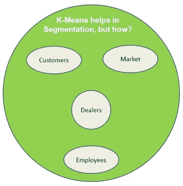

# 是的，K-Means 可以帮助确保更好的客户参与度！

> 原文：<https://medium.datadriveninvestor.com/yes-k-means-can-help-in-ensuring-better-customer-engagement-c5fa38f0254a?source=collection_archive---------5----------------------->

***作者仅代表作者个人观点。这些绝不代表和/或反映他所联系的组织***

**最初的想法**

又是一个周末，我想尝试一些新的东西来满足我学习新知识的渴望。我通常会尝试在这些主题之间切换，以保持自己在这个练习中保持清醒，而且我已经花了相当长的时间来接触机器学习，所以这次让我在这个领域尝试一些东西。

下一个直接的问题是选择什么和尝试什么。如果你看看我以前的帖子，我确实尝试过监督学习，包括[线性回归](https://medium.com/datadriveninvestor/lets-predict-with-the-simple-linear-regression-1b690f64f947)、[逻辑回归](https://medium.com/datadriveninvestor/wow-logistic-regression-is-easy-too-fdf6ee247349)、[梯度下降](https://medium.com/datadriveninvestor/gradient-descent-the-key-for-ml-algorithms-d84ad511937e)、[支持向量机](https://medium.com/datadriveninvestor/svm-helps-in-resolving-missing-cases-48c61c6e9715)，这可能是尝试一些关于无监督学习的东西的时候了。

 [## DDI 编辑推荐:5 本让你从新手变成专家的机器学习书籍|数据驱动…

### 机器学习行业的蓬勃发展重新引起了人们对人工智能的兴趣

www.datadriveninvestor.com](https://www.datadriveninvestor.com/2019/03/03/editors-pick-5-machine-learning-books/) 

无监督学习更符合它的名字，它不需要任何显式的标记/标签来识别数据。数据中的潜在模式将有助于产生适当的分组，这样任何新的数据元素都可以很容易地与定义的分组/模式对齐。从技术角度来看，这些模式被正式称为“集群”。

聚类经常与分类混淆，但它们都代表了机器学习的两个不同类别，前者映射到无监督学习，后者映射到监督学习，其中数据被标记/标注以便于识别，而无监督学习不是这种情况。

**业务需求**

一旦我们清楚了这个概念，那么我们想到的下一个部分就是它在现实世界用例或业务案例中的应用。我相信我们可以找到许多无监督学习可以很容易地用。

一般情况可以是任何企业都常见的客户细分。例如，如果我们以银行及其关于设置下一台 ATM 机的决策为例，可以很容易地根据客户的地理位置对其进行聚类，这样人口密集的位置就可以被选为设置下一台 ATM 机的理想候选位置。一旦这个集群设置完成，任何加入银行的新客户都可以与其中一个集群保持一致，以便为所有未来决策保持最新。

同样的概念可以扩展到其他领域，如市场细分等。

**如何逼近，K-Means 算法？**

虽然似乎有很多关于处理聚类的文献，但是其中一个引人注目的算法是 K-Means 算法。原因是它的简单性和逻辑与我们通常思维方式的联系，它不需要我们太专业就能理解细节。

根据维基百科的定义，K 均值聚类旨在将 n 个观察值划分为 K 个聚类，其中每个观察值属于具有最近均值的聚类。

尽管该算法开始将数据点与 k 个随机质心对齐，但最终数据点通过细化并与数据点的“平均值”对齐而开始收敛到其逻辑聚类。原始质心被转换成包含在聚类中的数据点的平均值。这是一个重复的过程，直到所有的数据点都正确地与其相关的聚类对齐。

让我们通过算法中涉及的步骤来更详细地理解这一点

*   第一步是了解我们要去的集群的数量。那么标准是什么，我们如何决定呢？集群的密度和代表性可以根据业务案例和手头的问题而变化，因此我们确定集群数量的方式也可能依赖于此。
*   有时，如果数据不太具有代表性而不能分成单独的聚类，我们可能也需要对数据进行返工。尽管如此，也有一些标准方法(如肘形法)试图绘制给定聚类的数据点相对于要考虑的聚类数的最小平方误差，并且可以从图中挑选肘形点作为决策点，以考虑聚类数。当我们绘制图表时，有可能看不到所需的形状，在这种情况下，必须评估替代方法。
*   一旦我们清楚了聚类的数量，那么下一步就是确定 k 个随机点(也称为质心),它们可以启动这个过程。
*   根据邻近度或相关的最短距离，将数据点指定给任一个质心。集群将从这里开始进化，并在后续步骤中变得成熟
*   现在，计算每个聚类中数据点的平均值，并移动质心以匹配平均值。
*   现在，重复将数据点映射到右边质心的步骤，无论哪一个是最接近的。此外，重复计算新集群设置的平均值的步骤。
*   几次迭代之后，质心停止变化，此时我们可以断定数据点与正确的聚类对齐，并且算法已经收敛。

总的来说，根据数据的表示方式，该算法收敛所需的时间或多或少。如果数据已经很好地分成了几个簇，那么它收敛所需的时间可能会比数据没有适当地分离时少。

**最终意见**

K-Means 是数据科学家处理各种业务问题的另一个武器，它简单且易于采用，但在某些情况下，当数据不能很好地表示以进行聚类时，它可能会变得昂贵。关键的挑战将是确定可以在试错的基础上开始但可以在一段时间内成熟的集群的数量。一旦我们在组织中建立了一些案例研究，剩下的工作就变得容易了。最后，任何微小的进步都必须从缓慢开始，通过一些学习曲线才能达到顶峰，对吗？